<p style="text-align: center;">Adam's Bridge Hardware Specification</p>

<p style="text-align: center;">Version 1.0</p>

<div style="page-break-after: always"></div>

# Scope

This document defines technical specifications for a Adam's Bridge Post-Quantum Cryptography (PQC ML-DSA) subsystem used in the Open Compute Project (OCP). This document shall comprise the Adam's Bridge technical specification.

# Overview

This document provides definitions and requirements for a Adam's Bridge Post-Quantum Cryptography (PQC ML-DSA) subsystem. The document then relates these definitions to existing technologies, enabling device and platform vendors to better understand those technologies in trusted computing terms.

# Introduction

The advent of quantum computers poses a serious challenge to the security of cloud infrastructures and services, as they can potentially break the existing public-key cryptosystems, such as RSA and elliptic curve cryptography (ECC). Even though the gap between today’s quantum computers and the threats they pose to current public-key cryptography is large, the cloud landscape should act proactively and initiate the transition to the post-quantum era as early as possible. To comply with that, the U.S. government issued a National Security Memorandum in May 2022 that mandated federal agencies to migrate to PQC by 2035 \[1\]. 

The long-term security of cloud computing against quantum attacks depends on developing lattice-based cryptosystems, which are among the most promising PQC algorithms that are believed to be hard for both classical and quantum computers. The American National Institute of Standards and Technology (NIST) recognized this and selected CRYSTALS-KYBER (ML-KEM) and CRYSTALS-Dilithium (ML-DSA) \[2\], two lattice-based algorithms, as standards for post-quantum key-establishment and digital signatures, respectively, in July 2022\. These cryptosystems are constructed on the hardness of the module learning-with-errors problem (M-LWE) in module lattices. 

To transition to PQC, we must develop hybrid cryptosystems to maintain industry or government regulations, while PQC updates will be applied thoroughly. Therefore, classical cryptosystems, e.g. ECC, cannot be eliminated even if PQC will significantly be developed.

Adam’s bridge was a mythological structure that existed to cross the formidable gulf that existed between two land masses. Asymmetric cryptography to post quantum is a similar formidable gap that exists in the world of cryptography and Adam’s bridge is the work undertaken to bridge the gap by building post quantum cryptographic accelerators.

In this presentation, we share the architectural characteristics of our post-quantum Adams Bridge implementation. Our proposed work divides the operations in the algorithms into multiple stages and executes them using pipelined processing architecture. We use an optimized cascading method within each stage and fine-tune each module individually to exploit multi-levels of parallelism to accelerate post-quantum Dilithium computation on hardware platforms to address performance and complexity challenges of PQC implementation. Our proposed architecture uses various optimization techniques, including multi-levels of parallelism, designing reconfigurable cores, and implementing interleaved and pipelined architecture achieving significant speedup while maintaining high security and scalability. Our work can facilitate the adoption and deployment of PQC in cloud computing and enhance the security and efficiency of cloud services and applications in the post-quantum era.

# High-Level Overview

Adam’s Bridge accelerator has all the necessary components to execute a pure hardware PQC operation. The main operations that involve more computational complexity, such as NTT, hashing, and sampling units, are explained as follows.

 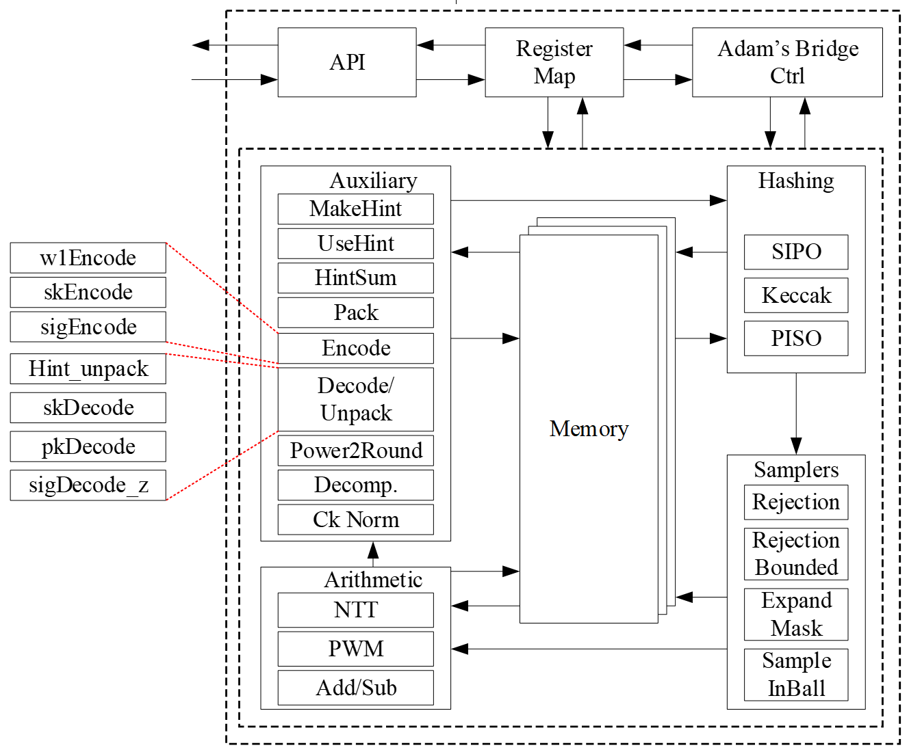

The security level of ML-DSA defined by NIST are as follows:

| Algorithm Name | Security Level |
|:---------------|:---------------|
| ML-DSA-44      | Level-2        |
| ML-DSA-65      | Level-3        |
| ML-DSA-87      | Level-5        |

CNSA 2.0 only allows the highest security level (Level-5) for PQC which is ML-DSA-87, and the current architecture only supports this parameter set.

# API

The ML-DSA-87 architecture inputs and outputs are described in the following table.


| Name                        | Input/Output    | Operation       | Size (Byte)   |
| --------------------------- | --------------- | --------------- | ------------- |
| name                        | Output          | All             | 8             |
| version                     | Output          | All             | 8             |
| ctrl                        | Input           | All             | 4             |
| status                      | Output          | All             | 4             |
| entropy (SCA)               | Input           | All             | 64            |
| seed                        | Input           | Keygen          | 32            |
| sign\_rnd                   | Input           | Sign            | 32            |
| message                     | Input           | Sign/Verify     | 64            |
| verification result         | Output          | Verify          | 64            |
| pk                          | Input/Output    | Keygen/Verify   | 2592          |
| signature                   | Input/Output    | Sign/Verify     | 4627          |
| sk\_out (software only)     | Output          | Keygen          | 4896          |
| sk\_in                      | Input           | Signing         | 4896          |
| Interrupt                   | Output          | All             | 520           |
| --------------------------- | --------------- | --------------- | ------------- |
| Total                       |                 |                 | 18440         |

## name

​Read-only register consists of the name of component. 

## version 

​Read-only register consists of the version of component. 

## CTRL 

​The control register consists of the following flags: 

| Bits     | Identifier | Access | Reset | Decoded | Name |
| :------- | :--------- | :----- | :---- | :------ | :--- |
| \[31:4\] | \-         | \-     | \-    |         | \-   |
| \[3\]    | ZEROIZE    | w      | 0x0   |         | \-   |
| \[2:0\]  | CTRL       | w      | 0x0   |         | \-   |

### ​CTRL 

CTRL command field contains two bits indicating:

* ​Ctrl \= 0b000 

​No Operation. 

* ​Ctrl \= 0b001 

​Trigs the core to start the initialization and perform keygen operation. 

* ​Ctrl \= 0b010 

​Trigs the core to start the signing operation for a message block.  

* ​Ctrl \= 0b011 

​Trigs the core to start verifying a signature for a message block.  

* Ctrl \= 0b100 

​Trigs the core to start the keygen+signing operation for a message block.  This mode decreases storage costs for the secret key (SK) by recalling keygen and using an on-the-fly SK during the signing process.

### zeroize

Zeroize all internal registers: Zeroize all internal registers after process to avoid SCA leakage.  
Software write generates only a single-cycle pulse on the hardware interface and then will be erased.

## status 

​The read-only status register consists of the following flags: 

| Bits     | Identifier | Access | Reset | Decoded | Name |
| :------- | :--------- | :----- | :---- | :------ | :--- |
| \[31:2\] | \-         | \-     | \-    |         | \-   |
| \[1\]    | VALID      | r      | 0x0   |         | \-   |
| \[0\]    | READY      | r      | 0x0   |         | \-   |

### READY 

​Indicates if the core is ready to process the inputs. 

### ​VALID 

​Indicates if the process is computed and the output is valid. 

## entropy

Entropy is required for SCA countermeasures to randomize the inputs with no change in the outputs. The entropy can be any 512-bit value in \[0 : 2^512-1\]. 

The ML-DSA-87 countermeasure requires several random vectors to randomize the intermediate values. A DRBG unit is used to take one random vector of 512-bit (i.e., entropy register) and generate the required random vectors for different countermeasures.

## seed

Adams Bridge component seed register type definition 8 32-bit registers storing the 256-bit seed for keygen in big-endian representation. The seed can be any 256-bit value in \[0 : 2^256-1\].

## sign\_rnd

This register is used to support both deterministic and hedge variants of ML-DSA. The content of this register is the only difference between the deterministic and hedged variant of ML-DSA.

- In the “hedged” variant, sign\_rnd is the output of an RBG.  
- In the “deterministic” variant, sign\_rnd is a 256-bit string consisting entirely of zeroes. 

## message

This architecture supports pre-hash ML-DSA defined by NIST. In other words, the architecture signs a digest of the message rather than the message directly.  

Obtaining at least λ bits of classical security strength against collision attacks requires that the digest to be signed be at least 2λ bits in length. For ML-DSA-87 with λ=256, the length of digest (hashed message) is 512 bits (64 Bytes).

Hence, the engine only supports pre-hash signing/verifying ML-DSA operations, the assumption is the given input is the hash of a pure message. Based on FIPS 204 \[3\], the hashed message needs to be extended by some pre-defined OIDs. 

PH𝑀 ← H(𝑀)  
𝑀′ ← BytesToBits(IntegerToBytes(1,1) ∥ IntegerToBytes(|𝑐𝑡𝑥|, 1\) ∥ 𝑐𝑡𝑥 ∥ OID ∥ PH𝑀)

The defined API takes PH𝑀 from the user, and the engine takes care of the prefix internally.

## verification result

To mitigate a possible fault attack on Boolean flag verification result, a 64-byte register is considered. Firmware is responsible for comparing the computed result with a defined value, and if they are equal the signature is valid.

## sk\_out

This register stores the private key for keygen if seed is given by software. This register is read by ML-DSA user, i.e., software, after keygen operation.

If seed comes from key vault, this register will not contain the private key to avoid exposing secret assets to software.

## sk\_in

This register stores the private key for signing. This register should be set before signing operation.

## pk

ML-DSA component public key register type definition 648 32-bit registers storing the public key in big-endian representation. These registers is read by Adams Bridge user after keygen operation, or be set before verifying operation. 

## signature

ML-DSA component signature register type definition 1149 32-bit registers storing the signature of the message in big-endian representation. These registers is read by Adams Bridge user after signing operation, or be set before verifying operation. 

# ​Pseudocode 

## ​Keygen 

```cpp
Input:
    seed  
    entropy

Output:
    sk_out
    pk

// Wait for the core to be ready (STATUS flag should be 2'b01 or 2'b11)
read_data = 0
while read_data == 0:
    read_data = read(ADDR_STATUS)

// Feed the required inputs
write(ADDR_SEED, seed)
write(ADDR_ENTROPY, entropy)

// Trigger the core for performing Keygen
write(ADDR_CTRL, {29'b0, 3'b001})  // (STATUS flag will be changed to 2'b00)

// Wait for the core to be ready and valid (STATUS flag should be 2'b11)
read_data = 0
while read_data == 0:
    read_data = read(ADDR_STATUS)

// Reading the outputs
sk_out = read(ADDR_SK)
pk = read(ADDR_PK)

// Return the outputs
return sk_out, pk
```
​ 
## ​Signing 

```cpp
‚ÄãInput:
    msg            
    sk_in          
    sign_rnd       
    entropy        

Output:
    signature  

// Wait for the core to be ready (STATUS flag should be 2'b01 or 2'b11)
read_data = 0;
while (read_data == 0) {
    read_data = read(ADDR_STATUS);
}

// Feed the required inputs
write(ADDR_MSG, msg);
write(ADDR_SK_IN, sk_in);
write(ADDR_SIGN_RND, sign_rnd);
write(ADDR_ENTROPY, entropy);

// Trigger the core for performing Signing
write(ADDR_CTRL, {29'b0, 3'b010});  // (STATUS flag will be changed to 2'b00)

// Wait for the core to be ready and valid (STATUS flag should be 2'b11)
read_data = 0;
while (read_data == 0) {
    read_data = read(ADDR_STATUS);
}

// Reading the outputs
signature = read(ADDR_SIGNATURE);

// Return the output (signature)
return signature;
```

## ​Verifying 

```cpp
Input:
    msg                    
    pk                    
    signature          

Output:
    verification_result   

// Wait for the core to be ready (STATUS flag should be 2'b01 or 2'b11)
read_data = 0;
while (read_data == 0) {
    read_data = read(ADDR_STATUS);
}

// Feed the required inputs
write(ADDR_MSG, msg);
write(ADDR_PK, pk);
write(ADDR_SIGNATURE, signature);

// Trigger the core for performing Verifying
write(ADDR_CTRL, {29'b0, 3'b011});  // (STATUS flag will be changed to 2'b00)

// Wait for the core to be ready and valid (STATUS flag should be 2'b11)
read_data = 0;
while (read_data == 0) {
    read_data = read(ADDR_STATUS);
}

// Reading the outputs
verification_result = read(ADDR_VERIFICATION_RESULT);

// Return the output (verification_result)
return verification_result;
```

## Keygen \+ Signing 

This mode decreases storage costs for the secret key (SK) by recalling keygen and using an on-the-fly SK during the signing process.

```cpp
Input:
    seed        
    msg
    sign_rnd       
    entropy        

Output:
    signature  

// Wait for the core to be ready (STATUS flag should be 2'b01 or 2'b11)
read_data = 0;
while (read_data == 0) {
    read_data = read(ADDR_STATUS);
}

// Feed the required inputs
write(ADDR_SEED, seed);
write(ADDR_MSG, msg);
write(ADDR_SIGN_RND, sign_rnd);
write(ADDR_ENTROPY, entropy);

// Trigger the core for performing Keygen + Signing
write(ADDR_CTRL, {29'b0, 3'b100});  // (STATUS flag will be changed to 2'b00)

// Wait for the core to be ready and valid (STATUS flag should be 2'b11)
read_data = 0;
while (read_data == 0) {
    read_data = read(ADDR_STATUS);
}

// Reading the outputs
signature = read(ADDR_SIGNATURE);

// Return the output (signature)
return signature;
```
​ 
# Performance and Area Results

## ML-DSA-87

The performance results for two operational frequencies, 400 MHz and 600 MHz, are presented in terms of latency (clock cycles [CCs]), time [ms], and performance [IOPS] as follows:

|                       | Freq [MHz]       |           400 |                        |     |           600 |                        |
| --------------------- | ---------------- | ------------: | ---------------------- | --- | ------------: | ---------------------- |
| **"Unprotected"**     | **Latency [CC]** | **Time [ms]** | **Performance [IOPS]** |     | **Time [ms]** | **Performance [IOPS]** |
| **Keygen**            | 15,200           |         0.038 | 26,316                 |     |         0.025 | 39,474                 |
| **Signing (1 round)** | 26,600           |         0.067 | 15,038                 |     |         0.044 | 22,556                 |
| **Signing (Ave)**     | 106,400          |         0.266 | 3,759                  |     |         0.177 | 5,639                  |
| **Verifying**         | 18,500           |         0.046 | 21,622                 |     |         0.031 | 32,432                 |


Masking and shuffling countermeasures are integrated into the architecture and can be configured to be enabled or disabled at synthesis time. 

The area overhead associated with enabling these countermeasures is as follows:

|                       | Freq [MHz]       |           400 |                        |     |           600 |                        |
| --------------------- | ---------------- | ------------: | ---------------------- | --- | ------------: | ---------------------- |
| **"Protected"**       | **Latency [CC]** | **Time [ms]** | **Performance [IOPS]** |     | **Time [ms]** | **Performance [IOPS]** |
| **keygen**            | 15,200           |         0.038 | 26,316                 |     |         0.025 | 39,474                 |
| **Signing (1 round)** | 35,700           |         0.089 | 11,204                 |     |         0.060 | 16,807                 |
| **Signing (Ave)**     | 142,800          |         0.357 | 2,801                  |     |         0.238 | 4,202                  |
| **Verifying**         | 18,500           |         0.046 | 21,622                 |     |         0.031 | 32,432                 |


- CNSA 2.0 only allows the highest security level (Level-5) for PQC which is ML-DSA-87, and the current architecture only supports this parameter set.
- The requried area for the unprotected ML-DSA-87 is 0.0366mm2 @5nm.
- The requried area for the protected ML-DSA-87 is ??mm2 @5nm.
- The design is converging today at 600MHz.


# Proposed architecture

The value of k and l is determined based on the security level of the system defined by NIST as follows:

| Algorithm Name | Security Level | k   | l   |
| :------------- | :------------- | :-- | :-- |
| ML-DSA-44      | Level-2        | 4   | 4   |
| ML-DSA-65      | Level-3        | 6   | 5   |
| ML-DSA-87      | Level-5        | 8   | 7   |

In the hardware design, using an instruction-set processor yields a smaller, simpler, and more controllable design. By fine-tuning hardware acceleration, we achieve efficiency without excessive logic overhead. We implement all computation blocks in hardware while maintaining flexibility for future extensions. This adaptability proves crucial in a rapidly evolving field like post-quantum cryptography (PQC), even amidst existing HW architectures.

The Customized Instruction-Set Cryptography Engine is designed to provide efficient cryptographic operations while allowing flexibility for changes in NIST ML-DSA standards and varying security levels. This proposal outlines the architecture, instruction set design, sequencer functionality, and hardware considerations for the proposed architecture. This architecture is typically implemented as an Intellectual Property (IP) core within an FPGA or ASIC, featuring a pipelined design for streamlined execution and interfaces for seamless communication with the host processor.

In our proposed architecture, we define specific instructions for various submodules, including SHAKE256, SHAKE128, NTT, INTT, etc. Each instruction is associated with an opcode and operands. By customizing these instructions, we can tailor the engine's behavior to different security levels.

To execute the required instructions, a high-level controller acts as a sequencer, orchestrating a precise sequence of operations. Within the architecture, several memory blocks are accessible to submodules. However, it's the sequencer's responsibility to provide the necessary memory addresses for each operation. Additionally, the sequencer handles instruction fetching, decoding, operand retrieval, and overall data flow management.

The high-level architecture of Adams Bridge controller is illustrated as follows:

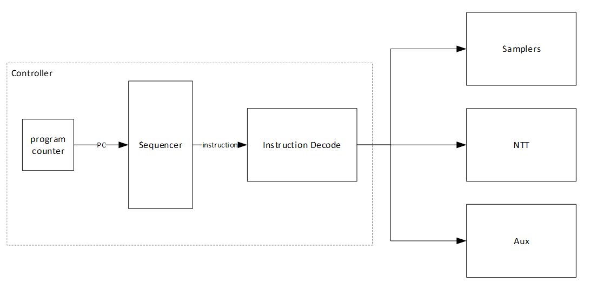

## Keccak

Hashing operation takes a significant portion of PQC latency. All samplers need to be fed by hashing functions. i.e., SHAKE128 and SHAKE256. Therefore, to improve the efficiency of the implementation, one should increase efficiency on the Keccak core, providing higher throughput using fewer hardware resources. Keccak core requires 24 rounds of the sponge function computation. We develop a dedicated SIPO (serial-in, parallel-out) and PISO (parallel-in, serial-out) for interfacing with this core in its input and output, respectively.

We propose an approach to design hardware rejection sampling architecture, which can offer more efficiency. This approach enables us to cascade the Keccak unit to rejection sampler and polynomial multiplication units that results in avoiding the memory access.

In our optimized architecture, to reduce the failure probability due to the non-deterministic pattern of rejection sampling and avoid any stall cycle in polynomial multiplication, we use a FIFO to store sampled coefficients that match the speed of polynomial multiplication. The proposed sampler works in parallel with the Keccak core. Therefore, the latency for sampling unit is absorbed within the latency for a concurrently running Keccak core. 

In the input side, there are two different situations:

1) The given block from SIPO is the last absorbing round.  
   In this situation, the output PISO buffer should receive the Keccak state.  
2) The given block from SIPO is not the last absorbing round.  
   In this situation, the output PISO buffer should not receive the Keccak state. However, the next input block from SIPO needs to be XORed with the Keccak state.

There are two possible scenarios when the Keccak state has to be saved in the PISO buffer on the output side:

1) PISO buffer EMPTY flag is not set.  
   In this situation, Keccak should hold on and maintain the current state until EMPTY is activated and transfer the state into PISO buffer.  
2) PISO buffer EMPTY flag is set.  
   In this situation, the state can be transferred to PISO buffer and the following round of Keccak (if any) can be started.

## Stage 1: Keccak – Expand Mask – Memory

Dilithium samples the polynomials that make up the vectors and matrices independently, using a fixed seed value and a nonce value that increases the security as the input for Keccak. Keccak is used to take these seed and nonce and generate random stream bits. 

Expand Mask takes γ\-bits (20-bit for ML-DSA-87) and samples a vector such that all coefficients are in range of \[-γ\+1, γ\]. It continues to sample all required coefficients, n=256, for a polynomial. 

After sampling a polynomial with 256 coefficients, nonce will be changed and a new random stream will be generated using Keccak core and will be sampled by expand mask unit.

The output of this operation results in a l different polynomial while each polynomial includes 256 coefficients.

y1,0  y1,l-1 

Expand Mask is used in signing operation of Dilithium. The output of expand mask sampler is stored into memory and will be used as an input for NTT module.

We propose an architecture to remove the cost of memory access since NTT needs input in a specific format, i.e., 4 coefficients per each memory address. To achieve this, we need to have a balanced throughput between all these modules to avoid large buffering or conflict between them.

High-level architecture is illustrated as follows:

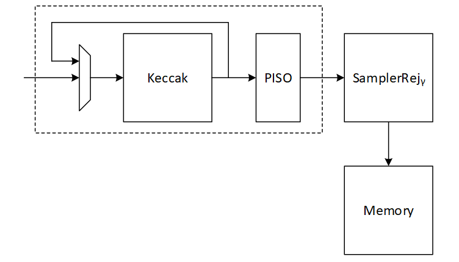

### Keccak Unit

Keccak is used in SHAKE-256 configuration for expand mask operation. Hence, it will take the input data and generate 1088-bit output after each round. We propose implementing of Keccak while each round takes 12 cycles. The format of input data is as follows:

Input data \= ρ' | n

Where ρ'    is seed with 512-bits, n=κ+r   is the 16-bit nonce that will be incremented for each polynomial (r++) or if the signature is rejected by validity checks (\++).

Since each   bits (20-bit in for ML-DSA-87) is used for one coefficient, 256\*20=5120 bits are required for one polynomial which needs 5 rounds (5120/1088=4.7) of Keccak. 

To sample l polynomial (l=7 for ML-DSA-87), we need a total of 5\*7 \= 35 rounds of Keccak. 

There are two paths for Keccak input. While the input can be set by controller for new nonce in the case of next polynomial or rejected signature, the loop path is used to rerun Keccak for completing the current sampling process with l polynomial.

Expand mask cannot take all 1088-bit output parallelly since it makes hardware architecture too costly and complex, and also there is no other input from Keccak for the next 12 cycles. Therefore, we propose a parallel-input serial-output (PISO) unit in between to store the Keccak output and feed rejection unit sequentially.

### Expand Mask

This unit takes data from the output of SHAKE-256 stored in a PISO buffer. The required cycles for this unit is 4.7 rounds of Keccak for one polynomial and 35 rounds of Keccak for all required polynomial (l polynomial which l=7 for ML-DSA-87). 

In our optimized architecture, this unit works in parallel with the Keccak core. Therefore, the latency for expand mask is absorbed within the latency for a concurrently running Keccak core. 

Our proposed NTT unit takes four coefficients per cycle from one memory address. It helps to avoid memory access challenges and make the control logic too complicated. This implies that the optimal speed of the expand mask module is to sample four coefficients per cycle.

There are 4 rejection sampler circuits corresponding to each 20-bit input. The total coefficient after each round of Keccak is 1088/20 \= 54.4 coefficients. We keep expand mask unit working in all cycles and generating 4 coefficients per cycle without any interrupt. That means 12\*4=48 coefficients can be processed during each Keccak round. 


After 12 cycles, 48 coefficients are processed by the expand mask unit, and there are still 128-bit inside PISO. To maximize the utilization factor of our hardware resources, Keccak core will check the PISO status. If PISO contains 4 coefficients or more (the required inputs for expand mask unit), EMPTY flag will not be set, and Keccak will wait until the next cycle. Hence, expand mask unit takes 13 cycles to process 52 coefficients, and the last 48-bit will be combined with the next Keccak round to be processed.

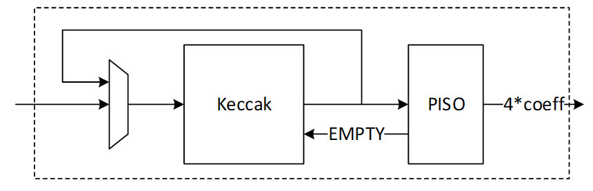

### Performance

Sampling a polynomial with 256 coefficients takes 256/4=64 cycles. The first round of Keccak needs 12 cycles, and the rest of Keccak operation will be parallel with expand mask operation. 

For a complete expand mask for Dilithium ML-DSA-87 with 7 polynomials, 7\*64+12=460 cycles are required using sequential operation. However, our design can be duplicated to enable parallel sampling for two different polynomials. Having two parallel design results in 268 cycles, while three parallel design results in 204 cycles at the cost of more resource utilization.

## Stage 2: Memory-NTT-Memory

The most computationally intensive operation in lattice-based PQC schemes is polynomial multiplication which can be accelerated using NTT. However, NTT is still a performance bottleneck in lattice-based cryptography. We propose improved NTT architecture with highly efficient modular reduction. This architecture supports NTT, INTT, and point-wise multiplication (PWM) to enhance the design from resource sharing point-of-view while reducing the pre-processing cost of NTT and post-processing cost of INTT. 

Our NTT architecture exploits a merged-layer NTT technique using two pipelined stages with two parallel cores in each stage level, making 4 butterfly cores in total. Our proposed parallel pipelined butterfly cores enable us to perform Radix-4 NTT/INTT operation with 4 parallel coefficients. While memory bandwidth limits the efficiency of the butterfly operation, we use a specific memory pattern to store four coefficients per address. 

### NTT Architecture

An NTT operation can be regarded as an iterative operation by applying a sequence of butterfly operations on the input polynomial coefficients. A butterfly operation is an arithmetic operation that combines two coefficients to obtain two outputs. By repeating this process for different pairs of coefficients, the NTT operation can be computed in a logarithmic number of steps. 

Cooley-Tukey (CT) and Gentleman-Sande (GS) butterfly configurations can be used to facilitate NTT/INTT computation. The bit-reverse function reverses the bits of the coefficient index. However, the bit-reverse permutation can be skipped by using CT butterfly for NTT and GS for INTT.

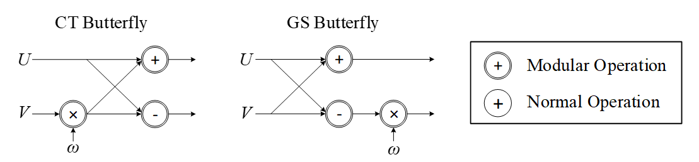

We propose a merged NTT architecture using dual radix-4 design by employing four pipelined stages with two parallel cores at each stage level. 

The following presents the high-level architecture of our proposed NTT to take advantage of Merged architectural design:

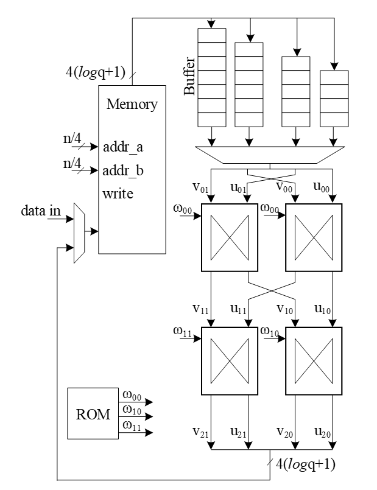

The following figure illustrates a 16-point NTT data flow based on our proposed architecture:

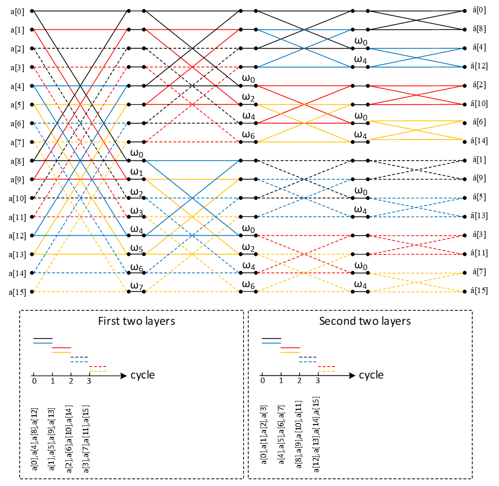

A merged-layer NTT technique uses two pipelined stages with two parallel cores in each stage level, making 4 butterfly cores in total. The parallel pipelined butterfly cores enable us to perform Radix-4 NTT/INTT operation with 4 parallel coefficients. 

However, NTT requires a specific memory pattern that may limit the efficiency of the butterfly operation. For Dilithium use case, there are n=256 coefficients per polynomial that requires log n=8 layers of NTT operations. Each butterfly unit takes two coefficients while difference between the indexes is 28-i in ith stage. That means for the first stage, the given indexes for each butterfly unit are (k, k+128):

Stage 1 input indexes: {(0, 128), {1, 129), (2, 130), …, (127, 255)}

Stage 2 input indexes: {(0, 64), {1, 65), (2, 66), …, (63, 127), (128, 192), (129, 193), …, (191, 255)}

…

Stage 8 input indexes: {(0, 1), {2, 3), (4, 5), …, (254, 255)}

There are several considerations for that:

- We need access to 4 coefficients per cycle to match the throughput into 2√ó2 butterfly units.  
- An optimized architecture provides a memory with only one reading port, and one writing port.  
- Based on the previous two notes, each memory address contains 4 coefficients.  
- The initial coefficients are produced sequentially by Keccak and samplers. Specifically, they begin with 0 and continue incrementally up to 255\. Hence, at the very beginning cycle, the memory contains (0, 1, 2, 3\) in the first address, (4, 5, 6, 7\) in second address, and so on.  
- The cost of in-place memory relocation to align the memory content is not negligible. Particularly, it needs to be repeated for each stage.

While memory bandwidth limits the efficiency of the butterfly operation, we use a specific memory pattern to store four coefficients per address.  

We propose a pipeline architecture the read memory in a particular pattern and using a set of buffers, the corresponding coefficients are fed into NTT block. 

The initial memory contains the indexes as follows:

| Address | Initial Memory Content |     |     |     |
| ------- | ---------------------- | --- | --- | --- |
|         |                        |     |     |     |
| 0       | 0                      | 1   | 2   | 3   |
| 1       | 4                      | 5   | 6   | 7   |
| 2       | 8                      | 9   | 10  | 11  |
| 3       | 12                     | 13  | 14  | 15  |
| 4       | 16                     | 17  | 18  | 19  |
| 5       | 20                     | 21  | 22  | 23  |
| 6       | 24                     | 25  | 26  | 27  |
| 7       | 28                     | 29  | 30  | 31  |
| 8       | 32                     | 33  | 34  | 35  |
| 9       | 36                     | 37  | 38  | 39  |
| 10      | 40                     | 41  | 42  | 43  |
| 11      | 44                     | 45  | 46  | 47  |
| 12      | 48                     | 49  | 50  | 51  |
| 13      | 52                     | 53  | 54  | 55  |
| 14      | 56                     | 57  | 58  | 59  |
| 15      | 60                     | 61  | 62  | 63  |
| 16      | 64                     | 65  | 66  | 67  |
| 17      | 68                     | 69  | 70  | 71  |
| 18      | 72                     | 73  | 74  | 75  |
| 19      | 76                     | 77  | 78  | 79  |
| 20      | 80                     | 81  | 82  | 83  |
| 21      | 84                     | 85  | 86  | 87  |
| 22      | 88                     | 89  | 90  | 91  |
| 23      | 92                     | 93  | 94  | 95  |
| 24      | 96                     | 97  | 98  | 99  |
| 25      | 100                    | 101 | 102 | 103 |
| 26      | 104                    | 105 | 106 | 107 |
| 27      | 108                    | 109 | 110 | 111 |
| 28      | 112                    | 113 | 114 | 115 |
| 29      | 116                    | 117 | 118 | 119 |
| 30      | 120                    | 121 | 122 | 123 |
| 31      | 124                    | 125 | 126 | 127 |
| 32      | 128                    | 129 | 130 | 131 |
| 33      | 132                    | 133 | 134 | 135 |
| 34      | 136                    | 137 | 138 | 139 |
| 35      | 140                    | 141 | 142 | 143 |
| 36      | 144                    | 145 | 146 | 147 |
| 37      | 148                    | 149 | 150 | 151 |
| 38      | 152                    | 153 | 154 | 155 |
| 39      | 156                    | 157 | 158 | 159 |
| 40      | 160                    | 161 | 162 | 163 |
| 41      | 164                    | 165 | 166 | 167 |
| 42      | 168                    | 169 | 170 | 171 |
| 43      | 172                    | 173 | 174 | 175 |
| 44      | 176                    | 177 | 178 | 179 |
| 45      | 180                    | 181 | 182 | 183 |
| 46      | 184                    | 185 | 186 | 187 |
| 47      | 188                    | 189 | 190 | 191 |
| 48      | 192                    | 193 | 194 | 195 |
| 49      | 196                    | 197 | 198 | 199 |
| 50      | 200                    | 201 | 202 | 203 |
| 51      | 204                    | 205 | 206 | 207 |
| 52      | 208                    | 209 | 210 | 211 |
| 53      | 212                    | 213 | 214 | 215 |
| 54      | 216                    | 217 | 218 | 219 |
| 55      | 220                    | 221 | 222 | 223 |
| 56      | 224                    | 225 | 226 | 227 |
| 57      | 228                    | 229 | 230 | 231 |
| 58      | 232                    | 233 | 234 | 235 |
| 59      | 236                    | 237 | 238 | 239 |
| 60      | 240                    | 241 | 242 | 243 |
| 61      | 244                    | 245 | 246 | 247 |
| 62      | 248                    | 249 | 250 | 251 |
| 63      | 252                    | 253 | 254 | 255 |

Suppose memory is read in this pattern:

Addr: 0, 16, 32, 48, 1, 17, 33, 49, …, 15, 31, 47, 63

The input goes to the customized buffer architecture as follows:

|  0  |  ‚Üí  |     |     |     |     |     |     |     |
| :-: | :-: | :-: | :-: | :-: | :-: | :-: | :-: | :-: |
|  1  |     |     |     |     |     |     |     |     |
|  2  |     |     |     |     |     |     |     |     |
|  3  |     |     |     |     |     |     |     |     |

Cycle 0 reading address 0

| 64  |  ‚Üí  |     |     |     |  0  |     |     |     |
| :-: | :-: | :-: | :-: | :-: | :-: | :-: | :-: | :-: |
| 65  |     |     |     |  1  |     |     |     |     |
| 66  |     |     |  2  |     |     |     |     |     |
| 67  |     |  3  |     |     |     |     |     |     |

Cycle 1 reading address 16

| 128 |  ‚Üí  |     |     |     | 64  |  0  |     |     |
| :-: | :-: | :-: | :-: | :-: | :-: | :-: | :-: | :-: |
| 129 |     |     |     | 65  |  1  |     |     |     |
| 130 |     |     | 66  |  2  |     |     |     |     |
| 131 |     | 67  |  3  |     |     |     |     |     |

Cycle 2 reading address 32

| 192 |  ‚Üí  |     |     |     | 128 | 64  |  0  |     |
| :-: | :-: | :-: | :-: | :-: | :-: | :-: | :-: | :-: |
| 193 |     |     |     | 129 | 65  |  1  |     |     |
| 194 |     |     | 130 | 66  |  2  |     |     |     |
| 195 |     | 131 | 67  |  3  |     |     |     |     |

Cycle 3 reading address 48

|  4  |  ‚Üí  |     |     |     | 192 | 128 | 64  |  0  |
| :-: | :-: | :-: | :-: | :-: | :-: | :-: | :-: | :-: |
|  5  |     |     |     | 193 | 129 | 65  |  1  |     |
|  6  |     |     | 194 | 130 | 66  |  2  |     |     |
|  7  |     | 195 | 131 | 67  |  3  |     |     |     |

Cycle 4 reading address 1

| 68  |  ‚Üí  |     |     |     |  4  | 192 | 128 | 64  |
| :-: | :-: | :-: | :-: | :-: | :-: | :-: | :-: | :-: |
| 69  |     |     |     |  5  | 193 | 129 | 65  |  1  |
| 70  |     |     |  6  | 194 | 130 | 66  |  2  |     |
| 71  |     |  7  | 195 | 131 | 67  |  3  |     |     |

Cycle 5 reading address 17

The highlighted value in the first buffer contains the required coefficients for our butterfly units, i.e., (0, 128\) and (64, 192). Since we merged the 1 and second layers of NTT stages, the output of the first parallel butterfly units need to exchange one coefficient and then the required input for the second parallel set of butterfly units is ready, i.e., (0, 64\) and (128, 192).

After completing the first round of operation including NTT stage 1 and 2, the memory contains the following data:

| Address | Memory Content after 1&2 stages |     |     |     |
| ------- | ------------------------------- | --- | --- | --- |
|         |                                 |     |     |     |
| 0       | 0                               | 64  | 128 | 192 |
| 1       | 1                               | 65  | 129 | 193 |
| 2       | 2                               | 66  | 130 | 194 |
| 3       | 3                               | 67  | 131 | 195 |
| 4       | 4                               | 68  | 132 | 196 |
| 5       | 5                               | 69  | 133 | 197 |
| 6       | 6                               | 70  | 134 | 198 |
| 7       | 7                               | 71  | 135 | 199 |
| 8       | 8                               | 72  | 136 | 200 |
| 9       | 9                               | 73  | 137 | 201 |
| 10      | 10                              | 74  | 138 | 202 |
| 11      | 11                              | 75  | 139 | 203 |
| 12      | 12                              | 76  | 140 | 204 |
| 13      | 13                              | 77  | 141 | 205 |
| 14      | 14                              | 78  | 142 | 206 |
| 15      | 15                              | 79  | 143 | 207 |
| 16      | 16                              | 80  | 144 | 208 |
| 17      | 17                              | 81  | 145 | 209 |
| 18      | 18                              | 82  | 146 | 210 |
| 19      | 19                              | 83  | 147 | 211 |
| 20      | 20                              | 84  | 148 | 212 |
| 21      | 21                              | 85  | 149 | 213 |
| 22      | 22                              | 86  | 150 | 214 |
| 23      | 23                              | 87  | 151 | 215 |
| 24      | 24                              | 88  | 152 | 216 |
| 25      | 25                              | 89  | 153 | 217 |
| 26      | 26                              | 90  | 154 | 218 |
| 27      | 27                              | 91  | 155 | 219 |
| 28      | 28                              | 92  | 156 | 220 |
| 29      | 29                              | 93  | 157 | 221 |
| 30      | 30                              | 94  | 158 | 222 |
| 31      | 31                              | 95  | 159 | 223 |
| 32      | 32                              | 96  | 160 | 224 |
| 33      | 33                              | 97  | 161 | 225 |
| 34      | 34                              | 98  | 162 | 226 |
| 35      | 35                              | 99  | 163 | 227 |
| 36      | 36                              | 100 | 164 | 228 |
| 37      | 37                              | 101 | 165 | 229 |
| 38      | 38                              | 102 | 166 | 230 |
| 39      | 39                              | 103 | 167 | 231 |
| 40      | 40                              | 104 | 168 | 232 |
| 41      | 41                              | 105 | 169 | 233 |
| 42      | 42                              | 106 | 170 | 234 |
| 43      | 43                              | 107 | 171 | 235 |
| 44      | 44                              | 108 | 172 | 236 |
| 45      | 45                              | 109 | 173 | 237 |
| 46      | 46                              | 110 | 174 | 238 |
| 47      | 47                              | 111 | 175 | 239 |
| 48      | 48                              | 112 | 176 | 240 |
| 49      | 49                              | 113 | 177 | 241 |
| 50      | 50                              | 114 | 178 | 242 |
| 51      | 51                              | 115 | 179 | 243 |
| 52      | 52                              | 116 | 180 | 244 |
| 53      | 53                              | 117 | 181 | 245 |
| 54      | 54                              | 118 | 182 | 246 |
| 55      | 55                              | 119 | 183 | 247 |
| 56      | 56                              | 120 | 184 | 248 |
| 57      | 57                              | 121 | 185 | 249 |
| 58      | 58                              | 122 | 186 | 250 |
| 59      | 59                              | 123 | 187 | 251 |
| 60      | 60                              | 124 | 188 | 252 |
| 61      | 61                              | 125 | 189 | 253 |
| 62      | 62                              | 126 | 190 | 254 |
| 63      | 63                              | 127 | 191 | 255 |

The same process can be applied in the next round to perform NTT stage 3 and 4\.

|  0  |  ‚Üí  |     |     |     |     |     |     |     |
| :-: | :-: | :-: | :-: | :-: | :-: | :-: | :-: | :-: |
| 64  |     |     |     |     |     |     |     |     |
| 128 |     |     |     |     |     |     |     |     |
| 192 |     |     |     |     |     |     |     |     |

Cycle 0 reading address 0

| 16  |  ‚Üí  |     |     |     |  0  |     |     |     |
| :-: | :-: | :-: | :-: | :-: | :-: | :-: | :-: | :-: |
| 80  |     |     |     | 64  |     |     |     |     |
| 144 |     |     | 128 |     |     |     |     |     |
| 208 |     | 192 |     |     |     |     |     |     |

Cycle 1 reading address 16

| 32  |  ‚Üí  |     |     |     | 16  |  0  |     |     |
| :-: | :-: | :-: | :-: | :-: | :-: | :-: | :-: | :-: |
| 96  |     |     |     | 80  | 64  |     |     |     |
| 160 |     |     | 144 | 128 |     |     |     |     |
| 224 |     | 208 | 192 |     |     |     |     |     |

Cycle 2 reading address 32

| 48  |  ‚Üí  |     |     |     | 32  | 16  |  0  |     |
| :-: | :-: | :-: | :-: | :-: | :-: | :-: | :-: | :-: |
| 112 |     |     |     | 96  | 80  | 64  |     |     |
| 176 |     |     | 160 | 144 | 128 |     |     |     |
| 240 |     | 224 | 208 | 192 |     |     |     |     |

Cycle 3 reading address 48

|  1  |  ‚Üí  |     |     |     | 48  | 32  | 16  |  0  |
| :-: | :-: | :-: | :-: | :-: | :-: | :-: | :-: | :-: |
| 65  |     |     |     | 112 | 96  | 80  | 64  |     |
| 129 |     |     | 176 | 160 | 144 | 128 |     |     |
| 193 |     | 240 | 224 | 208 | 192 |     |     |     |

Cycle 4 reading address 1

| 17  |  ‚Üí  |     |     |     |  1  | 48  | 32  | 16  |
| :-: | :-: | :-: | :-: | :-: | :-: | :-: | :-: | :-: |
| 81  |     |     |     | 65  | 112 | 96  | 80  | 64  |
| 145 |     |     | 129 | 176 | 160 | 144 | 128 |     |
| 209 |     | 193 | 240 | 224 | 208 | 192 |     |     |

Cycle 5 reading address 17

After completing all stages, the memory contents would be as follows:

| Address | Memory Content after Stage 7&8 |     |     |     |
| ------- | ------------------------------ | --- | --- | --- |
|         |                                |     |     |     |
| 0       | 0                              | 1   | 2   | 3   |
| 1       | 4                              | 5   | 6   | 7   |
| 2       | 8                              | 9   | 10  | 11  |
| 3       | 12                             | 13  | 14  | 15  |
| 4       | 16                             | 17  | 18  | 19  |
| 5       | 20                             | 21  | 22  | 23  |
| 6       | 24                             | 25  | 26  | 27  |
| 7       | 28                             | 29  | 30  | 31  |
| 8       | 32                             | 33  | 34  | 35  |
| 9       | 36                             | 37  | 38  | 39  |
| 10      | 40                             | 41  | 42  | 43  |
| 11      | 44                             | 45  | 46  | 47  |
| 12      | 48                             | 49  | 50  | 51  |
| 13      | 52                             | 53  | 54  | 55  |
| 14      | 56                             | 57  | 58  | 59  |
| 15      | 60                             | 61  | 62  | 63  |
| 16      | 64                             | 65  | 66  | 67  |
| 17      | 68                             | 69  | 70  | 71  |
| 18      | 72                             | 73  | 74  | 75  |
| 19      | 76                             | 77  | 78  | 79  |
| 20      | 80                             | 81  | 82  | 83  |
| 21      | 84                             | 85  | 86  | 87  |
| 22      | 88                             | 89  | 90  | 91  |
| 23      | 92                             | 93  | 94  | 95  |
| 24      | 96                             | 97  | 98  | 99  |
| 25      | 100                            | 101 | 102 | 103 |
| 26      | 104                            | 105 | 106 | 107 |
| 27      | 108                            | 109 | 110 | 111 |
| 28      | 112                            | 113 | 114 | 115 |
| 29      | 116                            | 117 | 118 | 119 |
| 30      | 120                            | 121 | 122 | 123 |
| 31      | 124                            | 125 | 126 | 127 |
| 32      | 128                            | 129 | 130 | 131 |
| 33      | 132                            | 133 | 134 | 135 |
| 34      | 136                            | 137 | 138 | 139 |
| 35      | 140                            | 141 | 142 | 143 |
| 36      | 144                            | 145 | 146 | 147 |
| 37      | 148                            | 149 | 150 | 151 |
| 38      | 152                            | 153 | 154 | 155 |
| 39      | 156                            | 157 | 158 | 159 |
| 40      | 160                            | 161 | 162 | 163 |
| 41      | 164                            | 165 | 166 | 167 |
| 42      | 168                            | 169 | 170 | 171 |
| 43      | 172                            | 173 | 174 | 175 |
| 44      | 176                            | 177 | 178 | 179 |
| 45      | 180                            | 181 | 182 | 183 |
| 46      | 184                            | 185 | 186 | 187 |
| 47      | 188                            | 189 | 190 | 191 |
| 48      | 192                            | 193 | 194 | 195 |
| 49      | 196                            | 197 | 198 | 199 |
| 50      | 200                            | 201 | 202 | 203 |
| 51      | 204                            | 205 | 206 | 207 |
| 52      | 208                            | 209 | 210 | 211 |
| 53      | 212                            | 213 | 214 | 215 |
| 54      | 216                            | 217 | 218 | 219 |
| 55      | 220                            | 221 | 222 | 223 |
| 56      | 224                            | 225 | 226 | 227 |
| 57      | 228                            | 229 | 230 | 231 |
| 58      | 232                            | 233 | 234 | 235 |
| 59      | 236                            | 237 | 238 | 239 |
| 60      | 240                            | 241 | 242 | 243 |
| 61      | 244                            | 245 | 246 | 247 |
| 62      | 248                            | 249 | 250 | 251 |
| 63      | 252                            | 253 | 254 | 255 |

The proposed method saves the time needed for shuffling and reordering, while using only a little more memory.

With this memory access pattern, writes to the memory are in order (0, 1, 2, 3, etc) while reads wraparound with a step of 16 (0, 16, 32 48, 1, 17, 33, 49, etc). Hence, there will be a memory conflict where writes to addresses take place before the data is read and provided to the butterfly 2x2 module. To resolve this, a set of 3 base addresses are given to the NTT module – src address, interim address and dest address that belong to 3 separate sections in memory. The NTT module will access the memory with the appropriate base address for each round as follows:

| Round | Read base address | Write base address |
| :---- | :---------------- | :----------------- |
| 0     | src               | interim            |
| 1     | interim           | dest               |
| 2     | dest              | interim            |
| 3     | interim           | dest               |

At the end of NTT operation, results must be located in the section with the dest base address. This will also provide the benefit of preserving the original input for later use in keygen or signing operations. The same memory access pattern is followed for INTT operation as well. Note that Adam’s bridge controller may choose to make interim and dest base addresses the same to save on memory usage. In this case, the requirement is still to have a separate src base address to preserve original input polynomial coefficients in memory.

#### *Modular Reduction*

The modular addition/subtraction in hardware platform can be implemented by one additional subtraction/addition operations, as follows:

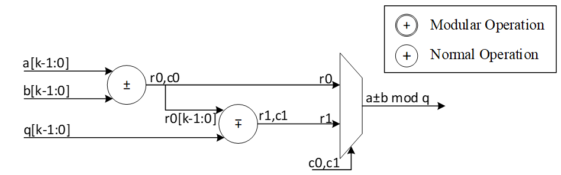

However, modular multiplication can be implemented using different techniques. The commonly used Barrett reduction and Montgomery reduction require additional multiplications and are more suitable for the non-specific modulus. Furthermore, Montgomery reduction needs two more steps to convert all inputs from normal domain to Montgomery domain and then convert back the results into normal domain. This conversation increases the latency of NTT operations and does not lead to the best performance. Hence, Barrett reduction and Montgomery reduction are expensive in time and hardware resources.

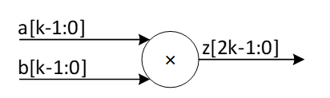

For Dilithium hardware accelerator, we can customize the reduction architecture based on the prime value of the scheme with q= 8,380,417 to design a hardware-friendly architecture that increase the efficiency of computation. The value of q can be presented by: 

q=8,380,417=223-213+1

For the modular operation we have:

223=213-1 mod q

Suppose that all input operands are less than q, we have:

0≤a,b\<q

z=a.b\<q2=46'h3FE0\_04FF\_C001

Based on 223=213-1 mod q, we can rewrite the equation as follows:

z=223z45:23+z22:0=213z45:23-z45:23+z22:0=223z45:33+213z32:23-z45:23+z22:0=213z45:33-z45:33+213z32:23-z45:23+z22:0=223z45:43+213z42:33-z45:33+213z32:23-z45:23+z22:0=213z45:43-z45:43+213z42:33-z45:33+213z32:23-z45:23+z22:0=213z45:43+z42:33+z32:23+-z45:43-z45:33-z45:23+z22:0=213z45:43+z42:33+z32:23+z22:13+-z45:43-z45:33-z45:23+z12:0=213c-(z45:43+z45:33+z45:23)+z\[12:0\]

Where:

c=z45:43+z42:33+z32:23+z\[22:13\]\<212

The value of c has 12 bits, and we can rewrite it as follows:

213c11:0=223c11:10+213c9:0=213c11:10-c11:10+213c9:0=213d-c11:10

d=c11:10+c9:0

So, the value of z mod q is as follows:

z=213c-z45:43+z45:33+z45:23+z12:0=213d+z12:0-z45:43+z45:33+z45:23+c11:10=213d+z12:0-e

Where:

e=z45:43+z45:33+z45:23+c11:10=f+z45:23 mod q

f\[14:0\]=z45:43+z45:33+c11:10

We use a modular addition for f+z45:23 to keep it less than q. This modular addition has one stage delay.

The addition between 213d and z12:0 can be implemented by concatenating since the first 13 bits of d are zero as follows:

g23:0=213d+z12:0=d10:0||z\[12:0\]

Since the result has more than 23 bits, we perform a modular addition to keep it less than q. For that, the regular modular addition will be replaced by the following architecture while c0=g23, r0=g\[22:0\]. In other words, c0=d10, r0\[22:0\]=d9:0||z\[12:0\]

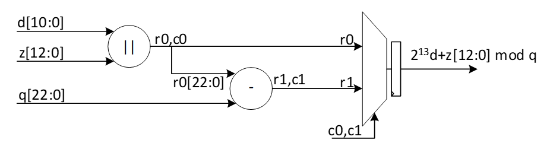

The following figure shows the architecture of this reduction technique. As one can see, these functions do not need any multiplications in hardware and can be achieved by shifter and adder.

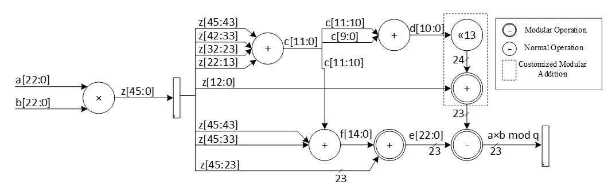

The modular multiplication is implemented with a 3-stage pipeline architecture. At the first pipeline stage, z=a·b is calculated. At the second pipeline stage, f+z\[45:23\] and 213d+z12:0 are calculated in parallel. At the third pipeline stage, a modular subtraction is executed to obtain the result and the result is output.

We do not need extra multiplications for our modular reduction, unlike Barrett and Montgomery algorithms. The operations of our reduction do not depend on the input data and do not leak any information. Our reduction using the modulus q= 8,380,417 is fast, efficient and constant-time.

### Performance

For a complete NTT operation with 8 layers, i.e., n \= 256, the proposed architecture takes 82=4      rounds. Each round involves 2564=64 operations in pipelined architecture. Hence, the latency of each round is equal to 64 (read from memory) \+ 8 (2 sequential butterfly latency) \+ 4 (input buffer latency) \+ 2 (wait between each two stages) \= 78 cycles. 

Round 0: stage 0 & 1 

Round 1: stage 2 & 3

Round 2: stage 4 & 5

Round 3: stage 6 & 7

The total latency would be 4√ó78=312 cycles.

For a complete NTT/INTT operation for Dilithium ML-DSA-87 with 7 or 8 polynomials, 7\*312=2184 or 8\*312=2496 cycles are required. However, our design can be duplicated to enable parallel NTT for two different polynomials. Having two parallel design results in 1248 cycles.

### NTT shuffling countermeasure

To protect NTT, we have two options – shuffling the order of execution of coefficients and masking in-order computation such that NTT performs operation on two input shares per coefficient and produces two output shares. While masking is a strong countermeasure for side-channel attacks, it requires at least 4x the area and adds 4x the latency to one NTT operation. Shuffling is an implementation trick that can be used to provide randomization to some degree without area or latency overhead. In Adam’s Bridge, we employ a combination of both for protected design. One NTT core will have shuffling for both NTT and INTT modes. The second NTT core will have shuffling and masking on the first layer of computation for INTT mode with cascaded connection from a masked PWM module. In NTT mode, the second NTT core will employ only shuffling. PWM operations are masked by default. PWA and PWS operations are shuffled by default.

| Address |     | Memory Content |     |     |     |
| ------- | --- | -------------- | --- | --- | --- |
|         |     |                |     |     |     |
| 0       |     | 0              | 1   | 2   | 3   |
| 1       |     | 4              | 5   | 6   | 7   |
| 2       |     | 8              | 9   | 10  | 11  |
| 3       |     | 12             | 13  | 14  | 15  |
| 4       |     | 16             | 17  | 18  | 19  |
| 5       |     | 20             | 21  | 22  | 23  |
| 6       |     | 24             | 25  | 26  | 27  |
| 7       |     | 28             | 29  | 30  | 31  |
| 8       |     | 32             | 33  | 34  | 35  |
| 9       |     | 36             | 37  | 38  | 39  |
| 10      |     | 40             | 41  | 42  | 43  |
| 11      |     | 44             | 45  | 46  | 47  |
| 12      |     | 48             | 49  | 50  | 51  |
| 13      |     | 52             | 53  | 54  | 55  |
| 14      |     | 56             | 57  | 58  | 59  |
| 15      |     | 60             | 61  | 62  | 63  |
| 16      |     | 64             | 65  | 66  | 67  |
| 17      |     | 68             | 69  | 70  | 71  |
| 18      |     | 72             | 73  | 74  | 75  |
| 19      |     | 76             | 77  | 78  | 79  |
| 20      |     | 80             | 81  | 82  | 83  |
| 21      |     | 84             | 85  | 86  | 87  |
| 22      |     | 88             | 89  | 90  | 91  |
| 23      |     | 92             | 93  | 94  | 95  |
| 24      |     | 96             | 97  | 98  | 99  |
| 25      |     | 100            | 101 | 102 | 103 |
| 26      |     | 104            | 105 | 106 | 107 |
| 27      |     | 108            | 109 | 110 | 111 |
| 28      |     | 112            | 113 | 114 | 115 |
| 29      |     | 116            | 117 | 118 | 119 |
| 30      |     | 120            | 121 | 122 | 123 |
| 31      |     | 124            | 125 | 126 | 127 |
| 32      |     | 128            | 129 | 130 | 131 |
| 33      |     | 132            | 133 | 134 | 135 |
| 34      |     | 136            | 137 | 138 | 139 |
| 35      |     | 140            | 141 | 142 | 143 |
| 36      |     | 144            | 145 | 146 | 147 |
| 37      |     | 148            | 149 | 150 | 151 |
| 38      |     | 152            | 153 | 154 | 155 |
| 39      |     | 156            | 157 | 158 | 159 |
| 40      |     | 160            | 161 | 162 | 163 |
| 41      |     | 164            | 165 | 166 | 167 |
| 42      |     | 168            | 169 | 170 | 171 |
| 43      |     | 172            | 173 | 174 | 175 |
| 44      |     | 176            | 177 | 178 | 179 |
| 45      |     | 180            | 181 | 182 | 183 |
| 46      |     | 184            | 185 | 186 | 187 |
| 47      |     | 188            | 189 | 190 | 191 |
| 48      |     | 192            | 193 | 194 | 195 |
| 49      |     | 196            | 197 | 198 | 199 |
| 50      |     | 200            | 201 | 202 | 203 |
| 51      |     | 204            | 205 | 206 | 207 |
| 52      |     | 208            | 209 | 210 | 211 |
| 53      |     | 212            | 213 | 214 | 215 |
| 54      |     | 216            | 217 | 218 | 219 |
| 55      |     | 220            | 221 | 222 | 223 |
| 56      |     | 224            | 225 | 226 | 227 |
| 57      |     | 228            | 229 | 230 | 231 |
| 58      |     | 232            | 233 | 234 | 235 |
| 59      |     | 236            | 237 | 238 | 239 |
| 60      |     | 240            | 241 | 242 | 243 |
| 61      |     | 244            | 245 | 246 | 247 |
| 62      |     | 248            | 249 | 250 | 251 |
| 63      |     | 252            | 253 | 254 | 255 |

To implement shuffling in NTT, the memory content is divided into 16 chunks. The highlighted section in the memory table above shows the 16 chunk start addresses. For example, the first chunk consists of addresses 0, 16, 32, 48\. Second chunk has 1, 17, 33, 49, and so on. In NTT mode, memory read pattern is 0, 16, 32, 48, 1, 17, 33, 49, etc. The buffer in NTT module is updated to have two sections and is addressable to support INTT shuffling with matched search space as that of NTT mode.

During shuffling, two levels of randomization are done:

1. Chunk order is randomized  
2. Start address within the selected chunk is also randomized. 

With this technique, the search space is 16 √ó416=236. For example, if chunk 5 is selected as the starting chunk, the input buffer in NTT mode is configured as below.

|      |      |      |      |
| :--- | :--- | :--- | :--- |
|      |      |      |      |
|      |      |      |      |
|      |      |      |      |
| 2151 | 2140 | 2133 | 2122 |
| 1511 | 1500 | 1493 | 1482 |
| 871  | 860  | 853  | 842  |
| 231  | 220  | 213  | 202  |

Then, the order of execution is randomized for NTT as a second level of randomization. For example, order of execution in NTT mode can be (22, 86, 150, 214), (23, 87, 151, 215), (20, 84, 148, 212), (21, 85, 149, 213). Note that, once a random start address is selected, the addresses increment from that point and wrap around until all 4 sets of coefficients have been processed in order. Similarly, once a random chunk is selected, rest of the chunks are processed in order and wrapped around until all chunks are covered. In this example, chunk processing order is 5, 6, 7, 8, …, 15, 0, 1, 2, 3, 4\. 

For the next chunk, buffer pointer switches to the top half. While the bottom half of the buffer is read and executed, each location of the top half is filled in the same cycle avoiding latency overhead. When all 4 entries of the lower buffer are processed, upper buffer is ready to be fed into BF units.

| 2193 | 2183 | 2173 | 2163 |
| :--- | :--- | :--- | :--- |
| 1552 | 1542 | 1532 | 1522 |
| 911  | 901  | 891  | 881  |
| 270  | 260  | 250  | 240  |
| 2151 | 2140 | 2133 | 2122 |
| 1511 | 1500 | 1493 | 1482 |
| 871  | 860  | 853  | 842  |
| 231  | 220  | 213  | 202  |

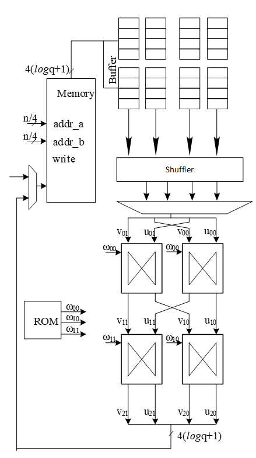

Above figure shows the flow of a shuffled NTT/INTT operation. The shuffler part of the controller is responsible for calculating the correct memory addresses and feed the correct inputs to the BFs.

When shuffling in NTT mode, the memory read and write addresses are computed as shown below.for i in range (0, 4):

    Read address \= chunk \+ (i \* RD\_STEP)

Write address \= chunk \* 4 \+ (rand\_index \* WR\_STEP)

Where rand\_index is the randomized start index of execution order for an NTT operation

E.g. if selected chunk is 5, and rand\_index is 2

    Order of execution is 2, 3, 0, 1

    Read address \= 5 \+ (0\*16), 5 \+ (1\*16), 5+(2\*16), 5+(3\*16) \= 5, 21, 37, 53

    Write address \= (5\*4) \+ (2\*1), (5\*4) \+ (3\*1), (5\*4) \+ (0\*1), (5\*4) \+ (1\*1) \= 22, 23, 20, 21

Figure below shows the additional control logic required to maintain the shuffling mechanism.


The index and chunk are obtained from a random number source. Chunk refers to starting chunk number and index refers to start address within the selected chunk. To account for BF latency, the index and chunk must be delayed appropriately (for our design, this latency is 10 cycles) for use in the controller shuffler logic. 

The general address calculation for NTT is:

mem read addr=chunk+(countregular\*STEPrd)

Since reading memory can be in order, a regular counter is used to read all 4 addresses of the selected chunk.

mem write addr=chunkf10\*4+indexf10\*STEPwr

The buffer address calculation for NTT is:

buffer write addr=countregular

buffer read addr=countindex

Where f10 refers to delayed values by 10 cycles. In this logic, chunk is updated every 4 cycles and buffer pointer is toggled (to top or bottom half) every 4 cycles.

The general address calculation for INTT is:

mem read addr=(chunk\*4)+(index\*STEPrd)

mem write addr=chunkf10+countregular\*STEPwr

Since writing to memory can be in order, a regular counter is used to write all 4 addresses of the selected chunk.

In INTT, index need not be delayed since the BFs consume the coefficients in the next cycle.

The buffer address calculation for INTT is:

buffer write addr=indexf10

buffer read addr=countregular

## Stage 3: Keccak \- SampleRejq – Pointwise Mult- Memory

Dilithium (or Kyber) samples the polynomials that make up the vectors and matrices independently, using a fixed seed value and a nonce value that increases the security as the input for Keccak. Keccak is used to take these seed and nonce and generate random stream bits. 

Rejection sampler takes 24-bits (12 bits in case of Kyber) and checks if it is less than the prime number *q* \= 223 ‚àí213\+1 \= 8380417 (q=3369 in case of Kyber). It continues to sample all required coefficients, n=256, for a polynomial. 

After sampling a polynomial with 256 coefficients, nonce will be changed and a new random stream will be generated using Keccak core and will be sampled by rejection sampling unit.

The output of this operation results in a matrix of polynomial with k rows and l column while each polynomial includes 256 coefficients.

A0,0  A0,l-1  ‚ã±  Ak-1,0  Ak-1,l-1 k√ól

Rejection sampling is used in all three operations of Dilithium, i.e., keygen, sign, and verify. Since based on the specification of the Dilithium (and Kyber), the sampled coefficients are considered in NTT domain, the output of rejection sampler can directly be used for polynomial multiplication operation, as follows:

A0,0  A0,l-1  ⋱  Ak-1,0  Ak-1,l-1 °s1,0  s1,l-1 \=A0,0 °s1,0+…+A0,l-1°s1,l-1  Ak-1,0°s1,0+…+Ak-1,l-1°s1,l-1 

We propose an architecture to remove the cost of memory access from Keccak to rejection sampler, and from rejection sampler to polynomial multiplier. To achieve this, we need to have a balanced throughput between all these modules to avoid large buffering or conflict between them.

High-level architecture is illustrated as follows:

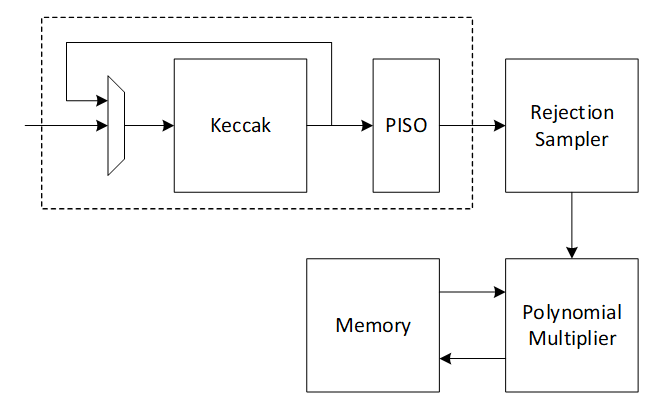

### Keccak Unit

Keccak is used in SHAKE-128 configuration for rejection sampling operation. Hence, it will take the input data and generates 1344-bit output after each round. We propose implementing of Keccak while each round takes 12 cycles. The format of input data is as follows:

Input data \= ρ | j | i

Where  is seed with 256-bits, i and j are nonce that describes the row and column number of corresponding polynomial A such that:

Ai,j=Rejection\_sampling(Keccak(ρ | j | i))

Since each 24-bit is used for one coefficient, each round of Keccak output provides 1344/24=56 coefficients. To have 256 coefficients for each polynomial (with same seed and nonce), we need to rerun Keccak for at least 5 rounds. 

There are two paths for Keccak input. While the input can be set by controller for each new polynomial, the loop path is used to rerun Keccak for completing the previous polynomial.

Rejection sampler cannot take all 1344-bit output parallelly since it makes hardware architecture too costly and complex, and also there is no other input from Keccak for the next 12 cycles. Therefore, we propose a parallel-input serial-output (PISO) unit in between to store the Keccak output and feed rejection unit sequentially.

### Rejection Sampler

This unit takes data from the output of SHAKE-128 stored in a PISO buffer. The required cycles for this unit are variable due to the non-deterministic pattern of rejection sampling. However, at least 5 Keccak rounds are required to provide 256 coefficients.

In our optimized architecture, this unit works in parallel with the Keccak core. Therefore, the latency for rejection sampling is absorbed within the latency for a concurrently running Keccak core. 

Our proposed polynomial multiplier can perform point-wise multiplication on four coefficients per cycle that also helps to avoid memory access challenges and make the control logic too complicated. This implies that the optimal speed of the rejection sampling module is to sample four coefficients without rejection in one cycle.

On the output side, as the rejection sampling might fail, the rejection rate for each input is:

rejection\_rate= 1-q223=1-8380471223=0.0009764≈10-3

Hence, the probability of failure to provide 4 appropriate coefficients from 4 inputs would be:

1-1-rejection\_rate4=0.00399

To reduce the failure probability and avoid any wait cycle in polynomial multiplication, 5 coefficients are fed into rejection while only 4 of them will be passed to polynomial multiplication. This decision reduces the probability of failure to

1-probability of having 5 good inputs-probability of having 4 good inputs=1-1-rejectionrate5-rejectionrate\*5 4 1-rejectionrate4=0.00000998≈10-5

Adding a FIFO to rejection sampling unit can store the remaining unused coefficients and increase the probability of having 4 appropriate coefficients to match polynomial multiplication throughput. The architecture is as follows:

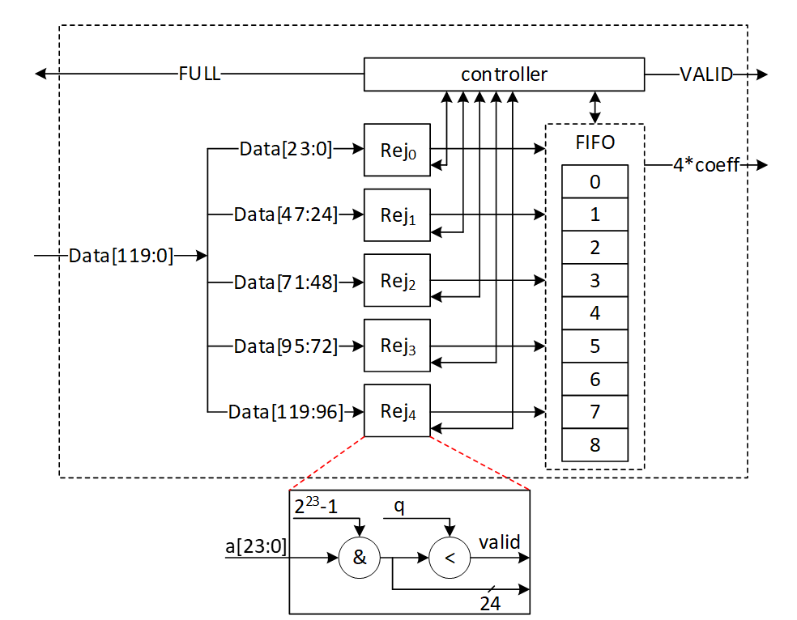

There are 5 rejection sampler circuits corresponding to each 24-bit input. The controller checks if each of these coefficients should be rejected or not. The valid input coefficients can be stored into the FIFO. While maximum 5 coefficients can be fed into FIFO, there are four more entries for the remaining coefficients from the previous cycle. There are several scenarios for the proposed balanced throughput architecture:

1) At the very first cycle, or whenever the FIFO is empty, rejection sampling unit may not provide all 4 coefficients for polynomial multiplication unit. We reduce the failure probability of this scenario by feeding 5 coefficients, however, it may happen. So, for designing efficient architecture, instead of reducing the failure probability by adding more hardware cost, we use a VALID output that stops polynomial multiplier until all 4 required coefficients are sampled.  
2) If all 5 inputs are valid, they are going to be stored into FIFO. The first 4 coefficients will be sent to polynomial multiplication unit, while the remaining coefficients will be shifted to head of FIFO and be used for the next cycle with the first 3 valid coefficients from the next cycle.  
3) The maximum depth of FIFO is 9 entries. If all 9 FIFO entries are full, rejection sampling unit can provide the required output for the next cycles too. Hence, it does not accept a new input from Keccak core by raising FULL flag.  
   

| Cycle count | Input from PISO | FIFO valid entries from previous cycle | Total valid samples | output | FIFO remaining for the next cycle |
| :---------- | :-------------- | :------------------------------------- | :------------------ | :----- | :-------------------------------- |
| 0           | 5               | 0                                      | 5                   | 4      | 1                                 |
| 1           | 5               | 1                                      | 6                   | 4      | 2                                 |
| 2           | 5               | 2                                      | 7                   | 4      | 3                                 |
| 3           | 5               | 3                                      | 8                   | 4      | 4                                 |
| 4           | 5               | 4                                      | 9                   | 4      | 5 (FULL)                          |
| 5           | 0               | 5                                      | 5                   | 4      | 1                                 |
| 6           | 5               | 1                                      | 6                   | 4      | 2                                 |

   

4) If there is not FULL condition for reading from Keccak, all PISO data can be read in 12 cycles, including 11 cycles with 5 coefficients and 1 cycle for the 56th coefficient. This would be match with Keccak throughput that generates 56 coefficients per 12 cycles.  
5) The maximum number of FULL conditions is when there are no rejected coefficients for all 56 inputs. In this case, after 5 cycles with 5 coefficients, there is one FULL condition. After 12 cycles, 50 coefficients are processed by rejection sampling unit, and there are still 6 coefficients inside PISO. To maximize the utilization factor of our hardware resources, Keccak core will check the PISO status. If PISO contains 5 coefficients or more (the required inputs for rejection sampling unit), EMPTY flag will not be set, and Keccak will wait until the next cycle. Hence, rejection sampling unit takes 13 cycles to process 55 coefficients, and the last coefficients will be combined with the next Keccak round to be processed.

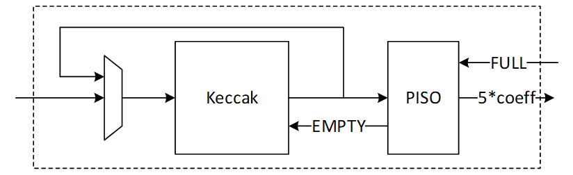

### Performance

For processing each round of Keccak using rejection sampling unit, we need 12 to 13 cycles that result in 60-65 cycles for each polynomial with 256 coefficients. 

For a complete rejection sampling for Dilithium ML-DSA-87 with 8\*7=56 polynomials, 3360 to 3640 cycles are required using sequential operation. However, our design can be duplicated to enable parallel sampling for two different polynomials. Having two parallel design results in 1680 to 1820 cycles, while three parallel design results in 1120 to 1214 cycles at the cost of more resource utilization.

## Stage 4: Memory – Decompose – Encode – Keccak 

### Decompose Unit

Decompose unit is used in signing operation of Dilithium. It decomposes r into (r1,r0) such that r ≡ r1(2γ2)+r0 mod q. The output of decompose has two parts. While r0 will be stored into memory, r1 will be encoded and then be stored into Keccak SIPO input buffer to run SHAKE256. 

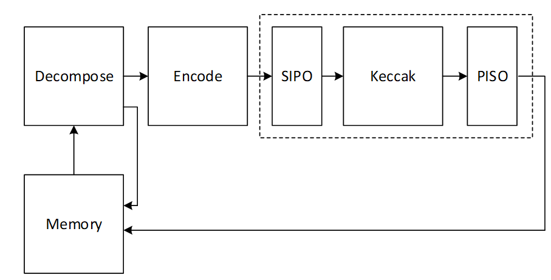

There are k polynomials (k=8 for ML-DSA-87) that needs to be decomposed as follows:

w=w0  wk-1 

Due to our memory configuration that stores 4 coefficients per address, we need 4 parallel cores for decompose and encode units to match the throughout between these modules.

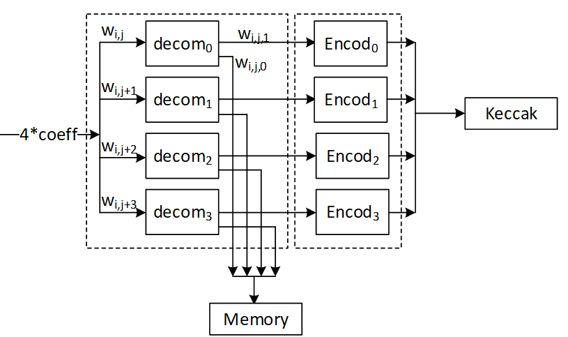

### Performance

There are k polynomials with 256 coefficients for each that need to be fed into decompose unit in pipeline method. After having 1088-bit input into SIPO, Keccak will be enabled parallel with decompose and encode units.  However, the last round of Keccak will be performed after processing all coefficients. Each round of Keccak takes 12 cycles which allows processing of 48 coefficients. Since the output length of each encode unit is 4 bits, Keccak works faster than decompose/encode units and SIPO will not have overflow issue.

For a complete decompose/encode/hash operation for Dilithium ML-DSA-87 with 8 polynomials, 8\*256/4 \+ 12 \= 524 cycles are required using pipelined architecture.

## INTT

A merged-layer INTT technique uses two pipelined stages with two parallel cores in each stage level, making 4 butterfly cores in total. The parallel pipelined butterfly cores enable us to perform Radix-4 INTT operation with 4 parallel coefficients. 

However, INTT requires a specific memory pattern that may limit the efficiency of the butterfly operation. For Dilithium use case, there are n=256 coefficients per polynomial that requires log n=8 layers of INTT operations. Each butterfly unit takes two coefficients while difference between the indexes is 2i-1 in ith stage. That means for the first stage, the given indexes for each butterfly unit are (2\*k, 2\*k+1):

Stage 1 input indexes: {(0, 1), {2, 3), (4, 5), …, (254, 255)}

Stage 2 input indexes: {(0, 2), {1, 3), (4, 6), …, (61, 63), (64, 66), (65, 67), …, (253, 255)}

…

Stage 8 input indexes: {(0, 128), {1, 129), (2, 130), …, (127, 255)}

There are several considerations for that:

- We need access to 4 coefficients per cycle to match the throughput into 2√ó2 butterfly units.  
- An optimized architecture provides a memory with only one reading port, and one writing port.  
- Based on the previous two notes, each memory address contains 4 coefficients.  
- The initial coefficients are stored sequentially by NTT. Specifically, they begin with 0 and continue incrementally up to 255\. Hence, at the very beginning cycle, the memory contains (0, 1, 2, 3\) in the first address, (4, 5, 6, 7\) in second address, and so on.  
- The cost of in-place memory relocation to align the memory content is not negligible. Particularly, it needs to be repeated for each stage.

While memory bandwidth limits the efficiency of the butterfly operation, we use a specific memory pattern to store four coefficients per address.  

We propose a pipeline architecture the read memory in a particular pattern and using a set of buffers, the corresponding coefficients are fed into INTT block. 

The initial memory contains the indexes as follows:

| Address | Initial Memory Content |     |     |     |
| ------- | ---------------------- | --- | --- | --- |
|         |                        |     |     |     |
| 0       | 0                      | 1   | 2   | 3   |
| 1       | 4                      | 5   | 6   | 7   |
| 2       | 8                      | 9   | 10  | 11  |
| 3       | 12                     | 13  | 14  | 15  |
| 4       | 16                     | 17  | 18  | 19  |
| 5       | 20                     | 21  | 22  | 23  |
| 6       | 24                     | 25  | 26  | 27  |
| 7       | 28                     | 29  | 30  | 31  |
| 8       | 32                     | 33  | 34  | 35  |
| 9       | 36                     | 37  | 38  | 39  |
| 10      | 40                     | 41  | 42  | 43  |
| 11      | 44                     | 45  | 46  | 47  |
| 12      | 48                     | 49  | 50  | 51  |
| 13      | 52                     | 53  | 54  | 55  |
| 14      | 56                     | 57  | 58  | 59  |
| 15      | 60                     | 61  | 62  | 63  |
| 16      | 64                     | 65  | 66  | 67  |
| 17      | 68                     | 69  | 70  | 71  |
| 18      | 72                     | 73  | 74  | 75  |
| 19      | 76                     | 77  | 78  | 79  |
| 20      | 80                     | 81  | 82  | 83  |
| 21      | 84                     | 85  | 86  | 87  |
| 22      | 88                     | 89  | 90  | 91  |
| 23      | 92                     | 93  | 94  | 95  |
| 24      | 96                     | 97  | 98  | 99  |
| 25      | 100                    | 101 | 102 | 103 |
| 26      | 104                    | 105 | 106 | 107 |
| 27      | 108                    | 109 | 110 | 111 |
| 28      | 112                    | 113 | 114 | 115 |
| 29      | 116                    | 117 | 118 | 119 |
| 30      | 120                    | 121 | 122 | 123 |
| 31      | 124                    | 125 | 126 | 127 |
| 32      | 128                    | 129 | 130 | 131 |
| 33      | 132                    | 133 | 134 | 135 |
| 34      | 136                    | 137 | 138 | 139 |
| 35      | 140                    | 141 | 142 | 143 |
| 36      | 144                    | 145 | 146 | 147 |
| 37      | 148                    | 149 | 150 | 151 |
| 38      | 152                    | 153 | 154 | 155 |
| 39      | 156                    | 157 | 158 | 159 |
| 40      | 160                    | 161 | 162 | 163 |
| 41      | 164                    | 165 | 166 | 167 |
| 42      | 168                    | 169 | 170 | 171 |
| 43      | 172                    | 173 | 174 | 175 |
| 44      | 176                    | 177 | 178 | 179 |
| 45      | 180                    | 181 | 182 | 183 |
| 46      | 184                    | 185 | 186 | 187 |
| 47      | 188                    | 189 | 190 | 191 |
| 48      | 192                    | 193 | 194 | 195 |
| 49      | 196                    | 197 | 198 | 199 |
| 50      | 200                    | 201 | 202 | 203 |
| 51      | 204                    | 205 | 206 | 207 |
| 52      | 208                    | 209 | 210 | 211 |
| 53      | 212                    | 213 | 214 | 215 |
| 54      | 216                    | 217 | 218 | 219 |
| 55      | 220                    | 221 | 222 | 223 |
| 56      | 224                    | 225 | 226 | 227 |
| 57      | 228                    | 229 | 230 | 231 |
| 58      | 232                    | 233 | 234 | 235 |
| 59      | 236                    | 237 | 238 | 239 |
| 60      | 240                    | 241 | 242 | 243 |
| 61      | 244                    | 245 | 246 | 247 |
| 62      | 248                    | 249 | 250 | 251 |
| 63      | 252                    | 253 | 254 | 255 |

Suppose memory is read in the regular pattern:

Reading Addr: 0, 1, 2, 3, 4, …, 62, 63

The input goes to the butterfly architecture. The input values contain the required coefficients for our butterfly units in the next stage, i.e., (0, 1\) and (2, 3). Since we merged the first and second layers of INTT stages, the output of the first parallel butterfly units need to exchange one coefficient and then the required input for the second parallel set of butterfly units is ready, i.e., (0, 2\) and (1, 3).

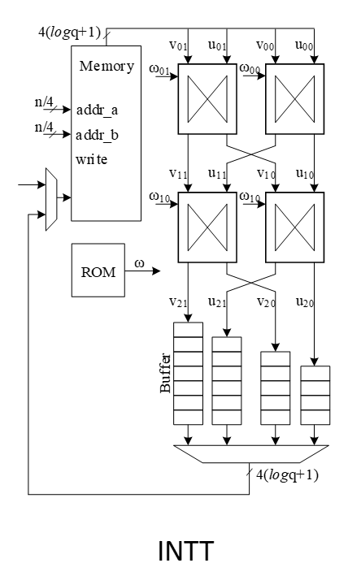

To prepare the results for the next stages, the output needs to be stored into the customized buffer architecture as follows:

|  0  |  ‚Üí  |     |     |     |     |     |     |     |
| :-: | :-: | :-: | :-: | :-: | :-: | :-: | :-: | :-: |
|  1  |     |     |     |     |     |     |     |     |
|  2  |     |     |     |     |     |     |     |     |
|  3  |     |     |     |     |     |     |     |     |

Cycle 0 after butterfly reading address 0

|  4  |  ‚Üí  |     |     |     |  0  |     |     |     |
| :-: | :-: | :-: | :-: | :-: | :-: | :-: | :-: | :-: |
|  5  |     |     |     |  1  |     |     |     |     |
|  6  |     |     |  2  |     |     |     |     |     |
|  7  |     |  3  |     |     |     |     |     |     |

Cycle 0 after butterfly reading address 1

|  8  |  ‚Üí  |     |     |     |  4  |  0  |     |     |
| :-: | :-: | :-: | :-: | :-: | :-: | :-: | :-: | :-: |
|  9  |     |     |     |  5  |  1  |     |     |     |
| 10  |     |     |  6  |  2  |     |     |     |     |
| 11  |     |  7  |  3  |     |     |     |     |     |

Cycle 2 after butterfly reading address 2

| 12  |  ‚Üí  |     |     |     |  8  |  4  |  0  |     |
| :-: | :-: | :-: | :-: | :-: | :-: | :-: | :-: | :-: |
| 13  |     |     |     |  9  |  5  |  1  |     |     |
| 14  |     |     | 10  |  6  |  2  |     |     |     |
| 15  |     | 11  |  7  |  3  |     |     |     |     |

Cycle 3 after butterfly reading address 3

| 16  |  ‚Üí  |     |     |     | 12  |  8  |  4  |  0  |
| :-: | :-: | :-: | :-: | :-: | :-: | :-: | :-: | :-: |
| 17  |     |     |     | 13  |  9  |  5  |  1  |     |
| 18  |     |     | 14  | 10  |  6  |  2  |     |     |
| 19  |     | 15  | 11  |  7  |  3  |     |     |     |

Cycle 4 after butterfly reading address 4

| 20  |  ‚Üí  |     |     |     | 16  | 12  |  8  |  4  |
| :-: | :-: | :-: | :-: | :-: | :-: | :-: | :-: | :-: |
| 21  |     |     |     | 17  | 13  |  9  |  5  |  1  |
| 22  |     |     | 18  | 14  | 10  |  6  |  2  |     |
| 23  |     | 19  | 15  | 11  |  7  |  3  |     |     |

Cycle 5 after butterfly reading address 5

The highlighted value in the first buffer contains the required coefficients for our butterfly units in the next stage, i.e., (0, 4\) and (8, 12). 

However, we need to write the output in a particular pattern as follows:

Writing Addr: 0, 16, 32, 48, 1, 17, 33, 49, …, 15, 31, 47, 63

After completing the first round of operation including INTT stage 1 and 2, the memory contains the following data:

| Address | Memory Content after 1&2 stages |     |     |     |
| ------- | ------------------------------- | --- | --- | --- |
|         |                                 |     |     |     |
| 0       | 0                               | 4   | 8   | 12  |
| 1       | 16                              | 20  | 24  | 28  |
| 2       | 32                              | 36  | 40  | 44  |
| 3       | 48                              | 52  | 56  | 60  |
| 4       | 64                              | 68  | 72  | 76  |
| 5       | 80                              | 84  | 88  | 92  |
| 6       | 96                              | 100 | 104 | 108 |
| 7       | 112                             | 116 | 120 | 124 |
| 8       | 128                             | 132 | 136 | 140 |
| 9       | 144                             | 148 | 152 | 156 |
| 10      | 160                             | 164 | 168 | 172 |
| 11      | 176                             | 180 | 184 | 188 |
| 12      | 192                             | 196 | 200 | 204 |
| 13      | 208                             | 212 | 216 | 220 |
| 14      | 224                             | 228 | 232 | 236 |
| 15      | 240                             | 244 | 248 | 252 |
| 16      | 1                               | 5   | 9   | 13  |
| 17      | 17                              | 21  | 25  | 29  |
| 18      | 33                              | 37  | 41  | 45  |
| 19      | 49                              | 53  | 57  | 61  |
| 20      | 65                              | 69  | 73  | 77  |
| 21      | 81                              | 85  | 89  | 93  |
| 22      | 97                              | 101 | 105 | 109 |
| 23      | 113                             | 117 | 121 | 125 |
| 24      | 129                             | 133 | 137 | 141 |
| 25      | 145                             | 149 | 153 | 157 |
| 26      | 161                             | 165 | 169 | 173 |
| 27      | 177                             | 181 | 185 | 189 |
| 28      | 193                             | 197 | 201 | 205 |
| 29      | 209                             | 213 | 217 | 221 |
| 30      | 225                             | 229 | 233 | 237 |
| 31      | 241                             | 245 | 249 | 253 |
| 32      | 2                               | 6   | 10  | 14  |
| 33      | 18                              | 22  | 26  | 30  |
| 34      | 34                              | 38  | 42  | 46  |
| 35      | 50                              | 54  | 58  | 62  |
| 36      | 66                              | 70  | 74  | 78  |
| 37      | 82                              | 86  | 90  | 94  |
| 38      | 98                              | 102 | 106 | 110 |
| 39      | 114                             | 118 | 122 | 126 |
| 40      | 130                             | 134 | 138 | 142 |
| 41      | 146                             | 150 | 154 | 158 |
| 42      | 162                             | 166 | 170 | 174 |
| 43      | 178                             | 182 | 186 | 190 |
| 44      | 194                             | 198 | 202 | 206 |
| 45      | 210                             | 214 | 218 | 222 |
| 46      | 226                             | 230 | 234 | 238 |
| 47      | 242                             | 246 | 250 | 254 |
| 48      | 3                               | 7   | 11  | 15  |
| 49      | 19                              | 23  | 27  | 31  |
| 50      | 35                              | 39  | 43  | 47  |
| 51      | 51                              | 55  | 59  | 63  |
| 52      | 67                              | 71  | 75  | 79  |
| 53      | 83                              | 87  | 91  | 95  |
| 54      | 99                              | 103 | 107 | 111 |
| 55      | 115                             | 119 | 123 | 127 |
| 56      | 131                             | 135 | 139 | 143 |
| 57      | 147                             | 151 | 155 | 159 |
| 58      | 163                             | 167 | 171 | 175 |
| 59      | 179                             | 183 | 187 | 191 |
| 60      | 195                             | 199 | 203 | 207 |
| 61      | 211                             | 215 | 219 | 223 |
| 62      | 227                             | 231 | 235 | 239 |
| 63      | 243                             | 247 | 251 | 255 |

The same process can be applied in the next round to perform INTT stage 3 and 4\.

|  0  |  ‚Üí  |     |     |     |     |     |     |     |
| :-: | :-: | :-: | :-: | :-: | :-: | :-: | :-: | :-: |
|  4  |     |     |     |     |     |     |     |     |
|  8  |     |     |     |     |     |     |     |     |
| 12  |     |     |     |     |     |     |     |     |

Cycle 0 after butterfly reading address 0

| 16  |  ‚Üí  |     |     |     |  0  |     |     |     |
| :-: | :-: | :-: | :-: | :-: | :-: | :-: | :-: | :-: |
| 20  |     |     |     |  4  |     |     |     |     |
| 24  |     |     |  8  |     |     |     |     |     |
| 28  |     | 12  |     |     |     |     |     |     |

Cycle 1 after butterfly reading address 1

| 32  |  ‚Üí  |     |     |     | 16  |  0  |     |     |
| :-: | :-: | :-: | :-: | :-: | :-: | :-: | :-: | :-: |
| 36  |     |     |     | 20  |  4  |     |     |     |
| 40  |     |     | 24  |  8  |     |     |     |     |
| 44  |     | 28  | 12  |     |     |     |     |     |

Cycle 2 after butterfly reading address 2

| 48  |  ‚Üí  |     |     |     | 32  | 16  |  0  |     |
| :-: | :-: | :-: | :-: | :-: | :-: | :-: | :-: | :-: |
| 52  |     |     |     | 36  | 20  |  4  |     |     |
| 56  |     |     | 40  | 24  |  8  |     |     |     |
| 60  |     | 44  | 28  | 12  |     |     |     |     |

Cycle 3 after butterfly reading address 3

| 64  |  ‚Üí  |     |     |     | 48  | 32  | 16  |  0  |
| :-: | :-: | :-: | :-: | :-: | :-: | :-: | :-: | :-: |
| 68  |     |     |     | 52  | 36  | 20  |  4  |     |
| 72  |     |     | 56  | 40  | 24  |  8  |     |     |
| 76  |     | 60  | 44  | 28  | 12  |     |     |     |

Cycle 4 after butterfly reading address 4

| 80  |  ‚Üí  |     |     |     | 64  | 48  | 32  | 16  |
| :-: | :-: | :-: | :-: | :-: | :-: | :-: | :-: | :-: |
| 84  |     |     |     | 68  | 52  | 36  | 20  |  4  |
| 88  |     |     | 72  | 56  | 40  | 24  |  8  |     |
| 92  |     | 76  | 60  | 44  | 28  | 12  |     |     |

Cycle 5 after butterfly reading address 5

After completing all stages, the memory contents would be as follows:

| Address | Memory Content after Stage 7&8 |     |     |     |
| ------- | ------------------------------ | --- | --- | --- |
|         |                                |     |     |     |
| 0       | 0                              | 1   | 2   | 3   |
| 1       | 4                              | 5   | 6   | 7   |
| 2       | 8                              | 9   | 10  | 11  |
| 3       | 12                             | 13  | 14  | 15  |
| 4       | 16                             | 17  | 18  | 19  |
| 5       | 20                             | 21  | 22  | 23  |
| 6       | 24                             | 25  | 26  | 27  |
| 7       | 28                             | 29  | 30  | 31  |
| 8       | 32                             | 33  | 34  | 35  |
| 9       | 36                             | 37  | 38  | 39  |
| 10      | 40                             | 41  | 42  | 43  |
| 11      | 44                             | 45  | 46  | 47  |
| 12      | 48                             | 49  | 50  | 51  |
| 13      | 52                             | 53  | 54  | 55  |
| 14      | 56                             | 57  | 58  | 59  |
| 15      | 60                             | 61  | 62  | 63  |
| 16      | 64                             | 65  | 66  | 67  |
| 17      | 68                             | 69  | 70  | 71  |
| 18      | 72                             | 73  | 74  | 75  |
| 19      | 76                             | 77  | 78  | 79  |
| 20      | 80                             | 81  | 82  | 83  |
| 21      | 84                             | 85  | 86  | 87  |
| 22      | 88                             | 89  | 90  | 91  |
| 23      | 92                             | 93  | 94  | 95  |
| 24      | 96                             | 97  | 98  | 99  |
| 25      | 100                            | 101 | 102 | 103 |
| 26      | 104                            | 105 | 106 | 107 |
| 27      | 108                            | 109 | 110 | 111 |
| 28      | 112                            | 113 | 114 | 115 |
| 29      | 116                            | 117 | 118 | 119 |
| 30      | 120                            | 121 | 122 | 123 |
| 31      | 124                            | 125 | 126 | 127 |
| 32      | 128                            | 129 | 130 | 131 |
| 33      | 132                            | 133 | 134 | 135 |
| 34      | 136                            | 137 | 138 | 139 |
| 35      | 140                            | 141 | 142 | 143 |
| 36      | 144                            | 145 | 146 | 147 |
| 37      | 148                            | 149 | 150 | 151 |
| 38      | 152                            | 153 | 154 | 155 |
| 39      | 156                            | 157 | 158 | 159 |
| 40      | 160                            | 161 | 162 | 163 |
| 41      | 164                            | 165 | 166 | 167 |
| 42      | 168                            | 169 | 170 | 171 |
| 43      | 172                            | 173 | 174 | 175 |
| 44      | 176                            | 177 | 178 | 179 |
| 45      | 180                            | 181 | 182 | 183 |
| 46      | 184                            | 185 | 186 | 187 |
| 47      | 188                            | 189 | 190 | 191 |
| 48      | 192                            | 193 | 194 | 195 |
| 49      | 196                            | 197 | 198 | 199 |
| 50      | 200                            | 201 | 202 | 203 |
| 51      | 204                            | 205 | 206 | 207 |
| 52      | 208                            | 209 | 210 | 211 |
| 53      | 212                            | 213 | 214 | 215 |
| 54      | 216                            | 217 | 218 | 219 |
| 55      | 220                            | 221 | 222 | 223 |
| 56      | 224                            | 225 | 226 | 227 |
| 57      | 228                            | 229 | 230 | 231 |
| 58      | 232                            | 233 | 234 | 235 |
| 59      | 236                            | 237 | 238 | 239 |
| 60      | 240                            | 241 | 242 | 243 |
| 61      | 244                            | 245 | 246 | 247 |
| 62      | 248                            | 249 | 250 | 251 |
| 63      | 252                            | 253 | 254 | 255 |

The proposed method saves the time needed for shuffling and reordering, while using only a little more memory.

### INTT shuffling countermeasure

Similar to NTT operation, INTT requires shuffling the order of execution of coefficients in order to mitigate SCA attacks. Refer to section 5.3.3 for details on NTT shuffling. In INTT mode, the chunks are split in the following pattern into 16 chunks:

| Address |     | 1&2 |     |     |     |
| ------- | --- | --- | --- | --- | --- |
|         |     |     |     |     |     |
| 0       |     | 0   | 1   | 2   | 3   |
| 1       |     | 4   | 5   | 6   | 7   |
| 2       |     | 8   | 9   | 10  | 11  |
| 3       |     | 12  | 13  | 14  | 15  |
| 4       |     | 16  | 17  | 18  | 19  |
| 5       |     | 20  | 21  | 22  | 23  |
| 6       |     | 24  | 25  | 26  | 27  |
| 7       |     | 28  | 29  | 30  | 31  |
| 8       |     | 32  | 33  | 34  | 35  |
| 9       |     | 36  | 37  | 38  | 39  |
| 10      |     | 40  | 41  | 42  | 43  |
| 11      |     | 44  | 45  | 46  | 47  |
| 12      |     | 48  | 49  | 50  | 51  |
| 13      |     | 52  | 53  | 54  | 55  |
| 14      |     | 56  | 57  | 58  | 59  |
| 15      |     | 60  | 61  | 62  | 63  |
| 16      |     | 64  | 65  | 66  | 67  |
| 17      |     | 68  | 69  | 70  | 71  |
| 18      |     | 72  | 73  | 74  | 75  |
| 19      |     | 76  | 77  | 78  | 79  |
| 20      |     | 80  | 81  | 82  | 83  |
| 21      |     | 84  | 85  | 86  | 87  |
| 22      |     | 88  | 89  | 90  | 91  |
| 23      |     | 92  | 93  | 94  | 95  |
| 24      |     | 96  | 97  | 98  | 99  |
| 25      |     | 100 | 101 | 102 | 103 |
| 26      |     | 104 | 105 | 106 | 107 |
| 27      |     | 108 | 109 | 110 | 111 |
| 28      |     | 112 | 113 | 114 | 115 |
| 29      |     | 116 | 117 | 118 | 119 |
| 30      |     | 120 | 121 | 122 | 123 |
| 31      |     | 124 | 125 | 126 | 127 |
| 32      |     | 128 | 129 | 130 | 131 |
| 33      |     | 132 | 133 | 134 | 135 |
| 34      |     | 136 | 137 | 138 | 139 |
| 35      |     | 140 | 141 | 142 | 143 |
| 36      |     | 144 | 145 | 146 | 147 |
| 37      |     | 148 | 149 | 150 | 151 |
| 38      |     | 152 | 153 | 154 | 155 |
| 39      |     | 156 | 157 | 158 | 159 |
| 40      |     | 160 | 161 | 162 | 163 |
| 41      |     | 164 | 165 | 166 | 167 |
| 42      |     | 168 | 169 | 170 | 171 |
| 43      |     | 172 | 173 | 174 | 175 |
| 44      |     | 176 | 177 | 178 | 179 |
| 45      |     | 180 | 181 | 182 | 183 |
| 46      |     | 184 | 185 | 186 | 187 |
| 47      |     | 188 | 189 | 190 | 191 |
| 48      |     | 192 | 193 | 194 | 195 |
| 49      |     | 196 | 197 | 198 | 199 |
| 50      |     | 200 | 201 | 202 | 203 |
| 51      |     | 204 | 205 | 206 | 207 |
| 52      |     | 208 | 209 | 210 | 211 |
| 53      |     | 212 | 213 | 214 | 215 |
| 54      |     | 216 | 217 | 218 | 219 |
| 55      |     | 220 | 221 | 222 | 223 |
| 56      |     | 224 | 225 | 226 | 227 |
| 57      |     | 228 | 229 | 230 | 231 |
| 58      |     | 232 | 233 | 234 | 235 |
| 59      |     | 236 | 237 | 238 | 239 |
| 60      |     | 240 | 241 | 242 | 243 |
| 61      |     | 244 | 245 | 246 | 247 |
| 62      |     | 248 | 249 | 250 | 251 |
| 63      |     | 252 | 253 | 254 | 255 |

(0, 1, 2, 3\) addresses are chunk0, (4,5,6,7) are chunk1, etc. Chunk addresses are in order since for INTT, reads are in order and writes are out of order. Similar to NTT, two levels of randomization are used:

1. Starting chunk is randomized  
2. Start address within each chunk is randomized

With this technique, the search space is 16 √ó416=236. For example, if chunk 5 is selected as the starting chunk, and start address is 1, the order of execution is (21, 22, 23, 20). When next chunk is selected (chunk 6), start address is again randomized. For example, next order can be (27, 24, 25, 26\) and so on.

The output buffer in INTT mode is configured as below. The buffer write pointer is aligned with the start address of the selected chunk and wraps around. In the given example, buffer write pointer increments as (1, 2, 3, 0\) and the outputs of butterfly2x2 are stored in the buffer in locations (1, 2, 3, 0\) in the order shown by superscript in the table below. This ensures the correct data is written back to memory to the correct addresses. In INTT mode, memory reads are randomized and memory writes will be in order.

| 1110 | 1100 | 1090 | 1080 |
| :--- | :--- | :--- | :--- |
| 1073 | 1063 | 1053 | 1043 |
| 1032 | 1022 | 1012 | 1002 |
| 991  | 981  | 971  | 961  |
| 952  | 942  | 932  | 922  |
| 911  | 901  | 891  | 881  |
| 870  | 860  | 850  | 840  |
| 833  | 823  | 813  | 803  |

While the next chunk starts, the data in the bottom half of the buffer is written to memory. Since every cycle there is a write to memory and write to the other half of the buffer, this incurs no latency overhead.

Memory read and write addresses are calculated as shown

for i in range (0, 4):

    Read address \= (chunk\*4) \+ (rand\_index \* INTT\_RD\_STEP)

Write address \= chunk \+ (i \* INTT\_WR\_STEP)

Where rand\_index is the randomized start index of execution order for an NTT operation

E.g. if selected chunk is 5, and rand\_index is 2

    Order of execution is 2, 3, 0, 1

    Read address \= 5\*4 \+ (2\*1), 5\*4 \+ (3\*1), 5\*4+(0\*1), 5\*4+(1\*1) \= 22, 23, 20, 21

    Write address \= 5 \+ (2\*16), 5 \+ (3\*16), 5 \+ (0\*16), 5 \+ (1\*16) \= 37, 53, 5, 21

## Point-wise Multiplication

Polynomial in NTT domain can be performed using point-wise multiplication (PWM). Considering the current architecture with 4 butterfly units, there are 4 modular multiplications that can be reused in point-wise multiplication operation. This approach enhances the design from an optimization perspective by resource sharing technique. \`

There are 2 memories containing polynomial f and g, with 4 coefficients per each memory address. The parallel butterfly cores enable us to perform 4 point-wise multiplication operations with 4 parallel coefficients as follows:

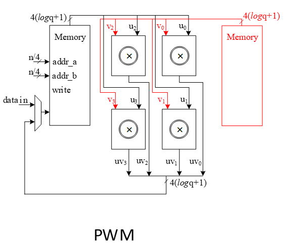

The proposed NTT method preserves the memory contents in sequence without needing to shuffle and reorder them, so the point-wise multiplication can be sped up by using consistent reading/writing addresses from both memories.

## RejBounded

This unit takes data from the output of SHAKE-256 stored in a PISO buffer. The required cycles for this unit are variable due to the non-deterministic pattern of sampling. However, at least 1 Keccak round is required to provide 256 coefficients.

This unit takes 4 bits from Keccak output. For ML-DSA-87 scheme, the only rejected sample is input data equal to 15 which means the probability of rejection is 116 .

| b (4-bit Input) | b mod 5 | 2-(b mod 5\) | valid/invalid | Output mod q |
| :-------------: | :-----: | :----------: | :-----------: | :----------: |
|        0        |    0    |      2       |     valid     |      2       |
|        1        |    1    |      1       |     valid     |      1       |
|        2        |    2    |      0       |     valid     |      0       |
|        3        |    3    |     \-1      |     valid     |   8380416    |
|        4        |    4    |     \-2      |     valid     |   8380415    |
|        5        |    0    |      2       |     valid     |      2       |
|        6        |    1    |      1       |     valid     |      1       |
|        7        |    2    |      0       |     valid     |      0       |
|        8        |    3    |     \-1      |     valid     |   8380416    |
|        9        |    4    |     \-2      |     valid     |   8380415    |
|       10        |    0    |      2       |     valid     |      2       |
|       11        |    1    |      1       |     valid     |      1       |
|       12        |    2    |      0       |     valid     |      0       |
|       13        |    3    |     \-1      |     valid     |   8380416    |
|       14        |    4    |     \-2      |     valid     |   8380415    |
|       15        |    0    |      2       |    invalid    |   invalid    |

In our optimized architecture, this unit works in parallel with the Keccak core. Therefore, the latency for RejBounded sampling is absorbed within the latency for a concurrently running Keccak core. 

Our proposed NTT can perform on four coefficients per cycle that also helps to avoid memory access challenges and make the control logic too complicated. This implies that the optimal speed of the RejBounded sampling module is to sample four coefficients without rejection in one cycle.

On the output side, as the RejBouned sampling might fail, the rejection rate for each input is:

rejection\_rate=116=0.0625

Hence, the probability of failure to provide 4 appropriate coefficients from 4 inputs would be:

1-1-rejection\_rate4=0.2275

To reduce the failure probability and avoid any wait cycle in polynomial multiplication, 5 coefficients are fed into rejection while only 4 of them will be passed to polynomial multiplication. This decision reduces the probability of failure to

1-probability of having 5 good inputs-probability of having 4 good inputs=1-1-rejectionrate5-rejectionrate\*5 4 1-rejectionrate4=0.0344

The following is the probability of failure for a design that has 4 samplings per cycle:

| Sample number in input | Failure probability of 4 valid output |
| :--------------------- | :------------------------------------ |
| 4                      | 0.2275238037109375                    |
| 5                      | 0.034404754638671875                  |
| 6                      | 0.004229903221130371                  |
| 7                      | 0.0004580467939376831                 |
| 8                      | 4.549999721348286e-05                 |

The following is the probability of failure for a high-throughput design that has 8 samplings per cycle:

| Sample number in input | Failure probability of 8 valid output |
| :--------------------- | :------------------------------------ |
| 8                      | 0.4032805261667818                    |
| 9                      | 0.10492078925017267                   |
| 10                     | 0.021007113242376363                  |
| 11                     | 0.003525097407418798                  |
| 12                     | 0.0005203759357854665                 |
| 13                     | 6.966771504046676e-05                 |

Adding a FIFO to RejBounded sampling unit can store the remaining unused coefficients and increase the probability of having 4 appropriate coefficients to match polynomial multiplication throughput. The architecture is as follows:

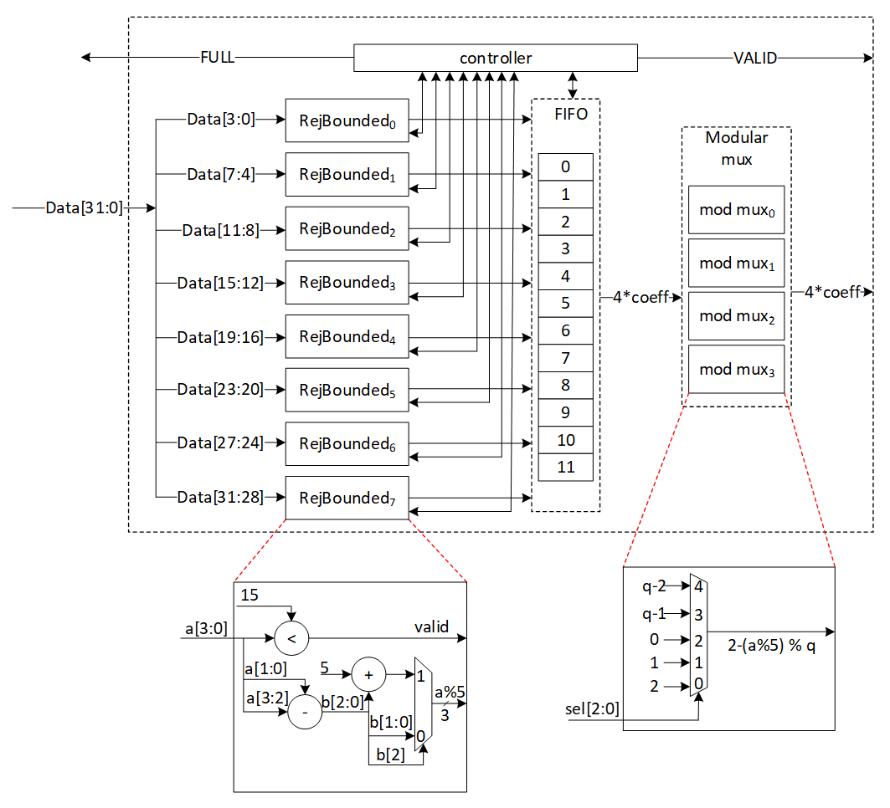

There are 8 rejection sampler circuits corresponding to each 4-bit input. The controller checks if each of these coefficients should be rejected or not. The valid input coefficients will be processes and a result between \[-η, η\] ( is 2 for ML-DSA-87) will be stored into the FIFO. While maximum 8 coefficients can be fed into FIFO, there are four more entries for the remaining coefficients from the previous cycle. There are several scenarios for the proposed balanced throughput architecture:

1) At the very first cycle, or whenever the FIFO is empty, RejBounded sampling unit may not provide all 4 coefficients for polynomial multiplication unit. We reduce the failure probability of this scenario by feeding 8 coefficients, however, it may happen. So, for designing efficient architecture, instead of reducing the failure probability by adding more hardware cost, we use a VALID output that stops polynomial multiplier until all 4 required coefficients are sampled.  
2) If more than 4 inputs are valid, they are going to be stored into FIFO. The first 4 coefficients will be sent to polynomial multiplication unit, while the remaining coefficients will be shifted to head of FIFO and be used for the next cycle with the valid coefficients from the next cycle.  
3) The maximum depth of FIFO is 12 entries. The input needs 8 entities that are ready to use, and we know that 4 entities will be released in each cycle by sending the output. Hence, if more than 8 FIFO entries are full, RejBounded sampling unit does not accept a new input from Keccak core by raising FULL flag. However, it has the required valid samples to provide the required output for the next cycle.  
   

| Cycle count | Input from PISO | FIFO valid entries from previous cycle | Total valid samples | output | FIFO remaining for the next cycle |
| :---------- | :-------------- | :------------------------------------- | :------------------ | :----- | :-------------------------------- |
| 0           | 8               | 0                                      | 8                   | 4      | 4                                 |
| 1           | 8               | 4                                      | 12                  | 4      | 8                                 |
| 2           | 8               | 8                                      | 16                  | 4      | 12 (FULL)                         |
| 3           | 0               | 12                                     | 12                  | 4      | 8                                 |
| 4           | 8               | 8                                      | 16                  | 4      | 12 (FULL)                         |
| 5           | 0               | 12                                     | 12                  | 4      | 8                                 |
| 6           | 8               | 8                                      | 16                  | 4      | 12 (FULL)                         |
| 7           | 0               | 12                                     | 12                  | 4      | 8                                 |
| 8           | 7               | 8                                      | 15                  | 4      | 11 (FULL)                         |
| 9           | 0               | 11                                     | 11                  | 4      | 7                                 |
| 10          | 6               | 7                                      | 13                  | 4      | 9 (FULL)                          |

   

4) PISO contains 1088/4=272 coefficients. If there is not FULL condition for reading from Keccak, all PISO data can be read in 34 cycles. This would be match with Keccak throughput that generates 56 coefficients per 12 cycles. To maximize the utilization factor of our hardware resources, Keccak core will check the PISO status. If PISO contains 8 coefficients or more (the required inputs for RejBounded sampling unit), EMPTY flag will not be set, and Keccak will wait until the next cycle.   
5) The maximum number of FULL conditions is when there are no rejected coefficients for all inputs. In this case, after 2 cycles with 16 coefficients, there is one FULL condition. After 64 cycles, all 256 required coefficients are processed by RejBouned sampling unit.  
6) To maximize the utilization factor of our hardware resources, Keccak core will check the PISO status. If PISO contains 8 coefficients or more (the required inputs for RejBounded sampling unit), EMPTY flag will not be set, and Keccak will wait until the next cycle.

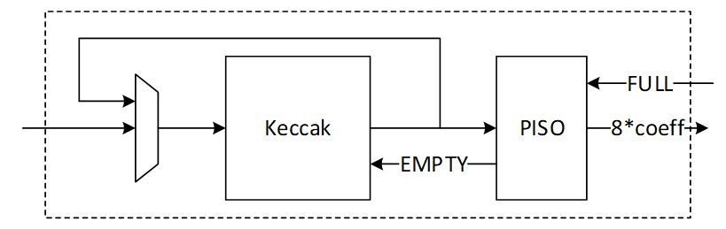

## Stage 5: SampleInBall – Memory 

SampleInBall is a procedure that uses the SHAKE256 of a seed ρ to produce a random element of Bτ. The procedure uses the Fisher-Yates shuffle method. The signs of the nonzero entries of c are determined by the first 8 bytes of H(ρ), and the following bytes of H(ρ) are used to determine the locations of those nonzero entries.

We propose an architecture to remove the cost of memory access from Keccak to SampleInBall, and from SampleInBall to NTT. This requires a specific pattern of coefficients for NTT that prevents excessive buffering or interference between them. It also lowers the rejection rate and speeds up SampleInBall while maintaining small and efficient architecture.

High-level architecture is illustrated as follows:

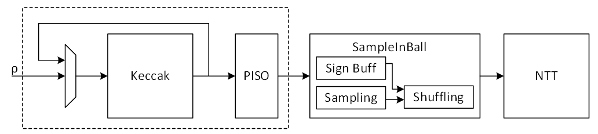

### Keccak Unit

Keccak is used in SHAKE-256 configuration for SampleInBall operation. Hence, it will take the input seed  with 256-bit and generates 1088-bit output after each round. 

The first τ bits (τ \= 60 in the case of ML-DSA-87) in the first 8 bytes of this random stream are interpreted as τ random sign bits si ∈ {0, 1}, i \= 0, . . . , τ − 1\. The remaining 64 − τ bits are discarded. 

The remaining random bits are used for sampling. Since each 8-bit is used for one sample, the first round of Keccak output provides (1088-64)/8=128 samples. The number of valid samples needed is 60\. Because this is a sampling operation that is non-deterministic, if more samples are required, Keccak will run again and produce 1088/8=136 additional samples. Hence, there are two paths for Keccak input. While the input seed  can be set by controller for each new polynomial c, the loop path is used to rerun Keccak for completing the previous polynomial.

SampleInBall cannot take all samples parallelly since it makes hardware architecture too costly and complex. Therefore, we propose a parallel-input serial-output (PISO) unit in between to store the Keccak output and feed SampleInBall unit sequentially.

### SampleInBall

This unit takes data from the output of SHAKE-256 stored in a PISO buffer. The required cycles for this unit are variable due to the non-deterministic pattern of sampling. But this operation can only be finished with 60 valid samples.

In our optimized architecture, this unit works in parallel with the Keccak core. Therefore, the latency for Keccak sampling (for the second round and next) is absorbed within the latency for a concurrently running SampleInBall core. 

The NTT unit needs to take four coefficients per cycle. This implies that the output contains four samples per each address as follows:

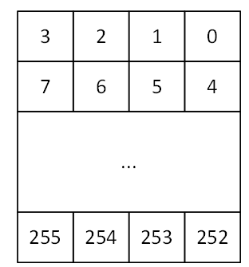

SampleInBall algorithm is as follows:

1) Initialize c \= c0 c1 . . . c255 \= 0 0 . . . 0   
2) for i := 256 − τ to 255   
3)     j ‚Üê {0, 1, . . . , i}   
4)     s ‚Üê {0, 1}   
5)     ci := cj   
6)     cj := (‚àí1)s   
7) return c

SampleInBall includes three main operations:

1) Check the validity of input samples respect to parameter i (line 3 of algorithm)  
2) Store the sign s (line 4 of algorithm)  
3) Shuffle the stored polynomial c respect to parameter i, j, and s (line 5 and 6 of algorithm)

To recall, for ML-DSA-87 with τ \= 60, 60 valid samples are required. 

Validity check on the input sample depends on the iteration number i while a sample greater than i will be rejected. Hence, the probability of failure for each round would be:


*Rejection rate for each round of SampleInBall operation*

To reduce the failure probability and avoid any wait cycle in polynomial multiplication, 4 samples are fed into SampleInBall while only 1 of them will be passed to shuffling unit. This decision reduces the probability of failure to:

probability of having 4 rejected inputs=rejectionrate4

In the worst case scenario (the first iteration with i=196), the failure probability is:

0.230464=0.00282

The unused coefficients will be processed in the next cycle when i increments. The architecture is as follows:

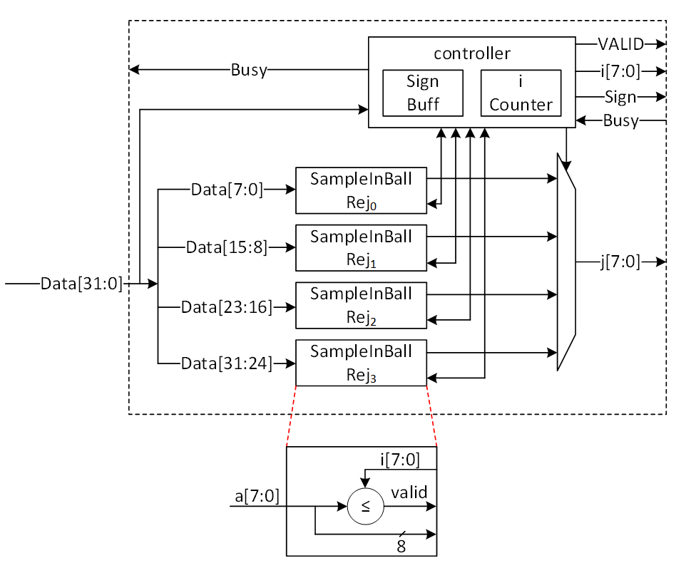

*Sampling phase of SampleInBall architecture*

The first 2 cycles is used to store the sign bits into the sign buffer. After that, each 32 bits of input will be divided into 4 samples. Each sample is compared to i and the first valid sample is passed into the shuffling step.

Controller uses a counter to manage i value. The counter starts at 196 (for ML-DSA-87) and goes up after a valid coefficient is found.

When a valid coefficient is found, valid flag will be set and the chosen sample (known by j), i, and s will be transferred to shuffling unit. Then, the counter is incremented, and the remaining samples will be compared to the new i value. 

The architecture of shuffling unit is as follows:

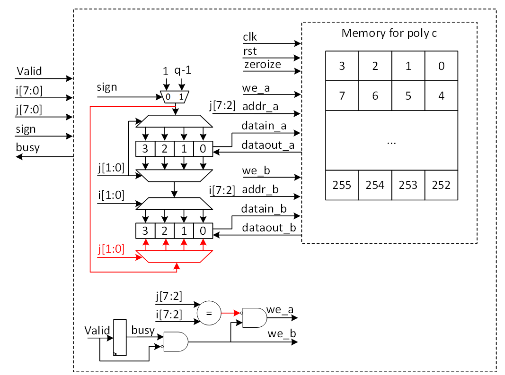

*Shuffling phase of SampleInBall architecture*

A polynomial c is stored in a memory that has four coefficients for each address. This pattern is needed for NTT operation that works on the output of SampleInBall. The memory has two ports that can read or write data.

Each input sample needs two cycles. In the first cycle, the memory reads the two addresses that have i and j, and in the second cycle, the memory saves the new coefficients.

The read data from address j will be updated with 1 or q-1 based on the s value, while the original value of j is transferred to address i using a multiplexer and demultiplexer.

When i and j have the same address, both ports try to write to the same location in the second cycle. To avoid this, the red path is used to turn off port a for address j. But then, j will be changed in the same buffer that has i (port b) and will be saved into memory.

## Decompose Architecture

Decompose algorithm plays a crucial role by breaking down the coefficients of a polynomial into smaller parts. Decompose calculates high and low bits r1 and r0 such that:

r \= r1 · 2 2 \+r0  mod q

where:

\-2\<r02

except for the border case when r \- r0=q – 1. In the border case, the high bits r1 are made zero, and the low bits r0 are reduced by one.

**Definition:**

* mod α:  If α is a positive integer and m ∈ Z or m ∈ Zα, then m mod α denotes the unique element m ′∈ Z in the range 0 ≤ m ′ \< α such that m and m ′ are congruent modulo α.    
* mod± α:  If α is a positive integer and m ∈ Z or m ∈ Zα, then m mod± α denotes the unique element m ′∈ Z in the range −α/2 \< m ′ ≤ α/2 such that m and m ′ are congruent modulo α.

High-level architecture is illustrated as follows:

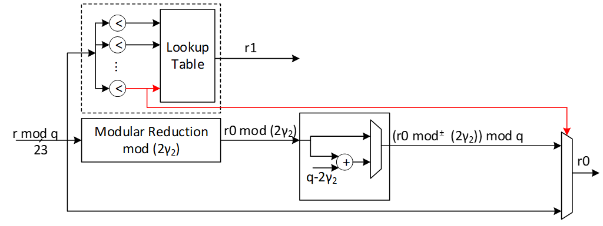

The modular reduction architecture is as follows:

 

| r0 mod 22 down limit | r0 mod 22 Up limit |            r0             |
| :------------------: | :----------------: | :-----------------------: |
|          0           |         γ2         |        r0 mod 2 γ2        |
|        γ2\+1         |       2γ2\-1       | (r0 mod 2 γ2) \+ (q-2 γ2) |

Our suggested design calculates two shares of r0 and r1 at the same time. We use a lookup table with 16 parallel comparisons to find the value of r1 from r based on the following graph:

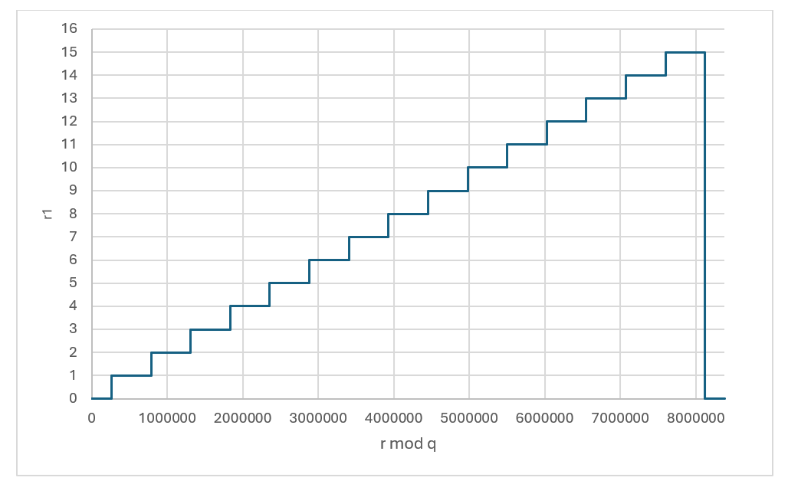

*r1 value based on the given r*

| r down limit | r Up limit | r1  |
| :----------: | :--------: | :-: |
|      0       |     γ2     |  0  |
|    γ2\+1     |    3γ2     |  1  |
|    3γ2\+1    |    5γ2     |  2  |
|    5γ2\+1    |    7γ2     |  3  |
|    7γ2\+1    |    9γ2     |  4  |
|    9γ2\+1    |    11γ2    |  5  |
|   11γ2\+1    |    13γ2    |  6  |
|   13γ2\+1    |    15γ2    |  7  |
|   15γ2\+1    |    17γ2    |  8  |
|   17γ2\+1    |    19γ2    |  9  |
|   19γ2\+1    |    21γ2    | 10  |
|   21γ2\+1    |    23γ2    | 11  |
|   23γ2\+1    |    25γ2    | 12  |
|   25γ2\+1    |    27γ2    | 13  |
|   27γ2\+1    |    29γ2    | 14  |
|   29γ2\+1    |    31γ2    | 15  |
|   31γ2\+1    |    q-1     |  0  |

To compute r0 mod± 2γ2, at the same time with r1 computation, a modular reduction operation will be applied to the input value r with respect to 2γ2 to compute r0 mod 2γ2. The result can be mapped into mod± 2γ2 range by subtracting 2γ2 when the result is greater than γ2. However, at the end all shares should be modulus q. For that, instead of subtracting 2γ2, we perform an addition with q-2γ2 to the results.

The expected r0 for different values of r is illustrated as follows:


*r0 value based on the given r (without considering boarder case)*

Using this technique, we could achieve r0 and r1 for all cases expect the border case where r \- r0=q – 1. This case can be detected inside r1 decompose architecture shown by red. In this case, the lookup table sets the value of 0 for r1, while r1 will be set as follows:

r0=r0-1=r-q+1-1=r-q≡r mod q

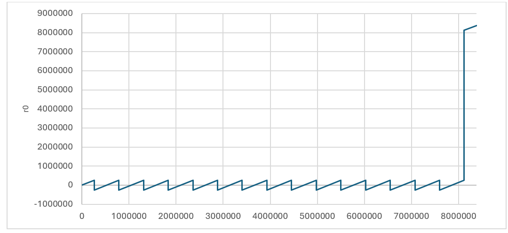

*r0 value based on the given r considering boarder case*

## MakeHint Architecture

The basic approach of the MakeHint(z, r) function involves decomposing both r and r+z into two parts: (r1, r0) for r and (rz1, rz0) for r+z. It then proceeds to evaluate whether r1 and rz1 are identical. In the event that r1 does not match rz1, it indicates that a hint is necessary to proceed. This process is essential for determining when additional information is required to resolve discrepancies between the compared segments.

However, decompose function is expensive on hardware to be implemented. Furthermore, performing a sequential decompose function using a shared hardware resource requires more latency.

The process of implementing the decompose function is notably resource-intensive and can incur significant costs when executed on hardware. Additionally, the sequential execution of this function, particularly when it relies on a common hardware resource, tends to introduce increased latency. This is due to the fact that shared resources often necessitate additional time to manage concurrent operations, which can result in delays and reduced efficiency.

The following architecture shows Dilithium algorithm to compute h=MakeHint(‚àíct0, w ‚àí cs2 \+ ct0). There are several decompose operations embedded into HighBits, LowBits, and MakeHint functions, shown by red.

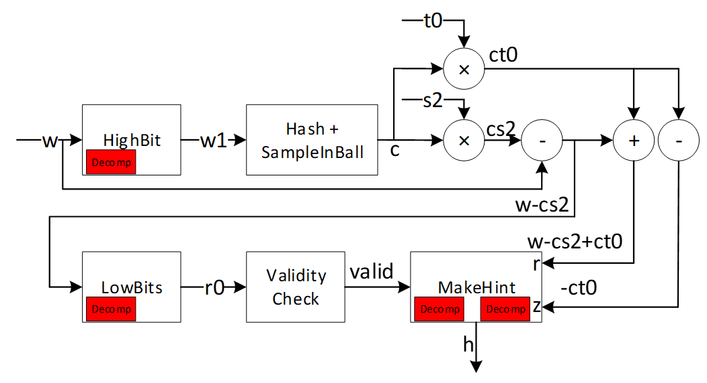

As an alternative and more efficient way, we can use a method to realize where hint needs to be generated as follows:

To compute h=MakeHint(−ct0, w − cs2 \+ ct0), first note is that instead of computing (r1, r0) \= Decomposeq (w−cs2, α) and checking whether ‖r0‖\<2 \- β and r1 \= w1, it is equivalent to just check that ‖w0-cs2‖\<2\-β, where w0 is the low part of w. If this check passes, w0 − cs2 is the low part of w − cs2. Next, recall that by the definition of the MakeHint function, a coefficient of a polynomial in h as computed is non-zero precisely if the high parts of the corresponding coefficients of w − cs2 and w − cs2 \+ ct0 differ. Now, we have already computed the full decomposition w \= αw1 \+ w0 of w, and we know that αw1 \+ (w0 −cs2) is the correct decomposition of w−cs2. But then, αw1 \+ (w0 −cs2 \+ct0) is the correct decomposition of w − cs2 \+ ct0 (i.e. the high part is w1) if and only if each coefficient of w0 − cs2 \+ ct0 lies in the interval (−γ2, γ2\], or, when some coefficient is −γ2 and the corresponding coefficient of w1 is zero. The last condition is due to the border case in the Decompose function. On the other hand, if these conditions are not true, then the high parts must differ, and it then follows that for computing the hint vector h it suffices to just check these conditions on the coefficients of w0 − cs2 \+ ct0. This algorithm is shown as follows:

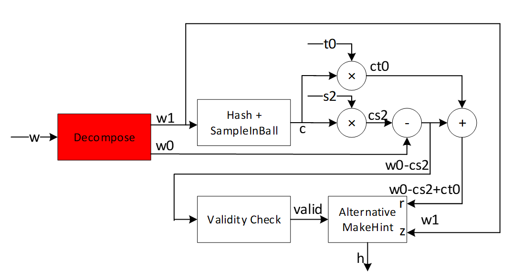

The alternative algorithm reduces the decompose cost by modifying the MakeHint to enhance the efficiency of the architecture. We propose efficient architecture for performing the alternative MakeHint operation on hardware platform and accelerate this operation using a pipeline architecture. 

High-level architecture is illustrated as follows:

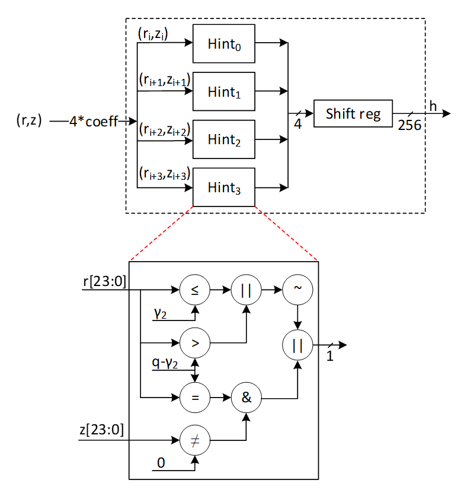

### Hint Sum and Hint BitPack

In Dilithium signing algorithm, the output of Makehint (hint output) is further processed to generate the encoded ‘h’ component of the signature. Additionally, one of the validity checks in signing algorithm uses hint sum to determine validity of the generated signature. These post-processing steps can be embedded into the Makehint architecture to avoid latency overhead while maintaining low complexity. The following figure shows the embedded logic into Makehint to generate the required outputs.

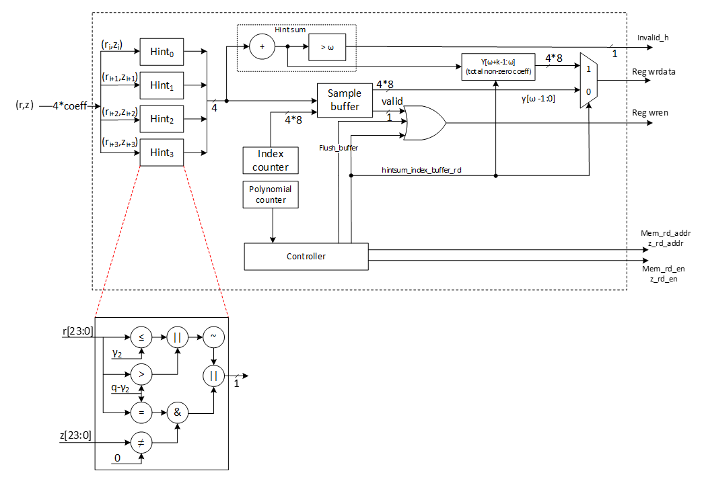

Hint Sum:

In the pipelined architecture, as 4 hints are generated every cycle, they are accumulated every cycle for all 8 polynomials. 

{if hintsum\> ω invalid\_h=1 else invalid\_h=0 

Hint BitPack:

The output of hint bitpack is a byte string ‘y’ of which \[ω\-1:0\] bytes are the indices at which the generated hint is non-zero. \[ω\+k-1 : ω\] bytes are the total number of indices per polynomial at which the hint is non-zero. If the number of non-zero hints is \< ω, the rest of the entries of y are filled with 0s. If the number of non-zero hints is \> ω, Makehint flow continues for the remaining coefficients and the ‘y’ array is overwritten with the subsequent values. In this case, the ‘h’ component is invalid and the signature is discarded.

The following table shows an example of construction of y array per polynomial based on generated hints.

| Polynomial | Hint\[3:0\] | Index\[3:0\]\[7:0\] | y\[ω\-1:0\]                     |
| :--------- | :---------- | :------------------ | :------------------------------ |
| 0          | 1-1-0-0     | 3-2-1-0             | 3-2                             |
| 0          | 0-1-0-1     | 7-6-5-4             | 6-4-3-2                         |
| 0          | 0-0-1-0     | 11-10-9-8           | 9-6-4-3-2                       |
| …          | …           | …                   | …-9-6-4-3-2                     |
| 1          | 1-1-1-0     | 3-2-1-0             | 3-2-1-…-9-6-4-3-2               |
| 1          | 0-1-1-0     | 7-6-5-4             | 6-5-3-2-1-…-9-6-4-3-2           |
| …          | …           | …                   | …-6-5-3-2-1-…-9-6-4-3-2         |
| 2          | 0-0-0-0     | 3-2-1-0             | …-6-5-3-2-1-…-9-6-4-3-2         |
| 2          | 0-0-0-1     | 7-6-5-4             | 4-…-6-5-3-2-1-…-9-6-4-3-2       |
| 2          | 1-1-0-0     | 11-10-9-8           | 11-10-4-…-6-5-3-2-1-…-9-6-4-3-2 |
| …          | …           | …                   | …                               |

To optimize area, 1 dword of ‘y’ buffer is written directly to the register API. The buffer generates a valid signal after accumulating 1 dword worth of data which can be used as a write enable for the register API. To protect the signature from intermittent firmware reads, the signature register is lockable. The lock is asserted during signing flow and is only unlocked after the entire flow has been completed.

At the end of all polynomials, the hintsum is written to the register API to construct the y\[ω\+k-1:ω\] locations of the byte string.

It is possible that during the last cycle of a given polynomial, the index buffer contains \< 1 dword of index values to be written to the reg API. To accommodate this scenario, the controller flushes out the buffer at the end of each polynomial and writes the remaining data to the register API. 

## W1Encode

The signer’s commitment is shown by w, while this value needs to be decomposed into two shares to provide the required hint as a part of signature. The output of decompose is shown by (w1, w0) which presents the higher and lower parts of the given input. While w0 can be stored into the memory, the value of w1 is required to compute commitment hash using SHAKE256 operation. The following equation shows this operation:

c=H(μ||w1Encodew1)

Where  is a 512-bit value computed based on the message and || means the concatenation between these two parts.

In ML-DSA-87 algorithm, there are 8 polynomials for w shown by w0 to w7. Furthermore, higher parts of each coefficient of these polynomials, shown by w1, is a value in \[0:15\] range that can be presented by 4 bits. Based on this, the total input size for performing SHAKE256 is:

inputsize=512size of μ+8poly number\*256coeff per poly\*4higher bit per coeff=8,704 bits

Since SHAKE256 takes only 1088 bits per each round, we have to feed these values sequentially. However, due to the prefix value of , and also the SHAKE256 input size does not divide evenly by each polynomial w1 size (which is 256\*4=1024 bits), the pattern of feeding decompose results into hashing buffer is challenging.

There are k polynomials (k=8 for ML-DSA-87) that needs to be decomposed as follows:

w=w0  wk-1 

Due to our memory configuration that stores 4 coefficients per address, we need 4 parallel cores for decompose and encode units to match the throughout between these modules.

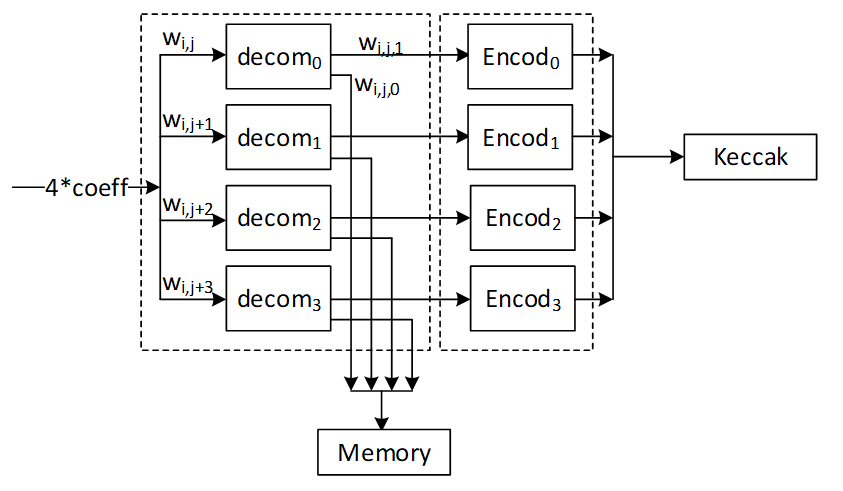

To optimize the performance and remove the cost of memory, we use a pipeline architecture for encode that processes the input values and feed them into Keccak buffer. The following figure shows the optimized architecture for W1Encoder.

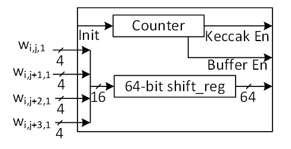

In the suggested design, every cycle, 4 coefficients for w1 are calculated from the decompose unit and then sent to the encode unit. Each coefficient is represented by 4 bits, making a total of 16 bits. However, the Keccak buffer only accepts input in 64-bit chunks. Therefore, a shift register is used to store the coefficients and pass a 64-bit chunk every 4 cycles to the Keccak SIPO buffer. An internal counter is used to control when the Keccak SIPO buffer takes this 64-bit chunk every 4 cycles.

Meanwhile, Keccak SIPO buffer can store 1088 bits of data and then activate Keccak to process it. The internal counter counts the number of writes on Keccak SIPO, and when it reaches 17 (17\*64 \= 1088 bits), Keccak enable is triggered. Because of Keccak architecture, SIPO can keep buffering a new input while Keccak works on the previous stored data. 

The very first iteration of Keccak contains a 512-bit value shown by , which the high-level controller puts in Keccak SIPO buffer before decompose/encode process. So, only 576 bits of SIPO are left for encoding output. We suggest starting with a counter value of 8 to deal with this edge case in the first Keccak round. The other rounds have 17 SIPO write enable.

The following figure shows the counter architecture. The first two bits is used to enable SIPO buffer, while the remaining bits of \[6:2\] is used to enable Keccak process. 

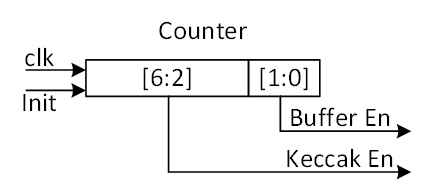

The following table reports the SIPO input for different Keccak rounds.

| Keccak SHAKE256 Round | Buffer input  | Bits |
| :-------------------- | :------------ | :--- |
| 1                     |               | 512  |
|                       | w0\[143:0\]   | 576  |
| 2                     | w0\[255:144\] | 448  |
|                       | w1\[159:0\]   | 640  |
| 3                     | w1\[255:160\] | 384  |
|                       | w2\[175:0\]   | 704  |
| 4                     | w2\[255:176\] | 320  |
|                       | w3\[191:0\]   | 768  |
| 5                     | w3\[255:192\] | 256  |
|                       | w4\[207:0\]   | 832  |
| 6                     | w4\[255:208\] | 192  |
|                       | w5\[223:0\]   | 896  |
| 7                     | w5\[255:224\] | 128  |
|                       | w6\[239:0\]   | 960  |
| 8                     | w6\[255:240\] | 64   |
|                       | w7\[255:0\]   | 1024 |
| 9                     | padding       | 1088 |

When the whole polynomials are done in the first 8 rounds of Keccak and Keccak done signal is asserted, the encode done signal is asserted and the high-level controller resumes control and adds the necessary padding to SIPO to finish the SHAKE256 process.

## Norm Check

The figure provided illustrates the finite field range for polynomial coefficients. It indicates that each coefficient is an integer ranging from 0 to q-1:

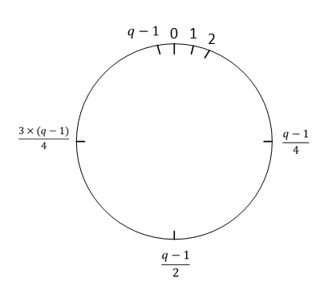

The infinity norm is defined as follows:

For an element w  Z , w \= |w|, the absolute value of *w*. For an element w  Zq,w \= w mod q . For an element *w* of *R* or *Rq*, w \= max0i\<256 wi . For a length-*m* vector w with entries from *R* or *Rq*, w \= max0i\<m w\[i\] . 

In the context of norm definition within a finite field, when a value for the bound is provided, the norm check determines whether the coefficient falls below the bound or exceeds the q-bound, which is highlighted in red in the following figure. 

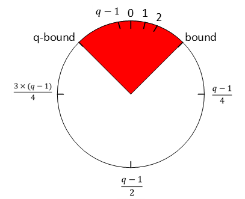

There are three different validity checks with different bounds during signing operations as follows:

1) z  1 \-  
2) r0  2 \-  
3) ⟨⟨ct0⟩⟩  2

Vector z contains l polynomials  (l=7 for ML-DSA-87) and r0 and ct0 contains k polynomials (k=8 for ML-DSA-87) that needs to be evaluated by norm check operation. 

Due to our memory configuration that stores 4 coefficients per address, we need 4 parallel cores for norm check unit to match the throughput between these modules. To optimize the performance and remove the cost of memory, we use a pipeline architecture for norm check that processes the input values. 

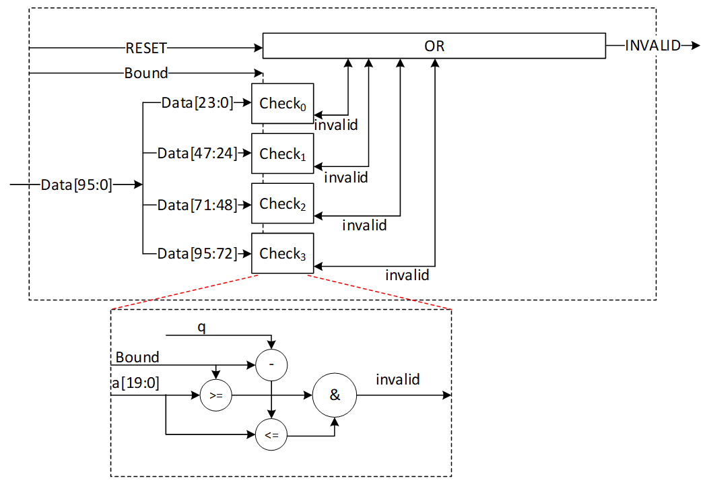

In the proposed design, during each cycle, 4 norm check coefficients are computed from stored data. This provides a performance improvement since this block only needs to read from memory and does not perform any writes to memory. Every coefficient is expressed using 24 bits, culminating in a combined total of 96 bits. A norm check is executed on each of these coefficients to produce a invalid output. The invalid outputs for all coefficients across all polynomials must be collectively ORed to yield the ultimate INVALID signal. This INVALID signal is asserted when any coefficient fails to meet the predetermined norm check criteria within the specified bound. 

The proposed design is configurable and accepts different bounds to reduce the required hardware resources. The following table shows the latency requirements for these three norm checks.

| Input polynomials | Number of polynomials | Total coefficients | Latency for ML-DSA-87 |
| :---------------- | :-------------------- | :----------------- | :-------------------- |
| z                 | L                     | L\*256             | 448 (for 4\)          |
| r0                | K                     | K\*256             | 512 (for 4\)          |
| ct0               | k                     | K\*256             | 512 (for 4\)          |

## skDecode

The given sk to the core for performing a signing operation has been encoded, and skDecode is responsible to reverse the encoding procedure to divide sk to the appropriate portions. The initial segments within sk should be allocated to variables p, K, and tr, corresponding to sizes of 256 bits, 256 bits, and 512 bits, respectively, without necessitating any modifications.

The remaining part of sk stores the packed form of s1, s2, and t0, respectively. For s1 and s2, each coefficient is represented by η bits and needs to be unpacked as follows:

coefficient \= η – data\[η\_size-1:0\]

where η\_size \= bitlen(2\*η).

For t0, each coefficient is represented by d bits and needs to be unpacked as follows:

coefficient \= 2d-1 – data\[d-1:0\]

| sk part | poly size | coeff size | Total size                        | Latency for ML-DSA-87                                                   |
| :------ | :-------- | :--------- | :-------------------------------- | :---------------------------------------------------------------------- |
| s1      | l=7       | η\_size=3  | l\*256\*η\_size=7\*256\*3= 5376   | 224 cycles                                                              |
| s2      | k=8       | η\_size=3  | k\*256\*η\_size \=8\*256\*3= 6144 | 256 cycles                                                              |
| t0      | K=8       | d=13       | k\*256\*d=8\*256\*13= 26624       | 256 cycles (using 8 parallel cores) 512 cycles (using 4 parallel cores) |

The skDecode architecture reads 8 values from the register API, based on the memory pattern that has 4 coefficients for each address. It then maps them to modulo q value using the given equation. Then it stores the mapped value in the memory with two parallel write operations.

The high-level architecture for skDecode is as follows:


For s1 and s2 unpacking, the decode architecture is as follows:

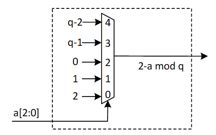

In case a\[2:0\] is greater than ‘h4, the sk is considered out of range. skDecode block triggers an error interrupt to the RV core and the algorithm is aborted.

For t0 unpacking, the decode architecture is shown below:


Since key sizes are large, a key memory is used to interface with FW and skDecode module to avoid routing and timing issues. Assuming a memory interface of two 32-bit RW ports, s1s2 unpacking can be done with 8 parallel cores. This requires 24-bits per cycle to be processed which can be accommodated with a single key memory read per cycle (32-bits) and accumulating remaining bits in a sample buffer. Once next read occurs, bits are appended to the previous ones and the values are fed from buffer to the unpack module.

In case of t0 unpacking, since 13-bits are required per core, 4 parallel cores can be used instead of 8 to support the 32-bit memory interface. Two memory reads are done per cycle (64-bits) and 52 bits are processed per cycle (13\*4). Remaining bits are accumulated in the sample buffer and read out.

The s1/s2 buffer can hold up to 32+24 bits of data. To avoid data conflict within s1/s2 buffer, the following memory access pattern is used:

S1, s2 unpack:

Cycle 0 ü°™ read 1 addr (buffer \= 32 bits)

Cycle 1 ü°™ read 1 addr (buffer \= 32 \+ 8 bits)

Cycle 2 ü°™ read 1 addr (buffer \= 32 \+ 16 bits)

Cycle 3 ü°™ stall and read buffer contents (24 bits)

T0 unpack:

In case of t0 unpack, the t0 sample buffer can hold up to 64+52 \= 116 bits of data. The buffer generates a full signal that is used to stall key memory reads for a cycle before continuing to write to the buffer.

## sigEncode\_z

The sigEncode\_z operation converts a signature into a sequence of bytes. This operation has three distinct parts, namely c, z, and h. The first part simply writes the c into the register API as it is. The last part also uses the MakeHint structure to combine the MakeHint outputs into register API. However, the middle part, that is z, requires encoding.

Every coefficient of z is between \[-γ1+1, γ1\], but its value mod q is kept in memory. To encode it, this equation is needed on the non-modular value:

Encoded z \= γ1 – z

The high-level architecture processes each coefficient of z in this way:

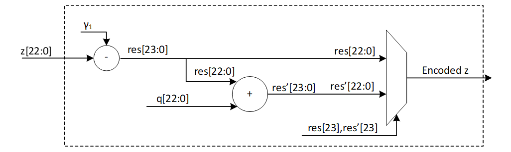

The modular and non-modular value are equal when the z is in the interval \[0, γ1\]. The first branch in this architecture shows this. But for the negative range, we need to remove q from the difference results. In this case, we get γ1 – (z mod q) \= γ1 – (q \+ z) \= γ1 – z – q. So, the second branch adds q to the result to finish the encoding.

Using two parallel read ports, 8 encoding units read 8 coefficients from the memory and write the encoded values to the register API as follows:

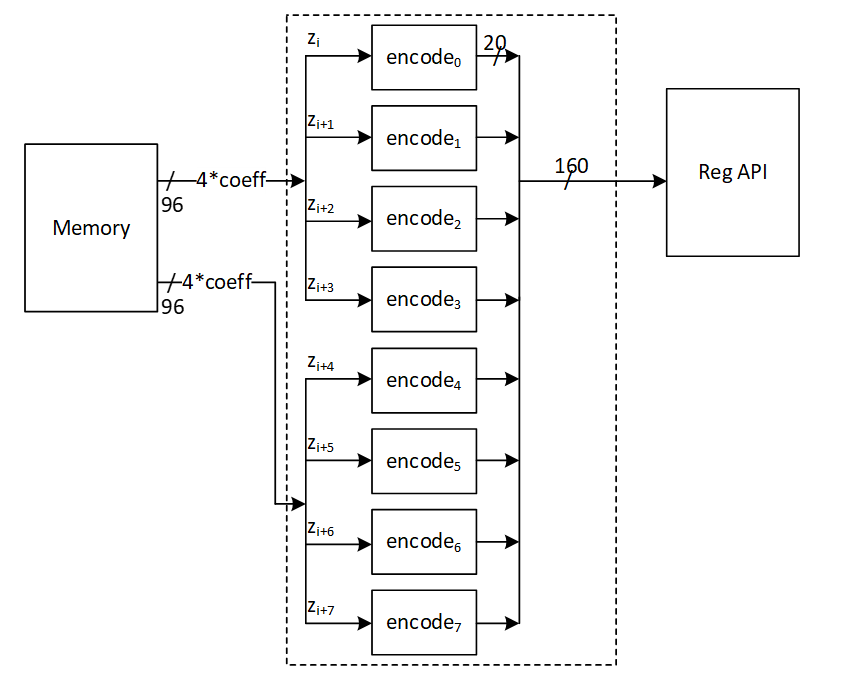

## PISO Buffer

The output of the Keccak unit is used to feed four different samplers at varying data rates. The Parallel in Serial out buffer is a generic buffer that can take the full width of the Keccak state and deliver it to the sampler units at the appropriate data rates.

Input data from the Keccak can come at 1088 or 1344 bits per clock. During expand mask operation, the buffer needs to be written from a write pointer while valid data remains in the buffer. All other modes only require writing the full Keccak state into the buffer when it is empty.

Output data rate varies \- 32 bits for RejBounded and SampleInBall, 80 bits for Expand Mask and 120 bits for SampleRejq.

## Power2Round

Power2Round function is used to split each coefficient of vector t to two parts (similar to decompose unit). Power2Round calculates high and low bits r1 and r0 such that:

r \= r1 · 2d \+r0  mod q

where:

\-2d-1\<r02d-1

**Definition:**

* mod α:  If α is a positive integer and m ∈ Z or m ∈ Zα, then m mod α denotes the unique element m ′∈ Z in the range 0 ≤ m ′ \< α such that m and m ′ are congruent modulo α.    
* mod± α:  If α is a positive integer and m ∈ Z or m ∈ Zα, then m mod± α denotes the unique element m ′∈ Z in the range −α/2 \< m ′ ≤ α/2 such that m and m ′ are congruent modulo α.

The power2round process yields two outputs, t0 and t1. The value of t0 must be processed using skEncode and then placed in the API register. Meanwhile, t1 is to be processed with pkEncode and then fed into the register API. This is depicted in the high-level architecture diagram.

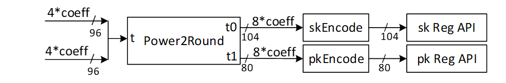

The goal is to create a pipeline architecture for skEncode and pkEncode that minimizes memory overhead costs. Therefore, these operations will be executed simultaneously with power2round, and the outcomes will be directly stored into the API.

Power2Round reads 2 addresses of memory containing 8 coefficients.

The expected r1 and r0 for different values of given r is illustrated as follows:

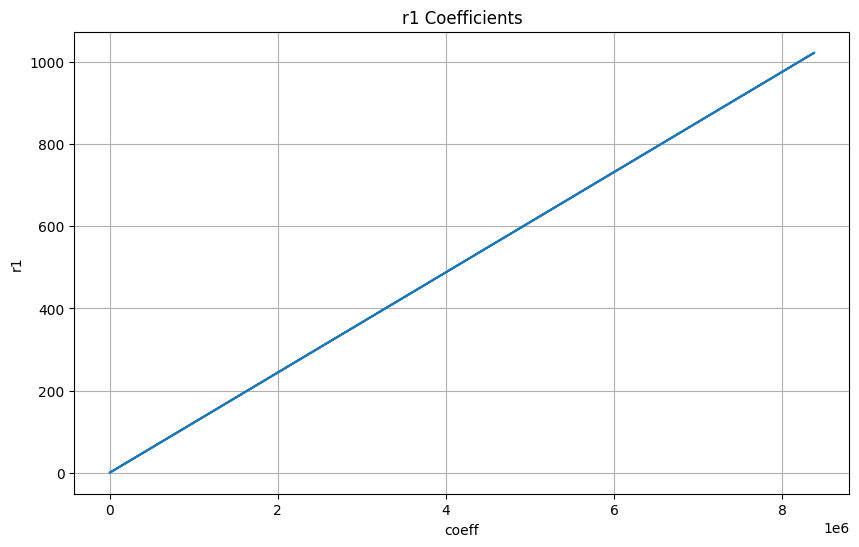


The diagram illustrates the structure of the power2round mechanism integrated with the skEncode arrangement. However, pkEncode is the process of saving the t1 values into the register API.

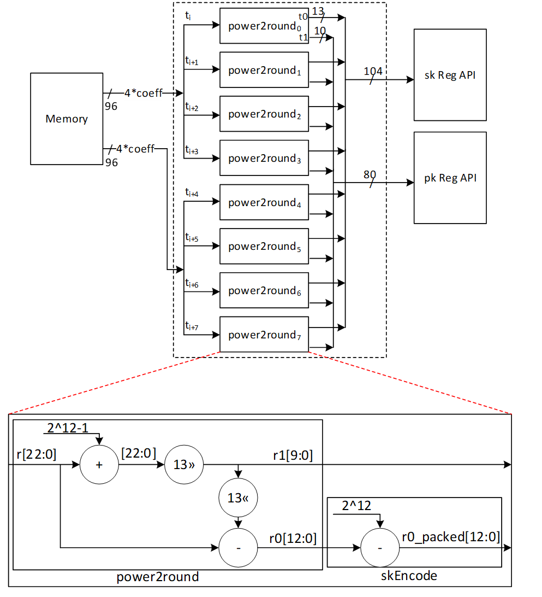

## skEncode

The SkEncode operation requires multiple inputs (skEncode(ρ, K, tr, s1, s2, t0)). But ρ, K, tr, and t0 have been preloaded into the API through different operations. In terms of s1 and s2, SkEncode serves as a conversion tool that maps the values of these coefficients using the following equation:

data\[η\_size-1:0\] \= η – coefficient

For ML-DSA-87 with η=2, there are only 5 possible values for the s1 and s2 coefficients, and the following architecture converts their modular presentation into the packed format:


## pkDecode

During the verification process, the provided pk must be decoded. The initial 256 bits of pk include ρ exactly as it is. The bits that follow consist of t1 polynomials. According to ML-DSA-87 protocol, each set of 10 bits represents a single coefficient. Therefore, these 10 bits need to be read, shifted left by 13 bits, and the outcome should be saved into memory.

The architecture is as follows:

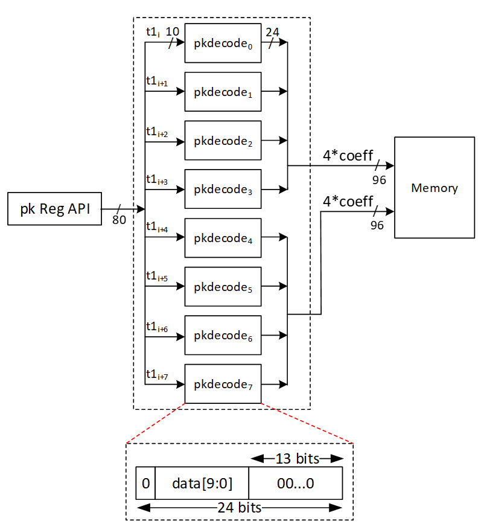

## sigDecode\_z

The sigDecode operation reverses the sigEncode. This operation has three distinct parts, namely c, z, and h. The first part simply writes the c from the register API as it is. The last part also uses the HintBitUnpack structure to combine the MakeHint outputs into register API. However, the middle part, that is z, requires decoding.

Every coefficient of z is presented by 20 bits, but its value mod q is required to be stored into memory. To decode it, this equation is needed:

Decoded z \= γ1 – z

However, because the decoded value falls within \[-γ1+1, γ1\], we must convert it to its equivalent modular q value.

The high-level architecture is as follows:

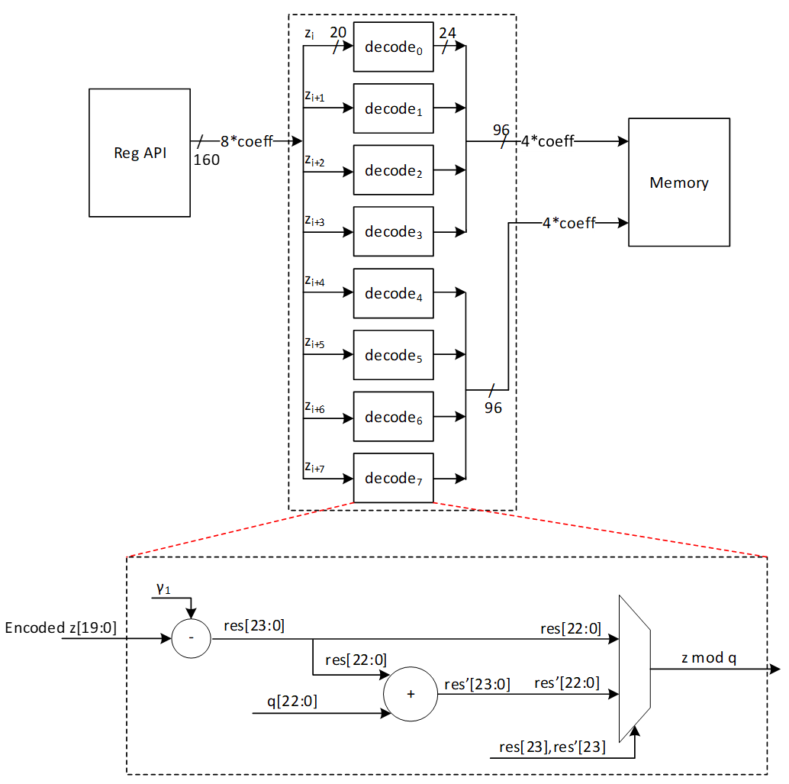

## sigDecode\_h

The sigDecode function reverses sigEncode and is composed of three separate segments: c, z, and h. The h part uses the HintBitUnpack structure to decode given Hint and store it into memory.

We must reconstruct k polynomials (with k being 8 in the case of ML-DSA-87) using the decoding process provided. The total number of non-zero indices of each polynomial can be found in the range of bytes \[ω: ω+k-1\] (where ω is set to 75 for ML-DAS-87). Therefore, the initial step to reconstruct each hi involves reading the byte at position ω+i for each polynomial (where 0≤i\<k), shown by HINTSUM\_i. 

HINTSUM\_i indicates how many bytes to read from \[ω\-1:0\] byte range for the current polynomial from the register API. To keep the API constant and avoid any complexity in storing hints for the next polynomial, the decode module always reads 4 bytes from the register API and an internal vector, current polynomial map (curr\_poly\_map), is used to indicate which of the 4 bytes belongs to the current polynomial. For example, if the HINTSUM is 3, the curr\_poly\_map is updated to 0-1-1-1 to indicate that bytes \[2:0\] are valid. Byte\[3\] is processed as part of the next polynomial. Once the required bytes are identified, a 256-bit vector is updated with 1s in the positions indicated by these input bytes. After the first cycle, the first 4 bits of the bitmap are ready to be written to the memory. 

To keep the throughput as storing 4 coefficients per cycle into internal memory, hints are processed every cycle and the bitmap is updated every cycle. To store data into memory, each coefficient, which might either be a 0 or a 1, is represented using 24 bits.

Since a non-zero hint can occur in any position of the 256-bit vector, it takes 64 cycles (4 coeffs/cycle) to write all 256 coefficients to memory irrespective of the value of the coefficient. For example, if the last 1 recorded is in index 35, the decode module continues to write the rest of the coefficients (36, 37, etc) to memory.

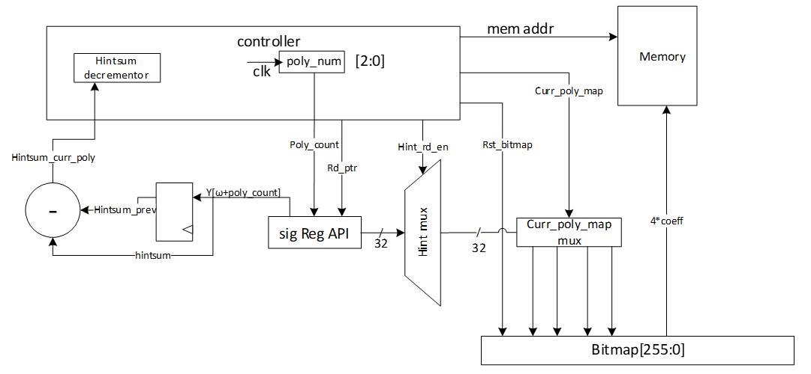

Example hint processing:

| Cycle  | Polynomial | Hintsum | Hintsum\_curr | Remaining hintsum | Byte select of reg API | Curr\_poly\_map |
| :----- | :--------- | :------ | :------------ | :---------------- | :--------------------- | :-------------- |
| 0      | 0          | 5       | 5             | 5                 | 3-2-1-0                | 1-1-1-1         |
| 1      | 0          | 5       | 5             | 5-4 \= 1          | 7-6-5-4                | 0-0-0-1         |
| 2-63   | 0          | 5       | 5             | 0                 | \-                     | 0-0-0-0         |
| 64     | 1          | 11      | 11-5 \= 6     | 6                 | 8-7-6-5                | 1-1-1-1         |
| 65     | 1          | 11      | 6             | 6-4 \= 2          | 12-11-10-9             | 0-0-1-1         |
| 66-127 | 1          | 11      | 6             | 0                 | \-                     | 0-0-0-0         |
| 128    | 2          | 25      | 25-11 \= 14   | 14                | 14-13-12-11            | 1-1-1-1         |
| 129    | 2          | 25      | 14            | 14-4 \= 10        | 18-17-16-15            | 1-1-1-1         |
| 130    | 2          | 25      | 14            | 10-4 \= 6         | 22-21-20-19            | 1-1-1-1         |
| 131    | 2          | 25      | 14            | 6-4 \= 2          | 26-25-24-23            | 0-0-1-1         |

In each cycle, the positions indicated by y\[rd\_ptr\] are flipped to 1 in the bitmap. Once a polynomial is finished, the bitmap, read pointer, current polynomial map, etc are all reset to prepare for the next polynomial. In this way, sigdecode\_h takes (64\*8 \= 512\) cycles to finish writing all coefficients to the internal memory (a few additional cycles are required for control state transitions). 

## UseHint

To reconstruct the signer's commitment, it is necessary to update the approximate computed value labeled as w' by utilizing the provided hint. Hence, the value of w’ should be decomposed, and its higher part should be altered if the related hint equals 1 for that coefficient. Subsequently, the higher part requires encoding through the W1Encode operation and must be stored into the Keccak SIPO.

The procedure is similar to the Decompose and W1Encode steps in the signing process, but it differs since there's no need to store the lower segment in memory. Moreover, the UseHint operation occurs between Decompose and W1Encode, adjusting the upper portion of the Decompose output utilizing h. 

The Decompose and W1Encode stages of the signing procedure are depicted below (with the gray components being inactive):

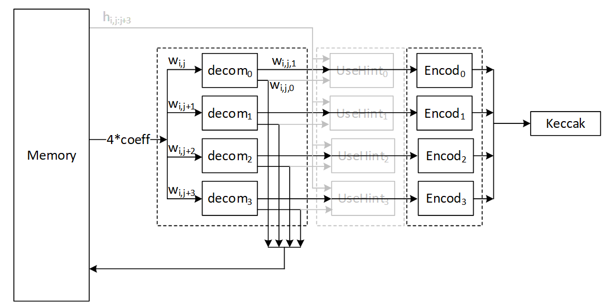

The UseHint operation in the verifying operation is as follows (with the gray components being inactive):

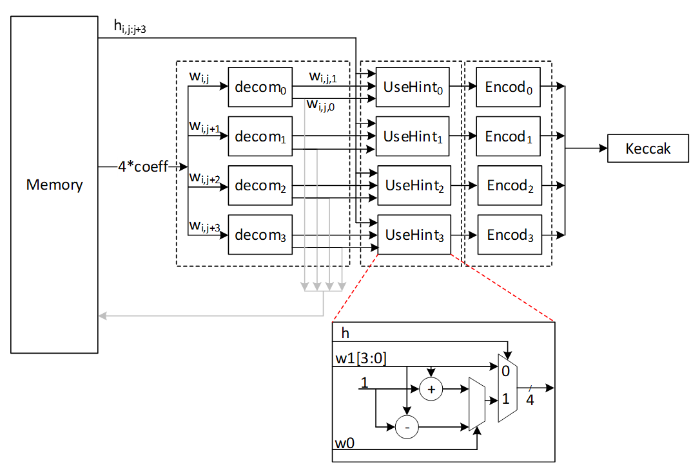

For w0 condition we have:

{if w0=0 or w0\>2 w1‚Üêw1-1 mod 16 else w1‚Üêw1+1 mod 16 

# High-Level architecture

## Sequencer

High-Level controller works as a sequencer to perform a specific sequence of operations. There are several blocks of memory in the architecture that can be accessed by sub-modules. However, the sequencer would be responsible for passing the required addresses for each operation. 

As an example, an NTT operation needs to take three base addresses as follows:

NTT(initialvalue\_base\_address, intermediatevalue\_base\_address, result\_base\_address)

So, for performing a=NTT(b), the sequencer needs to be:

NTT(a\_base\_address, temp\_base\_address, b\_base\_address)

The following table lists different operations used in the high-level controller.

**Keccak and samplers Opcodes:**

| Instruction             | Description                                                                      |
| :---------------------- | :------------------------------------------------------------------------------- |
| RST\_Keccak             | Reset the Keccak SIPO buffer                                                     |
| EN\_Keccak              | Enable the Keccak                                                                |
| LDKeccak\_MEM src, len  | Load Keccak SIPO buffer at memory address src in len \-width                     |
| LDKeccak\_REG src, len  | Load Keccak SIPO buffer at register ID src in len \-width                        |
| RDKeccak\_MEM dest, len | Read Keccak PISO buffer and store it at memory address dest in len \-width       |
| RDKeccak\_REG dest, len | Read Keccak PISO buffer and store it at register ID dest in len \-width          |
| REJBOUND\_SMPL dest     | Start Keccak and RejBounded sampler and store the results at memory address dest |
| REJ\_SMPL               | Start Keccak and rejection sampler (results is used by PWM)                      |
| SMPL\_INBALL            | Start Keccak and SampleInBall (results is stored in SampleInBall memory)         |
| EXP\_MASK dest          | Start Keccak and ExpandMask sampler and store the results at memory address dest |

**NTT/INTT/PWO Opcodes:**

| Instruction                | Description                                                                                                                                       |
| :------------------------- | :------------------------------------------------------------------------------------------------------------------------------------------------ |
| NTT src, temp, dest        | Perform NTT on data at memory address src and store the results at address dest                                                                   |
| INTT src, temp, dest       | Perform INTT on data at memory address src and store the results at address dest                                                                  |
| PWM src0, src1, dest       | Perform PWM on data at memory address src0 and src1 and store the results at address dest (dest \= src0\*src1)                                    |
| PWM\_SMPL src, dest        | Perform PWM on data from sampler and at memory address src and store the results at address dest (dest \= smpl\*src)                              |
| PWM\_ACCU src0, src1, dest | Perform PWM in accumulation mode on data at memory address src0 and src1 and store the results at address dest (dest \= src0\*src1+dest)          |
| PWM\_ACCU\_SMPL src, dest  | Perform PWM in accumulation mode on data from sampler and at memory address src and store the results at address dest (dest \= smpl\*src \+ dest) |
| PWA src0, src1, dest       | Perform PWA on data at memory address src0 and src1 and store the results at address dest (dest \= src0+src1)                                     |
| PWS src0, src1, dest       | Perform PWS on data at memory src0 and src1 and store the results at address dest (dest \= src0-src1)                                             |

**Other Opcodes:**

| Instruction                   | Description                                                                                                                                                     |
| :---------------------------- | :-------------------------------------------------------------------------------------------------------------------------------------------------------------- |
| MAKEHINT src, dest            | Perform MakeHint on data at memory address src and store the results at register API address dest                                                               |
| USEHINT src0, src1            | Perform Decompose on w data at memory address src0 considering the hint data at memory address src1, and perform W1Encode on w1 and store them into Keccak SIPO |
| NORM\_CHK src, mode           | Perform NormCheck on data at memory address src with mode configuration                                                                                         |
| SIG\_ENCODE src0, src1, dest  | Perform sigEncode on data at memory address src0 and src1 and store the results at register API address dest                                                    |
| DECOMP\_SIGN src, dest        | Perform Decompose on w data at memory address src and store w0 at memory address dest, and perform W1Encode on w1 and store them into Keccak SIPO               |
| UPDATE\_κ                     | The value of κ will be updated as κ+l                                                                                                                           |
| POWER2ROUND src, dest0, dest1 | Perform Power2Round on t data at memory address src and store t0 at register API address dest0 and t1 at register API address dest1                             |
| SIG\_DECODE\_Z src, dest      | Perform sigDecode\_z on data at register API address src and store the results at memory address dest                                                           |
| SIG\_DECODE\_H src, dest      | Perform sigDecode\_h on data at register API address src and store the results at memory address dest                                                           |

**Color definition:**

| API         |
| :---------- |
| Register ID |
| Memory      |
| Constant    |

## Keygen Operation:

The algorithm for keygen is presented below. We will explain the specifics of each operation in the following subsections.

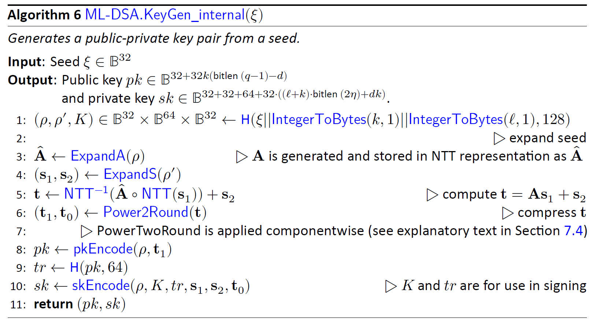

### (p,p',K)= H(ξ||K||L ,1024)

Keygen starts with running Keccak operation on seed to derive three different values. Seed is a value stored in register API, and we need to perform SHAKE256 with 256-bit inputs to generate 1024 bits output.

| Operation             | opcode       | operand | operand  | operand |
| :-------------------- | :----------- | :------ | :------- | :------ |
| (p,p',K)=Keccak(seed) | Keccak\_SIPO | seed    | 32 bytes |         |
|                       | Keccak\_SIPO | K       | 1 byte   |         |
|                       | Keccak\_SIPO | L       | 1 byte   |         |
|                       | Keccak\_PISO | p       | 32 bytes |         |
|                       | Keccak\_PISO | p'      | 64 bytes |         |
|                       | Keccak\_PISO | K       | 32 bytes |         |

Firstly, we need to fill Keccak input buffer with seed and then run the Keccak core. After that, the Keccak output stored in PISO is used to set the p, p’, and K values.

### (s1,s2)←ExpandS(ρ′)

We use the previous step's p' as the input for the Keccak and run the rejbounded sampler. For each polynomial, we need to feed the Keccak input buffer with p' and a constant value of length 16 bits. To do this, we first feed the 512-bit p' into SIPO, and then we add a 16 bits value (which acts as a counter from 0 to 14\) to the end of the fed p' and then padding starts from there. 

Rejbounded opcode enables both Keccak and sampler and shows the destination of output into the memory.

Then we run the rejbounded sampler 15 times with the shake256 mode. We can mask the latency of SIPO, the Keccak\_SIPO can be invoked when rejbounded is handling the previous data. However, the Keccak will not be enabled until rejbounded is done.

| Operation  | opcode       | operand | operand    | operand |
| :--------- | :----------- | :------ | :--------- | :------ |
| s1=expandS | Keccak\_SIPO | p'      | 0 (2bytes) |         |
|            | rejbounded   | s1\_0   |            |         |
|            | Keccak\_SIPO | p'      | 1          |         |
|            | rejbounded   | s1\_1   |            |         |
|            | …            |         |            |         |
|            | Keccak\_SIPO | p'      | 6          |         |
|            | rejbounded   | s1\_6   |            |         |
| s2=expandS | Keccak\_SIPO | p'      | 7          |         |
|            | rejbounded   | s2\_0   |            |         |
|            | …            |         |            |         |
|            | Keccak\_SIPO | p'      | 14         |         |
|            | rejbounded   | s2\_7   |            |         |

### NTT(s1)

We need to call NTT for s1 by passing three addresses. Temp address can be the same for all NTT calls while init and destination are different.

| Operation | opcode | operand | operand | operand    |
| :-------- | :----- | :------ | :------ | :--------- |
| NTT(s1)   | NTT    | s1\_0   | temp    | s1\_0\_ntt |
|           | NTT    | s1\_1   | temp    | s1\_1\_ntt |
|           | …      |         |         |            |
|           | NTT    | s1\_6   | temp    | s1\_6\_ntt |

### Aˆ ←ExpandA(ρ) AND Aˆ ◦NTT(s1)

We perform rejection sampling and PWM simultaneously. This step takes p from the first step and appends two bytes of Keccak SIPO to the end of the given p and then starts padding from there. We run the rejection sampler 56 times with shake128 mode, where k \* l=56.

Each polynomial requires p and the necessary constants to fill SIPO. Then Rejection\_sample opcode activates both Keccak and sampler. The output of rejection sampler goes straight to PWM unit. Then, the pwm opcode turns on pwm core, which can check the input from rejection sampler for a valid input. 

There are two different opcodes for PWM: regular PWM and PWM\_ACCU that indicates different modes for PWM units.

We can mask the latency of SIPO, the Keccak\_SIPO can be invoked when PWM/Rejection\_sampler is handling the previous data. However, the Keccak will not be enabled until PWM is done.

| Operation              | opcode             | operand  | operand    | operand    |
| :--------------------- | :----------------- | :------- | :--------- | :--------- |
| As1\_0=PWM(A, NTT(s1)) | Keccak\_SIPO       | p        | 0 (1 byte) | 0 (1 byte) |
|                        | Rejection\_sampler |          |            |            |
|                        | pwm                | DONTCARE | s1\_0\_ntt | As0        |
|                        | Keccak\_SIPO       | p        | 0          | 1          |
|                        | Rejection\_sampler |          |            |            |
|                        | pwm\_accu          | DONTCARE | s1\_1\_ntt | As0        |
|                        | Keccak\_SIPO       | p        | 0          | 2          |
|                        | Rejection\_sampler |          |            |            |
|                        | pwm\_accu          | DONTCARE | s1\_2\_ntt | As0        |
|                        | …                  |          |            |            |
|                        | Keccak\_SIPO       | p        | 0          | 6          |
|                        | Rejection\_sampler |          |            |            |
|                        | pwm\_accu          | DONTCARE | s1\_6\_ntt | As0        |
| As1\_1=PWM(A, NTT(s1)) | Keccak\_SIPO       | p        | 1          | 0          |
|                        | Rejection\_sampler |          |            |            |
|                        | pwm                | DONTCARE | s1\_0\_ntt | As1        |
|                        | Keccak\_SIPO       | p        | 1          | 1          |
|                        | Rejection\_sampler |          |            |            |
|                        | pwm\_accu          | DONTCARE | s1\_1\_ntt | As1        |
|                        | …                  |          |            |            |
|                        | Keccak\_SIPO       | p        | 1          | 6          |
|                        | Rejection\_sampler |          |            |            |
|                        | pwm\_accu          | DONTCARE | s1\_6\_ntt | As1        |
| As1\_7=PWM(A, NTT(s1)) | …                  |          |            |            |
|                        | Keccak\_SIPO       | p        | 7          | 6          |
|                        | Rejection\_sampler |          |            |            |
|                        | pwm\_accu          | DONTCARE | s1\_6\_ntt | As7        |

### NTT‚àí1(AÀÜ ‚ó¶NTT(s1))

We need to call INTT for As1 by passing three addresses. Temp address can be the same for all INTT calls while init and destination are different.

| Operation | opcode | operand | operand | operand   |
| :-------- | :----- | :------ | :------ | :-------- |
| INTT(As1) | INTT   | As0     | temp    | As0\_intt |
|           | INTT   | As1     | temp    | As1\_intt |
|           | …      |         |         |           |
|           | INTT   | As7     | temp    | As7\_intt |

### t ‚ÜêNTT‚àí1(AÀÜ ‚ó¶NTT(s1))+s2

We need to call point-wise addition for As1 results and s2 by passing three addresses. 

| Operation      | opcode | operand   | operand | operand |
| :------------- | :----- | :-------- | :------ | :------ |
| t=INTT(As1)+s2 | PWA    | As0\_intt | s2\_0   | t0      |
|                | PWA    | As1\_intt | s2\_1   | t1      |
|                | …      |           |         |         |
|                | PWA    | As7\_intt | s2\_7   | t7      |

### (t1,t0)←Power2Round(t,*d*) AND *pk* ←pkEncode(ρ,t1) AND *sk* ←skEncode(t0)

We need to call power2round for t results from the previous step, and the results are stored in two different addresses to API for sk and pk. 

| Operation                  | Opcode      | operand | operand | operand |
| :------------------------- | :---------- | :------ | :------ | :------ |
| (t1,t0)‚ÜêPower2Round(t,*d*) | POWER2ROUND | t       | t0 (sk) | t1 (pk) |

NOTE: The value of ρ needs to be also stored into register API for pk.

### *tr* ‚ÜêH(BytesToBits(*pk*),512)

The value of pk from register API needs to be read and stored into Keccak SIPO to perform SHAKE256. Due to long size of pk, 20 rounds of Keccak is required to executed to generate 512-bit tr.

| Operation     | opcode       | operand | operand    | operand |
| :------------ | :----------- | :------ | :--------- | :------ |
| tr=Keccak(pk) | Keccak\_SIPO | pk      | 2592 bytes |         |
|               | Keccak\_PISO | tr      | 64 bytes   |         |

### *sk* ←skEncode(ρ,*K*,*tr*,s1,s2,t0)

The value of ρ, *K* needs to be stored into register API, while *tr* and *t0* are already stored by previous steps. 

We need to call skEncode for s1 and s2 coefficients and the results are stored into API for sk. 

| Operation          | opcode   | operand | operand | operand |
| :----------------- | :------- | :------ | :------ | :------ |
| *sk* ‚ÜêskEncode(s1) | skEncode | s1      | sk      |         |
| *sk* ‚ÜêskEncode(s2) | skEncode | S2      | sk      |         |

## Signing

Signing operation is the most challenging operation for ML-DSA. From a high-level perspective, the required operation for performing a signing operation can be shown as follows:


The are some initial processes to decode private key. The loop between challenge generation and validity check should be continued until validity check passed the results and then, the signature will be generated and published. 

In our optimized design, the next challenge is generated in advance, so that it can be used if the validity check of the current round fails. Therefore, we use two sequencers to support parallel operations.

The algorithm for signing is presented below. We will explain the specifics of each operation in the following subsections.


The following table shows the operations for each sequencer:

| Sequencer 2          |                                                 | Sequencer 1             |               |
| :------------------- | :---------------------------------------------- | :---------------------- | :------------ |
| Initial steps        | (ρ,*K*,*tr*,s1,s2,t0)←skDecode(*sk*)            | μ ←H(*tr*               |               |*M*,512) | Challenge Generation
|                      | sˆ1 ←NTT(s1)                                    | ρ′←H(*K*                |               |*rnd*||μ,512)
|                      | sˆ2 ←NTT(s2)                                    | y ←ExpandMask(ρ′ ,κ)    |               |
|                      | ÀÜt0 ‚ÜêNTT(t0)                                    | w ‚ÜêNTT‚àí1(AÀÜ ‚ó¶NTT(y))    |               |
| *Validity Checks*    | *c*ÀÜ ‚ÜêNTT(*c*)                                  | (w1,w0) ‚ÜêDecompose(w)   |               |
|                      | ⟨⟨*c*s1⟩⟩←NTT−1(*c*ˆ◦ sˆ1)                  | *c*˜←H(μ                |               |w1Encode(w1),2λ)
|                      | ⟨⟨*c*s2⟩⟩←NTT−1(*c*ˆ◦ sˆ2)                  | *c* ←SampleInBall(*c*˜) |               |
|                      | z ←y \+⟨⟨*c*s1⟩⟩                            | *κ ←κ \+ℓ*              |               |
|                      | r0 ←(w0 −⟨⟨*c*s2⟩⟩)                         |                         |               |
|                      | ⟨⟨*c*t0⟩⟩←NTT−1(*c*ˆ◦ tˆ0)                  |                         |               |
|                      | h ←MakeHint(w1, w0−⟨⟨*c*s2⟩⟩+⟨⟨*c*t0⟩⟩) |                         |               |
|                      |                                                 |                         | z             ||∞ ≥ γ1 −β 
|                      |                                                 |                         | r0            ||∞ ≥ γ2 −β 
|                      |                                                 |                         | ⟨⟨*c*t0⟩⟩ ||∞ ≥ γ2 
| Signature Generation | σ ←sigEncode(*c*˜,z mod±*q*,h)                  |                         |               |

### (ρ,*K*,*tr*,s1,s2,t0)←skDecode(*sk*)

We need to call skDecode for s1, s2, and t0 by passing the required addresses. 

| Operation    | opcode   | operand | operand | operand |
| :----------- | :------- | :------ | :------ | :------ |
| skDecode(s1) | skDecode | s1      | s1      |         |
| skDecode(s2) |          | s2      | s2      |         |
| skDecode(t0) |          | t0      | t0      |         |

### sÀÜ1 ‚ÜêNTT(s1)

We need to call NTT for s1 by passing three addresses. Temp address can be the same for all NTT calls while init and destination are different.

| Operation | opcode | operand | operand | operand    |
| :-------- | :----- | :------ | :------ | :--------- |
| NTT(s1)   | NTT    | s1\_0   | temp    | s1\_0\_ntt |
|           | NTT    | s1\_1   | temp    | s1\_1\_ntt |
|           | …      |         |         |            |
|           | NTT    | s1\_6   | temp    | s1\_6\_ntt |

### sÀÜ2 ‚ÜêNTT(s2)

We need to call NTT for t0 by passing three addresses. Temp address can be the same for all NTT calls while init and destination are different.

| Operation | opcode | operand | operand | operand    |
| :-------- | :----- | :------ | :------ | :--------- |
| NTT(s2)   | NTT    | t0\_0   | temp    | t0\_0\_ntt |
|           | NTT    | t0\_1   | temp    | t0\_1\_ntt |
|           | …      |         |         |            |
|           | NTT    | t0\_7   | temp    | t0\_7\_ntt |

### ÀÜt0 ‚ÜêNTT(t0)

We need to call NTT for s2 by passing three addresses. Temp address can be the same for all NTT calls while init and destination are different.

| Operation | opcode | operand | operand | operand    |
| :-------- | :----- | :------ | :------ | :--------- |
| NTT(s2)   | NTT    | s2\_0   | temp    | s2\_0\_ntt |
|           | NTT    | s2\_1   | temp    | s2\_1\_ntt |
|           | …      |         |         |            |
|           | NTT    | s2\_7   | temp    | s2\_7\_ntt |

### *c*ÀÜ ‚ÜêNTT(*c*)

This is the part where two sequencers sync up. Sequencer 1 will pause until the second sequencer finishes the SampleInBall operation and the ready flag from SampleInBall tells the first sequencer to go on. 

We need to call NTT for c by passing three addresses. Temp address can be the same for all NTT calls while init and destination are different.

| Operation | opcode | operand | operand | operand |
| :-------- | :----- | :------ | :------ | :------ |
| NTT(c)    | NTT    | c       | temp    | c\_ntt  |

### ⟨⟨*c*s1⟩⟩←NTT−1(*c*ˆ◦ sˆ1)

We need firstly to call PWM to perform point-wise multiplication between c and s1.

| Operation      | opcode | operand | operand    | operand     |
| :------------- | :----- | :------ | :--------- | :---------- |
| cs1=PWM(c, s1) | PWM    | c\_ntt  | s1\_0\_ntt | cs1\_0\_ntt |
|                | PWM    | c\_ntt  | s1\_1\_ntt | cs1\_1\_ntt |
|                | …      |         |            |             |
|                | PWM    | c\_ntt  | s1\_6\_ntt | cs1\_6\_ntt |

Then, we need to call INTT for cs1 by passing three addresses. Temp address can be the same for all INTT calls while init and destination are different.

| Operation | opcode | operand     | operand | operand |
| :-------- | :----- | :---------- | :------ | :------ |
| INTT(cs1) | INTT   | cs1\_0\_ntt | temp    | cs1\_0  |
|           | INTT   | cs1\_1\_ntt | temp    | cs1\_1  |
|           | …      |             |         |         |
|           | INTT   | cs1\_6\_ntt | temp    | cs1\_6  |

### ⟨⟨*c*s2⟩⟩←NTT−1(*c*ˆ◦ sˆ2)

We need first to call PWM to perform point-wise multiplication between c and s2.

| Operation      | opcode | operand | operand    | operand     |
| :------------- | :----- | :------ | :--------- | :---------- |
| cs2=PWM(c, s2) | PWM    | c\_ntt  | s2\_0\_ntt | cs2\_0\_ntt |
|                | PWM    | c\_ntt  | s2\_1\_ntt | cs2\_1\_ntt |
|                | …      |         |            |             |
|                | PWM    | c\_ntt  | s2\_7\_ntt | cs2\_7\_ntt |

Then, we need to call INTT for cs2 by passing three addresses. Temp address can be the same for all INTT calls while init and destination are different.

| Operation | opcode | operand     | operand | operand |
| :-------- | :----- | :---------- | :------ | :------ |
| INTT(cs2) | INTT   | cs2\_0\_ntt | temp    | cs2\_0  |
|           | INTT   | cs2\_1\_ntt | temp    | cs2\_1  |
|           | …      |             |         |         |
|           | INTT   | cs2\_7\_ntt | temp    | cs2\_7  |

### z ←y \+⟨⟨*c*s1⟩⟩

We need to call PWA to perform point-wise addition between cs1 and y.

| Operation     | opcode | operand | operand | operand |
| :------------ | :----- | :------ | :------ | :------ |
| z=PWA(y, cs1) | PWA    | y\_0    | cs1\_0  | z\_0    |
|               | PWA    | y\_1    | cs1\_1  | z\_1    |
|               | …      |         |         |         |
|               | PWA    | y\_6    | cs1\_6  | z\_6    |

### r0 ←(w0 −⟨⟨*c*s2⟩⟩)

We need to call PWS to perform point-wise subtraction between w0 and cs2.

| Operation       | opcode | operand | operand | operand |
| :-------------- | :----- | :------ | :------ | :------ |
| r0=PWS(w0, cs2) | PWS    | w0\_0   | cs2\_0  | r0\_0   |
|                 | PWS    | w0\_1   | cs2\_1  | r0\_1   |
|                 | …      |         |         |         |
|                 | PWS    | w0\_7   | cs2\_7  | r0\_7   |

### ⟨⟨*c*t0⟩⟩←NTT−1(*c*ˆ◦ tˆ0)

We need first to call PWM to perform point-wise multiplication between c and t0.

| Operation      | opcode | operand | operand    | operand     |
| :------------- | :----- | :------ | :--------- | :---------- |
| ct0=PWM(c, t0) | PWM    | c\_ntt  | t0\_0\_ntt | ct0\_0\_ntt |
|                | PWM    | c\_ntt  | t0\_1\_ntt | ct0\_1\_ntt |
|                | …      |         |            |             |
|                | PWM    | c\_ntt  | t0\_7\_ntt | ct0\_7\_ntt |

Then, we need to call INTT for ct0 by passing three addresses. Temp address can be the same for all INTT calls while init and destination are different.

| Operation | opcode | operand     | operand | operand |
| :-------- | :----- | :---------- | :------ | :------ |
| INTT(ct0) | INTT   | ct0\_0\_ntt | temp    | ct0\_0  |
|           | INTT   | ct0\_1\_ntt | temp    | ct0\_1  |
|           | …      |             |         |         |
|           | INTT   | ct0\_7\_ntt | temp    | ct0\_7  |

### h ←MakeHint(w1,r0+⟨⟨*c*t0⟩⟩)

We need to call PWA to perform point-wise addition between r0 and ct0.

| Operation            | opcode | operand    | operand | operand |
| :------------------- | :----- | :--------- | :------ | :------ |
| hint\_r=PWA(r0, ct0) | PWA    | hint\_r\_0 | r0\_0   | ct0\_0  |
|                      | PWA    | hint\_r\_1 | r0\_1   | ct0\_1  |
|                      | …      |            |         |         |
|                      | PWA    | hint\_r\_7 | r0\_7   | ct0\_7  |

Then, we need to call MakeHint for hint\_r. It will process the entire hint\_r polynomials, i.e., from hint\_r\_0 to hint\_r\_7.

| Operation            | opcode   | operand    | operand | operand |
| :------------------- | :------- | :--------- | :------ | :------ |
| hint\_r=PWA(r0, ct0) | MAKEHINT | hint\_r\_0 | h       |         |

### ||z||∞ ≥ γ1 −β

We need to call Norm\_Check to perform validity check on z. The output will be stored as an individual flag in the high-level architecture.

| Operation          | opcode  | operand | operand | operand |
| :----------------- | :------ | :------ | :------ | :------ |
| Valid=NormCheck(z) | NormChk | z       | mode    |         |

### ||r0||∞ ≥ γ2 −β

We need to call Norm\_Check to perform validity check on r0. The output will be stored as an individual flag in the high-level architecture.

| Operation           | opcode  | operand | operand | operand |
| :------------------ | :------ | :------ | :------ | :------ |
| Valid=NormCheck(r0) | NormChk | r       | mode    |         |

### ||⟨⟨*c*t0⟩⟩||∞ ≥ γ2

We need to call Norm\_Check to perform validity check on ct0. The output will be stored as an individual flag in the high-level architecture.

| Operation            | opcode  | operand | operand | operand |
| :------------------- | :------ | :------ | :------ | :------ |
| Valid=NormCheck(ct0) | NormChk | ct0     | mode    |         |

### σ ←sigEncode(*c*˜,z mod±*q*,h)

This step writes the final signature into the register API. Before that, the high-level design will check all four flags coming from:

1) MakeHint  
2) NormChk on z  
3) NormChk on r0  
4) NormChk on ct0

If all checks show the successful signature, then the sigEncode unit will be called. The value of h is already stored by MakeHint unit into the register API. Hence, only two remaining parts will be passed to this unit.

| Operation        | opcode    | operand | operand | operand |
| :--------------- | :-------- | :------ | :------ | :------ |
| σ=sigEncode(c,z) | sigEncode | c       | z       | σ       |

### μ ←H(*tr*||*M*,512)

The other sequencer starts with running Keccak operation on tr and the given message. tr and the message are stored in register API as inputs, and we need to perform SHAKE256 with to generate 512 bits output.  
Since the engine only supports prehash signing/verifying ML-DSA operations, the assumption is the given message is the hash of a pure message. Based on FIPS 204 \[3\], the hashed message needs to be extended by some pre-defined OIDs. 

| Operation    | opcode       | operand | operand      | operand |
| :----------- | :----------- | :------ | :----------- | :------ |
| μ\=Keccak(tr |              | M)      | Keccak\_SIPO | tr      | 64 bytes
|              | Keccak\_SIPO | 1       | 1 byte       |         |
|              | Keccak\_SIPO | OID     | 11 bytes     |         |
|              | Keccak\_SIPO | Message | 64 bytes     |         |
|              | Keccak\_PISO | μ       | 64 bytes     |         |

Firstly, we need to fill Keccak input buffer with tr and then concatenate it with message. NIST may apply some changes in this operation by adding some constant value into this concatenation. Then we run the Keccak core, and the Keccak output stored in PISO is used to set the μ value into a special register.

### ρ′←H(*K*||*rnd*||μ,512)

We need to run Keccak operation on K, rnd, and μ values. K and rnd are stored in register API as inputs, and μ is stored in an internal register. we need to perform SHAKE256 with to generate 512 bits output.

| Operation    | opcode       | operand   | operand       | operand |
| :----------- | :----------- | :-------- | :------------ | :------ |
| ρ′\=Keccak(K |              | rnd       |               | μ)      | Keccak\_SIPO | K | 4 (x64 words)
|              | Keccak\_SIPO | sign\_rnd | 4 (x64 words) |         |
|              | Keccak\_SIPO | μ         | 8 (x64 words) |         |
|              | Keccak\_PISO | ρ′        | 8 (x64 words) |         |

Firstly, we need to fill Keccak input buffer with K and then concatenate it with sign\_rnd and μ. Then we run the Keccak core, and the Keccak output stored in PISO is used to set the ρ′ value into a special register.

### y ←ExpandMask(ρ’ ,κ)

We use the previous step's p' as the input for the Keccak and run the ExpandMask sampler. For each polynomial, we need to feed the Keccak input buffer with p' and a register value of length 16 bits. To do this, we first feed the 512-bit p' into SIPO, and then we add a 16 bits value (which acts as a counter from 0 to 6\) to the end of the fed p' and then padding starts from there. 

ExpandMask opcode enables both Keccak and sampler and shows the destination of output into the memory.

Then we run the ExpandMask sampler 7 times with the shake256 mode. We can mask the latency of SIPO, the Keccak\_SIPO can be invoked when ExpandMask is handling the previous data. However, the Keccak will not be enabled until ExpandMask is done.

| Operation           | opcode    | operand | operand  | operand |
| :------------------ | :-------- | :------ | :------- | :------ |
| y=ExpandMask(ρ’ ,κ) | LDKeccak  | p'      | 64 bytes |         |
|                     | LDKeccak  | κ       | 2 bytes  |         |
|                     | Exp\_Mask | y\_0    |          |         |
|                     | LDKeccak  | p'      | 1 bytes  |         |
|                     | LDKeccak  | κ+1     | 2 bytes  |         |
|                     | Exp\_Mask | y\_1    |          |         |
|                     | …         |         |          |         |
|                     | LDKeccak  | p'      | 64 bytes |         |
|                     | LDKeccak  | κ \+6   | 2 bytes  |         |
|                     | Exp\_Mask | y\_6    |          |         |

### NTT(y)

We need to call NTT for s1 by passing three addresses. Temp address can be the same for all NTT calls while init and destination are different.

| Operation | opcode | operand | operand | operand   |
| :-------- | :----- | :------ | :------ | :-------- |
| NTT(y)    | NTT    | y\_0    | temp    | y\_0\_ntt |
|           | NTT    | y\_1    | temp    | y\_1\_ntt |
|           | …      |         |         |           |
|           | NTT    | y\_6    | temp    | y\_6\_ntt |

### Aˆ ←ExpandA(ρ) AND Aˆ ◦NTT(y)

We perform rejection sampling and PWM simultaneously. This step takes p from and appends two bytes of Keccak SIPO to the end of the given p and then starts padding from there. We run the rejection sampler 56 times with shake128 mode, where k \* l=56.

Each polynomial requires p and the necessary constants to fill SIPO. Then Rejection\_sample opcode activates both Keccak and sampler. The output of rejection sampler goes straight to PWM unit. Then, the pwm opcode turns on pwm core, which can check the input from rejection sampler for a valid input. 

There are two different opcodes for PWM: regular PWM and PWM\_ACCU that indicates different modes for PWM units.

We can mask the latency of SIPO, the Keccak\_SIPO can be invoked when PWM/Rejection\_sampler is handling the previous data. However, the Keccak will not be enabled until PWM is done.

| Operation          | opcode             | operand  | operand   | operand |
| :----------------- | :----------------- | :------- | :-------- | :------ |
| Ay0=PWM(A, NTT(y)) | LDKeccak           | p        | 32 bytes  |         |
|                    | LDKeccak           | 0        | 1 byte    |         |
|                    | LDKeccak           | 0        | 1 byte    |         |
|                    | Rejection\_sampler |          |           |         |
|                    | pwm                | DONTCARE | y\_0\_ntt | Ay0     |
|                    | LDKeccak           | p        | 32 bytes  |         |
|                    | LDKeccak           | 0        | 1 byte    |         |
|                    | LDKeccak           | 1        | 1 byte    |         |
|                    | Rejection\_sampler |          |           |         |
|                    | pwm\_accu          | DONTCARE | y\_1\_ntt | Ay0     |
|                    | LDKeccak           | p        | 32 bytes  |         |
|                    | LDKeccak           | 0        | 1 byte    |         |
|                    | LDKeccak           | 2        | 1 byte    |         |
|                    | Rejection\_sampler |          |           |         |
|                    | pwm\_accu          | DONTCARE | y\_2\_ntt | Ay0     |
|                    | …                  |          |           |         |
|                    | LDKeccak           | p        | 32 bytes  |         |
|                    | LDKeccak           | 0        | 1 byte    |         |
|                    | LDKeccak           | 6        | 1 byte    |         |
|                    | Rejection\_sampler |          |           |         |
|                    | pwm\_accu          | DONTCARE | y\_6\_ntt | Ay0     |
| Ay1=PWM(A, NTT(y)) | LDKeccak           | p        | 32 bytes  | 0       |
|                    | LDKeccak           | 1        | 1 byte    |         |
|                    | LDKeccak           | 0        | 1 byte    |         |
|                    | Rejection\_sampler |          |           |         |
|                    | pwm                | DONTCARE | y\_0\_ntt | Ay1     |
|                    | LDKeccak           | p        | 32 bytes  |         |
|                    | LDKeccak           | 1        | 1 byte    |         |
|                    | LDKeccak           | 1        | 1 byte    |         |
|                    | Rejection\_sampler |          |           |         |
|                    | pwm\_accu          | DONTCARE | y\_1\_ntt | Ay1     |
|                    | …                  |          |           |         |
|                    | LDKeccak           | p        | 32 bytes  |         |
|                    | LDKeccak           | 1        | 1 byte    |         |
|                    | LDKeccak           | 6        | 1 byte    |         |
|                    | Rejection\_sampler |          |           |         |
|                    | pwm\_accu          | DONTCARE | y\_6\_ntt | Ay1     |
| Ay7=PWM(A, NTT(y)) | …                  |          |           |         |
|                    | LDKeccak           | p        | 32 bytes  |         |
|                    | LDKeccak           | 7        | 1 byte    |         |
|                    | LDKeccak           | 6        | 1 byte    |         |
|                    | Rejection\_sampler |          |           |         |
|                    | pwm\_accu          | DONTCARE | y\_6\_ntt | Ay7     |

### w ‚ÜêNTT‚àí1(AÀÜ ‚ó¶NTT(y))

We need to call INTT for Ay by passing three addresses. Temp address can be the same for all INTT calls while init and destination are different.

| Operation | opcode | operand | operand | operand |
| :-------- | :----- | :------ | :------ | :------ |
| INTT(Ay)  | INTT   | Ay0     | temp    | w\_0    |
|           | INTT   | Ay1     | temp    | w\_1    |
|           | …      |         |         |         |
|           | INTT   | Ay7     | temp    | w\_7    |

### (w1,w0) ←Decompose(w) AND *c*˜←H(μ||w1Encode(w1),2λ)

The decompose unit takes w from memory and splits it into two parts. It saves w0 in memory and sends w1 to the Keccak SIPO for SampleInBall. However, SIPO requires the μ prefix before receiving the w1 values. Therefore, the high-level controller should provide μ before using decompose. After completing the decompose operation, the high-level controller needs to add the necessary padding for H(μ||w1Encode(w1),2λ). Then, by activating the SampleInBall, the Keccak will start and the data in the SIPO will be processed.

| Operation             | opcode      | operand          | operand  | operand |
| :-------------------- | :---------- | :--------------- | :------- | :------ |
| H(μ                   |             | w1Encode(w1),2λ) | LDKeccak | μ       | 64 bytes
| (w1,w0) ‚ÜêDecompose(w) | Decomp\_Enc | w                | w0       |         |
| H(μ                   |             | w1Encode(w1),2λ) | LDKeccak | padding |

### *c* ‚ÜêSampleInBall(*c*Àú)

We take the SIPO value from the last step as the Keccak input and run SampleInBall. The output stays in the SampleInBall memory.

| Operation                | opcode       | operand | operand | operand |
| :----------------------- | :----------- | :------ | :------ | :------ |
| *c* ‚ÜêSampleInBall(*c*Àú1) | SMPL\_INBALL |         |         |         |

### κ ←κ \+ℓ

High-level controller increases the value of κ by l.

| Operation | opcode    | operand | operand | operand |
| :-------- | :-------- | :------ | :------ | :------ |
| κ ←κ \+ℓ  | Update\_k |         |         |         |

## Verifying

The algorithm for verifying is presented below. We will explain the specifics of each operation in the following subsections.

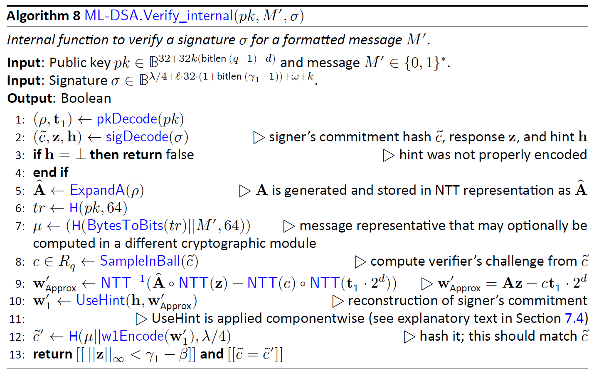

### (ρ,t1)←pkDecode(*pk*)

We need to call pkDecode to decode the given pk for t1 values.

| Operation         | opcode   | operand | operand | operand |
| :---------------- | :------- | :------ | :------ | :------ |
| *t1‚ÜêpkDecode(pk)* | pkDecode | *pk*    | t1      |         |

### (*c*˜,z,h)←sigDecode(σ) 

We need to call sigDecode to decode the given signature for z and h values.

| Operation          | opcode       | operand | operand | operand |
| :----------------- | :----------- | :------ | :------ | :------ |
| (z,h)←sigDecode(σ) | sigDecode\_z | *σ\_z*  | z       |         |
|                    | sigDecode\_h | *σ\_h*  | h       |         |

### ||z||∞ ≥ γ1 −β

We need to call Norm\_Check to perform validity check on the given z. The output will be stored as an individual flag in the high-level architecture.

| Operation          | opcode  | operand | operand | operand |
| :----------------- | :------ | :------ | :------ | :------ |
| Valid=NormCheck(z) | NormChk | z       | mode    |         |

### \[\[number of 1’s in h is ≤ ω\]\]

We need to call HintSum to perform validity check on the given h. The output will be stored as an individual flag in the high-level architecture.

| Operation        | opcode  | operand | operand | operand |
| :--------------- | :------ | :------ | :------ | :------ |
| Valid=HintSum(h) | HINTSUM | h       |         |         |

### z ‚ÜêNTT(z)

We need to call NTT for z by passing three addresses. Temp address can be the same for all NTT calls while init and destination are different.

| Operation | opcode | operand | operand | operand   |
| :-------- | :----- | :------ | :------ | :-------- |
| NTT(z)    | NTT    | z\_0    | temp    | z\_0\_ntt |
|           | NTT    | z\_1    | temp    | z\_1\_ntt |
|           | …      |         |         |           |
|           | NTT    | z\_6    | temp    | z\_6\_ntt |

### Aˆ ←ExpandA(ρ) AND Aˆ ◦NTT(z)

We perform rejection sampling and PWM simultaneously. This step takes p from the register API and appends two bytes of Keccak SIPO to the end of the given p and then starts padding from there. We run the rejection sampler 56 times with shake128 mode, where k \* l=56.

Each polynomial requires p and the necessary constants to fill SIPO. Then Rejection\_sample opcode activates both Keccak and sampler. The output of rejection sampler goes straight to PWM unit. Then, the pwm opcode turns on pwm core, which can check the input from rejection sampler for a valid input. 

There are two different opcodes for PWM: regular PWM and PWM\_ACCU that indicates different modes for PWM units.

We can mask the latency of SIPO, the Keccak\_SIPO can be invoked when PWM/Rejection\_sampler is handling the previous data. However, the Keccak will not be enabled until PWM is done.

| Operation            | opcode             | operand  | operand    | operand    |
| :------------------- | :----------------- | :------- | :--------- | :--------- |
| Az\_0=PWM(A, NTT(z)) | Keccak\_SIPO       | p        | 0 (1 byte) | 0 (1 byte) |
|                      | Rejection\_sampler |          |            |            |
|                      | pwm                | DONTCARE | z\_0\_ntt  | Az0        |
|                      | Keccak\_SIPO       | p        | 0          | 1          |
|                      | Rejection\_sampler |          |            |            |
|                      | pwm\_accu          | DONTCARE | z\_1\_ntt  | Az0        |
|                      | Keccak\_SIPO       | p        | 0          | 2          |
|                      | Rejection\_sampler |          |            |            |
|                      | pwm\_accu          | DONTCARE | z\_2\_ntt  | Az0        |
|                      | …                  |          |            |            |
|                      | Keccak\_SIPO       | p        | 0          | 6          |
|                      | Rejection\_sampler |          |            |            |
|                      | pwm\_accu          | DONTCARE | z\_6\_ntt  | Az0        |
| Az\_1=PWM(A, NTT(z)) | Keccak\_SIPO       | p        | 1          | 0          |
|                      | Rejection\_sampler |          |            |            |
|                      | pwm                | DONTCARE | z\_0\_ntt  | Az1        |
|                      | Keccak\_SIPO       | p        | 1          | 1          |
|                      | Rejection\_sampler |          |            |            |
|                      | pwm\_accu          | DONTCARE | z\_1\_ntt  | Az1        |
|                      | …                  |          |            |            |
|                      | Keccak\_SIPO       | p        | 1          | 6          |
|                      | Rejection\_sampler |          |            |            |
|                      | pwm\_accu          | DONTCARE | z\_6\_ntt  | Az1        |
| Az\_7=PWM(A, NTT(z)) | …                  |          |            |            |
|                      | Keccak\_SIPO       | p        | 7          | 6          |
|                      | Rejection\_sampler |          |            |            |
|                      | pwm\_accu          | DONTCARE | z\_6\_ntt  | Az7        |

### tr ‚ÜêH(pk,512)

The sequencer runs Keccak operation on pk. pk is stored in register API as input, and we need to perform SHAKE256 with to generate 512 bits output.

| Operation     | opcode       | operand | operand    | operand |
| :------------ | :----------- | :------ | :--------- | :------ |
| tr=Keccak(pk) | Keccak\_SIPO | pk      | 2592 bytes |         |
|               | Keccak\_PISO | tr      | 64 bytes   |         |

### μ ←H(*tr*||*M*,512)

The sequencer starts with running Keccak operation on tr and the given message. tr is stored in an internal register from the previous step, and the message is stored in register API as input, and we need to perform SHAKE256 with to generate 512 bits output.

| Operation    | opcode       | operand | operand      | operand |
| :----------- | :----------- | :------ | :----------- | :------ |
| μ\=Keccak(tr |              | M)      | Keccak\_SIPO | tr      | 64 bytes
|              | Keccak\_SIPO | 1       | 1 byte       |         |
|              | Keccak\_SIPO | OID     | 11 bytes     |         |
|              | Keccak\_SIPO | Message | 64 bytes     |         |
|              | Keccak\_PISO | μ       | 64 bytes     |         |

Firstly, we need to fill Keccak input buffer with tr and then concatenate it with message. NIST may apply some changes in this operation by adding some constant value into this concatenation. Then we run the Keccak core, and the Keccak output stored in PISO is used to set the μ value into a special register.

### *c* ‚ÜêSampleInBall(*c*Àú)

We take the c\~ values from register API as the Keccak input and run SampleInBall. The output stays in the SampleInBall memory.

| Operation               | opcode       | operand | operand  | operand |
| :---------------------- | :----------- | :------ | :------- | :------ |
|                         | Keccak\_SIPO | c\~     | 64 bytes |         |
| *c* ‚ÜêSampleInBall(*c*Àú) | SMPL\_INBALL |         |          |         |

### *c*ÀÜ ‚ÜêNTT(*c*)

We need to call NTT for c by passing three addresses. Temp address can be the same for all NTT calls while init and destination are different.

| Operation | opcode | operand | operand | operand |
| :-------- | :----- | :------ | :------ | :------ |
| NTT(c)    | NTT    | c       | temp    | c\_ntt  |

### *c*ÀÜ ‚ÜêNTT(*c*)

We need to call NTT for c by passing three addresses. Temp address can be the same for all NTT calls while init and destination are different.

| Operation | opcode | operand | operand | operand |
| :-------- | :----- | :------ | :------ | :------ |
| NTT(c)    | NTT    | c       | temp    | c\_ntt  |

### t1 ‚ÜêNTT(t1)

We need to call NTT for t1 by passing three addresses. Temp address can be the same for all NTT calls while init and destination are different.

| Operation | opcode | operand | operand | operand    |
| :-------- | :----- | :------ | :------ | :--------- |
| NTT(t1)   | NTT    | t1\_0   | temp    | t1\_0\_ntt |
|           | NTT    | t1\_1   | temp    | t1\_1\_ntt |
|           | …      |         |         |            |
|           | NTT    | t1\_7   | temp    | t1\_7\_ntt |

### NTT(*c*) ‚ó¶NTT(t1)

We need to call point-wise multiplication between c and all t1 polynomials in NTT domain. 

| Operation                  | opcode | operand | operand    | operand |
| :------------------------- | :----- | :------ | :--------- | :------ |
| ct1=PWM(NTT(*c*) ‚ó¶NTT(t1)) | PWM    | c\_ntt  | t1\_0\_ntt | ct1\_0  |
|                            | PWM    | c\_ntt  | t1\_1\_ntt | ct1\_1  |
|                            | …      |         |            |         |
| .                          | PWM    | c\_ntt  | t1\_7\_ntt | ct1\_7  |

### A ÀÜ ‚ó¶NTT(z*)* ‚àíNTT(*c*) ‚ó¶NTT(t1)

We need to call point-wise subtraction between Az and ct1 polynomials in NTT domain. 

| Operation                               | opcode | operand | operand | operand    |
| :-------------------------------------- | :----- | :------ | :------ | :--------- |
| Az-ct1=A ÀÜ ‚ó¶NTT(z*)* ‚àíNTT(*c*) ‚ó¶NTT(t1) | PWS    | Az\_0   | ct1\_0  | Az\_ct1\_0 |
|                                         | PWS    | Az\_1   | ct1\_1  | Az\_ct1\_1 |
|                                         | …      |         |         |            |
| .                                       | PWS    | Az\_7   | ct1\_7  | Az\_ct1\_7 |

### w′ ←NTT-1(A ˆ ◦NTT(z*)* −NTT(*c*) ◦NTT(t1))

We need to call INTT for Az\_ct1 by passing three addresses. Temp address can be the same for all INTT calls while init and destination are different.

| Operation                                   | opcode | operand    | operand | operand |
| :------------------------------------------ | :----- | :--------- | :------ | :------ |
| w′ ←NTT-1(A ˆ ◦NTT(z*)* −NTT(*c*) ◦NTT(t1)) | INTT   | Az\_ct1\_0 | temp    | w’\_0   |
|                                             | INTT   | Az\_ct1\_1 | temp    | w’\_1   |
|                                             | …      |            |         |         |
|                                             | INTT   | Az\_ct1\_7 | temp    | w’\_7   |

### w ′ ←UseHint(h,w ′) AND *c*˜←H(μ||w1Encode(w1),2λ)

In the UseHint phase, the decompose unit retrieves w from memory and divides it into two components. Next, w1 is refreshed through useHint, encoded, and forwarded to the Keccak SIPO. Nonetheless, the μ prefix must precede w1 before SIPO can accept it. Therefore, the high-level controller should provide μ before using decompose. After completing the UseHint operation, the high-level controller needs to add the necessary padding for H(μ||w1Encode(w1),2λ). Then, the Keccak will start and the data in the SIPO will be stored at register API as verification result.

| Operation           | opcode     | operand             | operand  | operand |
| :------------------ | :--------- | :------------------ | :------- | :------ |
| H(μ                 |            | w1Encode(w1),2λ)    | LDKeccak | μ       | 64 bytes
| w ′ ←UseHint(h,w ′) | USEHINT    | w                   | H        |         |
| H(μ                 |            | w1Encode(w1),2λ)    | LDKeccak | padding |
|                     | EN\_Keccak |                     |          |         |
|                     | RDKeccak   | Verification Result |          |         |

References:

| \[1\] | The White House, "National Security Memorandum on Promoting United States Leadership in Quantum Computing While Mitigating Risks to Vulnerable Cryptographic Systems," 2022\. \[Online\]. Available: https://www.whitehouse.gov/briefing-room/statements-releases/2022/05/04/national-security-memorandum-on-promoting-united-states-leadership-in-quantum-computing-while-mitigating-risks-to-vulnerable-cryptographic-systems/. |
| :---- | :-------------------------------------------------------------------------------------------------------------------------------------------------------------------------------------------------------------------------------------------------------------------------------------------------------------------------------------------------------------------------------------------------------------------------------- |
| \[2\] | NIST, "PQC Standardization Process: Announcing Four Candidates to be Standardized, Plus Fourth Round Candidates," \[Online\]. Available: https://csrc.nist.gov/news/2022/pqc-candidates-to-be-standardized-and-round-4. \[Accessed 2022\].                                                                                                                                                                                        |
| \[3\] | NIST, "FIPS 204 Module-Lattice-Based Digital Signature Standard," August 13, 2024\.                                                                                                                                                                                                                                                                                                                                               |


