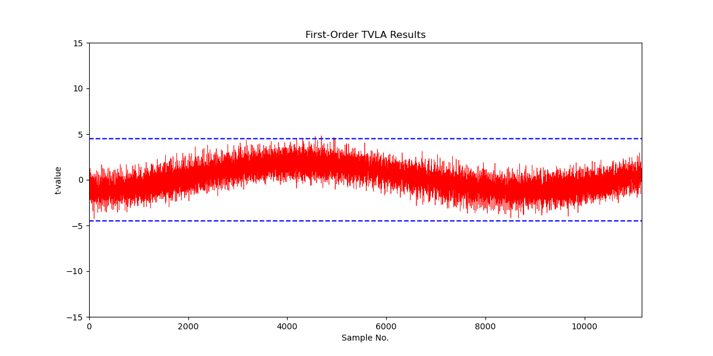
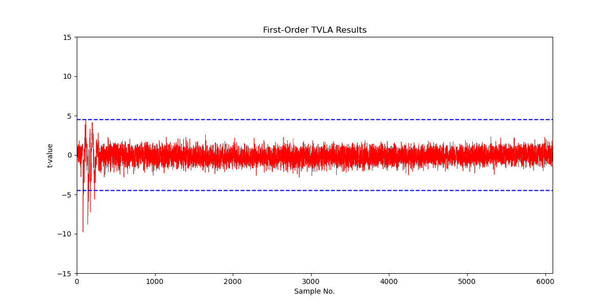
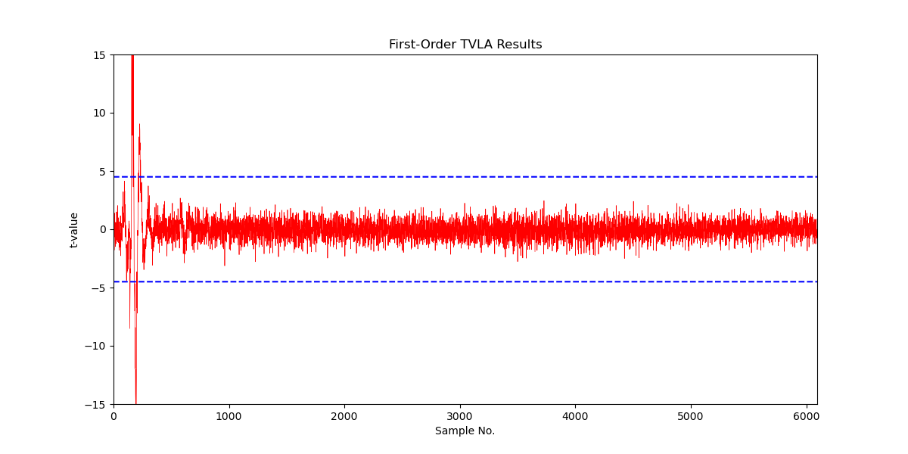
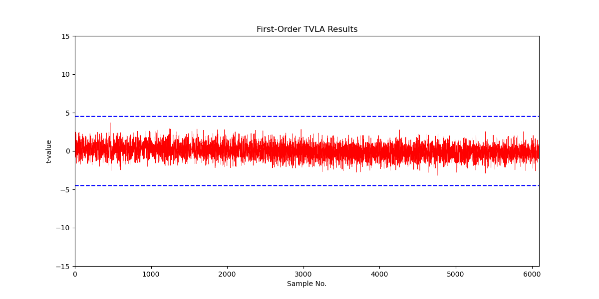
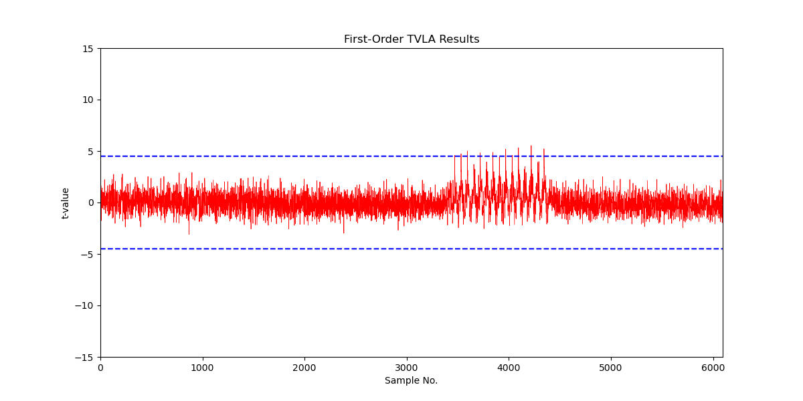
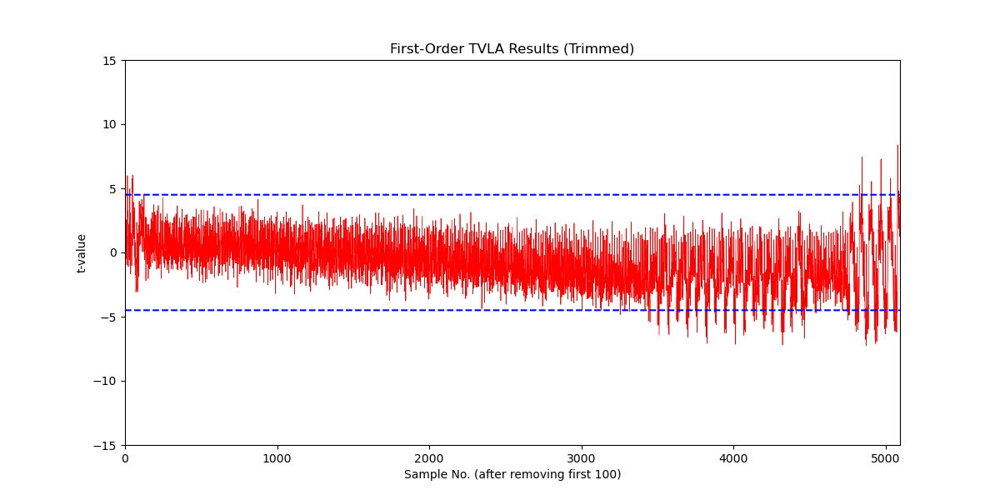

Side-Channel Countermeasures for Adam’s Bridge Accelerator

Version 1.0

**Note:** This document will be updated soon and will include the countermeasure implementation details.

See NIST FIPS 204 document for the pseudo codes and symbols. 

# Threat Model for Securing Adams Bridge Against Side-Channel Attacks

## Introduction

In this threat model, the document outlines the potential vulnerabilities and the measures taken to secure the hardware implementation of the Crystal Dilithium post-quantum cryptographic algorithm against side-channel attacks. The document distinguishes between profiled and non-profiled attacks, identify the private and secret key values, and separate timing side-channel attacks from other physical attacks such as power, EM, and acoustic attacks. This model specifically addresses the operations involved in key generation and signature generation, excluding the verification routine which does not involve secret data processing.

## Attack Vectors

### Profiled Attacks

**Definition**: Attacks where the adversary has prior knowledge or can build a profile of the target device’s behavior under various conditions. This attack has two phases: profiling and attacking. First, the attacker has physical access to the identical device and can configure it with known keys to capture side-channel traces. Therefore, the adversary can capture multiple measurements to create templates corresponding to known keys or intermediate values. 

Second, it is assumed that the adversary has sufficient knowledge about the details of the target implementation, i.e., the adversary downloads and inspects the publicly available RTL. The adversary captures one or multiple similar traces that are obtained from the device while it is executing the same inputs. The captured trace(s) go through a matching process where they are compared with pre-constructed templates, returning the label of the closest template.

**Targets**: Extraction of secret keys or private values by comparing the observed behavior with pre-constructed profiles.

### Non-Profiled Attacks

**Definition**: Attacks where the adversary does not have prior knowledge or profiles and relies solely on observed behavior during cryptographic operations. The example is Correlation Power Analysis (CPA). The attacker collects many side-channel traces during the execution of cryptographic operations. These traces are then statistically analyzed to find correlations between the side-channel measurement and hypothesized intermediate values, allowing the attacker to deduce the secret keys or private values. These attacks ideally work when the targeted device is configured with only a fixed secret key, with only one series of non-adaptive observations on operations using that single key.

Targets: Direct extraction of private or secret values from real-time observations without prior profiling. This strategy can be particularly effective against operations with data-dependent power consumption or electromagnetic emissions.

**Note**: *Non-profiled attacks are considered more powerful than profiled attacks since they can eliminate the effect of noise. The success rate is a matter of the number of collected traces rather than solely relying on platform conditions, and therefore their countermeasures are more limited and expensive*

**Note**: *This threat model covers the side-channel attack vectors for the deterministic version of Crystal Dilithium post-quantum cryptographic algorithm. Since the deterministic version covers all profiled and non-profiled attack vectors of hedged, this threat model covers superset of the hedged version of Crystal Dilithium post-quantum cryptographic algorithm. For simplicity, this document illustrates the main difference between hedged and deterministic version of the algorithm as given by: the hedged version generates Ro prime with a fresh randomness for each signature. As a result, the private intermediate values derived from this randomness are not considered for non-profiled attack.*

## Private and Secret Values

### Secret Keys

All secret keys are considered private and must be protected from both profiled and non-profiled attacks.

### Private Values

Private values include intermediate variables that can provide information about the secret keys if recovered. Although private values are not always secret, their recovery can reveal significant information about the secret keys.

## Threat Coverage

### Physical Side-Channel Attacks

**Types Covered:** Power analysis, electromagnetic (EM) analysis, and acoustic analysis.

**Scope:** All operations involved in key generation and signature generation.

**Countermeasures:** Combined masking and shuffling techniques to obscure power and EM signatures, and careful design to mitigate acoustic leakage.

### Timing Side-Channel Attacks

**Scope**: All operations in key generation and signature generation.

**Objective**: Ensure no variation in timing of any externally visible events that could reveal private values.

**Approach**: Implement constant-time execution for operations involving private values, while allowing non-constant time execution for other operations that do not involve private values.

## Key Generation

### Timing Side-Channel Attack Mitigation

The key generation implementation does not have any operations whose execution time varies based on private values. Ensures that no information about private values is leaked through timing variations.

### Physical Side-Channel Attack Mitigation

The key generation operation does not have a non-profiled attack vector since its nature is inherently secure against CPA-style attacks. This is because non-profiled attacks require multiple traces captured while constant secret or private values are being processed. Additionally, the attacker needs to either control or observe different inputs or outputs such that the side-channel measurement can be differentiated. Although key generation can be executed multiple times to satisfy the first condition of CPA, the second condition is not satisfied because each execution works with the same inputs and generates the same output. If the attacker needs to satisfy the second condition and feed the key generation with different inputs, this condition dissatisfies the first condition of CPA since the secret changes for each different input.

## Signature Generation

### Timing Side-Channel Attack Mitigation

Signature generation involves several steps where private values are processed. To mitigate timing side-channel attacks, we focus on ensuring that the execution time of these operations does not vary based on private values. We have timing variation only in signature validity checks. Validity check mechanism’s timing side-channel analysis is given by:

#### *Validity Checks:*

**First Validity Check**: This check involves conditions based on z and r0 (see FIPS 204:Algorithm 2:21-23). These checks are performed to ensure that the time taken does not vary based on the values of z and r0. If a condition fails, the signature routine iterates again. In our case, the implementation does not return a rejected signature and does not write the rejected signature to any location accessible by firmware.

The threat model assumes that having information about the result of the first validity check reveals partial information about the boundaries of r0. Specifically, it indicates whether r0 is less than gamma2 \- beta. Although r0 is a private polynomial, knowing partial information about r0 does not reveal the secret. This is because r0 is generated through an operation involving subtraction and multiplication.

The operation consists of one secret polynomial undergoing subtraction with a polynomial that is the product of a secret and public information. This multiplication blinds the public information, making the product a private value. Consequently, r0 is a product of two private values. Even though knowing r0 would require solving an NP-hard problem to recover the secret, the execution time of the validity check only reveals partial information about r0.

**Second Validity Check:** The second validity check also involves two conditions (see FIPS 204:Algorithm 2:27). The second condition, when true, is public. The first condition involves ct0, which is a blind value due to the multiplication. However, knowing the boundaries of this product can reveal information about the private value.

To prevent leaking coefficient-wise information about ct0, our design performs a full check of ct0 before returning the validity check result, rather than returning immediately after the first rejected coefficient. This approach ensures that the attacker cannot gain detailed coefficient-wise information about ct0. Instead, the attacker only knows that at least one coefficient of ct0 is less than gamma2.

By performing a full check, the design prevents timing variations that could reveal partial information about the private value ct0. The attacker is forced to solve the algebraic equation involving ct0 with the limited information that at least one coefficient is less than gamma2, making it significantly harder to extract useful private information.

### Physical Side-Channel Attack Mitigation

The threat model assumes that signature generation is vulnerable to non-profiled attack vectors. This is because an attacker can sign multiple different messages with a constant secret, allowing them to perform side-channel analysis. Therefore, the document focuses on the operations where a known message (c) or a known matrix (A) interacts directly and purely with secret or private values:

Identified Vulnerable Operations:

Point-wise Multiplication: Operations involving cs1, cs2, ct0, and Ay.

To mitigate these vulnerabilities, the following strategies are employed:

* Masking Countermeasures: Applied specifically to Point-wise Multiplication (PWM) operations. These countermeasures ensure that the output values are blinded, as the public value c is multiplied with secrets such as t0, s1, and s2. In addition to the point-wise multiplication, the first stage of inverse-NTT is also masked. 
* Special Case for A and y Multiplication: Although A is publicly known, the attacker cannot update A without updating the secret keys. Consequently, the multiplication of A with y is not subject to CPAs if A remains constant for given secret key. Therefore, Version 1.0 does not employ masking countermeasures for the A·y operation. However, this operation will be masked in future versions.
* Shuffling Techniques: Employed for other operations that are required before or after PWM multiplication, including NTT, pointwise addition, and subtraction. Shuffling helps to randomize the order of these operations, further obscuring any potential side-channel leakage. Additionally, the norm check operation is also protected using shuffling, as it can reveal information about the rejection process during signature generation. By randomizing the coefficient order, shuffling mitigates the risk of identifying which specific coefficient causes the signature rejection.

**Note**: Masking and shuffling require randomness entropy, which is obtained using PRNGs assumed to be anti-tampered.

### Operations Protected with Masking

Point-wise multiplication and the first state of inverse NTT.

### Operations Protected with Hiding

NTT, point-wise addition and point-wise subtraction.

# Attack Vectors

| Attack Type | Definition & Assumptions | Targets | Countermeasures |
| :---- | :---- | :---- | :---- |
| Profiled Attacks | Adversary has prior knowledge or can build a profile of the target device’s behavior. The attack has profiling and attacking phases. | Extraction of secret keys or private values by comparing observed behavior with pre-constructed profiles. | Masking and hiding techniques. |
| Non-Profiled Attacks | Adversary relies solely on observed behavior during cryptographic operations (e.g., CPA). | Direct extraction of private or secret values from real-time observations without prior profiling. | Masking countermeasures; use of PRGNs for randomness entropy. |

# Private and Secret Values

| Value Type | Description | Protection Requirements |
| :---- | :---- | :---- |
| Secret Keys | All secret keys are considered private and must be protected from non-profiled attacks. | Must be protected from any form of leakage; ensure no direct correlation with physical measurements. |
| Private Values | Intermediate variables that can reveal significant information about secret keys if recovered. | Protect against non-profiled attacks; apply masking and shuffling. |

# Threat Coverage

| Attack Type | Scope | Countermeasures |
| :---- | :---- | :---- |
| Physical Side-Channel Attacks | Power analysis, electromagnetic (EM) analysis, and acoustic analysis for all key generation and signature generation operations. | Combined masking and shuffling techniques; careful design to mitigate acoustic leakage. |
| Timing Side-Channel Attacks | All operations in key generation and signature generation. | Constant-time execution for operations involving private values; ensure no timing variations. |

## Empirical Validation

Version 1.0 presents TVLA results only for the case where the shuffling countermeasure is enabled. The results show that the shuffling countermeasure reduces the t-score by 100x compared to the unprotected design. However, leakage is still observed after 55K captured traces.

### Experiment Setup:
- **Target Physical Device**: CW310 Bergen Board with Kintex K410T FPGA, executing the hardware design for side-channel evaluation. The FPGA board has a designated SMA port that provides the power drop across a shunt resistor.
- **Oscilloscope**: PicoScope 6428E-D, capable of capturing up to 10 GS/s.
- **FPGA Operating Frequency**: 10 MHz.
- **Oscilloscope Sampling Frequency**: 156 MHz.

<!-- **Figure 1**: NTT and Point-wise multiplication TVLA results for 54,000 traces, showing leakage after 55,000 traces.

Although Version 1.0 includes masking countermeasures, this report does not present TVLA results for masking countermeasures. These results will be provided in future releases. -->

# Side‑Channel Analysis (SCA) — TVLA Results for ML‑KEM & ML‑DSA

---

## Experiment Setup
- **Target Physical Device:** CW310 Bergen Board with Kintex K410T FPGA implementing the DUT for side‑channel evaluation. The FPGA’s designated SMA port exposes the voltage drop across the on‑board shunt resistor.  
- **Oscilloscope:** PicoScope 6428E‑D (up to 10 GS/s).  
- **FPGA Operating Frequency:** 10 MHz.  
- **Oscilloscope Sampling Frequency:** 156 MHz.  
- **Statistical Test:** Fixed‑vs‑Random (TVLA) first‑order Welch’s t‑test. Conventional screening threshold \|t\| ≥ 4.5; borderline excursions are examined contextually.

> **Legacy Baseline (v1.0)**  
> Although v1.0 included masking countermeasures, TVLA for masking was not reported at that time. The legacy baseline below covered **NTT + point‑wise multiplication** with shuffling.  
> **Figure 1.** NTT & PWM TVLA results for 54,000 traces (leakage observed after ~55,000 traces).  
> 

## Input Set Selection
- **NTT top Module:**  
  - Operates on **4 coefficients at a time**.  
  - For the **fixed set**, we selected **4 fixed coefficients** for operand A and **4 fixed coefficients** for operand B for the point‑wise multiplication (PWM). For the **random set**, each trace uses **4 random coefficients** for operand A and the **same 4 fixed coefficients** for operand B.
  - For INTT (Inverse Transform), the **fixed set** has **4 fixed coefficients**, and the rest are zero. For the **random set**, **4 coefficients** are random, and the rest are zero.  

## Summary of New Results (v1.1)

| Algorithm | Configuration | Component / Phase | Traces to First Leakage | Max Traces Analyzed | Outcome |
|---|---|---|---:|---:|---|
| **ML‑KEM** | **Masking OFF, Shuffling OFF** (PRNG disabled) | **PWM** | **~21K** | 100K | Leakage observed starting ~21K |
| **ML‑DSA** | **Masking OFF, Shuffling OFF** (PRNG disabled) | **PWM** | **~5K** | 100K | Leakage observed starting ~5K |
| **ML‑KEM** | **Masking ON, Shuffling ON** | **Full flow segments covered** | **None up to 1M** | 1M | **Pass** |
| **ML‑DSA** | **Masking ON, Shuffling ON** | **Full flow segments covered** | **None up to 1M** | 1M | **Pass**; minor excursions (4.5 < \|t\| < 5.5) from ~275K |
| **ML‑KEM** | **Masking ON, Shuffling ON** | **INTT** | **Pass up to 1M** | 1M | **Pass**; apparent “leak” after X sample = unmasked 2nd layer |
| **ML‑DSA** | **Masking ON, Shuffling ON** | **INTT** | **Pass up to 1M** | 1M | **Pass**; apparent “leak” after X sample = unmasked 2nd layer |

---

## Detailed Results & Figures

### Unmasked & Unshuffled (PRNG OFF)

**ML‑KEM — Point‑Wise Multiplication (PWM)**  
- Leakage starts at ~21K traces.  
- TVLA plotted up to 100K traces.  
- **Figure 2:** 

**ML‑DSA — Point‑Wise Multiplication (PWM)**  
- Leakage starts at ~5K traces.  
- TVLA plotted up to 100K traces.  
- **Figure 3:** 

---

### Masking & Shuffling ON (1,000,000 traces)

**ML‑KEM**  
- No first‑order leakage up to 1M traces.  
- **Figure 4:** 

**ML‑DSA**  
- No first‑order leakage up to 1M traces.  
- Minor excursions (4.5 < \|t\| < 5.5) from ~275K but bounded.  
- The minor excutsions are observed in memory write of an PWM. Since the shuffling is enabled, the excursions present for the first 63 cycles of memory write and not for masked operations. 
- **Figure 5:** 

---

### INTT TVLA (Masking & Shuffling ON)

- **ML‑KEM INTT:** Pass up to 1M traces.  
- **ML‑DSA INTT:** Pass up to 1M traces.  
- Apparent “leak” after X sample = unmasked 2nd layer (shuffling only).  

**Figure 6:** 
<!-- **Figure 7:** `./images/mlkem_intt_tvla_1m.png` -->

---

## Interpretation & Risk Posture
- Unprotected PWM leaks early (ML‑DSA ~5K, ML‑KEM ~21K).  
- Masked + Shuffled builds withstand 1M traces (first order).  
- ML‑DSA excursions remain bounded and acceptable.  
- INTT nuance: late “leak” is expected for unmasked 2nd layer.  

---

## Change Log
- **v1.1 (2025‑08‑19):** Added ML‑KEM/ML‑DSA PWM (PRNG OFF), masked+shuffled results (1M), INTT TVLA, and ML‑DSA excursion note.  
- **v1.0:** Reported NTT + PWM with shuffling only.  

---

## Figures Quick Reference
- Figure 1: 
- Figure 2:   
- Figure 3:   
- Figure 4:   
- Figure 5:   
- Figure 6: 
<!-- - Figure 7: `./images/mlkem_intt_tvla_1m.png`   -->

## Formal Validation
Unlike other SCA countermeasures, masking is a provable countermeasure. It can be formally verified using an accepted simulation and probing model. Boolean domain-oriented masking (DOM) AND gates or arithmetic DOM multiplier gadgets are constructed as building blocks for implementing masking countermeasures. 

DOM serves as a lower bound for any ISW-based multiplication gadget, although it does not provide composability guarantees. Consequently, our implementation is not formally proven to be secure under the robust probing model.
