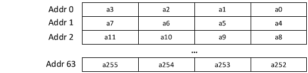
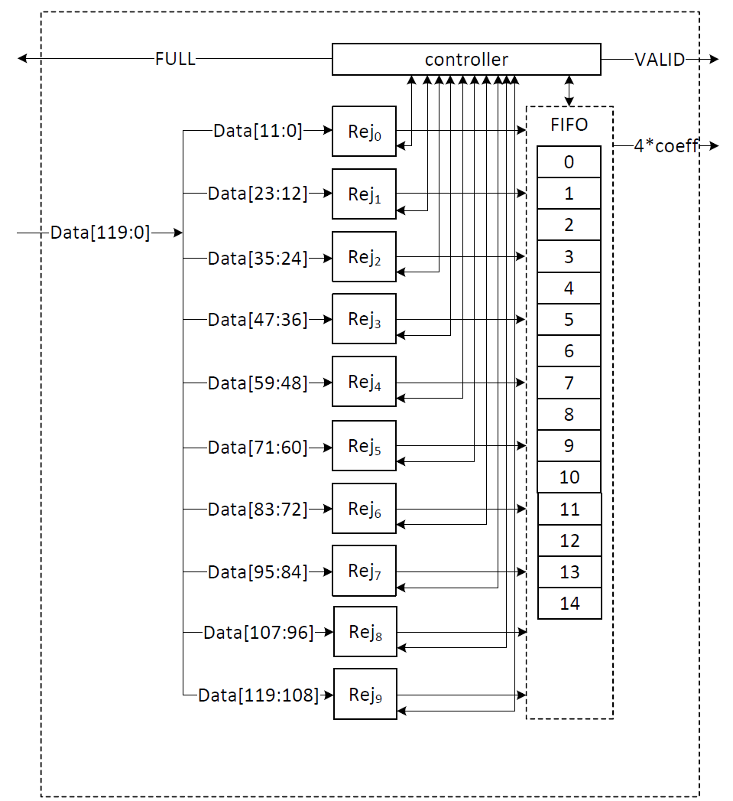
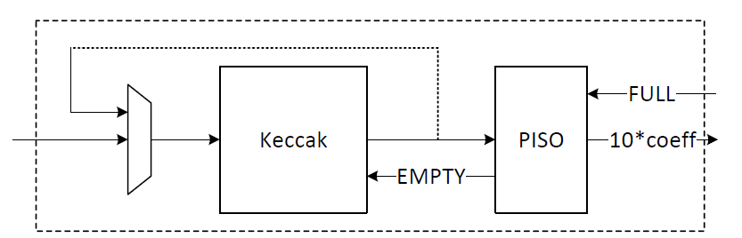
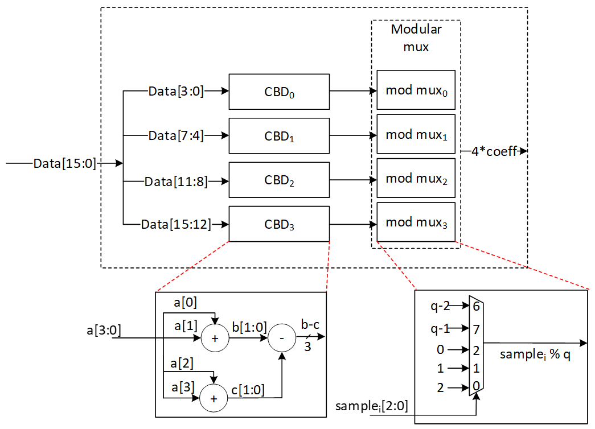

<p style="text-align: center;">Adam's Bridge ML-KEM Hardware Specification</p>

<p style="text-align: center;">Version 1.0</p>

<div style="page-break-after: always"></div>

# ML-KEM Overview

ML-KEM (Module-Lattice-Based Key-Encapsulation Mechanism) is a quantum-resistant Key exchange scheme defined in FIPS 203 \[1\].

# High-Level Overview

Adam’s Bridge MK-KEM accelerator has all the necessary components to execute a pure hardware PQC operation. The main operations that involve more computational complexity, such as NTT, hashing, and sampling units, are explained as follows.

 

The security level of ML-KEM defined by NIST are as follows:

| Algorithm Name  | Security Level |
| :-------------- | :------------- |
| ML-KEM-512      | Level-1        |
| ML-KEM-768      | Level-3        |
| **ML-KEM-1024** | **Level-5**    |

CNSA 2.0 only allows the highest security level (Level-5) for PQC which is ML-KEM-1024, and **Adams Bridge only supports ML-KEM-1024 parameter set.**

# API

The ML-KEM-1024 architecture inputs and outputs are described in the following table.


| Name                        | Input/Output    | Operation       | Size (Byte)   |
| --------------------------- | --------------- | --------------- | ------------- |
| name                        | Output          | All             | 8             |
| version                     | Output          | All             | 8             |
| ctrl                        | Input           | All             | 4             |
| status                      | Output          | All             | 4             |
| entropy (SCA)               | Input           | All             | 64            |
| seed_d                      | Input           | Keygen          | 32            |
| seed_z                      | Input           | Keygen          | 32            |
| message                     | Input           | Encaps          | 32            |
| shared_key                  | Output          | Encaps/Decaps   | 32            |
| decaps_key                  | Input/Output    | Keygen/Decaps   | 3168          |
| encaps_key                  | Input/Output    | Keygen/Decaps   | 1568          |
| ciphertext                  | Input/Output    | Encaps/Decaps   | 1568          |
| Interrupt                   | Output          | All             | 520           |
| --------------------------- | --------------- | --------------- | ------------- |
| Total                       |                 |                 | 7040          |

## name

​Read-only register consists of the name of component. 

## version 

​Read-only register consists of the version of component. 

## CTRL 

​The control register consists of the following flags: 

| Bits     | Identifier | Access | Reset | Decoded | Name |
| :------- | :--------- | :----- | :---- | :------ | :--- |
| \[31:4\] | \-         | \-     | \-    |         | \-   |
| \[3\]    | ZEROIZE    | w      | 0x0   |         | \-   |
| \[2:0\]  | CTRL       | w      | 0x0   |         | \-   |

### ​CTRL 

CTRL command field contains two bits indicating:

* ​Ctrl \= 0b000 

​No Operation. 

* ​Ctrl \= 0b001 

​Trigs the core to start the initialization and perform keygen operation. 

* ​Ctrl \= 0b010 

​Trigs the core to start the Encapsulation operation.

* ​Ctrl \= 0b011 

​Trigs the core to start Decapsulation operation.

* Ctrl \= 0b100 

​Trigs the core to start the keygen+Decapsulation operation for a ciphertext block.  This mode decreases storage costs for the decaps_key (dk) by recalling keygen and using an on-the-fly decaps_key during the decapsultion process.

### ZEROIZE

Zeroize all internal registers: Zeroize all internal registers after process to avoid SCA leakage.  
Software write generates only a single-cycle pulse on the hardware interface and then will be erased.

## status 

​The read-only status register consists of the following flags: 

| Bits     | Identifier     | Access | Reset | Decoded | Name |
| :------- | :------------- | :----- | :---- | :------ | :--- |
| \[31:2\] | \-             | \-     | \-    |         | \-   |
| \[1\]    | VALID          | r      | 0x0   |         | \-   |
| \[0\]    | READY          | r      | 0x0   |         | \-   |

### READY 

​Indicates if the core is ready to process the inputs. 

### ​VALID 

​Indicates if the process is computed and the output is valid. 

## entropy

Entropy is required for SCA countermeasures to randomize the inputs with no change in the outputs. The entropy can be any 512-bit value in \[0 : 2^512-1\]. 

The ML-KEM-1024 countermeasure requires several random vectors to randomize the intermediate values. An internal mechanism is considered to take one random vector of 512-bit (i.e., entropy register) and generate the required random vectors for different countermeasures.

## seed_d

Adams Bridge component seed_d register type definition 8 32-bit registers storing the 256-bit seed_d for keygen. The seed can be any 256-bit value in \[0 : 2^256-1\].

## seed_z

Adams Bridge component seed_z register type definition 8 32-bit registers storing the 256-bit seed_z for keygen. The seed can be any 256-bit value in \[0 : 2^256-1\].

## message

Adams Bridge component message register type definition 8 32-bit registers storing the 256-bit message for encapsulation. The message can be any 256-bit value in \[0 : 2^256-1\].

## shared_key

This register stores the shared_key for generated by encapsulation or decapsulation operations.

## decaps_key

This register stores the decapsulation key generated in keygen. This register should be set before decapsulation operation.

If seed_d or seed_z comes from key vault, this register will not contain the decaps_key to avoid exposing secret assets to software.

## encaps_key

This register stores the encapsulation key generated in keygen. This register should be set before encapsulation operation.

## ciphertext

This register stores the ciphertext generated in encapsulation operation. This register should be set before decapsulation operation.

# ​Pseudocode 

## ​Keygen 

```cpp
Input:
    seed_d
    seed_z  
    entropy

Output:
    encaps_key
    decaps_key

// Wait for the core to be ready (STATUS flag should be 2'b01 or 2'b11)
read_data = 0
while read_data == 0:
    read_data = read(ADDR_STATUS)

// Feed the required inputs
write(ADDR_SEED_D, seed_d)
write(ADDR_SEED_Z, seed_z)
write(ADDR_ENTROPY, entropy)

// Trigger the core for performing Keygen
write(ADDR_CTRL, KEYGEN_CMD)  // (STATUS flag will be changed to 2'b00)

// Wait for the core to be ready and valid (STATUS flag should be 2'b11)
read_data = 0
while read_data == 0:
    read_data = read(ADDR_STATUS)

// Reading the outputs
encaps_key = read(ADDR_EK)
decaps_key = read(ADDR_DK)

// Return the outputs
return encaps_key, decaps_key
```
​ 
## Encapsulation

```cpp
​Input:
    msg            
    encaps_key               
    entropy        

Output:
    shared_key
    ciphertext

// Wait for the core to be ready (STATUS flag should be 2'b01 or 2'b11)
read_data = 0;
while (read_data == 0) {
    read_data = read(ADDR_STATUS);
}

// Feed the required inputs
write(ADDR_MSG, msg);
write(ADDR_EK, encaps_key);
write(ADDR_ENTROPY, entropy);

// Trigger the core for performing Encapsulation
write(ADDR_CTRL, ENCAPS_CMD);  // (STATUS flag will be changed to 2'b00)

// Wait for the core to be ready and valid (STATUS flag should be 2'b11)
read_data = 0;
while (read_data == 0) {
    read_data = read(ADDR_STATUS);
}

// Reading the outputs
shared_key = read(ADDR_SHAREDKEY);
ciphertext = read(ADDR_CIPHERTEXT);

// Return the output
return shared_key, ciphertext;
```

## Decapsulation

```cpp
Input:
    decaps_key
    ciphertext  
    entropy       

Output:
    shared_key

// Wait for the core to be ready (STATUS flag should be 2'b01 or 2'b11)
read_data = 0;
while (read_data == 0) {
    read_data = read(ADDR_STATUS);
}

// Feed the required inputs
write(ADDR_DK, decaps_key);
write(ADDR_CIPHERTEXT, ciphertext);
write(ADDR_ENTROPY, entropy);

// Trigger the core for performing decapsulation
write(ADDR_CTRL, DECAPS_CMD);  // (STATUS flag will be changed to 2'b00)

// Wait for the core to be ready and valid (STATUS flag should be 2'b11)
read_data = 0;
while (read_data == 0) {
    read_data = read(ADDR_STATUS);
}

// Reading the output
shared_key = read(ADDR_SHAREDKEY);

// Return the output
return shared_key;
```

## Keygen \+ Decapsulation

This mode decreases storage costs for the decaps_key (DK) by recalling keygen and using an on-the-fly decaps_key during the decapsulaiton process.

```cpp
Input:
    seed_d
    seed_z  
    ciphertext  
    entropy  

Output:
    shared_key

// Wait for the core to be ready (STATUS flag should be 2'b01 or 2'b11)
read_data = 0
while read_data == 0:
    read_data = read(ADDR_STATUS)

// Feed the required inputs
write(ADDR_SEED_D, seed_d)
write(ADDR_SEED_Z, seed_z)
write(ADDR_CIPHERTEXT, ciphertext);
write(ADDR_ENTROPY, entropy)

// Trigger the core for performing Keygen + Decapsulation
write(ADDR_CTRL, KEYGEN_DECAPS_CMD)  // (STATUS flag will be changed to 2'b00)

// Wait for the core to be ready and valid (STATUS flag should be 2'b11)
read_data = 0
while read_data == 0:
    read_data = read(ADDR_STATUS)

// Reading the output
shared_key = read(ADDR_SHAREDKEY);

// Return the outputs
return shared_key;
```
​ 
# Performance and Area Results

## ML-KEM-1024
TBD

# NTT/INTT

Number Theoretic Transform (NTT) and inverse Number Theoretic Transform (INTT) are used to achieve more efficient polynomial multiplication in lattice-based cryptosystems by reducing time-complexity from O(n2) to O(n log n).

NTT/INTT computation is made up of many butterfly operations. A butterfly operation is a mathematical operation that merges two coefficients to produce two outputs to help with NTT and INTT calculation. The NTT engine consists of 2 stages of 2 butterfly units connected serially which results in a 2x2 architecture. This is a pipelined architecture where every clock cycle, each butterfly unit receives two input coefficients and produces two output coefficients.

As a result of this pipelined 2x2 architecture, even number of stages are executed to complete a single NTT/INTT operation. However, in ML-KEM definition of NTT/INTT, (log n)-1 layers of NTT operation must be performed, where n is the number of coefficients in the polynomial. For n \= 256, 7 layers of computation must be done to complete one NTT/INTT operation.

This mismatch between the required odd number of layers in ML-KEM and the fixed even-layered execution of a conventional pipelined NTT/INTT engine creates a fundamental challenge. ML-KEM employs an even/odd coefficient separation technique, where each butterfly operation processes pairs of coefficients that are either both even-indexed or both odd-indexed in the polynomial. This structure disrupts the standard sequential memory access pattern used in conventional NTT architectures, as coefficients that should be processed together are no longer contiguous in memory. As a result, direct reuse of a standard 2x2 NTT pipeline leads to inefficient memory access, increased data shuffling, and potential performance bottlenecks. Addressing this requires modifications to the memory access strategy and data flow to ensure that the ML-KEM NTT can be efficiently computed without excessive latency or resource overhead.

We propose an efficient method to achieve the incomplete NTT/INTT computation without any area, memory or latency overhead and without compromising the arithmetic correctness of the algorithm.

1. **NTT memory access resolution for ML-KEM**

In ML-KEM, for n=256 coefficients, (log n)-1 layers of NTT/INTT operations must be performed, where even and odd coefficients are grouped together and computed separately. The twiddle factors must be reused within even and odd computations. 

Consider the following memory layout as an example output of stage 1&2 of NTT:

| 1&2 |     |     |     |
| --- | --- | --- | --- |
|     |     |     |     |
| 0   | 64  | 128 | 192 |
| 1   | 65  | 129 | 193 |
| 2   | 66  | 130 | 194 |
| 3   | 67  | 131 | 195 |
| 4   | 68  | 132 | 196 |
| 5   | 69  | 133 | 197 |
| 6   | 70  | 134 | 198 |
| 7   | 71  | 135 | 199 |
| 8   | 72  | 136 | 200 |
| 9   | 73  | 137 | 201 |
| 10  | 74  | 138 | 202 |
| 11  | 75  | 139 | 203 |
| 12  | 76  | 140 | 204 |
| 13  | 77  | 141 | 205 |
| 14  | 78  | 142 | 206 |
| 15  | 79  | 143 | 207 |
| 16  | 80  | 144 | 208 |
| 17  | 81  | 145 | 209 |
| 18  | 82  | 146 | 210 |
| 19  | 83  | 147 | 211 |
| 20  | 84  | 148 | 212 |
| 21  | 85  | 149 | 213 |
| 22  | 86  | 150 | 214 |
| 23  | 87  | 151 | 215 |
| 24  | 88  | 152 | 216 |
| 25  | 89  | 153 | 217 |
| 26  | 90  | 154 | 218 |
| 27  | 91  | 155 | 219 |
| 28  | 92  | 156 | 220 |
| 29  | 93  | 157 | 221 |
| 30  | 94  | 158 | 222 |
| 31  | 95  | 159 | 223 |
| 32  | 96  | 160 | 224 |
| 33  | 97  | 161 | 225 |
| 34  | 98  | 162 | 226 |
| 35  | 99  | 163 | 227 |
| 36  | 100 | 164 | 228 |
| 37  | 101 | 165 | 229 |
| 38  | 102 | 166 | 230 |
| 39  | 103 | 167 | 231 |
| 40  | 104 | 168 | 232 |
| 41  | 105 | 169 | 233 |
| 42  | 106 | 170 | 234 |
| 43  | 107 | 171 | 235 |
| 44  | 108 | 172 | 236 |
| 45  | 109 | 173 | 237 |
| 46  | 110 | 174 | 238 |
| 47  | 111 | 175 | 239 |
| 48  | 112 | 176 | 240 |
| 49  | 113 | 177 | 241 |
| 50  | 114 | 178 | 242 |
| 51  | 115 | 179 | 243 |
| 52  | 116 | 180 | 244 |
| 53  | 117 | 181 | 245 |
| 54  | 118 | 182 | 246 |
| 55  | 119 | 183 | 247 |
| 56  | 120 | 184 | 248 |
| 57  | 121 | 185 | 249 |
| 58  | 122 | 186 | 250 |
| 59  | 123 | 187 | 251 |
| 60  | 124 | 188 | 252 |
| 61  | 125 | 189 | 253 |
| 62  | 126 | 190 | 254 |
| 63  | 127 | 191 | 255 |

The following coefficient groups are executed by the 2x2 butterfly architecture:

Cycle 0 – {0, 64, 128, 192}

Cycle 1 – {1, 65, 129, 193}

Cycle 2 – {2, 66, 130, 194}

Cycle 3 – {3, 67, 131, 195}, etc

Every cycle, the coefficients toggle between even and odd. By managing twiddle factor input such that the same value is held for the next clock cycle, the NTT can perform one even followed by one odd operation before moving onto the next set of coefficients.

Following memory layout shows output of stage 3&4:

| 3&4 |     |     |     |
| --- | --- | --- | --- |
|     |     |     |     |
| 0   | 16  | 32  | 48  |
| 64  | 80  | 96  | 112 |
| 128 | 144 | 160 | 176 |
| 192 | 208 | 224 | 240 |
| 1   | 17  | 33  | 49  |
| 65  | 81  | 97  | 113 |
| 129 | 145 | 161 | 177 |
| 193 | 209 | 225 | 241 |
| 2   | 18  | 34  | 50  |
| 66  | 82  | 98  | 114 |
| 130 | 146 | 162 | 178 |
| 194 | 210 | 226 | 242 |
| 3   | 19  | 35  | 51  |
| 67  | 83  | 99  | 115 |
| 131 | 147 | 163 | 179 |
| 195 | 211 | 227 | 243 |
| 4   | 20  | 36  | 52  |
| 68  | 84  | 100 | 116 |
| 132 | 148 | 164 | 180 |
| 196 | 212 | 228 | 244 |
| 5   | 21  | 37  | 53  |
| 69  | 85  | 101 | 117 |
| 133 | 149 | 165 | 181 |
| 197 | 213 | 229 | 245 |
| 6   | 22  | 38  | 54  |
| 70  | 86  | 102 | 118 |
| 134 | 150 | 166 | 182 |
| 198 | 214 | 230 | 246 |
| 7   | 23  | 39  | 55  |
| 71  | 87  | 103 | 119 |
| 135 | 151 | 167 | 183 |
| 199 | 215 | 231 | 247 |
| 8   | 24  | 40  | 56  |
| 72  | 88  | 104 | 120 |
| 136 | 152 | 168 | 184 |
| 200 | 216 | 232 | 248 |
| 9   | 25  | 41  | 57  |
| 73  | 89  | 105 | 121 |
| 137 | 153 | 169 | 185 |
| 201 | 217 | 233 | 249 |
| 10  | 26  | 42  | 58  |
| 74  | 90  | 106 | 122 |
| 138 | 154 | 170 | 186 |
| 202 | 218 | 234 | 250 |
| 11  | 27  | 43  | 59  |
| 75  | 91  | 107 | 123 |
| 139 | 155 | 171 | 187 |
| 203 | 219 | 235 | 251 |
| 12  | 28  | 44  | 60  |
| 76  | 92  | 108 | 124 |
| 140 | 156 | 172 | 188 |
| 204 | 220 | 236 | 252 |
| 13  | 29  | 45  | 61  |
| 77  | 93  | 109 | 125 |
| 141 | 157 | 173 | 189 |
| 205 | 221 | 237 | 253 |
| 14  | 30  | 46  | 62  |
| 78  | 94  | 110 | 126 |
| 142 | 158 | 174 | 190 |
| 206 | 222 | 238 | 254 |
| 15  | 31  | 47  | 63  |
| 79  | 95  | 111 | 127 |
| 143 | 159 | 175 | 191 |
| 207 | 223 | 239 | 255 |

As shown, in merged stages 3&4, even operations occur for 4 consecutive cycles and followed by 4 odd operations for next 4 consecutive cycles. This behavior continues for entire polynomial. By repeating the twiddle factor input between every 4 cycles, the entire polynomial can be processed efficiently by the NTT engine.

In stage 5&6, the memory output is as follows:

| 5&6 |     |     |     |
| --- | --- | --- | --- |
|     |     |     |     |
| 0   | 4   | 8   | 12  |
| 16  | 20  | 24  | 28  |
| 32  | 36  | 40  | 44  |
| 48  | 52  | 56  | 60  |
| 64  | 68  | 72  | 76  |
| 80  | 84  | 88  | 92  |
| 96  | 100 | 104 | 108 |
| 112 | 116 | 120 | 124 |
| 128 | 132 | 136 | 140 |
| 144 | 148 | 152 | 156 |
| 160 | 164 | 168 | 172 |
| 176 | 180 | 184 | 188 |
| 192 | 196 | 200 | 204 |
| 208 | 212 | 216 | 220 |
| 224 | 228 | 232 | 236 |
| 240 | 244 | 248 | 252 |
| 1   | 5   | 9   | 13  |
| 17  | 21  | 25  | 29  |
| 33  | 37  | 41  | 45  |
| 49  | 53  | 57  | 61  |
| 65  | 69  | 73  | 77  |
| 81  | 85  | 89  | 93  |
| 97  | 101 | 105 | 109 |
| 113 | 117 | 121 | 125 |
| 129 | 133 | 137 | 141 |
| 145 | 149 | 153 | 157 |
| 161 | 165 | 169 | 173 |
| 177 | 181 | 185 | 189 |
| 193 | 197 | 201 | 205 |
| 209 | 213 | 217 | 221 |
| 225 | 229 | 233 | 237 |
| 241 | 245 | 249 | 253 |
| 2   | 6   | 10  | 14  |
| 18  | 22  | 26  | 30  |
| 34  | 38  | 42  | 46  |
| 50  | 54  | 58  | 62  |
| 66  | 70  | 74  | 78  |
| 82  | 86  | 90  | 94  |
| 98  | 102 | 106 | 110 |
| 114 | 118 | 122 | 126 |
| 130 | 134 | 138 | 142 |
| 146 | 150 | 154 | 158 |
| 162 | 166 | 170 | 174 |
| 178 | 182 | 186 | 190 |
| 194 | 198 | 202 | 206 |
| 210 | 214 | 218 | 222 |
| 226 | 230 | 234 | 238 |
| 242 | 246 | 250 | 254 |
| 3   | 7   | 11  | 15  |
| 19  | 23  | 27  | 31  |
| 35  | 39  | 43  | 47  |
| 51  | 55  | 59  | 63  |
| 67  | 71  | 75  | 79  |
| 83  | 87  | 91  | 95  |
| 99  | 103 | 107 | 111 |
| 115 | 119 | 123 | 127 |
| 131 | 135 | 139 | 143 |
| 147 | 151 | 155 | 159 |
| 163 | 167 | 171 | 175 |
| 179 | 183 | 187 | 191 |
| 195 | 199 | 203 | 207 |
| 211 | 215 | 219 | 223 |
| 227 | 231 | 235 | 239 |
| 243 | 247 | 251 | 255 |

Here 16 even operations occur for 16 consecutive clock cycles followed by 16 odd operations, and so on. As mentioned earlier, the twiddle factors are shared between even and odd and will be repeated per even/odd chunk.

In the last round, the output of memory is as follows:

| 7&8 |     |     |     |
| --- | --- | --- | --- |
|     |     |     |     |
| 0   | 1   | 2   | 3   |
| 4   | 5   | 6   | 7   |
| 8   | 9   | 10  | 11  |
| 12  | 13  | 14  | 15  |
| 16  | 17  | 18  | 19  |
| 20  | 21  | 22  | 23  |
| 24  | 25  | 26  | 27  |
| 28  | 29  | 30  | 31  |
| 32  | 33  | 34  | 35  |
| 36  | 37  | 38  | 39  |
| 40  | 41  | 42  | 43  |
| 44  | 45  | 46  | 47  |
| 48  | 49  | 50  | 51  |
| 52  | 53  | 54  | 55  |
| 56  | 57  | 58  | 59  |
| 60  | 61  | 62  | 63  |
| 64  | 65  | 66  | 67  |
| 68  | 69  | 70  | 71  |
| 72  | 73  | 74  | 75  |
| 76  | 77  | 78  | 79  |
| 80  | 81  | 82  | 83  |
| 84  | 85  | 86  | 87  |
| 88  | 89  | 90  | 91  |
| 92  | 93  | 94  | 95  |
| 96  | 97  | 98  | 99  |
| 100 | 101 | 102 | 103 |
| 104 | 105 | 106 | 107 |
| 108 | 109 | 110 | 111 |
| 112 | 113 | 114 | 115 |
| 116 | 117 | 118 | 119 |
| 120 | 121 | 122 | 123 |
| 124 | 125 | 126 | 127 |
| 128 | 129 | 130 | 131 |
| 132 | 133 | 134 | 135 |
| 136 | 137 | 138 | 139 |
| 140 | 141 | 142 | 143 |
| 144 | 145 | 146 | 147 |
| 148 | 149 | 150 | 151 |
| 152 | 153 | 154 | 155 |
| 156 | 157 | 158 | 159 |
| 160 | 161 | 162 | 163 |
| 164 | 165 | 166 | 167 |
| 168 | 169 | 170 | 171 |
| 172 | 173 | 174 | 175 |
| 176 | 177 | 178 | 179 |
| 180 | 181 | 182 | 183 |
| 184 | 185 | 186 | 187 |
| 188 | 189 | 190 | 191 |
| 192 | 193 | 194 | 195 |
| 196 | 197 | 198 | 199 |
| 200 | 201 | 202 | 203 |
| 204 | 205 | 206 | 207 |
| 208 | 209 | 210 | 211 |
| 212 | 213 | 214 | 215 |
| 216 | 217 | 218 | 219 |
| 220 | 221 | 222 | 223 |
| 224 | 225 | 226 | 227 |
| 228 | 229 | 230 | 231 |
| 232 | 233 | 234 | 235 |
| 236 | 237 | 238 | 239 |
| 240 | 241 | 242 | 243 |
| 244 | 245 | 246 | 247 |
| 248 | 249 | 250 | 251 |
| 252 | 253 | 254 | 255 |

The challenge here is that even and odd coefficients are mixed which is not allowed in ML-KEM. In order to compute the last layer (layer 7\) with least complexity and overhead, we propose a method to swap the inputs to the butterfly cores such that even and odd pairs of coefficients are computed separately. We propose an architecture where the second stage of butterfly units do not perform any operations during this last round of ML-KEM NTT which results in correct arithmetic computation. 

To preserve correctness of memory layout, we propose a method to further swap the outputs of butterfly units such that they are regrouped to be in the same order as they were read from the memory. This allows subsequent NTT/INTT operations to have access to the correct memory contents without the need for a post-processing step thus reducing both complexity and latency, while maintaining high security.

Figure below shows the 2x2 architecture indicating data swapping and 7-layer computation in ML-KEM.


Passthrough control signal is asserted when performing the last stage 7 in ML-KEM NTT and will disable the second set of butterfly cores leading to a passthrough of inputs to outputs. Since the inputs of the second stage are swapped, the correct order of coefficients is written to memory.

2. **Memory access pattern for INTT**

The following figure shows example memory contents for an INTT operation in Dilithium:

| Address |     | 1&2 |     |     |     |
| ------- | --- | --- | --- | --- | --- |
|         |     |     |     |     |     |
| 0       |     | 0   | 1   | 2   | 3   |
| 1       |     | 4   | 5   | 6   | 7   |
| 2       |     | 8   | 9   | 10  | 11  |
| 3       |     | 12  | 13  | 14  | 15  |
| 4       |     | 16  | 17  | 18  | 19  |
| 5       |     | 20  | 21  | 22  | 23  |
| 6       |     | 24  | 25  | 26  | 27  |
| 7       |     | 28  | 29  | 30  | 31  |
| 8       |     | 32  | 33  | 34  | 35  |
| 9       |     | 36  | 37  | 38  | 39  |
| 10      |     | 40  | 41  | 42  | 43  |
| 11      |     | 44  | 45  | 46  | 47  |
| 12      |     | 48  | 49  | 50  | 51  |
| 13      |     | 52  | 53  | 54  | 55  |
| 14      |     | 56  | 57  | 58  | 59  |
| 15      |     | 60  | 61  | 62  | 63  |
| 16      |     | 64  | 65  | 66  | 67  |
| 17      |     | 68  | 69  | 70  | 71  |
| 18      |     | 72  | 73  | 74  | 75  |
| 19      |     | 76  | 77  | 78  | 79  |
| 20      |     | 80  | 81  | 82  | 83  |
| 21      |     | 84  | 85  | 86  | 87  |
| 22      |     | 88  | 89  | 90  | 91  |
| 23      |     | 92  | 93  | 94  | 95  |
| 24      |     | 96  | 97  | 98  | 99  |
| 25      |     | 100 | 101 | 102 | 103 |
| 26      |     | 104 | 105 | 106 | 107 |
| 27      |     | 108 | 109 | 110 | 111 |
| 28      |     | 112 | 113 | 114 | 115 |
| 29      |     | 116 | 117 | 118 | 119 |
| 30      |     | 120 | 121 | 122 | 123 |
| 31      |     | 124 | 125 | 126 | 127 |
| 32      |     | 128 | 129 | 130 | 131 |
| 33      |     | 132 | 133 | 134 | 135 |
| 34      |     | 136 | 137 | 138 | 139 |
| 35      |     | 140 | 141 | 142 | 143 |
| 36      |     | 144 | 145 | 146 | 147 |
| 37      |     | 148 | 149 | 150 | 151 |
| 38      |     | 152 | 153 | 154 | 155 |
| 39      |     | 156 | 157 | 158 | 159 |
| 40      |     | 160 | 161 | 162 | 163 |
| 41      |     | 164 | 165 | 166 | 167 |
| 42      |     | 168 | 169 | 170 | 171 |
| 43      |     | 172 | 173 | 174 | 175 |
| 44      |     | 176 | 177 | 178 | 179 |
| 45      |     | 180 | 181 | 182 | 183 |
| 46      |     | 184 | 185 | 186 | 187 |
| 47      |     | 188 | 189 | 190 | 191 |
| 48      |     | 192 | 193 | 194 | 195 |
| 49      |     | 196 | 197 | 198 | 199 |
| 50      |     | 200 | 201 | 202 | 203 |
| 51      |     | 204 | 205 | 206 | 207 |
| 52      |     | 208 | 209 | 210 | 211 |
| 53      |     | 212 | 213 | 214 | 215 |
| 54      |     | 216 | 217 | 218 | 219 |
| 55      |     | 220 | 221 | 222 | 223 |
| 56      |     | 224 | 225 | 226 | 227 |
| 57      |     | 228 | 229 | 230 | 231 |
| 58      |     | 232 | 233 | 234 | 235 |
| 59      |     | 236 | 237 | 238 | 239 |
| 60      |     | 240 | 241 | 242 | 243 |
| 61      |     | 244 | 245 | 246 | 247 |
| 62      |     | 248 | 249 | 250 | 251 |
| 63      |     | 252 | 253 | 254 | 255 |

In INTT, the coefficients are read and executed in order, i.e., in cycle 0, the coefficients executed are {0, 1, 2, 3}, etc. 

3. **INTT memory access resolution for ML-KEM**

In ML-KEM, since even and odd coefficients need to be grouped together, the first stage of butterfly operations is bypassed. The inputs are passed onto the second stage after swapping them, which results in correct arithmetic results in ML-KEM INTT operation. The following architecture indicates the passthrough mode for INTT:  


Remaining layers of INTT are similar to ML-KEM NTT where even and odd operations alternate for 16, 4 and 1 clock cycles and both butterfly stages are engaged. Twiddle factors are shared between even and odd operations and in the proposed method, the twiddle factors will be appropriately driven to maintain arithmetic correctness.

The final NTT/INTT architecture is shown in the following figure:


The butterfly operation is determined by a mode input that indicates whether current operation is NTT or INTT. The ntt\_passthrough flag is asserted in NTT mode during the last round of operation. The intt\_passthrough flag is asserted in INTT mode during the first round of operation. Once asserted, the appropriate butterfly stage is skipped and the inputs are swapped and directly passed onto outputs.

# Modular Reduction

Barrett reduction is an efficient method for computing z mod q without performing division. Instead, it precomputes an approximation of 1/q, allowing the reduction to be done with multiplications and shifts.

Given an integer z and a modulus q, Barrett reduction works as follows:

* Precompute the scaling factor μ=⌊2kq⌋.   
* Approximate the quotient ⌊z/q⌋ as u=⌊(z)/2k⌋  
* Compute the remainder as r=z-uq  
* Final correction step to see if r≥q then subtract q to ensure r is in the range \[0,q-1\].

For ML-KEM hardware accelerator, we can customize the reduction architecture based on the prime value of the scheme with q= 3,329 to design a hardware-friendly architecture that increases the efficiency of computation. 

Suppose that all input operands are less than q, we have:

0≤a,b\<q

z=a.b\<q2=24'hA9\_1A01

Since the input value for reduction is presented in 24 bits, k is set to 24\. In that case, we have:

μ=⌊2kq⌋\=⌊2243329⌋\=5039

The figure below illustrates the architecture of this reduction technique, which requires two multiplications, along with a shifter and subtractor.


The modular multiplication is implemented with a 2-stage pipeline architecture. At the first pipeline stage, z=a·b is calculated. At the second pipeline stage, the reduction is executed to obtain the result and the result is output.

The operations of our reduction do not depend on the input data and do not leak any information. Our reduction using the modulus q= 3329 is fast, efficient and constant-time.

# PWM

Polynomials are represented in the ring Rq=ZqX/XN+ 1, meaning they are defined over the field of integers modulo q with a degree constraint of N-1. A polynomial a(x) is expressed as a sum of monomials with integer coefficients:

ax= i=0N-1aiXi

Where ai​ are the coefficients of the polynomial, and each belongs to Zq.

NTT presentation of this polynomial is shown as a=NTT(a) such that 

ai=j=0N-1ainij mod q

and n is n\-th primitive root of unity such that nn=1 mod q.

The multiplication of two polynomials cx= axbx  can be performed efficiently in NTT domain follows modular polynomial arithmetic under the constraint XN+1=0. The product polynomial c(x) is computed as:

cx= axbx  mod XN+ 1

Expanding this multiplication:

cx=i=0N-1aibiXi 

Where  is point-wise multiplication in NTT domain.

In ML-KEM, the incomplete Number-Theoretic Transform (NTT) representation alters the conventional point-wise multiplication used in NTT-based polynomial multiplication. Unlike fully transformed polynomials, where coefficients are directly multiplied element-wise, ML-KEM requires a pair-wise multiplication scheme. 

Specifically, in ML-KEM’s NTT domain, the multiplication must be performed between paired coefficients from two input polynomials. This means that an even-indexed coefficient a2i​ and its corresponding odd-indexed coefficient a2i+1​ from the first polynomial must be combined with the even- and odd-indexed coefficients b2i​ and b2i+1 from the second polynomial according to the following formula:

c2i+c2i+1X=a2i ⋅ b2i+a2i+1b2i+12bri+1+a2ib2i+1+a2i+1b2iX        0≤i\<128

Where

c2i=a2i ⋅ b2i+a2i+1b2i+12bri+1

c2i+1=a2ib2i+1+a2i+1b2i

where  represents the twiddle factor used for proper coefficient alignment in the transformation, and br(i) denotes the bit-reversal permutation applied to the index i.

Each pair-wise multiplication in ML-KEM's NTT domain involves five multiplication operations per index pair. Since multiplication is a computationally expensive operation in hardware, reducing the number of multiplications can significantly improve efficiency and reduce resource utilization.

To optimize the implementation, we apply Karatsuba’s algorithm to reduce the number of required multiplications by leveraging algebraic decomposition. Given two operands x and y, Karatsuba multiplication decomposes them into two smaller parts:

x=x12k+x0

y=y12k+y0

directly computing the product using four multiplications can be presented as follows:

x⋅y=x12k+x0y12k+y0=x1y122k+(x1y0+x0y1)2k+x0y0

While Karatsuba reduces it to three:

x⋅y=x12k+x0y12k+y0=x1y122k+(x1+x0y1+y0-x0y0-x1y1)2k+x0y0

This technique reduces the number of multiplications from four to three at the cost of additional additions and subtractions, which are significantly less expensive in hardware.

In ML-KEM’s pair-wise multiplication formula can be optimized using Karatsuba’s method. By applying the decomposition to these terms, we can effectively replace five multiplications with a reduced set of four per pair-wise operation, minimizing the hardware cost while maintaining computational correctness.

c2i+c2i+1X=a2i ⋅ b2i+a2i+1b2i+12bri+1+a2ib2i+1+a2i+1b2iX=a2i ⋅ b2i+a2i+1b2i+12bri+1+a2i+a2i+1b2i+b2i+1-a2i ⋅ b2i-a2i+1b2i+1X      0≤i\<128

c2i=a2i ⋅ b2i+a2i+1b2i+12bri+1

c2i+1=a2i+a2i+1b2i+b2i+1-a2i ⋅ b2i-a2i+1b2i+1

This optimization significantly enhances the efficiency of the ML-KEM NTT implementation, making it more suitable for hardware acceleration while preserving the correctness of polynomial multiplication.

The hardware architecture of this proposal is shown below while all operations are modular:


The proposed Karatsuba-based optimization is well aligned with our memory architecture, which stores four polynomial coefficients per address. Our memory architecture is shown below:



This structure allows efficient loading and processing of coefficient pairs, reducing the number of memory accesses required during multiplication. Since Karatsuba’s method naturally decomposes polynomial multiplication into smaller subproblems involving coefficient pairs, it maps well onto our memory organization, enabling parallel processing of multiple coefficient pairs in a single memory fetch. 


# Rejection Sampler

Rejection sampling is integral to the KeyGen and Encapsulation processes of ML-KEM. It generates polynomials that are directly utilized in polynomial multiplications within the Number Theoretic Transform (NTT) domain. ML-KEM utilizes SHAKE-128, Keccak processes an input seed concatenated with nonce values (describing polynomial indices) to generate a pseudorandom bit stream. To optimize this process, our design focuses on Parallel-Input Serial-Output (PISO) Buffering, optimizing the rejection unit to perform efficient polynomial multiplication.

A PISO unit stores Keccak outputs, sequentially feeding data into the rejection sampler to ensure a steady input flow. The rejection sampler selectively retains 12-bit samples below the modulus q=3329, discarding values exceeding this threshold. The output is a 256-coefficient polynomial structured as:

A=A0,0  A0,k-1  ⋱  Ak-1,0  Ak-1,k-1 k×k

The value of k is determined based on the security level of the system defined by NIST as follows:

| Algorithm Name | Security Level | k   |
| :------------- | :------------- | :-- |
| ML-KEM-512     | Level-1        | 2   |
| ML-KEM-768     | Level-3        | 3   |
| ML-KEM-1024    | Level-5        | 4   |

To enhance polynomial multiplication efficiency, the sampled polynomials undergo pointwise multiplication, reducing computational overhead by eliminating unnecessary memory accesses as follows:

A0,0  A0,k-1  ⋱  Ak-1,0  Ak-1,k-1 °s1,0  s1,k-1 \=A0,0 °s1,0+…+A0,k-1°s1,k-1  Ak-1,0°s1,0+…+Ak-1,k-1°s1,k-1 

We propose an architecture to remove the cost of memory access from Keccak to rejection sampler, and from rejection sampler to polynomial multiplier using a on-the-fly technique. To achieve this, we need to have a balanced throughput between all these modules to avoid large buffering or conflict between them.

High-level architecture is illustrated as follows:


Keccak is used in SHAKE-128 configuration for rejection sampling operation. Hence, it will take the input data and generates 1344-bit output after each round. We propose implementing of Keccak while each round takes 12 cycles. The format of input data is as follows:

Input data \= ρ | j | i

Where  is seed with 256-bits, i and j are nonce that describes the row and column number of corresponding polynomial A such that:

Ai,j=Rejection\_sampling(Keccak(ρ | j | i))

Since each 12-bit is used for one coefficient, each round of Keccak output provides 1344/12=112 coefficients. There are two paths for Keccak input. While the input can be set by controller for each new polynomial, the loop path is used to rerun Keccak for completing the previous polynomial. Rejection sampler cannot take all 1344-bit output parallelly since it makes hardware architecture too costly and complex, and also there is no other input from Keccak for the next 12 cycles. Therefore, we propose a parallel-input serial-output (PISO) unit in between to store the Keccak output and feed rejection unit sequentially.

The rejection sampler takes data from the output of SHAKE-128 stored in a PISO buffer. The required cycles for this unit are variable due to the non-deterministic pattern of rejection sampling. In our optimized architecture, this unit works in parallel with the Keccak core. Therefore, the latency for rejection sampling is absorbed within the latency for a concurrently running Keccak core. 

Our proposed polynomial multiplier can perform point-wise multiplication on four coefficients per cycle that also helps to avoid memory access challenges and make the control logic too complicated. This implies that the optimal speed of the rejection sampling module is to sample four coefficients without rejection in one cycle.

On the output side, as the rejection sampling might fail, the rejection rate for each input is:

rejection\_rate= 1-q212=1-3329212=0.187

Hence, the probability of failure to provide 4 appropriate coefficients from 4 inputs would be:

1-1-rejectionrate4=1-1-0.1874=0.56

To reduce the failure probability and avoid any wait cycle in polynomial multiplication, we need more coefficients are fed into rejection while only 4 of them will be passed to polynomial multiplication. This decision reduces the probability of failure. The following equation computes failure probability of having at least 4 valid samples out of N inputs:

PX≥4=1-k=03PX=k

PX=k=N k pk1-pN-k 

The failure probability for different N as shown below:

| Number of Inputs (N) | Failure Probability |
| :------------------- | :------------------ |
| 4                    | 0.56                |
| 5                    | 0.23                |
| 6                    | 0.08                |
| 7                    | 0.02                |
| 8                    | 0.007               |
| 9                    | 0.002               |
| 10                   | 0.0005              |

To balance the hardware resource utilization while improving the performance, we chose to have 10 input samples. Adding a FIFO to rejection sampling unit can store the remaining unused coefficients and increase the probability of having 4 appropriate coefficients to match polynomial multiplication throughput. The architecture is as follows:



There are 10 rejection sampler circuits corresponding to each 12-bit input. The controller checks if each of these coefficients should be rejected or not. The valid input coefficients can be stored into the FIFO. While a maximum of 10 coefficients can be fed into FIFO, there are three more entries for the remaining coefficients from the previous cycle. There are several scenarios for the proposed balanced throughput architecture:

1) At the very first cycle, or whenever the FIFO is empty, rejection sampling unit may not provide all 4 coefficients for the polynomial multiplication unit. We reduce the failure probability of this scenario by feeding 10 coefficients, however, it may happen. So, for designing efficient architecture, instead of reducing the failure probability by adding more hardware cost, we use a VALID output that stops the polynomial multiplier until all 4 required coefficients are sampled.  
2) If all 10 inputs are valid, they are going to be stored into FIFO. The first 4 coefficients will be sent to the polynomial multiplication unit, while the remaining coefficients will be shifted to the head of FIFO and be used for the next cycle.  
3) The FIFO has a maximum depth of 14 entries. When 9 or more entries are filled, a pop operation reduces the occupancy to 5, which is still insufficient to accommodate new inputs while allowing the rejection sampling unit to continue outputting data in upcoming cycles. As a result, the FIFO asserts the FULL flag to block further input from the Keccak core.

| Cycle count | Input from PISO | FIFO valid entries from previous cycle | Total valid samples | output | FIFO remaining for the next cycle |
| :---------- | :-------------- | :------------------------------------- | :------------------ | :----- | :-------------------------------- |
| 0           | 10              | 0                                      | 10                  | 4      | 6 (FULL)                          |
| 1           | 0               | 6                                      | 6                   | 4      | 2                                 |
| 2           | 10              | 2                                      | 12                  | 4      | 8 (FULL)                          |
| 3           | 0               | 8                                      | 8                   | 4      | 4                                 |
| 4           | 10              | 4                                      | 14                  | 4      | 10 (FULL)                         |
| 5           | 0               | 10                                     | 10                  | 4      | 6                                 |
| 6           | 10              | 6                                      | 13                  | 4      | 9 (FULL)                          |

4) If there is not FULL condition for reading from Keccak, all PISO data can be read in 11 cycles. This would match with Keccak throughput that generates 112 coefficients per 12 cycles.  
5) The maximum number of FULL conditions is when there are no rejected coefficients for all 112 inputs. In this case, after every cycle with 10 coefficients, there is one FULL condition. It takes 28 cycles to process all PISO contents. To maximize the utilization factor of our hardware resources, Keccak core will check the PISO status. If PISO contains 8 coefficients or more (the required inputs for rejection sampling unit), EMPTY flag will not be set, and Keccak will wait until the next cycle. Hence, the Keccak output will be stored into PISO when all PISO contents are processed by rejection sampler.



# CBD sampler

ML-KEM ML-KEM, a lattice-based key encapsulation mechanism (KEM), relies on binomial sampling to generate small polynomials with coefficients following a centered binomial distribution (CBD). This distribution is crucial for ensuring cryptographic security while maintaining efficiency in polynomial arithmetic. In ML-KEM, the binomial parameter η varies depending on the security level, where η \= 3 for ML-KEM-512 and η \= 2 for ML-KEM-768 and ML-KEM-1024. 

ML-KEM ML-KEM relies on a specialized distribution, D(Rq), to generate polynomials with small coefficients, commonly referred to as "errors" or "noise". This distribution is parameterized by an integer η. To generate a polynomial from D(Rq), each coefficient is sampled independently from a centered binomial distribution (CBD) over . The sampling process follows the following equation, which produces polynomial coefficient arrays based on an input stream of uniformly random bytes. Let   be the Keccak output, the coefficients are computed as follows:

ei=j=0j=η-12iη+j-j=0j=η-12iη+η+j

which turns uniformly distributed samples into binomial distribution.

To have a configurable Hamming weight computation, the CBD sampler extracts 8η random bits per coefficient from a pseudorandom bit stream. Then it computes the Hamming weight difference between the first and second halves of these bits to derive the binomially distributed coefficient. A control unit dynamically adjusts the sampling logic based on the selected η value, allowing seamless reconfiguration.



Our proposed data flow ensures that 4 coefficients are computed per cycle, significantly improving throughput compared to conventional serial samplers. A parallel-input serial-output (PISO) buffer is employed to manage input bitstreams efficiently, ensuring a steady supply of random bits.


The binomial sampler operates concurrently with Keccak, reducing overall latency. By leveraging a pipelined structure, the design ensures that binomial sampling does not become a performance bottleneck for polynomial arithmetic operations. A PISO buffer stores intermediate values, reducing redundant computations and improving resource utilization. The architecture supports dynamic switching between η values based on control signals, making it adaptable for different security levels.

For η \= 2, each polynomial requires 1024 bits. Since SHAKE256 provides 1088 bits per round, a single Keccak round suffices. However, for η \= 3, each polynomial requires 1536 bits (256 × 3 × 2 \= 1536), necessitating two Keccak rounds to generate enough entropy.

The configurable design reduces hardware redundancy by allowing a single sampling unit to support multiple security levels. Generating 4 coefficients per cycle improves overall efficiency, aligning the sampler’s throughput with memory architecture, polynomial multiplication and other arithmetic operations. Parallelism and buffering mechanisms prevent stalls, ensuring that sampling latency does not impact system performance.

# Compress/Decompress 

The compression stage in ML-KEM takes full 12-bit polynomial coefficients and reduces them to a smaller representation of d bits, where d varies depending on the compression level. This design explicitly supports d values of 1, 5, 11, and 12. The value d = 12 is used to implement the byte encode and byte decode functions of the ML-KEM algorithm. This compression is a lossy operation that approximates a division by q \= 3329, mapping each coefficient in Zq to a smaller domain suitable for compact ciphertext encoding. In hardware, this typically requires multiplication by a scaling factor, followed by division and rounding operations that are expensive in terms of logic and latency.


To optimize this process, we propose a hardware-efficient compression architecture that processes four 12-bit coefficients per clock cycle. Each coefficient undergoes configurable shifts and additions to approximate the division operation. 

To accurately implement the compression formula in hardware, we adopt the following formula:

((data[11:0] << d) + q/2) / q

where data is a 12-bit coefficient and d is the target compressed bit-width. The term q2​ is added prior to division to address the rounding behavior of hardware right shifts. In hardware implementations, division is implemented using right shifts, which inherently perform truncation (i.e., rounding down). This creates a systematic bias in the compressed output. By adding q2​ before the division, we effectively round the result to the nearest integer rather than always rounding down. This adjustment is critical for maintaining the fidelity of the compression process and ensures that the mapping from Zq​ to the reduced d-bit representation is as accurate as possible, without introducing additional complexity to the hardware. The approach is both efficient and hardware-friendly, requiring only a simple addition and no costly division circuitry.

The following figure shows the compression map where d=1:


Rather than implementing a general-purpose division unit, which would significantly increase area, we leverage a dual-purpose Barrett reduction module, originally included for use in the Number-Theoretic Transform (NTT) and inverse NTT stages. This is a key novelty of our design: by reusing the Barrett logic for both modular reduction and compression scaling, we eliminate the need for redundant arithmetic units and improve overall resource utilization.

Barrett reduction is a well-established technique used in lattice-based cryptographic schemes to reduce coefficients modulo a fixed constant, such as q \= 3329, in a way that avoids full-width division. With careful parameter selection, the Barrett algorithm can be optimized to require only a single level of conditional subtraction, making it highly suitable for high-speed and low-area hardware implementations. 


In our architecture, the same logic is reused for the division required during compression, allowing efficient rounding without the overhead of full-precision arithmetic.


Following compression, decompression performs the inverse operation by expanding d-bit coefficients back to 12-bit values in Zq ​based on the following formula. 


Our architecture handles four such compressed coefficients per clock cycle using four parallel multipliers. Each compressed coefficient is scaled and shifted based on its original encoding formula to recover the approximate 12-bit representation. The decompression path supports multiple d values via a configurable datapath, enabling seamless integration into systems supporting different compression profiles for ML-KEM using the following equation. 

((data[d-1:0] * q) + (2^(d-1))) >> d

The addition of  2d-1 serves the same rounding purpose as q2​ in the compression path. Since right shifts truncate in hardware, adding  2d-1 ensures the result is rounded to the nearest integer instead of being consistently biased downward. As with compression, the technique is hardware-friendly and avoids complex division or floating-point logic, while delivering improved accuracy through a simple constant addition and shift. The proposed architecture for decompression is shown as follows:


To maximize efficiency, the decompression and compression stages share arithmetic resources wherever possible. Multipliers, shift-add networks, and routing logic are multiplexed between the two operations, enabling compact hardware without sacrificing throughput. The shared Barrett reduction module is a central feature of this architecture, serving both traditional modular reduction in the NTT/INTT flow and the scaled division in compression.

This approach not only improves area efficiency but also simplifies integration and control logic. By avoiding dedicated division circuits and leveraging existing reduction infrastructure, our architecture delivers high-performance, low-area compression and decompression tailored for the demands of post-quantum cryptography.

# High-Level architecture

In our proposed architecture, we define specific instructions for various submodules, including SHAKE256, SHAKE128, SHA3-512, SHA3-256, NTT, INTT, etc. Each instruction is associated with an opcode and operands. By customizing these instructions, we can tailor the engine's behavior to different security levels.

To execute the required instructions, a high-level controller acts as a sequencer, orchestrating a precise sequence of operations. Within the architecture, several memory blocks are accessible to submodules. However, it's the sequencer's responsibility to provide the necessary memory addresses for each operation. Additionally, the sequencer handles instruction fetching, decoding, operand retrieval, and overall data flow management.

The high-level architecture of Adams Bridge controller is illustrated as follows:


## Sequencer

High-Level controller works as a sequencer to perform a specific sequence of operations. There are several blocks of memory in the architecture that can be accessed by sub-modules. However, the sequencer would be responsible for passing the required addresses for each operation. 

As an example, an NTT operation needs to take three base addresses as follows:

NTT(initialvalue\_base\_address, intermediatevalue\_base\_address, result\_base\_address)

So, for performing a=NTT(b), the sequencer needs to be:

NTT(a\_base\_address, temp\_base\_address, b\_base\_address)

The following table lists different operations used in the high-level controller.

**Keccak and samplers Opcodes:**

| Instruction             | Description                                                                |
| :---------------------- | :------------------------------------------------------------------------- |
| RST\_Keccak             | Reset the Keccak SIPO buffer                                               |
| EN\_Keccak              | Enable the Keccak                                                          |
| LDKeccak\_MEM src, len  | Load Keccak SIPO buffer at memory address src in len \-width               |
| LDKeccak\_REG src, len  | Load Keccak SIPO buffer at register ID src in len \-width                  |
| RDKeccak\_MEM dest, len | Read Keccak PISO buffer and store it at memory address dest in len \-width |
| RDKeccak\_REG dest, len | Read Keccak PISO buffer and store it at register ID dest in len \-width    |
| REJ\_SMPL               | Start Keccak and rejection sampler (results is used by PWM)                |
| CBD\_SMPL               | Start Keccak and CBD sampler                                               |

**NTT/INTT/PWO Opcodes:**

| Instruction                | Description                                                                                                                                       |
| :------------------------- | :------------------------------------------------------------------------------------------------------------------------------------------------ |
| NTT src, temp, dest        | Perform NTT on data at memory address src and store the results at address dest                                                                   |
| INTT src, temp, dest       | Perform INTT on data at memory address src and store the results at address dest                                                                  |
| PWM src0, src1, dest       | Perform PWM on data at memory address src0 and src1 and store the results at address dest (dest \= src0\*src1)                                    |
| PWM\_SMPL src, dest        | Perform PWM on data from sampler and at memory address src and store the results at address dest (dest \= smpl\*src)                              |
| PWM\_ACCU src0, src1, dest | Perform PWM in accumulation mode on data at memory address src0 and src1 and store the results at address dest (dest \= src0\*src1+dest)          |
| PWM\_ACCU\_SMPL src, dest  | Perform PWM in accumulation mode on data from sampler and at memory address src and store the results at address dest (dest \= smpl\*src \+ dest) |
| PWA src0, src1, dest       | Perform PWA on data at memory address src0 and src1 and store the results at address dest (dest \= src0+src1)                                     |
| PWS src0, src1, dest       | Perform PWS on data at memory src0 and src1 and store the results at address dest (dest \= src0-src1)                                             |

**Other Opcodes:**

| Instruction                | Description                                                                                                    |
| :------------------------- | :------------------------------------------------------------------------------------------------------------- |
| COMPRESS src, mode, dest   | Perform compress on data at memory address src with mode configuration and store the results at address dest   |
| DECOMPRESS src, mode, dest | Perform decompress on data at memory address src with mode configuration and store the results at address dest |


# References:

[1] NIST, "FIPS 203 Module-Lattice-Based Key-Encapsulation Mechanism Standard," August 13, 2024.