{width="6.5in"
height="4.847222222222222in"}

Adam's Bridge Accelerator

Hardware Specifications

V0.1

**August 2024**

**Table of Contents:**

[1. Introduction [6](#introduction)](#introduction)

[2. High-Level Overview [6](#high-level-overview)](#high-level-overview)

[3. API [8](#api)](#api)

[3.1. name [8](#name)](#name)

[3.2. version [8](#version)](#version)

[3.3. CTRL [8](#ctrl)](#ctrl)

[3.3.1. ​CTRL [9](#ctrl-1)](#ctrl-1)

[3.3.2. zeroize [9](#zeroize)](#zeroize)

[3.4. status [9](#status)](#status)

[3.4.1. READY [10](#ready)](#ready)

[3.4.2. ​VALID [10](#valid)](#valid)

[3.5. entropy [10](#entropy)](#entropy)

[3.6. seed [10](#seed)](#seed)

[3.7. sign_rnd [10](#sign_rnd)](#sign_rnd)

[3.8. message [10](#message)](#message)

[3.9. verification result
[11](#verification-result)](#verification-result)

[3.10. sk_out [11](#sk_out)](#sk_out)

[3.11. sk_in [11](#sk_in)](#sk_in)

[3.12. pk [11](#pk)](#pk)

[3.13. signature [11](#signature)](#signature)

[4. ​Pseudocode [12](#pseudocode)](#pseudocode)

[4.1. ​Keygen [12](#keygen)](#keygen)

[4.2. ​Signing [13](#signing)](#signing)

[4.3. ​Verifying [14](#verifying)](#verifying)

[4.4. Keygen + Signing [15](#keygen-signing)](#keygen-signing)

[5. Proposed architecture
[16](#proposed-architecture)](#proposed-architecture)

[5.1. Keccak [17](#keccak)](#keccak)

[5.2. Stage 1: Keccak -- Expand Mask -- Memory
[18](#stage-1-keccak-expand-mask-memory)](#stage-1-keccak-expand-mask-memory)

[5.2.1. Keccak Unit [19](#keccak-unit)](#keccak-unit)

[5.2.2. Expand Mask [19](#expand-mask)](#expand-mask)

[5.2.3. Performance [21](#performance)](#performance)

[5.3. Stage 2: Memory-NTT-Memory
[21](#stage-2-memory-ntt-memory)](#stage-2-memory-ntt-memory)

[5.3.1. NTT Architecture [21](#ntt-architecture)](#ntt-architecture)

[5.3.2. Performance [34](#performance-1)](#performance-1)

[5.3.3. NTT shuffling countermeasure
[34](#ntt-shuffling-countermeasure)](#ntt-shuffling-countermeasure)

[5.4. Stage 3: Keccak - SampleRej~q~ -- Pointwise Mult- Memory
[39](#stage-3-keccak---samplerejq-pointwise-mult--memory)](#stage-3-keccak---samplerejq-pointwise-mult--memory)

[5.4.1. Keccak Unit [40](#keccak-unit-1)](#keccak-unit-1)

[5.4.2. Rejection Sampler [41](#rejection-sampler)](#rejection-sampler)

[5.4.3. Performance [43](#performance-2)](#performance-2)

[5.5. Stage 4: Memory -- Decompose -- Encode -- Keccak
[43](#stage-4-memory-decompose-encode-keccak)](#stage-4-memory-decompose-encode-keccak)

[5.5.1. Decompose Unit [43](#decompose-unit)](#decompose-unit)

[5.5.2. Performance [45](#performance-3)](#performance-3)

[5.6. INTT [45](#intt)](#intt)

[5.6.1. INTT shuffling countermeasure
[53](#intt-shuffling-countermeasure)](#intt-shuffling-countermeasure)

[5.7. Point-wise Multiplication
[56](#point-wise-multiplication)](#point-wise-multiplication)

[5.8. RejBounded [57](#rejbounded)](#rejbounded)

[5.9. Stage 5: SampleInBall -- Memory
[61](#stage-5-sampleinball-memory)](#stage-5-sampleinball-memory)

[5.9.1. Keccak Unit [61](#keccak-unit-2)](#keccak-unit-2)

[5.9.2. SampleInBall [62](#sampleinball)](#sampleinball)

[5.10. Decompose Architecture
[65](#decompose-architecture)](#decompose-architecture)

[5.11. MakeHint Architecture
[70](#makehint-architecture)](#makehint-architecture)

[5.11.1. Hint Sum and Hint BitPack
[72](#hint-sum-and-hint-bitpack)](#hint-sum-and-hint-bitpack)

[5.12. W1Encode [74](#w1encode)](#w1encode)

[5.13. Norm Check [77](#norm-check)](#norm-check)

[5.14. skDecode [79](#skdecode)](#skdecode)

[5.15. sigEncode_z [81](#sigencode_z)](#sigencode_z)

[5.16. PISO Buffer [83](#piso-buffer)](#piso-buffer)

[5.17. Power2Round [83](#power2round)](#power2round)

[5.18. skEncode [86](#skencode)](#skencode)

[5.19. pkDecode [87](#pkdecode)](#pkdecode)

[5.20. sigDecode_z [88](#sigdecode_z)](#sigdecode_z)

[5.21. sigDecode_h [89](#sigdecode_h)](#sigdecode_h)

[5.22. UseHint [91](#usehint)](#usehint)

[6. High-Level architecture
[92](#high-level-architecture)](#high-level-architecture)

[6.1. Sequencer [92](#sequencer)](#sequencer)

[6.2. Keygen Operation: [94](#keygen-operation)](#keygen-operation)

[6.2.1. (p,p\',K)= H(ξ\|\|K\|\|L ,1024)
[94](#ppk-hξkl-1024)](#ppk-hξkl-1024)

[6.2.2. (s1,s2)←ExpandS(ρ′) [95](#s1s2expandsρ)](#s1s2expandsρ)

[6.2.3. NTT(s1) [95](#ntts1)](#ntts1)

[6.2.4. Aˆ ←ExpandA(ρ) AND Aˆ ◦NTT(s1)
[96](#aˆ-expandaρ-and-aˆ-ntts1)](#aˆ-expandaρ-and-aˆ-ntts1)

[6.2.5. NTT^−1^(Aˆ ◦NTT(s1)) [97](#ntt1aˆ-ntts1)](#ntt1aˆ-ntts1)

[6.2.6. t ←NTT^−1^(Aˆ ◦NTT(s1))+s2
[97](#t-ntt1aˆ-ntts1s2)](#t-ntt1aˆ-ntts1s2)

[6.2.7. (t1,t0)←Power2Round(t,*d*) AND *pk* ←pkEncode(ρ,t1)
[97](#t1t0power2roundtd-and-pk-pkencodeρt1-and-sk-skencodet0)](#t1t0power2roundtd-and-pk-pkencodeρt1-and-sk-skencodet0)

[6.2.8. *tr* ←H(BytesToBits(*pk*),512)
[97](#tr-hbytestobitspk512)](#tr-hbytestobitspk512)

[6.2.9. *sk* ←skEncode(ρ,*K*,*tr*,s1,s2,t0)
[98](#sk-skencodeρktrs1s2t0)](#sk-skencodeρktrs1s2t0)

[6.3. Signing [98](#signing-1)](#signing-1)

[6.3.1. (ρ,*K*,*tr*,s1,s2,t0)←skDecode(*sk*)
[100](#ρktrs1s2t0skdecodesk)](#ρktrs1s2t0skdecodesk)

[6.3.2. sˆ1 ←NTT(s1) [100](#sˆ1-ntts1)](#sˆ1-ntts1)

[6.3.3. sˆ2 ←NTT(s2) [100](#sˆ2-ntts2)](#sˆ2-ntts2)

[6.3.4. ˆt0 ←NTT(t0) [101](#ˆt0-nttt0)](#ˆt0-nttt0)

[6.3.5. *c*ˆ ←NTT(*c*) [101](#cˆ-nttc)](#cˆ-nttc)

[6.3.6. ⟨⟨*c*s1⟩⟩←NTT−1(*c*ˆ◦ sˆ1)
[101](#cs1ntt1cˆ-sˆ1)](#cs1ntt1cˆ-sˆ1)

[6.3.7. ⟨⟨*c*s2⟩⟩←NTT−1(*c*ˆ◦ sˆ2)
[102](#cs2ntt1cˆ-sˆ2)](#cs2ntt1cˆ-sˆ2)

[6.3.8. z ←y +⟨⟨*c*s1⟩⟩ [102](#z-y-cs1)](#z-y-cs1)

[6.3.9. r0 ←(w0 −⟨⟨*c*s2⟩⟩) [102](#r0-w0-cs2)](#r0-w0-cs2)

[6.3.10. ⟨⟨*c*t0⟩⟩←NTT−1(*c*ˆ◦ tˆ0)
[102](#ct0ntt1cˆ-tˆ0)](#ct0ntt1cˆ-tˆ0)

[6.3.11. h ←MakeHint(w1,r0+⟨⟨*c*t0⟩⟩)
[103](#h-makehintw1r0ct0)](#h-makehintw1r0ct0)

[6.3.12. \|\|z\|\|∞ ≥ γ1 −β [103](#z-γ1-β)](#z-γ1-β)

[6.3.13. \|\|r0\|\|∞ ≥ γ2 −β [103](#r0-γ2-β)](#r0-γ2-β)

[6.3.14. \|\|⟨⟨*c*t0⟩⟩\|\|∞ ≥ γ2 [104](#ct0-γ2)](#ct0-γ2)

[6.3.15. σ ←sigEncode(*c*˜,z mod±*q*,h)
[104](#σ-sigencodecz-modqh)](#σ-sigencodecz-modqh)

[6.3.16. μ ←H(*tr*\|\|*M*,512) [104](#μ-htrm512)](#μ-htrm512)

[6.3.17. ρ′←H(*K*\|\|*rnd*\|\|μ,512) [105](#ρhkrndμ512)](#ρhkrndμ512)

[6.3.18. y ←ExpandMask(ρ' ,κ) [105](#y-expandmaskρ-κ)](#y-expandmaskρ-κ)

[6.3.19. NTT(y) [106](#ntty)](#ntty)

[6.3.20. Aˆ ←ExpandA(ρ) AND Aˆ ◦NTT(y)
[106](#aˆ-expandaρ-and-aˆ-ntty)](#aˆ-expandaρ-and-aˆ-ntty)

[6.3.21. w ←NTT−1(Aˆ ◦NTT(y)) [107](#w-ntt1aˆ-ntty)](#w-ntt1aˆ-ntty)

[6.3.22. (w1,w0) ←Decompose(w) AND *c*˜←H(μ\|\|w1Encode(w1),2λ)
[107](#w1w0-decomposew-and-chμw1encodew12λ)](#w1w0-decomposew-and-chμw1encodew12λ)

[6.3.23. *c* ←SampleInBall(*c*˜)
[108](#c-sampleinballc)](#c-sampleinballc)

[6.3.24. κ ←κ +ℓ [108](#κ-κ-ℓ)](#κ-κ-ℓ)

[6.4. Verifying [108](#verifying-1)](#verifying-1)

[6.4.1. (ρ,t1)←pkDecode(*pk*) [109](#ρt1pkdecodepk)](#ρt1pkdecodepk)

[6.4.2. (*c*˜,z,h)←sigDecode(σ) [109](#czhsigdecodeσ)](#czhsigdecodeσ)

[6.4.3. \|\|z\|\|∞ ≥ γ1 −β [109](#z-γ1-β-1)](#z-γ1-β-1)

[6.4.4. \[\[number of 1's in h is ≤ ω\]\]
[110](#number-of-1s-in-h-is-ω)](#number-of-1s-in-h-is-ω)

[6.4.5. z ←NTT(z) [110](#z-nttz)](#z-nttz)

[6.4.6. Aˆ ←ExpandA(ρ) AND Aˆ ◦NTT(z)
[110](#aˆ-expandaρ-and-aˆ-nttz)](#aˆ-expandaρ-and-aˆ-nttz)

[6.4.7. tr ←H(pk,512) [111](#tr-hpk512)](#tr-hpk512)

[6.4.8. μ ←H(*tr*\|\|*M*,512) [111](#μ-htrm512-1)](#μ-htrm512-1)

[6.4.9. *c* ←SampleInBall(*c*˜)
[112](#c-sampleinballc-1)](#c-sampleinballc-1)

[6.4.10. *c*ˆ ←NTT(*c*) [112](#cˆ-nttc-1)](#cˆ-nttc-1)

[6.4.11. *c*ˆ ←NTT(*c*) [112](#cˆ-nttc-2)](#cˆ-nttc-2)

[6.4.12. t1 ←NTT(t1) [112](#t1-nttt1)](#t1-nttt1)

[6.4.13. NTT(*c*) ◦NTT(t1) [112](#nttc-nttt1)](#nttc-nttt1)

[6.4.14. A ˆ ◦NTT(z*)* −NTT(*c*) ◦NTT(t1)
[113](#a-ˆ-nttz-nttc-nttt1)](#a-ˆ-nttz-nttc-nttt1)

[6.4.15. w′ ←NTT-1(A ˆ ◦NTT(z*)* −NTT(*c*) ◦NTT(t1))
[113](#w-ntt-1a-ˆ-nttz-nttc-nttt1)](#w-ntt-1a-ˆ-nttz-nttc-nttt1)

[6.4.16. w ′ ←UseHint(h,w ′) AND *c*˜←H(μ\|\|w1Encode(w1),2λ)
[113](#w-usehinthw-and-chμw1encodew12λ)](#w-usehinthw-and-chμw1encodew12λ)

#  

# Introduction

The advent of quantum computers poses a serious challenge to the
security of cloud infrastructures and services, as they can potentially
break the existing public-key cryptosystems, such as RSA and elliptic
curve cryptography (ECC). Even though the gap between today's quantum
computers and the threats they pose to current public-key cryptography
is large, the cloud landscape should act proactively and initiate the
transition to the post-quantum era as early as possible. To comply with
that, the U.S. government issued a National Security Memorandum in May
2022 that mandated federal agencies to migrate to PQC by 2035 \[1\].

The long-term security of cloud computing against quantum attacks
depends on developing lattice-based cryptosystems, which are among the
most promising PQC algorithms that are believed to be hard for both
classical and quantum computers. The American National Institute of
Standards and Technology (NIST) recognized this and selected
CRYSTALS-KYBER (ML-KEM) and CRYSTALS-Dilithium (ML-DSA) \[2\], two
lattice-based algorithms, as standards for post-quantum
key-establishment and digital signatures, respectively, in July 2022.
These cryptosystems are constructed on the hardness of the module
learning-with-errors problem (M-LWE) in module lattices.

To transition to PQC, we must develop hybrid cryptosystems to maintain
industry or government regulations, while PQC updates will be applied
thoroughly. Therefore, classical cryptosystems, e.g. ECC, cannot be
eliminated even if PQC will significantly be developed.

Adam's bridge was a mythological structure that existed to cross the
formidable gulf that existed between two land masses. Asymmetric
cryptography to post quantum is a similar formidable gap that exists in
the world of cryptography and Adam's bridge is the work undertaken to
bridge the gap by building post quantum cryptographic accelerators.

In this presentation, we share the architectural characteristics of our
post-quantum Adams Bridge implementation. Our proposed work divides the
operations in the algorithms into multiple stages and executes them
using pipelined processing architecture. We use an optimized cascading
method within each stage and fine-tune each module individually to
exploit multi-levels of parallelism to accelerate post-quantum Dilithium
computation on hardware platforms to address performance and complexity
challenges of PQC implementation. Our proposed architecture uses various
optimization techniques, including multi-levels of parallelism,
designing reconfigurable cores, and implementing interleaved and
pipelined architecture achieving significant speedup while maintaining
high security and scalability. Our work can facilitate the adoption and
deployment of PQC in cloud computing and enhance the security and
efficiency of cloud services and applications in the post-quantum era.

# High-Level Overview

Adam's Bridge accelerator has all the necessary components to execute a
pure hardware PQC operation. The main operations that involve more
computational complexity, such as NTT, hashing, and sampling units, are
explained as follows.

{width="6.5in"
height="5.384027777777778in"}

# API

The ML-DSA-87 architecture inputs and outputs are described in the following table.

  ---------------------------------------------------------------------------
  **Name**                 **Input/Output**     **Operation**   **Size
                                                                (Byte)**
  ------------------------ -------------------- --------------- -------------
  name                     Output               All             8

  version                  Output               All             8

  ctrl                     Input                All             4

  status                   Output               All             4

  entropy (SCA)            Input                All             64

  seed                     Input                Keygen          32

  sign_rnd                 Input                Sign            32

  message (hashed message) Input                Sign/Verify     64

  verification result      Output               Verify          64

  pk                       Input/Output         Keygen/Verify   2592

  signature                Input/Output         Sign/Verify     4627

  sk_out (software only)   Output               Keygen          4896

  sk_in                    Input                Signing         4896

  Interrupt                Output               All             520

  Total                                                         18440
  ---------------------------------------------------------------------------

## name

​Read-only register consists of the name of component. 

## version 

​Read-only register consists of the version of component. 

## CTRL 

​The control register consists of the following flags: 

  ---------------------------------------------------------------------------------
  **Bits**       **Identifier**   **Access**   **Reset**   **Decoded**   **Name**
  -------------- ---------------- ------------ ----------- ------------- ----------
  \[31:4\]       \-               \-           \-                        \-

  \[3\]          ZEROIZE          w            0x0                       \-

  \[2:0\]        CTRL             w            0x0                       \-
  ---------------------------------------------------------------------------------

### ​CTRL 

CTRL command field contains two bits indicating:

-   ​Ctrl = 0b000 

​No Operation. 

-   ​Ctrl = 0b001 

​Trigs the core to start the initialization and perform keygen
operation. 

-   ​Ctrl = 0b010 

​Trigs the core to start the signing operation for a message block.  

-   ​Ctrl = 0b011 

​Trigs the core to start verifying a signature for a message block.  

-   Ctrl = 0b100 

​Trigs the core to start the keygen+signing operation for a message
block.  This mode decreases storage costs for the secret key (SK) by
recalling keygen and using an on-the-fly SK during the signing process.

### zeroize

Zeroize all internal registers: Zeroize all internal registers after
process to avoid SCA leakage.\
Software write generates only a single-cycle pulse on the hardware
interface and then will be erased.

## status 

​The read-only status register consists of the following flags: 

  ------------------------------------------------------------------------------
  **Bits**   **Identifier**   **Access**   **Reset**   **Decoded**    **Name**
  ---------- ---------------- ------------ ----------- -------------- ----------
  \[31:2\]   \-               \-           \-                         \-

  \[1\]      VALID            r            0x0                        \-

  \[0\]      READY            r            0x0                        \-
  ------------------------------------------------------------------------------

### READY 

​Indicates if the core is ready to process the inputs. 

### ​VALID 

​Indicates if the process is computed and the output is valid. 

## entropy

Entropy is required for SCA countermeasures to randomize the inputs with
no change in the outputs. The entropy can be any 512-bit value in \[0 :
2\^512-1\]. 

The ML-DSA-87 countermeasure requires several random vectors to
randomize the intermediate values. A DRBG unit is used to take one
random vector of 512-bit (i.e., entropy register) and generate the
required random vectors for different countermeasures.

## seed

Adams Bridge component seed register type definition 8 32-bit registers
storing the 256-bit seed for keygen in big-endian representation. The
seed can be any 256-bit value in \[0 : 2\^256-1\].

## sign_rnd

This register is used to support both deterministic and hedge variants
of ML-DSA. The content of this register is the only difference between
the deterministic and hedged variant of ML-DSA.

-   In the "hedged" variant, sign_rnd is the output of an RBG.

-   In the "deterministic" variant, sign_rnd is a 256-bit string
    consisting entirely of zeroes.

## message

This architecture supports pre-hash ML-DSA defined by NIST. In other
words, the architecture signs a digest of the message rather than the
message directly.

Obtaining at least λ bits of classical security strength against
collision attacks requires that the digest to be signed be at least 2λ
bits in length. For ML-DSA-87 with λ=256, the length of digest (hashed
message) is 512 bits (64 Bytes).

Hence, the engine only supports pre-hash signing/verifying ML-DSA
operations, the assumption is the given input is the hash of a pure
message. Based on FIPS 204 \[3\], the hashed message needs to be
extended by some pre-defined OIDs.

PH~𝑀~ ← H(𝑀)

𝑀^′^ ← BytesToBits(IntegerToBytes(1,1) ∥ IntegerToBytes(\|𝑐𝑡𝑥\|, 1) ∥
𝑐𝑡𝑥 ∥ OID ∥ PH~𝑀~)

The defined API takes PH~𝑀~ from the user, and the engine takes care of
the prefix internally.

## verification result

To mitigate a possible fault attack on Boolean flag verification result,
a 64-byte register is considered. Firmware is responsible for comparing
the computed result with a defined value, and if they are equal the
signature is valid.

## sk_out

This register stores the private key for keygen if seed is given by
software. This register is read by ML-DSA user, i.e., software, after
keygen operation.

If seed comes from key vault, this register will not contain the private
key to avoid exposing secret assets to software.

## sk_in

This register stores the private key for signing. This register should
be set before signing operation.

## pk

ML-DSA component public key register type definition 648 32-bit
registers storing the public key in big-endian representation. These
registers is read by Adams Bridge user after keygen operation, or be set
before verifying operation.

## signature

ML-DSA component signature register type definition 1149 32-bit
registers storing the signature of the message in big-endian
representation. These registers is read by Adams Bridge user after
signing operation, or be set before verifying operation.

# ​Pseudocode 

## ​Keygen 

​ 

**Input:**

**seed**

**entropy**

**Output:**

**sk_out**

**pk**

//wait for the core to be ready (STATUS flag should be 2'b01 or 2'b11)

read_data **=** 0**;**

**while(**read_data **==** 0**){**

read_data **=** read**(**ADDR_STATUS**);**

**};**

//feed the required inputs

write**(**ADDR_SEED**,** seed**);**

write**(**ADDR_ENTROPY**,** ENTROPY**);**

//trig the core for performing Keygen

write**(**ADDR_CTRL**,** **{**29\'b0**,** 3'b001**});** (STATUS flag
will be changed to 2'b00)

//wait for the core to be ready and valid (STATUS flag should be 2'b11)

read_data **=** 0**;**

**while(**read_data **==** 0**){**

read_data **=** read**(**ADDR_STATUS**);**

**};**

//reading the outputs

sk_out = read**(**ADDR_SK**);**

pk = read**(**ADDR_PK**);**

**Return** sk_out, pk;

​ 

## ​Signing 

​ 

**Input:**

**msg**

**sk_in**

**sign_rnd**

**entropy**

**Output:**

**signature**

//wait for the core to be ready (STATUS flag should be 2'b01 or 2'b11)

read_data **=** 0**;**

**while(**read_data **==** 0**){**

read_data **=** read**(**ADDR_STATUS**);**

**};**

//feed the required inputs

write**(**ADDR_MSG**,** msg**);**

write**(**ADDR_SK_IN**,** SK_IN**);**

write**(**ADDR_SIGN_RND**,** SIGN_RND**);**

write**(**ADDR_ENTROPY**,** ENTROPY**);**

//trig the core for performing Signing

write**(**ADDR_CTRL**,** **{**29\'b0**,** 3'b010**});** (STATUS flag
will be changed to 2'b00)

//wait for the core to be ready and valid (STATUS flag should be 2'b11)

read_data **=** 0**;**

**while(**read_data **==** 0**){**

read_data **=** read**(**ADDR_STATUS**);**

**};**

//reading the outputs

signature = read**(**ADDR_SIGNATURE**);**

**Return** signature;

​ 

​ 

## ​Verifying 

​ 

**Input:**

**msg**

**pk**

**signature**

**Output:**

**verification_result**

//wait for the core to be ready (STATUS flag should be 2'b01 or 2'b11)

read_data **=** 0**;**

**while(**read_data **==** 0**){**

read_data **=** read**(**ADDR_STATUS**);**

**};**

//feed the required inputs

write**(**ADDR_MSG**,** msg**);**

write**(**ADDR_PK**,** pk**);**

write**(**ADDR_SIGNATURE**,** signature**);**

//trig the core for performing Verifying

write**(**ADDR_CTRL**,** **{**29\'b0**,** 3'b011**});** (STATUS flag
will be changed to 2'b00)

//wait for the core to be ready and valid (STATUS flag should be 2'b11)

read_data **=** 0**;**

**while(**read_data **==** 0**){**

read_data **=** read**(**ADDR_STATUS**);**

**};**

//reading the outputs

verification_result = read**(**ADDR_VERIFICATION_RESULT**);**

**Return** verification_result;

## Keygen + Signing 

​ 

**Input:**

**seed**

**msg**

**sign_rnd**

**entropy**

**Output:**

**signature**

//wait for the core to be ready (STATUS flag should be 2'b01 or 2'b11)

read_data **=** 0**;**

**while(**read_data **==** 0**){**

read_data **=** read**(**ADDR_STATUS**);**

**};**

//feed the required inputs

write**(**ADDR_SEED**,** seed**);**

write**(**ADDR_MSG**,** msg**);**

write**(**ADDR_SIGN_RND**,** SIGN_RND**);**

write**(**ADDR_ENTROPY**,** ENTROPY**);**

//trig the core for performing Keygen+Signing

write**(**ADDR_CTRL**,** **{**29\'b0**,** 3'b100**});** (STATUS flag
will be changed to 2'b00)

//wait for the core to be ready and valid (STATUS flag should be 2'b11)

read_data **=** 0**;**

**while(**read_data **==** 0**){**

read_data **=** read**(**ADDR_STATUS**);**

**};**

//reading the outputs

signature = read**(**ADDR_SIGNATURE**);**

**Return** signature;

​ 

This mode decreases storage costs for the secret key (SK) by recalling
keygen and using an on-the-fly SK during the signing process.

​ 

# Proposed architecture

The value of k and l is determined based on the security level of the
system defined by NIST as follows:

  -----------------------------------------------------------------------
  Algorithm Name    Security Level    k                 l
  ----------------- ----------------- ----------------- -----------------
  ML-DSA-44         Level-2           4                 4

  ML-DSA-65         Level-3           6                 5

  ML-DSA-87         Level-5           8                 7
  -----------------------------------------------------------------------

In the hardware design, using an instruction-set processor yields a
smaller, simpler, and more controllable design. By fine-tuning hardware
acceleration, we achieve efficiency without excessive logic overhead. We
implement all computation blocks in hardware while maintaining
flexibility for future extensions. This adaptability proves crucial in a
rapidly evolving field like post-quantum cryptography (PQC), even amidst
existing HW architectures.

The Customized Instruction-Set Cryptography Engine is designed to
provide efficient cryptographic operations while allowing flexibility
for changes in NIST ML-DSA standards and varying security levels. This
proposal outlines the architecture, instruction set design, sequencer
functionality, and hardware considerations for the proposed
architecture. This architecture is typically implemented as an
Intellectual Property (IP) core within an FPGA or ASIC, featuring a
pipelined design for streamlined execution and interfaces for seamless
communication with the host processor.

In our proposed architecture, we define specific instructions for
various submodules, including SHAKE256, SHAKE128, NTT, INTT, etc. Each
instruction is associated with an opcode and operands. By customizing
these instructions, we can tailor the engine\'s behavior to different
security levels.

To execute the required instructions, a high-level controller acts as a
sequencer, orchestrating a precise sequence of operations. Within the
architecture, several memory blocks are accessible to submodules.
However, it\'s the sequencer\'s responsibility to provide the necessary
memory addresses for each operation. Additionally, the sequencer handles
instruction fetching, decoding, operand retrieval, and overall data flow
management.

The high-level architecture of Adams Bridge controller is illustrated as
follows:

{width="6.5in"
height="3.1222222222222222in"}

## Keccak

Hashing operation takes a significant portion of PQC latency. All
samplers need to be fed by hashing functions. i.e., SHAKE128 and
SHAKE256. Therefore, to improve the efficiency of the implementation,
one should increase efficiency on the Keccak core, providing higher
throughput using fewer hardware resources. Keccak core requires 24
rounds of the sponge function computation. We develop a dedicated SIPO
(serial-in, parallel-out) and PISO (parallel-in, serial-out) for
interfacing with this core in its input and output, respectively.

We propose an approach to design hardware rejection sampling
architecture, which can offer more efficiency. This approach enables us
to cascade the Keccak unit to rejection sampler and polynomial
multiplication units that results in avoiding the memory access.

In our optimized architecture, to reduce the failure probability due to
the non-deterministic pattern of rejection sampling and avoid any stall
cycle in polynomial multiplication, we use a FIFO to store sampled
coefficients that match the speed of polynomial multiplication. The
proposed sampler works in parallel with the Keccak core. Therefore, the
latency for sampling unit is absorbed within the latency for a
concurrently running Keccak core.

In the input side, there are two different situations:

1)  The given block from SIPO is the last absorbing round.

In this situation, the output PISO buffer should receive the Keccak
state.

2)  The given block from SIPO is not the last absorbing round.

In this situation, the output PISO buffer should not receive the Keccak
state. However, the next input block from SIPO needs to be XORed with
the Keccak state.

There are two possible scenarios when the Keccak state has to be saved
in the PISO buffer on the output side:

1)  PISO buffer EMPTY flag is not set.

In this situation, Keccak should hold on and maintain the current state
until EMPTY is activated and transfer the state into PISO buffer.

2)  PISO buffer EMPTY flag is set.

In this situation, the state can be transferred to PISO buffer and the
following round of Keccak (if any) can be started.

## Stage 1: Keccak -- Expand Mask -- Memory

Dilithium samples the polynomials that make up the vectors and matrices
independently, using a fixed seed value and a nonce value that increases
the security as the input for Keccak. Keccak is used to take these seed
and nonce and generate random stream bits.

Expand Mask takes γ-bits (20-bit for ML-DSA-87) and samples a vector
such that all coefficients are in range of \[-γ+1, γ\]. It continues to
sample all required coefficients, n=256, for a polynomial.

After sampling a polynomial with 256 coefficients, nonce will be changed
and a new random stream will be generated using Keccak core and will be
sampled by expand mask unit.

The output of this operation results in a l different polynomial while
each polynomial includes 256 coefficients.

$$\begin{bmatrix}
y_{1,0} \\
 \vdots \\
y_{1,l - 1}
\end{bmatrix}$$

Expand Mask is used in signing operation of Dilithium. The output of
expand mask sampler is stored into memory and will be used as an input
for NTT module.

We propose an architecture to remove the cost of memory access since NTT
needs input in a specific format, i.e., 4 coefficients per each memory
address. To achieve this, we need to have a balanced throughput between
all these modules to avoid large buffering or conflict between them.

High-level architecture is illustrated as follows:

{width="4.438305993000875in"
height="2.5316360454943134in"}

### Keccak Unit

Keccak is used in SHAKE-256 configuration for expand mask operation.
Hence, it will take the input data and generate 1088-bit output after
each round. We propose implementing of Keccak while each round takes 12
cycles. The format of input data is as follows:

$$Input\ data\  = \ \rho'\ |\ n$$

Where $\rho'$ is seed with 512-bits, $n = \kappa + r$ is the 16-bit
nonce that will be incremented for each polynomial (r++) or if the
signature is rejected by validity checks ($\kappa$++).

Since each $\gamma$ bits (20-bit in for ML-DSA-87) is used for one
coefficient, 256\*20=5120 bits are required for one polynomial which
needs 5 rounds (5120/1088=4.7) of Keccak.

To sample l polynomial (l=7 for ML-DSA-87), we need a total of 5\*7 = 35
rounds of Keccak.

There are two paths for Keccak input. While the input can be set by
controller for new nonce in the case of next polynomial or rejected
signature, the loop path is used to rerun Keccak for completing the
current sampling process with l polynomial.

Expand mask cannot take all 1088-bit output parallelly since it makes
hardware architecture too costly and complex, and also there is no other
input from Keccak for the next 12 cycles. Therefore, we propose a
parallel-input serial-output (PISO) unit in between to store the Keccak
output and feed rejection unit sequentially.

### Expand Mask

This unit takes data from the output of SHAKE-256 stored in a PISO
buffer. The required cycles for this unit is 4.7 rounds of Keccak for
one polynomial and 35 rounds of Keccak for all required polynomial (l
polynomial which l=7 for ML-DSA-87).

In our optimized architecture, this unit works in parallel with the
Keccak core. Therefore, the latency for expand mask is absorbed within
the latency for a concurrently running Keccak core.

Our proposed NTT unit takes four coefficients per cycle from one memory
address. It helps to avoid memory access challenges and make the control
logic too complicated. This implies that the optimal speed of the expand
mask module is to sample four coefficients per cycle.

There are 4 rejection sampler circuits corresponding to each 20-bit
input. The total coefficient after each round of Keccak is 1088/20 =
54.4 coefficients. We keep expand mask unit working in all cycles and
generating 4 coefficients per cycle without any interrupt. That means
12\*4=48 coefficients can be processed during each Keccak round.

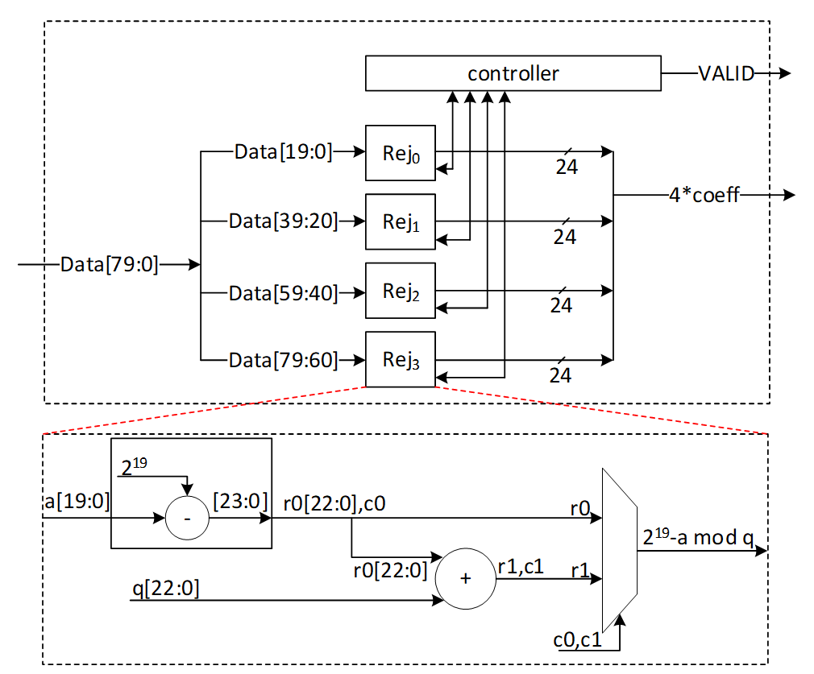{width="6.5in"
height="5.386111111111111in"}

After 12 cycles, 48 coefficients are processed by the expand mask unit,
and there are still 128-bit inside PISO. To maximize the utilization
factor of our hardware resources, Keccak core will check the PISO
status. If PISO contains 4 coefficients or more (the required inputs for
expand mask unit), EMPTY flag will not be set, and Keccak will wait
until the next cycle. Hence, expand mask unit takes 13 cycles to process
52 coefficients, and the last 48-bit will be combined with the next
Keccak round to be processed.

{width="5.091428258967629in"
height="1.6400273403324583in"}

### Performance

Sampling a polynomial with 256 coefficients takes 256/4=64 cycles. The
first round of Keccak needs 12 cycles, and the rest of Keccak operation
will be parallel with expand mask operation.

For a complete expand mask for Dilithium ML-DSA-87 with 7 polynomials,
7\*64+12=460 cycles are required using sequential operation. However,
our design can be duplicated to enable parallel sampling for two
different polynomials. Having two parallel design results in 268 cycles,
while three parallel design results in 204 cycles at the cost of more
resource utilization.

## Stage 2: Memory-NTT-Memory

The most computationally intensive operation in lattice-based PQC
schemes is polynomial multiplication which can be accelerated using NTT.
However, NTT is still a performance bottleneck in lattice-based
cryptography. We propose improved NTT architecture with highly efficient
modular reduction. This architecture supports NTT, INTT, and point-wise
multiplication (PWM) to enhance the design from resource sharing
point-of-view while reducing the pre-processing cost of NTT and
post-processing cost of INTT.

Our NTT architecture exploits a merged-layer NTT technique using two
pipelined stages with two parallel cores in each stage level, making 4
butterfly cores in total. Our proposed parallel pipelined butterfly
cores enable us to perform Radix-4 NTT/INTT operation with 4 parallel
coefficients. While memory bandwidth limits the efficiency of the
butterfly operation, we use a specific memory pattern to store four
coefficients per address.

### NTT Architecture

An NTT operation can be regarded as an iterative operation by applying a
sequence of butterfly operations on the input polynomial coefficients. A
butterfly operation is an arithmetic operation that combines two
coefficients to obtain two outputs. By repeating this process for
different pairs of coefficients, the NTT operation can be computed in a
logarithmic number of steps.

Cooley-Tukey (CT) and Gentleman-Sande (GS) butterfly configurations can
be used to facilitate NTT/INTT computation. The bit-reverse function
reverses the bits of the coefficient index. However, the bit-reverse
permutation can be skipped by using CT butterfly for NTT and GS for
INTT.

{width="6.5in"
height="1.5118055555555556in"}

We propose a merged NTT architecture using dual radix-4 design by
employing four pipelined stages with two parallel cores at each stage
level.

The following presents the high-level architecture of our proposed NTT
to take advantage of Merged architectural design:

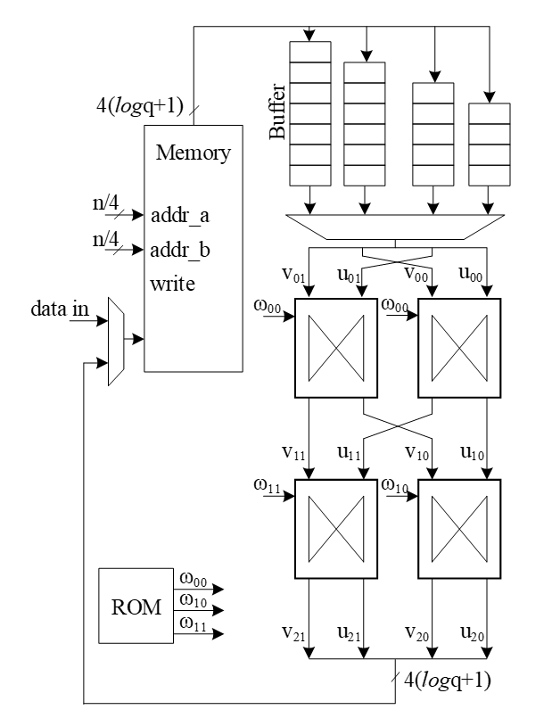{width="3.6602537182852144in"
height="4.760102799650044in"}

The following figure illustrates a 16-point NTT data flow based on our
proposed architecture:

{width="5.829517716535433in"
height="5.679419291338583in"}

A merged-layer NTT technique uses two pipelined stages with two parallel
cores in each stage level, making 4 butterfly cores in total. The
parallel pipelined butterfly cores enable us to perform Radix-4 NTT/INTT
operation with 4 parallel coefficients.

However, NTT requires a specific memory pattern that may limit the
efficiency of the butterfly operation. For Dilithium use case, there are
$n = 256$ coefficients per polynomial that requires $log\ n = 8$ layers
of NTT operations. Each butterfly unit takes two coefficients while
difference between the indexes is $2^{8 - i}$ in i^th^ stage. That means
for the first stage, the given indexes for each butterfly unit are (k,
k+128):

Stage 1 input indexes: {(0, 128), {1, 129), (2, 130), ..., (127, 255)}

Stage 2 input indexes: {(0, 64), {1, 65), (2, 66), ..., (63, 127), (128,
192), (129, 193), ..., (191, 255)}

...

Stage 8 input indexes: {(0, 1), {2, 3), (4, 5), ..., (254, 255)}

There are several considerations for that:

-   We need access to 4 coefficients per cycle to match the throughput
    into 2×2 butterfly units.

-   An optimized architecture provides a memory with only one reading
    port, and one writing port.

-   Based on the previous two notes, each memory address contains 4
    coefficients.

-   The initial coefficients are produced sequentially by Keccak and
    samplers. Specifically, they begin with 0 and continue incrementally
    up to 255. Hence, at the very beginning cycle, the memory contains
    (0, 1, 2, 3) in the first address, (4, 5, 6, 7) in second address,
    and so on.

-   The cost of in-place memory relocation to align the memory content
    is not negligible. Particularly, it needs to be repeated for each
    stage.

While memory bandwidth limits the efficiency of the butterfly operation,
we use a specific memory pattern to store four coefficients per
address.  

We propose a pipeline architecture the read memory in a particular
pattern and using a set of buffers, the corresponding coefficients are
fed into NTT block.

The initial memory contains the indexes as follows:

  --------------------------------------------------------------------------
     Address     Initial Memory                               
                 Content                                      
  -------------- -------------- -------------- -------------- --------------
                                                              

        0        0              1              2              3

        1        4              5              6              7

        2        8              9              10             11

        3        12             13             14             15

        4        16             17             18             19

        5        20             21             22             23

        6        24             25             26             27

        7        28             29             30             31

        8        32             33             34             35

        9        36             37             38             39

        10       40             41             42             43

        11       44             45             46             47

        12       48             49             50             51

        13       52             53             54             55

        14       56             57             58             59

        15       60             61             62             63

        16       64             65             66             67

        17       68             69             70             71

        18       72             73             74             75

        19       76             77             78             79

        20       80             81             82             83

        21       84             85             86             87

        22       88             89             90             91

        23       92             93             94             95

        24       96             97             98             99

        25       100            101            102            103

        26       104            105            106            107

        27       108            109            110            111

        28       112            113            114            115

        29       116            117            118            119

        30       120            121            122            123

        31       124            125            126            127

        32       128            129            130            131

        33       132            133            134            135

        34       136            137            138            139

        35       140            141            142            143

        36       144            145            146            147

        37       148            149            150            151

        38       152            153            154            155

        39       156            157            158            159

        40       160            161            162            163

        41       164            165            166            167

        42       168            169            170            171

        43       172            173            174            175

        44       176            177            178            179

        45       180            181            182            183

        46       184            185            186            187

        47       188            189            190            191

        48       192            193            194            195

        49       196            197            198            199

        50       200            201            202            203

        51       204            205            206            207

        52       208            209            210            211

        53       212            213            214            215

        54       216            217            218            219

        55       220            221            222            223

        56       224            225            226            227

        57       228            229            230            231

        58       232            233            234            235

        59       236            237            238            239

        60       240            241            242            243

        61       244            245            246            247

        62       248            249            250            251

        63       252            253            254            255
  --------------------------------------------------------------------------

Suppose memory is read in this pattern:

Addr: 0, 16, 32, 48, 1, 17, 33, 49, ..., 15, 31, 47, 63

The input goes to the customized buffer architecture as follows:

  -----------------------------------------------------------------------
  0       →                                                       
  ------- ------- ------- ------- ------- ------- ------- ------- -------
  1                                                               

  2                                                               

  3                                                               
  -----------------------------------------------------------------------

Cycle 0 reading address 0

  -----------------------------------------------------------------------
  64      →                               0                       
  ------- ------- ------- ------- ------- ------- ------- ------- -------
  65                              1                               

  66                      2                                       

  67              3                                               
  -----------------------------------------------------------------------

Cycle 1 reading address 16

  -----------------------------------------------------------------------
  128     →                               64      0               
  ------- ------- ------- ------- ------- ------- ------- ------- -------
  129                             65      1                       

  130                     66      2                               

  131             67      3                                       
  -----------------------------------------------------------------------

Cycle 2 reading address 32

  -----------------------------------------------------------------------
  192     →                               128     64      0       
  ------- ------- ------- ------- ------- ------- ------- ------- -------
  193                             129     65      1               

  194                     130     66      2                       

  195             131     67      3                               
  -----------------------------------------------------------------------

Cycle 3 reading address 48

  -----------------------------------------------------------------------
  4       →                               192     128     64      0
  ------- ------- ------- ------- ------- ------- ------- ------- -------
  5                               193     129     65      1       

  6                       194     130     66      2               

  7               195     131     67      3                       
  -----------------------------------------------------------------------

Cycle 4 reading address 1

  -----------------------------------------------------------------------
  68      →                               4       192     128     64
  ------- ------- ------- ------- ------- ------- ------- ------- -------
  69                              5       193     129     65      1

  70                      6       194     130     66      2       

  71              7       195     131     67      3               
  -----------------------------------------------------------------------

Cycle 5 reading address 17

The highlighted value in the first buffer contains the required
coefficients for our butterfly units, i.e., (0, 128) and (64, 192).
Since we merged the 1 and second layers of NTT stages, the output of the
first parallel butterfly units need to exchange one coefficient and then
the required input for the second parallel set of butterfly units is
ready, i.e., (0, 64) and (128, 192).

After completing the first round of operation including NTT stage 1 and
2, the memory contains the following data:

  -------------------------------------------------------------------------
     Address     Memory                                     
                 Content                                    
                 after 1&2                                  
                 stages                                     
  -------------- ---------- --------------- --------------- ---------------
                                                            

        0        0          64              128             192

        1        1          65              129             193

        2        2          66              130             194

        3        3          67              131             195

        4        4          68              132             196

        5        5          69              133             197

        6        6          70              134             198

        7        7          71              135             199

        8        8          72              136             200

        9        9          73              137             201

        10       10         74              138             202

        11       11         75              139             203

        12       12         76              140             204

        13       13         77              141             205

        14       14         78              142             206

        15       15         79              143             207

        16       16         80              144             208

        17       17         81              145             209

        18       18         82              146             210

        19       19         83              147             211

        20       20         84              148             212

        21       21         85              149             213

        22       22         86              150             214

        23       23         87              151             215

        24       24         88              152             216

        25       25         89              153             217

        26       26         90              154             218

        27       27         91              155             219

        28       28         92              156             220

        29       29         93              157             221

        30       30         94              158             222

        31       31         95              159             223

        32       32         96              160             224

        33       33         97              161             225

        34       34         98              162             226

        35       35         99              163             227

        36       36         100             164             228

        37       37         101             165             229

        38       38         102             166             230

        39       39         103             167             231

        40       40         104             168             232

        41       41         105             169             233

        42       42         106             170             234

        43       43         107             171             235

        44       44         108             172             236

        45       45         109             173             237

        46       46         110             174             238

        47       47         111             175             239

        48       48         112             176             240

        49       49         113             177             241

        50       50         114             178             242

        51       51         115             179             243

        52       52         116             180             244

        53       53         117             181             245

        54       54         118             182             246

        55       55         119             183             247

        56       56         120             184             248

        57       57         121             185             249

        58       58         122             186             250

        59       59         123             187             251

        60       60         124             188             252

        61       61         125             189             253

        62       62         126             190             254

        63       63         127             191             255
  -------------------------------------------------------------------------

The same process can be applied in the next round to perform NTT stage 3
and 4.

  -----------------------------------------------------------------------
  0       →                                                       
  ------- ------- ------- ------- ------- ------- ------- ------- -------
  64                                                              

  128                                                             

  192                                                             
  -----------------------------------------------------------------------

Cycle 0 reading address 0

  -----------------------------------------------------------------------
  16      →                               0                       
  ------- ------- ------- ------- ------- ------- ------- ------- -------
  80                              64                              

  144                     128                                     

  208             192                                             
  -----------------------------------------------------------------------

Cycle 1 reading address 16

  -----------------------------------------------------------------------
  32      →                               16      0               
  ------- ------- ------- ------- ------- ------- ------- ------- -------
  96                              80      64                      

  160                     144     128                             

  224             208     192                                     
  -----------------------------------------------------------------------

Cycle 2 reading address 32

  -----------------------------------------------------------------------
  48      →                               32      16      0       
  ------- ------- ------- ------- ------- ------- ------- ------- -------
  112                             96      80      64              

  176                     160     144     128                     

  240             224     208     192                             
  -----------------------------------------------------------------------

Cycle 3 reading address 48

  -----------------------------------------------------------------------
  1       →                               48      32      16      0
  ------- ------- ------- ------- ------- ------- ------- ------- -------
  65                              112     96      80      64      

  129                     176     160     144     128             

  193             240     224     208     192                     
  -----------------------------------------------------------------------

Cycle 4 reading address 1

  -----------------------------------------------------------------------
  17      →                               1       48      32      16
  ------- ------- ------- ------- ------- ------- ------- ------- -------
  81                              65      112     96      80      64

  145                     129     176     160     144     128     

  209             193     240     224     208     192             
  -----------------------------------------------------------------------

Cycle 5 reading address 17

After completing all stages, the memory contents would be as follows:

  --------------------------------------------------------------------------
     Address     Memory Content                               
                 after Stage                                  
                 7&8                                          
  -------------- -------------- -------------- -------------- --------------
                                                              

        0        0              1              2              3

        1        4              5              6              7

        2        8              9              10             11

        3        12             13             14             15

        4        16             17             18             19

        5        20             21             22             23

        6        24             25             26             27

        7        28             29             30             31

        8        32             33             34             35

        9        36             37             38             39

        10       40             41             42             43

        11       44             45             46             47

        12       48             49             50             51

        13       52             53             54             55

        14       56             57             58             59

        15       60             61             62             63

        16       64             65             66             67

        17       68             69             70             71

        18       72             73             74             75

        19       76             77             78             79

        20       80             81             82             83

        21       84             85             86             87

        22       88             89             90             91

        23       92             93             94             95

        24       96             97             98             99

        25       100            101            102            103

        26       104            105            106            107

        27       108            109            110            111

        28       112            113            114            115

        29       116            117            118            119

        30       120            121            122            123

        31       124            125            126            127

        32       128            129            130            131

        33       132            133            134            135

        34       136            137            138            139

        35       140            141            142            143

        36       144            145            146            147

        37       148            149            150            151

        38       152            153            154            155

        39       156            157            158            159

        40       160            161            162            163

        41       164            165            166            167

        42       168            169            170            171

        43       172            173            174            175

        44       176            177            178            179

        45       180            181            182            183

        46       184            185            186            187

        47       188            189            190            191

        48       192            193            194            195

        49       196            197            198            199

        50       200            201            202            203

        51       204            205            206            207

        52       208            209            210            211

        53       212            213            214            215

        54       216            217            218            219

        55       220            221            222            223

        56       224            225            226            227

        57       228            229            230            231

        58       232            233            234            235

        59       236            237            238            239

        60       240            241            242            243

        61       244            245            246            247

        62       248            249            250            251

        63       252            253            254            255
  --------------------------------------------------------------------------

The proposed method saves the time needed for shuffling and reordering,
while using only a little more memory.

With this memory access pattern, writes to the memory are in order (0,
1, 2, 3, etc) while reads wraparound with a step of 16 (0, 16, 32 48, 1,
17, 33, 49, etc). Hence, there will be a memory conflict where writes to
addresses take place before the data is read and provided to the
butterfly 2x2 module. To resolve this, a set of 3 base addresses are
given to the NTT module -- src address, interim address and dest address
that belong to 3 separate sections in memory. The NTT module will access
the memory with the appropriate base address for each round as follows:

  -----------------------------------------------------------------------
  **Round**   **Read base address**        **Write base address**
  ----------- ---------------------------- ------------------------------
  0           src                          interim

  1           interim                      dest

  2           dest                         interim

  3           interim                      dest
  -----------------------------------------------------------------------

At the end of NTT operation, results must be located in the section with
the dest base address. This will also provide the benefit of preserving
the original input for later use in keygen or signing operations. The
same memory access pattern is followed for INTT operation as well. Note
that Adam's bridge controller may choose to make interim and dest base
addresses the same to save on memory usage. In this case, the
requirement is still to have a separate src base address to preserve
original input polynomial coefficients in memory.

#### Modular Reduction

The modular addition/subtraction in hardware platform can be implemented
by one additional subtraction/addition operations, as follows:

{width="6.5in"
height="2.029166666666667in"}

However, modular multiplication can be implemented using different
techniques. The commonly used Barrett reduction and Montgomery reduction
require additional multiplications and are more suitable for the
non-specific modulus. Furthermore, Montgomery reduction needs two more
steps to convert all inputs from normal domain to Montgomery domain and
then convert back the results into normal domain. This conversation
increases the latency of NTT operations and does not lead to the best
performance. Hence, Barrett reduction and Montgomery reduction are
expensive in time and hardware resources.

{width="2.578015091863517in"
height="0.7696511373578303in"}

For Dilithium hardware accelerator, we can customize the reduction
architecture based on the prime value of the scheme with q= 8,380,417 to
design a hardware-friendly architecture that increase the efficiency of
computation. The value of q can be presented by:

$$q = 8,380,417 = 2^{23} - 2^{13} + 1$$

For the modular operation we have:

$$2^{23} = 2^{13} - 1\ mod\ q$$

Suppose that all input operands are less than q, we have:

$$0 \leq a,b < q$$

$$z = a.b < q^{2} = 46^{'}h3FE0\_ 04FF\_ C001$$

Based on $2^{23} = 2^{13} - 1\ mod\ q$, we can rewrite the equation as
follows:

$$z = 2^{23}z\lbrack 45:23\rbrack + z\lbrack 22:0\rbrack = 2^{13}z\lbrack 45:23\rbrack - z\lbrack 45:23\rbrack + z\lbrack 22:0\rbrack = 2^{23}z\lbrack 45:33\rbrack + 2^{13}z\lbrack 32:23\rbrack - z\lbrack 45:23\rbrack + z\lbrack 22:0\rbrack = 2^{13}z\lbrack 45:33\rbrack - z\lbrack 45:33\rbrack + 2^{13}z\lbrack 32:23\rbrack - z\lbrack 45:23\rbrack + z\lbrack 22:0\rbrack = 2^{23}z\lbrack 45:43\rbrack + 2^{13}z\lbrack 42:33\rbrack - z\lbrack 45:33\rbrack + 2^{13}z\lbrack 32:23\rbrack - z\lbrack 45:23\rbrack + z\lbrack 22:0\rbrack = 2^{13}z\lbrack 45:43\rbrack - z\lbrack 45:43\rbrack + 2^{13}z\lbrack 42:33\rbrack - z\lbrack 45:33\rbrack + 2^{13}z\lbrack 32:23\rbrack - z\lbrack 45:23\rbrack + z\lbrack 22:0\rbrack = 2^{13}\left( z\lbrack 45:43\rbrack + z\lbrack 42:33\rbrack + z\lbrack 32:23\rbrack \right) + \left( - z\lbrack 45:43\rbrack - z\lbrack 45:33\rbrack - z\lbrack 45:23\rbrack + z\lbrack 22:0\rbrack \right) = 2^{13}\left( z\lbrack 45:43\rbrack + z\lbrack 42:33\rbrack + z\lbrack 32:23\rbrack + z\lbrack 22:13\rbrack \right) + \left( - z\lbrack 45:43\rbrack - z\lbrack 45:33\rbrack - z\lbrack 45:23\rbrack + z\lbrack 12:0\rbrack \right) = 2^{13}c - (z\lbrack 45:43\rbrack + z\lbrack 45:33\rbrack + z\lbrack 45:23\rbrack) + z\lbrack 12:0\rbrack$$

Where:

$$c = z\lbrack 45:43\rbrack + z\lbrack 42:33\rbrack + z\lbrack 32:23\rbrack + z\lbrack 22:13\rbrack < 2^{12}$$

The value of c has 12 bits, and we can rewrite it as follows:

$$2^{13}c\lbrack 11:0\rbrack = 2^{23}c\lbrack 11:10\rbrack + 2^{13}c\lbrack 9:0\rbrack = 2^{13}c\lbrack 11:10\rbrack - c\lbrack 11:10\rbrack + 2^{13}c\lbrack 9:0\rbrack = 2^{13}d - c\lbrack 11:10\rbrack$$

$$d = c\lbrack 11:10\rbrack + c\lbrack 9:0\rbrack$$

So, the value of $z\ mod\ q$ is as follows:

$$z = 2^{13}c - \left( z\lbrack 45:43\rbrack + z\lbrack 45:33\rbrack + z\lbrack 45:23\rbrack \right) + z\lbrack 12:0\rbrack = 2^{13}d + z\lbrack 12:0\rbrack - \left( \left( z\lbrack 45:43\rbrack + z\lbrack 45:33\rbrack + z\lbrack 45:23\rbrack \right) + c\lbrack 11:10\rbrack \right) = 2^{13}d + z\lbrack 12:0\rbrack - e$$

Where:

$$e = \left( z\lbrack 45:43\rbrack + z\lbrack 45:33\rbrack + z\lbrack 45:23\rbrack \right) + c\lbrack 11:10\rbrack = f + z\lbrack 45:23\rbrack\ mod\ q$$

$$f\lbrack 14:0\rbrack = z\lbrack 45:43\rbrack + z\lbrack 45:33\rbrack + c\lbrack 11:10\rbrack$$

We use a modular addition for $f + z\lbrack 45:23\rbrack$ to keep it
less than $q$. This modular addition has one stage delay.

The addition between $2^{13}d$ and $z\lbrack 12:0\rbrack$ can be
implemented by concatenating since the first 13 bits of $d$ are zero as
follows:

$$g\lbrack 23:0\rbrack = 2^{13}d + z\lbrack 12:0\rbrack = d\lbrack 10:0\rbrack||z\lbrack 12:0\rbrack$$

Since the result has more than 23 bits, we perform a modular addition to
keep it less than $q$. For that, the regular modular addition will be
replaced by the following architecture while
$c0 = g\lbrack 23\rbrack,\ r0 = g\lbrack 22:0\rbrack$. In other words,
$c0 = d\lbrack 10\rbrack,\ r0\lbrack 22:0\rbrack = d\lbrack 9:0\rbrack||z\lbrack 12:0\rbrack$

{width="5.516804461942257in"
height="1.4357841207349082in"}

The following figure shows the architecture of this reduction technique.
As one can see, these functions do not need any multiplications in
hardware and can be achieved by shifter and adder.

{width="6.5in"
height="2.029166666666667in"}

The modular multiplication is implemented with a 3-stage pipeline
architecture. At the first pipeline stage, $z = a \cdot b$ is
calculated. At the second pipeline stage, $f + z\lbrack 45:23\rbrack$
and $2^{13}d + z\lbrack 12:0\rbrack$ are calculated in parallel. At the
third pipeline stage, a modular subtraction is executed to obtain the
result and the result is output.

We do not need extra multiplications for our modular reduction, unlike
Barrett and Montgomery algorithms. The operations of our reduction do
not depend on the input data and do not leak any information. Our
reduction using the modulus q= 8,380,417 is fast, efficient and
constant-time.

### Performance

For a complete NTT operation with 8 layers, i.e., n = 256, the proposed
architecture takes $\frac{8}{2} = 4$ rounds. Each round involves
$\frac{256}{4} = 64$ operations in pipelined architecture. Hence, the
latency of each round is equal to 64 (read from memory) + 8 (2
sequential butterfly latency) + 4 (input buffer latency) + 2 (wait
between each two stages) = 78 cycles.

Round 0: stage 0 & 1

Round 1: stage 2 & 3

Round 2: stage 4 & 5

Round 3: stage 6 & 7

The total latency would be $4 \times 78 = 312$ cycles.

For a complete NTT/INTT operation for Dilithium ML-DSA-87 with 7 or 8
polynomials, 7\*312=2184 or 8\*312=2496 cycles are required. However,
our design can be duplicated to enable parallel NTT for two different
polynomials. Having two parallel design results in 1248 cycles.

### NTT shuffling countermeasure

To protect NTT, we have two options -- shuffling the order of execution
of coefficients and masking in-order computation such that NTT performs
operation on two input shares per coefficient and produces two output
shares. While masking is a strong countermeasure for side-channel
attacks, it requires at least 4x the area and adds 4x the latency to one
NTT operation. Shuffling is an implementation trick that can be used to
provide randomization to some degree without area or latency overhead.
In Adam's Bridge, we employ a combination of both for protected design.
One NTT core will have shuffling for both NTT and INTT modes. The second
NTT core will have shuffling and masking on the first layer of
computation for INTT mode with cascaded connection from a masked PWM
module. In NTT mode, the second NTT core will employ only shuffling. PWM
operations are masked by default. PWA and PWS operations are shuffled by
default.

  -----------------------------------------------------------------------
  Address                 Memory                              
                          Content                             
  ----------- ----------- ----------- ----------- ----------- -----------
                                                               

  0                       0           1           2           3

  1                       4           5           6           7

  2                       8           9           10          11

  3                       12          13          14          15

  4                       16          17          18          19

  5                       20          21          22          23

  6                       24          25          26          27

  7                       28          29          30          31

  8                       32          33          34          35

  9                       36          37          38          39

  10                      40          41          42          43

  11                      44          45          46          47

  12                      48          49          50          51

  13                      52          53          54          55

  14                      56          57          58          59

  15                      60          61          62          63

  16                      64          65          66          67

  17                      68          69          70          71

  18                      72          73          74          75

  19                      76          77          78          79

  20                      80          81          82          83

  21                      84          85          86          87

  22                      88          89          90          91

  23                      92          93          94          95

  24                      96          97          98          99

  25                      100         101         102         103

  26                      104         105         106         107

  27                      108         109         110         111

  28                      112         113         114         115

  29                      116         117         118         119

  30                      120         121         122         123

  31                      124         125         126         127

  32                      128         129         130         131

  33                      132         133         134         135

  34                      136         137         138         139

  35                      140         141         142         143

  36                      144         145         146         147

  37                      148         149         150         151

  38                      152         153         154         155

  39                      156         157         158         159

  40                      160         161         162         163

  41                      164         165         166         167

  42                      168         169         170         171

  43                      172         173         174         175

  44                      176         177         178         179

  45                      180         181         182         183

  46                      184         185         186         187

  47                      188         189         190         191

  48                      192         193         194         195

  49                      196         197         198         199

  50                      200         201         202         203

  51                      204         205         206         207

  52                      208         209         210         211

  53                      212         213         214         215

  54                      216         217         218         219

  55                      220         221         222         223

  56                      224         225         226         227

  57                      228         229         230         231

  58                      232         233         234         235

  59                      236         237         238         239

  60                      240         241         242         243

  61                      244         245         246         247

  62                      248         249         250         251

  63                      252         253         254         255
  -----------------------------------------------------------------------

To implement shuffling in NTT, the memory content is divided into 16
chunks. The highlighted section in the memory table above shows the 16
chunk start addresses. For example, the first chunk consists of
addresses 0, 16, 32, 48. Second chunk has 1, 17, 33, 49, and so on. In
NTT mode, memory read pattern is 0, 16, 32, 48, 1, 17, 33, 49, etc. The
buffer in NTT module is updated to have two sections and is addressable
to support INTT shuffling with matched search space as that of NTT mode.

During shuffling, two levels of randomization are done:

1.  Chunk order is randomized

2.  Start address within the selected chunk is also randomized.

With this technique, the search space is $16\  \times 4^{16} = 2^{36}$.
For example, if chunk 5 is selected as the starting chunk, the input
buffer in NTT mode is configured as below.

  ----------------- ----------------- ----------------- -----------------
                                                        

                                                        

                                                        

                                                        

  215^1^            214^0^            213^3^            212^2^

  151^1^            150^0^            149^3^            148^2^

  87^1^             86^0^             85^3^             84^2^

  23^1^             22^0^             21^3^             20^2^
  ----------------- ----------------- ----------------- -----------------

Then, the order of execution is randomized for NTT as a second level of
randomization. For example, order of execution in NTT mode can be (22,
86, 150, 214), (23, 87, 151, 215), (20, 84, 148, 212), (21, 85, 149,
213). Note that, once a random start address is selected, the addresses
increment from that point and wrap around until all 4 sets of
coefficients have been processed in order. Similarly, once a random
chunk is selected, rest of the chunks are processed in order and wrapped
around until all chunks are covered. In this example, chunk processing
order is 5, 6, 7, 8, ..., 15, 0, 1, 2, 3, 4.

For the next chunk, buffer pointer switches to the top half. While the
bottom half of the buffer is read and executed, each location of the top
half is filled in the same cycle avoiding latency overhead. When all 4
entries of the lower buffer are processed, upper buffer is ready to be
fed into BF units.

  ----------------- ----------------- ----------------- -----------------
  219~3~            218~3~            217~3~            216~3~

  155~2~            154~2~            153~2~            152~2~

  91~1~             90~1~             89~1~             88~1~

  27~0~             26~0~             25~0~             24~0~

  215^1^            214^0^            213^3^            212^2^

  151^1^            150^0^            149^3^            148^2^

  87^1^             86^0^             85^3^             84^2^

  23^1^             22^0^             21^3^             20^2^
  ----------------- ----------------- ----------------- -----------------

{width="2.7949300087489064in"
height="4.991405293088364in"}

Above figure shows the flow of a shuffled NTT/INTT operation. The
shuffler part of the controller is responsible for calculating the
correct memory addresses and feed the correct inputs to the BFs.

When shuffling in NTT mode, the memory read and write addresses are
computed as shown below.$
$for i in range (0, 4):

Read address = chunk + (i \* RD_STEP)

Write address = chunk \* 4 + (rand_index \* WR_STEP)

Where rand_index is the randomized start index of execution order for an
NTT operation

E.g. if selected chunk is 5, and rand_index is 2

Order of execution is 2, 3, 0, 1

Read address = 5 + (0\*16), 5 + (1\*16), 5+(2\*16), 5+(3\*16) = 5, 21,
37, 53

Write address = (5\*4) + (2\*1), (5\*4) + (3\*1), (5\*4) + (0\*1),
(5\*4) + (1\*1) = 22, 23, 20, 21

Figure below shows the additional control logic required to maintain the
shuffling mechanism.

{width="4.769761592300962in"
height="4.356484033245844in"}

The index and chunk are obtained from a random number source. Chunk
refers to starting chunk number and index refers to start address within
the selected chunk. To account for BF latency, the index and chunk must
be delayed appropriately (for our design, this latency is 10 cycles) for
use in the controller shuffler logic.

The general address calculation for NTT is:

$$mem\ read\ addr = chunk + (count_{regular}*STEP_{rd})$$

Since reading memory can be in order, a regular counter is used to read
all 4 addresses of the selected chunk.

$$mem\ write\ addr = \left( chunk_{f10}*4 \right) + \left( index_{f10}*STEP_{wr} \right)$$

The buffer address calculation for NTT is:

$$buffer\ write\ addr = count_{regular}$$

$$buffer\ read\ addr = count_{index}$$

Where f10 refers to delayed values by 10 cycles. In this logic, chunk is
updated every 4 cycles and buffer pointer is toggled (to top or bottom
half) every 4 cycles.

The general address calculation for INTT is:

$$mem\ read\ addr = (chunk*4) + (index*STEP_{rd})$$

$$mem\ write\ addr = \left( chunk_{f10} \right) + \left( count_{regular}*STEP_{wr} \right)$$

Since writing to memory can be in order, a regular counter is used to
write all 4 addresses of the selected chunk.

In INTT, index need not be delayed since the BFs consume the
coefficients in the next cycle.

The buffer address calculation for INTT is:

$$buffer\ write\ addr = index_{f10}$$

$$buffer\ read\ addr = count_{regular}$$

## Stage 3: Keccak - SampleRej~q~ -- Pointwise Mult- Memory

Dilithium (or Kyber) samples the polynomials that make up the vectors
and matrices independently, using a fixed seed value and a nonce value
that increases the security as the input for Keccak. Keccak is used to
take these seed and nonce and generate random stream bits.

Rejection sampler takes 24-bits (12 bits in case of Kyber) and checks if
it is less than the prime number *q* = 2^23^ −2^13^+1 = 8380417 (q=3369
in case of Kyber). It continues to sample all required coefficients,
n=256, for a polynomial.

After sampling a polynomial with 256 coefficients, nonce will be changed
and a new random stream will be generated using Keccak core and will be
sampled by rejection sampling unit.

The output of this operation results in a matrix of polynomial with k
rows and l column while each polynomial includes 256 coefficients.

$$\begin{bmatrix}
A_{0,0} & \cdots & A_{0,l - 1} \\
 \vdots & \ddots & \vdots \\
A_{k - 1,0} & \cdots & A_{k - 1,l - 1}
\end{bmatrix}_{k \times l}$$

Rejection sampling is used in all three operations of Dilithium, i.e.,
keygen, sign, and verify. Since based on the specification of the
Dilithium (and Kyber), the sampled coefficients are considered in NTT
domain, the output of rejection sampler can directly be used for
polynomial multiplication operation, as follows:

$$\begin{bmatrix}
A_{0,0} & \cdots & A_{0,l - 1} \\
 \vdots & \ddots & \vdots \\
A_{k - 1,0} & \cdots & A_{k - 1,l - 1}
\end{bmatrix}{^\circ}\begin{bmatrix}
s_{1,0} \\
 \vdots \\
s_{1,l - 1}
\end{bmatrix} = \begin{bmatrix}
A_{0,0}\ {^\circ}s_{1,0} + \ldots + A_{0,l - 1}{^\circ}s_{1,l - 1} \\
 \vdots \\
A_{k - 1,0}{^\circ}s_{1,0} + \ldots + A_{k - 1,l - 1}{^\circ}s_{1,l - 1}
\end{bmatrix}$$

We propose an architecture to remove the cost of memory access from
Keccak to rejection sampler, and from rejection sampler to polynomial
multiplier. To achieve this, we need to have a balanced throughput
between all these modules to avoid large buffering or conflict between
them.

High-level architecture is illustrated as follows:

{width="4.298468941382327in"
height="2.5441786964129482in"}

### Keccak Unit

Keccak is used in SHAKE-128 configuration for rejection sampling
operation. Hence, it will take the input data and generates 1344-bit
output after each round. We propose implementing of Keccak while each
round takes 12 cycles. The format of input data is as follows:

$$Input\ data\  = \ \rho\ |\ j\ |\ i$$

Where $\rho$ is seed with 256-bits, $i$ and $j$ are nonce that describes
the row and column number of corresponding polynomial A such that:

$$A_{i,j} = Rejection\_ sampling(Keccak(\rho\ |\ j\ |\ i))$$

Since each 24-bit is used for one coefficient, each round of Keccak
output provides 1344/24=56 coefficients. To have 256 coefficients for
each polynomial (with same seed and nonce), we need to rerun Keccak for
at least 5 rounds.

There are two paths for Keccak input. While the input can be set by
controller for each new polynomial, the loop path is used to rerun
Keccak for completing the previous polynomial.

Rejection sampler cannot take all 1344-bit output parallelly since it
makes hardware architecture too costly and complex, and also there is no
other input from Keccak for the next 12 cycles. Therefore, we propose a
parallel-input serial-output (PISO) unit in between to store the Keccak
output and feed rejection unit sequentially.

### Rejection Sampler

This unit takes data from the output of SHAKE-128 stored in a PISO
buffer. The required cycles for this unit are variable due to the
non-deterministic pattern of rejection sampling. However, at least 5
Keccak rounds are required to provide 256 coefficients.

In our optimized architecture, this unit works in parallel with the
Keccak core. Therefore, the latency for rejection sampling is absorbed
within the latency for a concurrently running Keccak core.

Our proposed polynomial multiplier can perform point-wise multiplication
on four coefficients per cycle that also helps to avoid memory access
challenges and make the control logic too complicated. This implies that
the optimal speed of the rejection sampling module is to sample four
coefficients without rejection in one cycle.

On the output side, as the rejection sampling might fail, the rejection
rate for each input is:

$$rejection\_ rate = \ 1 - \frac{q}{2^{23}} = 1 - \frac{8380471}{2^{23}} = 0.0009764 \approx 10^{- 3}$$

Hence, the probability of failure to provide 4 appropriate coefficients
from 4 inputs would be:

$$1 - (1 - rejection\_ rate)^{4} = 0.00399$$

To reduce the failure probability and avoid any wait cycle in polynomial
multiplication, 5 coefficients are fed into rejection while only 4 of
them will be passed to polynomial multiplication. This decision reduces
the probability of failure to

$$1 - (probability\ of\ having\ 5\ good\ inputs) - (probability\ of\ having\ 4\ good\ inputs) = 1 - \left( 1 - rejection_{rate} \right)^{5} - rejection_{rate}*\begin{pmatrix}
5 \\
4
\end{pmatrix}\left( 1 - rejection_{rate} \right)^{4} = 0.00000998 \approx 10^{- 5}$$

Adding a FIFO to rejection sampling unit can store the remaining unused
coefficients and increase the probability of having 4 appropriate
coefficients to match polynomial multiplication throughput. The
architecture is as follows:

{width="5.112583114610674in"
height="3.9797298775153105in"}

There are 5 rejection sampler circuits corresponding to each 24-bit
input. The controller checks if each of these coefficients should be
rejected or not. The valid input coefficients can be stored into the
FIFO. While maximum 5 coefficients can be fed into FIFO, there are four
more entries for the remaining coefficients from the previous cycle.
There are several scenarios for the proposed balanced throughput
architecture:

1)  At the very first cycle, or whenever the FIFO is empty, rejection
    sampling unit may not provide all 4 coefficients for polynomial
    multiplication unit. We reduce the failure probability of this
    scenario by feeding 5 coefficients, however, it may happen. So, for
    designing efficient architecture, instead of reducing the failure
    probability by adding more hardware cost, we use a VALID output that
    stops polynomial multiplier until all 4 required coefficients are
    sampled.

2)  If all 5 inputs are valid, they are going to be stored into FIFO.
    The first 4 coefficients will be sent to polynomial multiplication
    unit, while the remaining coefficients will be shifted to head of
    FIFO and be used for the next cycle with the first 3 valid
    coefficients from the next cycle.

3)  The maximum depth of FIFO is 9 entries. If all 9 FIFO entries are
    full, rejection sampling unit can provide the required output for
    the next cycles too. Hence, it does not accept a new input from
    Keccak core by raising FULL flag.

  --------------------------------------------------------------------------
  Cycle     Input from FIFO valid       Total      output   FIFO remaining
  count     PISO       entries from     valid               for the next
                       previous cycle   samples             cycle
  --------- ---------- ---------------- ---------- -------- ----------------
  0         5          0                5          4        1

  1         5          1                6          4        2

  2         5          2                7          4        3

  3         5          3                8          4        4

  4         5          4                9          4        5 (FULL)

  5         0          5                5          4        1

  6         5          1                6          4        2
  --------------------------------------------------------------------------

4)  If there is not FULL condition for reading from Keccak, all PISO
    data can be read in 12 cycles, including 11 cycles with 5
    coefficients and 1 cycle for the 56^th^ coefficient. This would be
    match with Keccak throughput that generates 56 coefficients per 12
    cycles.

5)  The maximum number of FULL conditions is when there are no rejected
    coefficients for all 56 inputs. In this case, after 5 cycles with 5
    coefficients, there is one FULL condition. After 12 cycles, 50
    coefficients are processed by rejection sampling unit, and there are
    still 6 coefficients inside PISO. To maximize the utilization factor
    of our hardware resources, Keccak core will check the PISO status.
    If PISO contains 5 coefficients or more (the required inputs for
    rejection sampling unit), EMPTY flag will not be set, and Keccak
    will wait until the next cycle. Hence, rejection sampling unit takes
    13 cycles to process 55 coefficients, and the last coefficients will
    be combined with the next Keccak round to be processed.

{width="6.5in" height="1.9875in"}

### Performance

For processing each round of Keccak using rejection sampling unit, we
need 12 to 13 cycles that result in 60-65 cycles for each polynomial
with 256 coefficients.

For a complete rejection sampling for Dilithium ML-DSA-87 with 8\*7=56
polynomials, 3360 to 3640 cycles are required using sequential
operation. However, our design can be duplicated to enable parallel
sampling for two different polynomials. Having two parallel design
results in 1680 to 1820 cycles, while three parallel design results in
1120 to 1214 cycles at the cost of more resource utilization.

## Stage 4: Memory -- Decompose -- Encode -- Keccak 

### Decompose Unit

Decompose unit is used in signing operation of Dilithium. It decomposes
r into (r1,r0) such that r ≡ r1(2γ2)+r0 mod q. The output of decompose
has two parts. While r0 will be stored into memory, r1 will be encoded
and then be stored into Keccak SIPO input buffer to run SHAKE256.

{width="6.5in"
height="3.310416666666667in"}

There are k polynomials (k=8 for ML-DSA-87) that needs to be decomposed
as follows:

$$w = \begin{bmatrix}
w_{0} \\
 \vdots \\
w_{k - 1}
\end{bmatrix}$$

Due to our memory configuration that stores 4 coefficients per address,
we need 4 parallel cores for decompose and encode units to match the
throughout between these modules.

{width="5.6609623797025375in"
height="3.3548458005249344in"}

### Performance

There are k polynomials with 256 coefficients for each that need to be
fed into decompose unit in pipeline method. After having 1088-bit input
into SIPO, Keccak will be enabled parallel with decompose and encode
units. However, the last round of Keccak will be performed after
processing all coefficients. Each round of Keccak takes 12 cycles which
allows processing of 48 coefficients. Since the output length of each
encode unit is 4 bits, Keccak works faster than decompose/encode units
and SIPO will not have overflow issue.

For a complete decompose/encode/hash operation for Dilithium ML-DSA-87
with 8 polynomials, 8\*256/4 + 12 = 524 cycles are required using
pipelined architecture.

## INTT

A merged-layer INTT technique uses two pipelined stages with two
parallel cores in each stage level, making 4 butterfly cores in total.
The parallel pipelined butterfly cores enable us to perform Radix-4 INTT
operation with 4 parallel coefficients.

However, INTT requires a specific memory pattern that may limit the
efficiency of the butterfly operation. For Dilithium use case, there are
$n = 256$ coefficients per polynomial that requires $log\ n = 8$ layers
of INTT operations. Each butterfly unit takes two coefficients while
difference between the indexes is $2^{i - 1}$ in i^th^ stage. That means
for the first stage, the given indexes for each butterfly unit are
(2\*k, 2\*k+1):

Stage 1 input indexes: {(0, 1), {2, 3), (4, 5), ..., (254, 255)}

Stage 2 input indexes: {(0, 2), {1, 3), (4, 6), ..., (61, 63), (64, 66),
(65, 67), ..., (253, 255)}

...

Stage 8 input indexes: {(0, 128), {1, 129), (2, 130), ..., (127, 255)}

There are several considerations for that:

-   We need access to 4 coefficients per cycle to match the throughput
    into 2×2 butterfly units.

-   An optimized architecture provides a memory with only one reading
    port, and one writing port.

-   Based on the previous two notes, each memory address contains 4
    coefficients.

-   The initial coefficients are stored sequentially by NTT.
    Specifically, they begin with 0 and continue incrementally up
    to 255. Hence, at the very beginning cycle, the memory contains (0,
    1, 2, 3) in the first address, (4, 5, 6, 7) in second address, and
    so on.

-   The cost of in-place memory relocation to align the memory content
    is not negligible. Particularly, it needs to be repeated for each
    stage.

While memory bandwidth limits the efficiency of the butterfly operation,
we use a specific memory pattern to store four coefficients per
address.  

We propose a pipeline architecture the read memory in a particular
pattern and using a set of buffers, the corresponding coefficients are
fed into INTT block.

The initial memory contains the indexes as follows:

  ------------------------------------------------------------------------
     Address    Initial                                   
                Memory                                    
                Content                                   
  ------------- ------------- ------------- ------------- ----------------
                                                          

        0       0             1             2             3

        1       4             5             6             7

        2       8             9             10            11

        3       12            13            14            15

        4       16            17            18            19

        5       20            21            22            23

        6       24            25            26            27

        7       28            29            30            31

        8       32            33            34            35

        9       36            37            38            39

       10       40            41            42            43

       11       44            45            46            47

       12       48            49            50            51

       13       52            53            54            55

       14       56            57            58            59

       15       60            61            62            63

       16       64            65            66            67

       17       68            69            70            71

       18       72            73            74            75

       19       76            77            78            79

       20       80            81            82            83

       21       84            85            86            87

       22       88            89            90            91

       23       92            93            94            95

       24       96            97            98            99

       25       100           101           102           103

       26       104           105           106           107

       27       108           109           110           111

       28       112           113           114           115

       29       116           117           118           119

       30       120           121           122           123

       31       124           125           126           127

       32       128           129           130           131

       33       132           133           134           135

       34       136           137           138           139

       35       140           141           142           143

       36       144           145           146           147

       37       148           149           150           151

       38       152           153           154           155

       39       156           157           158           159

       40       160           161           162           163

       41       164           165           166           167

       42       168           169           170           171

       43       172           173           174           175

       44       176           177           178           179

       45       180           181           182           183

       46       184           185           186           187

       47       188           189           190           191sample in
                                                          ball

       48       192           193           194           195

       49       196           197           198           199

       50       200           201           202           203

       51       204           205           206           207

       52       208           209           210           211

       53       212           213           214           215

       54       216           217           218           219

       55       220           221           222           223

       56       224           225           226           227

       57       228           229           230           231

       58       232           233           234           235

       59       236           237           238           239

       60       240           241           242           243

       61       244           245           246           247

       62       248           249           250           251

       63       252           253           254           255
  ------------------------------------------------------------------------

Suppose memory is read in the regular pattern:

Reading Addr: 0, 1, 2, 3, 4, ..., 62, 63

The input goes to the butterfly architecture. The input values contain
the required coefficients for our butterfly units in the next stage,
i.e., (0, 1) and (2, 3). Since we merged the first and second layers of
INTT stages, the output of the first parallel butterfly units need to
exchange one coefficient and then the required input for the second
parallel set of butterfly units is ready, i.e., (0, 2) and (1, 3).

{width="2.6827340332458443in"
height="4.4440616797900265in"}

To prepare the results for the next stages, the output needs to be
stored into the customized buffer architecture as follows:

  -----------------------------------------------------------------------
  0       →                                                       
  ------- ------- ------- ------- ------- ------- ------- ------- -------
  1                                                               

  2                                                               

  3                                                               
  -----------------------------------------------------------------------

Cycle 0 after butterfly reading address 0

  -----------------------------------------------------------------------
  4       →                               0                       
  ------- ------- ------- ------- ------- ------- ------- ------- -------
  5                               1                               

  6                       2                                       

  7               3                                               
  -----------------------------------------------------------------------

Cycle 0 after butterfly reading address 1

  -----------------------------------------------------------------------
  8       →                               4       0               
  ------- ------- ------- ------- ------- ------- ------- ------- -------
  9                               5       1                       

  10                      6       2                               

  11              7       3                                       
  -----------------------------------------------------------------------

Cycle 2 after butterfly reading address 2

  -----------------------------------------------------------------------
  12      →                               8       4       0       
  ------- ------- ------- ------- ------- ------- ------- ------- -------
  13                              9       5       1               

  14                      10      6       2                       

  15              11      7       3                               
  -----------------------------------------------------------------------

Cycle 3 after butterfly reading address 3

  -----------------------------------------------------------------------
  16      →                               12      8       4       0
  ------- ------- ------- ------- ------- ------- ------- ------- -------
  17                              13      9       5       1       

  18                      14      10      6       2               

  19              15      11      7       3                       
  -----------------------------------------------------------------------

Cycle 4 after butterfly reading address 4

  -----------------------------------------------------------------------
  20      →                               16      12      8       4
  ------- ------- ------- ------- ------- ------- ------- ------- -------
  21                              17      13      9       5       1

  22                      18      14      10      6       2       

  23              19      15      11      7       3               
  -----------------------------------------------------------------------

Cycle 5 after butterfly reading address 5

The highlighted value in the first buffer contains the required
coefficients for our butterfly units in the next stage, i.e., (0, 4) and
(8, 12).

However, we need to write the output in a particular pattern as follows:

Writing Addr: 0, 16, 32, 48, 1, 17, 33, 49, ..., 15, 31, 47, 63

After completing the first round of operation including INTT stage 1 and
2, the memory contains the following data:

  -------------------------------------------------------------------------
     Address     Memory                                     
                 Content                                    
                 after 1&2                                  
                 stages                                     
  -------------- ---------- --------------- --------------- ---------------
                                                            

        0        0          4               8               12

        1        16         20              24              28

        2        32         36              40              44

        3        48         52              56              60

        4        64         68              72              76

        5        80         84              88              92

        6        96         100             104             108

        7        112        116             120             124

        8        128        132             136             140

        9        144        148             152             156

        10       160        164             168             172

        11       176        180             184             188

        12       192        196             200             204

        13       208        212             216             220

        14       224        228             232             236

        15       240        244             248             252

        16       1          5               9               13

        17       17         21              25              29

        18       33         37              41              45

        19       49         53              57              61

        20       65         69              73              77

        21       81         85              89              93

        22       97         101             105             109

        23       113        117             121             125

        24       129        133             137             141

        25       145        149             153             157

        26       161        165             169             173

        27       177        181             185             189

        28       193        197             201             205

        29       209        213             217             221

        30       225        229             233             237

        31       241        245             249             253

        32       2          6               10              14

        33       18         22              26              30

        34       34         38              42              46

        35       50         54              58              62

        36       66         70              74              78

        37       82         86              90              94

        38       98         102             106             110

        39       114        118             122             126

        40       130        134             138             142

        41       146        150             154             158

        42       162        166             170             174

        43       178        182             186             190

        44       194        198             202             206

        45       210        214             218             222

        46       226        230             234             238

        47       242        246             250             254

        48       3          7               11              15

        49       19         23              27              31

        50       35         39              43              47

        51       51         55              59              63

        52       67         71              75              79

        53       83         87              91              95

        54       99         103             107             111

        55       115        119             123             127

        56       131        135             139             143

        57       147        151             155             159

        58       163        167             171             175

        59       179        183             187             191

        60       195        199             203             207

        61       211        215             219             223

        62       227        231             235             239

        63       243        247             251             255
  -------------------------------------------------------------------------

The same process can be applied in the next round to perform INTT stage
3 and 4.

  -----------------------------------------------------------------------
  0       →                                                       
  ------- ------- ------- ------- ------- ------- ------- ------- -------
  4                                                               

  8                                                               

  12                                                              
  -----------------------------------------------------------------------

Cycle 0 after butterfly reading address 0

  -----------------------------------------------------------------------
  16      →                               0                       
  ------- ------- ------- ------- ------- ------- ------- ------- -------
  20                              4                               

  24                      8                                       

  28              12                                              
  -----------------------------------------------------------------------

Cycle 1 after butterfly reading address 1

  -----------------------------------------------------------------------
  32      →                               16      0               
  ------- ------- ------- ------- ------- ------- ------- ------- -------
  36                              20      4                       

  40                      24      8                               

  44              28      12                                      
  -----------------------------------------------------------------------

Cycle 2 after butterfly reading address 2

  -----------------------------------------------------------------------
  48      →                               32      16      0       
  ------- ------- ------- ------- ------- ------- ------- ------- -------
  52                              36      20      4               

  56                      40      24      8                       

  60              44      28      12                              
  -----------------------------------------------------------------------

Cycle 3 after butterfly reading address 3

  -----------------------------------------------------------------------
  64      →                               48      32      16      0
  ------- ------- ------- ------- ------- ------- ------- ------- -------
  68                              52      36      20      4       

  72                      56      40      24      8               

  76              60      44      28      12                      
  -----------------------------------------------------------------------

Cycle 4 after butterfly reading address 4

  -----------------------------------------------------------------------
  80      →                               64      48      32      16
  ------- ------- ------- ------- ------- ------- ------- ------- -------
  84                              68      52      36      20      4

  88                      72      56      40      24      8       

  92              76      60      44      28      12              
  -----------------------------------------------------------------------

Cycle 5 after butterfly reading address 5

After completing all stages, the memory contents would be as follows:

  --------------------------------------------------------------------------
     Address     Memory Content                               
                 after Stage                                  
                 7&8                                          
  -------------- -------------- -------------- -------------- --------------
                                                              

        0        0              1              2              3

        1        4              5              6              7

        2        8              9              10             11

        3        12             13             14             15

        4        16             17             18             19

        5        20             21             22             23

        6        24             25             26             27

        7        28             29             30             31

        8        32             33             34             35

        9        36             37             38             39

        10       40             41             42             43

        11       44             45             46             47

        12       48             49             50             51

        13       52             53             54             55

        14       56             57             58             59

        15       60             61             62             63

        16       64             65             66             67

        17       68             69             70             71

        18       72             73             74             75

        19       76             77             78             79

        20       80             81             82             83

        21       84             85             86             87

        22       88             89             90             91

        23       92             93             94             95

        24       96             97             98             99

        25       100            101            102            103

        26       104            105            106            107

        27       108            109            110            111

        28       112            113            114            115

        29       116            117            118            119

        30       120            121            122            123

        31       124            125            126            127

        32       128            129            130            131

        33       132            133            134            135

        34       136            137            138            139

        35       140            141            142            143

        36       144            145            146            147

        37       148            149            150            151

        38       152            153            154            155

        39       156            157            158            159

        40       160            161            162            163

        41       164            165            166            167

        42       168            169            170            171

        43       172            173            174            175

        44       176            177            178            179

        45       180            181            182            183

        46       184            185            186            187

        47       188            189            190            191

        48       192            193            194            195

        49       196            197            198            199

        50       200            201            202            203

        51       204            205            206            207

        52       208            209            210            211

        53       212            213            214            215

        54       216            217            218            219

        55       220            221            222            223

        56       224            225            226            227

        57       228            229            230            231

        58       232            233            234            235

        59       236            237            238            239

        60       240            241            242            243

        61       244            245            246            247

        62       248            249            250            251

        63       252            253            254            255
  --------------------------------------------------------------------------

The proposed method saves the time needed for shuffling and reordering,
while using only a little more memory.

### INTT shuffling countermeasure

Similar to NTT operation, INTT requires shuffling the order of execution
of coefficients in order to mitigate SCA attacks. Refer to section 5.3.3
for details on NTT shuffling. In INTT mode, the chunks are split in the
following pattern into 16 chunks:

  -----------------------------------------------------------------------
    Address               1&2                                 
  ----------- ----------- ----------- ----------- ----------- -----------
                                                              

       0                  0           1           2           3

       1                  4           5           6           7

       2                  8           9           10          11

       3                  12          13          14          15

       4                  16          17          18          19

       5                  20          21          22          23

       6                  24          25          26          27

       7                  28          29          30          31

       8                  32          33          34          35

       9                  36          37          38          39

      10                  40          41          42          43

      11                  44          45          46          47

      12                  48          49          50          51

      13                  52          53          54          55

      14                  56          57          58          59

      15                  60          61          62          63

      16                  64          65          66          67

      17                  68          69          70          71

      18                  72          73          74          75

      19                  76          77          78          79

      20                  80          81          82          83

      21                  84          85          86          87

      22                  88          89          90          91

      23                  92          93          94          95

      24                  96          97          98          99

      25                  100         101         102         103

      26                  104         105         106         107

      27                  108         109         110         111

      28                  112         113         114         115

      29                  116         117         118         119

      30                  120         121         122         123

      31                  124         125         126         127

      32                  128         129         130         131

      33                  132         133         134         135

      34                  136         137         138         139

      35                  140         141         142         143

      36                  144         145         146         147

      37                  148         149         150         151

      38                  152         153         154         155

      39                  156         157         158         159

      40                  160         161         162         163

      41                  164         165         166         167

      42                  168         169         170         171

      43                  172         173         174         175

      44                  176         177         178         179

      45                  180         181         182         183

      46                  184         185         186         187

      47                  188         189         190         191

      48                  192         193         194         195

      49                  196         197         198         199

      50                  200         201         202         203

      51                  204         205         206         207

      52                  208         209         210         211

      53                  212         213         214         215

      54                  216         217         218         219

      55                  220         221         222         223

      56                  224         225         226         227

      57                  228         229         230         231

      58                  232         233         234         235

      59                  236         237         238         239

      60                  240         241         242         243

      61                  244         245         246         247

      62                  248         249         250         251

      63                  252         253         254         255
  -----------------------------------------------------------------------

(0, 1, 2, 3) addresses are chunk0, (4,5,6,7) are chunk1, etc. Chunk
addresses are in order since for INTT, reads are in order and writes are
out of order. Similar to NTT, two levels of randomization are used:

1.  Starting chunk is randomized

2.  Start address within each chunk is randomized

With this technique, the search space is $16\  \times 4^{16} = 2^{36}$.
For example, if chunk 5 is selected as the starting chunk, and start
address is 1, the order of execution is (21, 22, 23, 20). When next
chunk is selected (chunk 6), start address is again randomized. For
example, next order can be (27, 24, 25, 26) and so on.

The output buffer in INTT mode is configured as below. The buffer write
pointer is aligned with the start address of the selected chunk and
wraps around. In the given example, buffer write pointer increments as
(1, 2, 3, 0) and the outputs of butterfly2x2 are stored in the buffer in
locations (1, 2, 3, 0) in the order shown by superscript in the table
below. This ensures the correct data is written back to memory to the
correct addresses. In INTT mode, memory reads are randomized and memory
writes will be in order.

  ----------------- ----------------- ----------------- -----------------
  111^0^            110^0^            109^0^            108^0^

  107^3^            106^3^            105^3^            104^3^

  103^2^            102^2^            101^2^            100^2^

  99^1^             98^1^             97^1^             96^1^

  95^2^             94^2^             93^2^             92^2^

  91^1^             90^1^             89^1^             88^1^

  87^0^             86^0^             85^0^             84^0^

  83^3^             82^3^             81^3^             80^3^
  ----------------- ----------------- ----------------- -----------------

While the next chunk starts, the data in the bottom half of the buffer
is written to memory. Since every cycle there is a write to memory and
write to the other half of the buffer, this incurs no latency overhead.

Memory read and write addresses are calculated as shown

for i in range (0, 4):

Read address = (chunk\*4) + (rand_index \* INTT_RD_STEP)

Write address = chunk + (i \* INTT_WR_STEP)

Where rand_index is the randomized start index of execution order for an
NTT operation

E.g. if selected chunk is 5, and rand_index is 2

Order of execution is 2, 3, 0, 1

Read address = 5\*4 + (2\*1), 5\*4 + (3\*1), 5\*4+(0\*1), 5\*4+(1\*1) =
22, 23, 20, 21

Write address = 5 + (2\*16), 5 + (3\*16), 5 + (0\*16), 5 + (1\*16) = 37,
53, 5, 21

## Point-wise Multiplication

Polynomial in NTT domain can be performed using point-wise
multiplication (PWM). Considering the current architecture with 4
butterfly units, there are 4 modular multiplications that can be reused
in point-wise multiplication operation. This approach enhances the
design from an optimization perspective by resource sharing technique.
\`

There are 2 memories containing polynomial $f$ and $g$, with 4
coefficients per each memory address. The parallel butterfly cores
enable us to perform 4 point-wise multiplication operations with 4
parallel coefficients as follows:

{width="4.584260717410324in"
height="3.9201093613298337in"}

The proposed NTT method preserves the memory contents in sequence
without needing to shuffle and reorder them, so the point-wise
multiplication can be sped up by using consistent reading/writing
addresses from both memories.

## RejBounded

This unit takes data from the output of SHAKE-256 stored in a PISO
buffer. The required cycles for this unit are variable due to the
non-deterministic pattern of sampling. However, at least 1 Keccak round
is required to provide 256 coefficients.

This unit takes 4 bits from Keccak output. For ML-DSA-87 scheme, the
only rejected sample is input data equal to 15 which means the
probability of rejection is $\frac{1}{16}$ .

  ---------------------------------------------------------------------------
   b (4-bit Input)    b mod 5    2-(b mod 5)   valid/invalid   Output mod q
  ------------------ ---------- ------------- --------------- ---------------
          0              0            2            valid             2

          1              1            1            valid             1

          2              2            0            valid             0

          3              3           -1            valid          8380416

          4              4           -2            valid          8380415

          5              0            2            valid             2

          6              1            1            valid             1

          7              2            0            valid             0

          8              3           -1            valid          8380416

          9              4           -2            valid          8380415

          10             0            2            valid             2

          11             1            1            valid             1

          12             2            0            valid             0

          13             3           -1            valid          8380416

          14             4           -2            valid          8380415

          15             0            2           invalid         invalid
  ---------------------------------------------------------------------------

In our optimized architecture, this unit works in parallel with the
Keccak core. Therefore, the latency for RejBounded sampling is absorbed
within the latency for a concurrently running Keccak core.

Our proposed NTT can perform on four coefficients per cycle that also
helps to avoid memory access challenges and make the control logic too
complicated. This implies that the optimal speed of the RejBounded
sampling module is to sample four coefficients without rejection in one
cycle.

On the output side, as the RejBouned sampling might fail, the rejection
rate for each input is:

$$rejection\_ rate = \frac{1}{16} = 0.0625$$

Hence, the probability of failure to provide 4 appropriate coefficients
from 4 inputs would be:

$$1 - (1 - rejection\_ rate)^{4} = 0.2275$$

To reduce the failure probability and avoid any wait cycle in polynomial
multiplication, 5 coefficients are fed into rejection while only 4 of
them will be passed to polynomial multiplication. This decision reduces
the probability of failure to

$$1 - (probability\ of\ having\ 5\ good\ inputs) - (probability\ of\ having\ 4\ good\ inputs) = 1 - \left( 1 - rejection_{rate} \right)^{5} - rejection_{rate}*\begin{pmatrix}
5 \\
4
\end{pmatrix}\left( 1 - rejection_{rate} \right)^{4} = 0.0344$$

The following is the probability of failure for a design that has 4
samplings per cycle:

  -----------------------------------------------------------------------
  Sample number in input        Failure probability of 4 valid output
  ----------------------------- -----------------------------------------
  4                             0.2275238037109375

  5                             0.034404754638671875

  6                             0.004229903221130371

  7                             0.0004580467939376831

  8                             4.549999721348286e-05
  -----------------------------------------------------------------------

The following is the probability of failure for a high-throughput design
that has 8 samplings per cycle:

  -----------------------------------------------------------------------
  Sample number in input        Failure probability of 8 valid output
  ----------------------------- -----------------------------------------
  8                             0.4032805261667818

  9                             0.10492078925017267

  10                            0.021007113242376363

  11                            0.003525097407418798

  12                            0.0005203759357854665

  13                            6.966771504046676e-05
  -----------------------------------------------------------------------

Adding a FIFO to RejBounded sampling unit can store the remaining unused
coefficients and increase the probability of having 4 appropriate
coefficients to match polynomial multiplication throughput. The
architecture is as follows:

{width="6.5in"
height="5.906944444444444in"}

There are 8 rejection sampler circuits corresponding to each 4-bit
input. The controller checks if each of these coefficients should be
rejected or not. The valid input coefficients will be processes and a
result between $\lbrack - \eta,\ \eta\rbrack$ ($\eta$ is 2 for
ML-DSA-87) will be stored into the FIFO. While maximum 8 coefficients
can be fed into FIFO, there are four more entries for the remaining
coefficients from the previous cycle. There are several scenarios for
the proposed balanced throughput architecture:

1)  At the very first cycle, or whenever the FIFO is empty, RejBounded
    sampling unit may not provide all 4 coefficients for polynomial
    multiplication unit. We reduce the failure probability of this
    scenario by feeding 8 coefficients, however, it may happen. So, for
    designing efficient architecture, instead of reducing the failure
    probability by adding more hardware cost, we use a VALID output that
    stops polynomial multiplier until all 4 required coefficients are
    sampled.

2)  If more than 4 inputs are valid, they are going to be stored into
    FIFO. The first 4 coefficients will be sent to polynomial
    multiplication unit, while the remaining coefficients will be
    shifted to head of FIFO and be used for the next cycle with the
    valid coefficients from the next cycle.

3)  The maximum depth of FIFO is 12 entries. The input needs 8 entities
    that are ready to use, and we know that 4 entities will be released
    in each cycle by sending the output. Hence, if more than 8 FIFO
    entries are full, RejBounded sampling unit does not accept a new
    input from Keccak core by raising FULL flag. However, it has the
    required valid samples to provide the required output for the next
    cycle.

  --------------------------------------------------------------------------
  Cycle     Input from FIFO valid       Total      output   FIFO remaining
  count     PISO       entries from     valid               for the next
                       previous cycle   samples             cycle
  --------- ---------- ---------------- ---------- -------- ----------------
  0         8          0                8          4        4

  1         8          4                12         4        8

  2         8          8                16         4        12 (FULL)

  3         0          12               12         4        8

  4         8          8                16         4        12 (FULL)

  5         0          12               12         4        8

  6         8          8                16         4        12 (FULL)

  7         0          12               12         4        8

  8         7          8                15         4        11 (FULL)

  9         0          11               11         4        7

  10        6          7                13         4        9 (FULL)
  --------------------------------------------------------------------------

4)  PISO contains 1088/4=272 coefficients. If there is not FULL
    condition for reading from Keccak, all PISO data can be read in 34
    cycles. This would be match with Keccak throughput that generates 56
    coefficients per 12 cycles. To maximize the utilization factor of
    our hardware resources, Keccak core will check the PISO status. If
    PISO contains 8 coefficients or more (the required inputs for
    RejBounded sampling unit), EMPTY flag will not be set, and Keccak
    will wait until the next cycle.

5)  The maximum number of FULL conditions is when there are no rejected
    coefficients for all inputs. In this case, after 2 cycles with 16
    coefficients, there is one FULL condition. After 64 cycles, all 256
    required coefficients are processed by RejBouned sampling unit.

6)  To maximize the utilization factor of our hardware resources, Keccak
    core will check the PISO status. If PISO contains 8 coefficients or
    more (the required inputs for RejBounded sampling unit), EMPTY flag
    will not be set, and Keccak will wait until the next cycle.

{width="5.362823709536308in"
height="1.695936132983377in"}

## Stage 5: SampleInBall -- Memory 

SampleInBall is a procedure that uses the SHAKE256 of a seed ρ to
produce a random element of Bτ. The procedure uses the Fisher-Yates
shuffle method. The signs of the nonzero entries of c are determined by
the first 8 bytes of H(ρ), and the following bytes of H(ρ) are used to
determine the locations of those nonzero entries.

We propose an architecture to remove the cost of memory access from
Keccak to SampleInBall, and from SampleInBall to NTT. This requires a
specific pattern of coefficients for NTT that prevents excessive
buffering or interference between them. It also lowers the rejection
rate and speeds up SampleInBall while maintaining small and efficient
architecture.

High-level architecture is illustrated as follows:

{width="6.5in"
height="1.4673611111111111in"}

### Keccak Unit

Keccak is used in SHAKE-256 configuration for SampleInBall operation.
Hence, it will take the input seed $\rho$ with 256-bit and generates
1088-bit output after each round.

The first τ bits (τ = 60 in the case of ML-DSA-87) in the first 8 bytes
of this random stream are interpreted as τ random sign bits si ∈ {0, 1},
i = 0, . . . , τ − 1. The remaining 64 − τ bits are discarded.

The remaining random bits are used for sampling. Since each 8-bit is
used for one sample, the first round of Keccak output provides
(1088-64)/8=128 samples. The number of valid samples needed is 60.
Because this is a sampling operation that is non-deterministic, if more
samples are required, Keccak will run again and produce 1088/8=136
additional samples. Hence, there are two paths for Keccak input. While
the input seed $\rho$ can be set by controller for each new polynomial
c, the loop path is used to rerun Keccak for completing the previous
polynomial.

SampleInBall cannot take all samples parallelly since it makes hardware
architecture too costly and complex. Therefore, we propose a
parallel-input serial-output (PISO) unit in between to store the Keccak
output and feed SampleInBall unit sequentially.

### SampleInBall

This unit takes data from the output of SHAKE-256 stored in a PISO
buffer. The required cycles for this unit are variable due to the
non-deterministic pattern of sampling. But this operation can only be
finished with 60 valid samples.

In our optimized architecture, this unit works in parallel with the
Keccak core. Therefore, the latency for Keccak sampling (for the second
round and next) is absorbed within the latency for a concurrently
running SampleInBall core.

The NTT unit needs to take four coefficients per cycle. This implies
that the output contains four samples per each address as follows:

{width="3.2504538495188102in"
height="3.4900699912510937in"}

SampleInBall algorithm is as follows:

1)  Initialize c = c0 c1 . . . c255 = 0 0 . . . 0

2)  for i := 256 − τ to 255

3)  j ← {0, 1, . . . , i}

4)  s ← {0, 1}

5)  ci := cj

6)  cj := (−1)^s^

7)  return c

SampleInBall includes three main operations:

1)  Check the validity of input samples respect to parameter i (line 3
    of algorithm)

2)  Store the sign s (line 4 of algorithm)

3)  Shuffle the stored polynomial c respect to parameter i, j, and s
    (line 5 and 6 of algorithm)

To recall, for ML-DSA-87 with τ = 60, 60 valid samples are required.

Validity check on the input sample depends on the iteration number i
while a sample greater than i will be rejected. Hence, the probability
of failure for each round would be:

<figure>
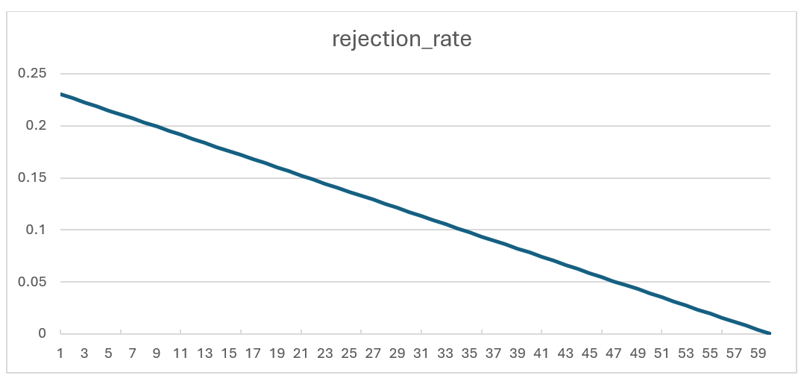
<figcaption>
Rejection rate for each round of SampleInBall
operation
</figcaption>
</figure>

To reduce the failure probability and avoid any wait cycle in polynomial
multiplication, 4 samples are fed into SampleInBall while only 1 of them
will be passed to shuffling unit. This decision reduces the probability
of failure to:

$$probability\ of\ having\ 4\ rejected\ inputs = \left( rejection_{rate} \right)^{4}$$

In the worst case scenario (the first iteration with i=196), the failure
probability is:

$$(0.23046)^{4} = 0.00282$$

The unused coefficients will be processed in the next cycle when i
increments. The architecture is as follows:

<figure>
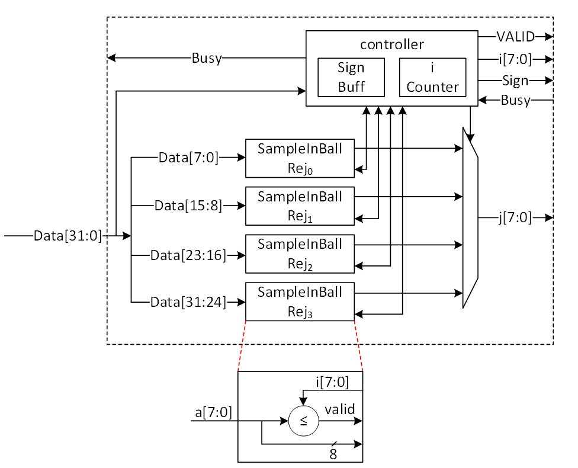
<figcaption>
Sampling phase of SampleInBall
architecture
</figcaption>
</figure>

The first 2 cycles is used to store the sign bits into the sign buffer.
After that, each 32 bits of input will be divided into 4 samples. Each
sample is compared to i and the first valid sample is passed into the
shuffling step.

Controller uses a counter to manage i value. The counter starts at 196
(for ML-DSA-87) and goes up after a valid coefficient is found.

When a valid coefficient is found, valid flag will be set and the chosen
sample (known by j), i, and s will be transferred to shuffling unit.
Then, the counter is incremented, and the remaining samples will be
compared to the new i value.

The architecture of shuffling unit is as follows:

<figure>
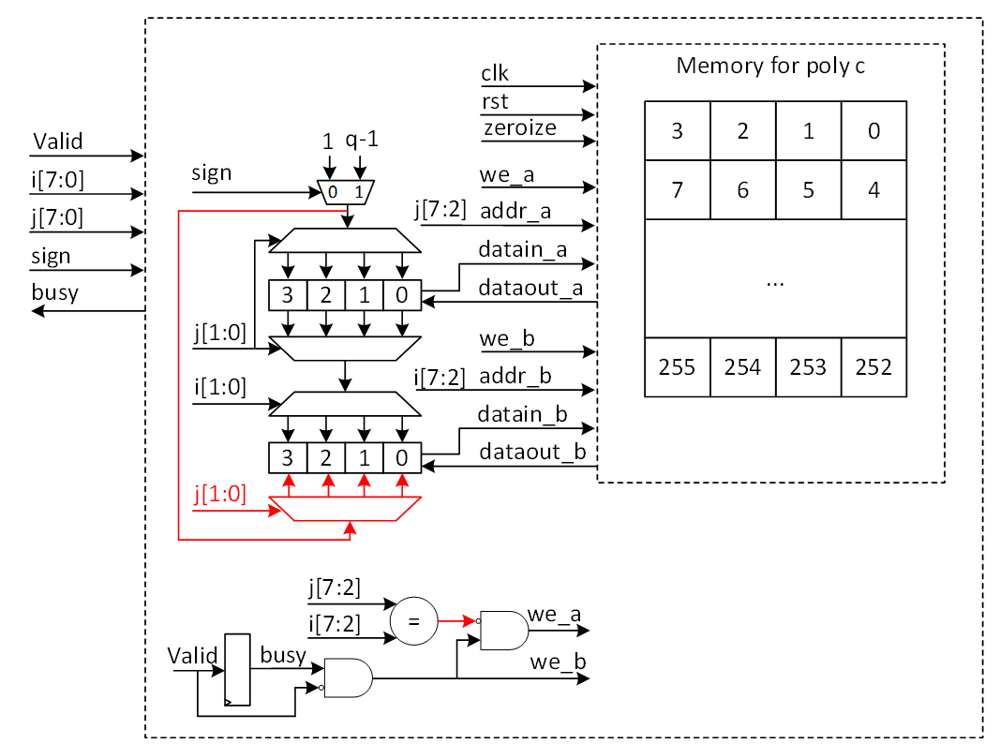
<figcaption>
Shuffling phase of SampleInBall
architecture
</figcaption>
</figure>

A polynomial c is stored in a memory that has four coefficients for each
address. This pattern is needed for NTT operation that works on the
output of SampleInBall. The memory has two ports that can read or write
data.

Each input sample needs two cycles. In the first cycle, the memory reads
the two addresses that have i and j, and in the second cycle, the memory
saves the new coefficients.

The read data from address j will be updated with 1 or q-1 based on the
s value, while the original value of j is transferred to address i using
a multiplexer and demultiplexer.

When i and j have the same address, both ports try to write to the same
location in the second cycle. To avoid this, the red path is used to
turn off port a for address j. But then, j will be changed in the same
buffer that has i (port b) and will be saved into memory.

## Decompose Architecture

Decompose algorithm plays a crucial role by breaking down the
coefficients of a polynomial into smaller parts. Decompose calculates
high and low bits r1 and r0 such that:

$$r\  = \ r_{1}\  \cdot \ 2\ \gamma_{2}\  + r_{0}\ \ mod\ q$$

where:

$$- \gamma_{2} < r_{0} \leq \gamma_{2}$$

except for the border case when $r\  - \ r0 = q\ –\ 1$. In the border
case, the high bits r1 are made zero, and the low bits r0 are reduced by
one.

**Definition:**

-   mod α: If α is a positive integer and m ∈ Z or m ∈ Z~α~, then m mod
    α denotes the unique element m ′∈ Z in the range 0 ≤ m ′ \< α such
    that m and m ′ are congruent modulo α.

-   mod^±^ α: If α is a positive integer and m ∈ Z or m ∈ Z~α~, then m
    mod^±^ α denotes the unique element m ′∈ Z in the range −α/2 \< m ′
    ≤ α/2 such that m and m ′ are congruent modulo α.

High-level architecture is illustrated as follows:

{width="6.5in" height="2.44375in"}

The modular reduction architecture is as follows:

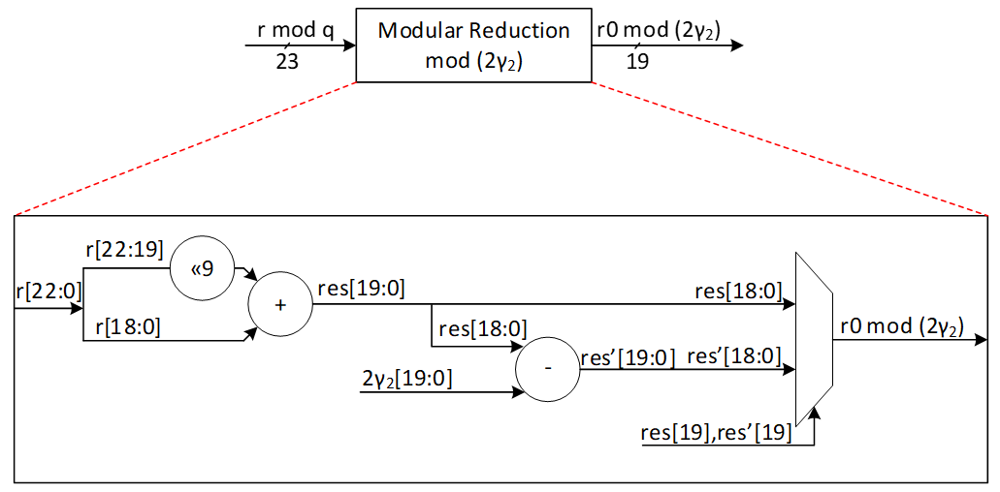{width="6.5in"
height="3.202777777777778in"}

  -------------------------------------------------------------------------------
   $r0\ mod\ 2\gamma_{2}$   $r0\ mod\ 2\gamma_{2}$               r0
         down limit                Up limit         
  ------------------------ ------------------------ -----------------------------
             0                       γ~2~                   r0 mod 2 γ~2~

           γ~2~+1                  2γ~2~-1          (r0 mod 2 γ~2~) + (q-2 γ~2~)
  -------------------------------------------------------------------------------

Our suggested design calculates two shares of r0 and r1 at the same
time. We use a lookup table with 16 parallel comparisons to find the
value of r1 from r based on the following graph:

<figure>

<figcaption>
r1 value based on the given r
</figcaption>
</figure>

  -----------------------------------------------------------------------
       r down limit             r Up limit                  r1
  ----------------------- ----------------------- -----------------------
             0                     γ~2~                      0

          γ~2~+1                   3γ~2~                     1

          3γ~2~+1                  5γ~2~                     2

          5γ~2~+1                  7γ~2~                     3

          7γ~2~+1                  9γ~2~                     4

          9γ~2~+1                 11γ~2~                     5

         11γ~2~+1                 13γ~2~                     6

         13γ~2~+1                 15γ~2~                     7

         15γ~2~+1                 17γ~2~                     8

         17γ~2~+1                 19γ~2~                     9

         19γ~2~+1                 21γ~2~                    10

         21γ~2~+1                 23γ~2~                    11

         23γ~2~+1                 25γ~2~                    12

         25γ~2~+1                 27γ~2~                    13

         27γ~2~+1                 29γ~2~                    14

         29γ~2~+1                 31γ~2~                    15

         31γ~2~+1                   q-1                      0
  -----------------------------------------------------------------------

To compute r0 mod^±^ 2γ~2,~ at the same time with r1 computation, a
modular reduction operation will be applied to the input value r with
respect to 2γ~2~ to compute r0 mod 2γ~2~. The result can be mapped into
mod^±^ 2γ~2~ range by subtracting 2γ~2~ when the result is greater than
γ~2~. However, at the end all shares should be modulus q. For that,
instead of subtracting 2γ~2~, we perform an addition with q-2γ~2~ to the
results.

The expected r0 for different values of r is illustrated as follows:

<figure>
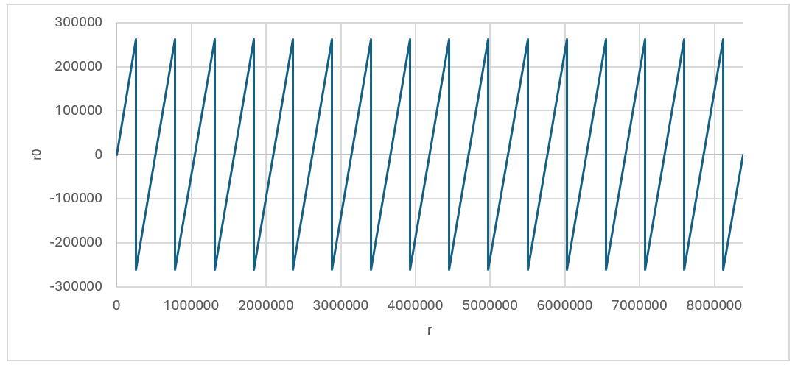
<figcaption>
r0 value based on the given r (without considering
boarder case)
</figcaption>
</figure>

Using this technique, we could achieve r0 and r1 for all cases expect
the border case where $r\  - \ r0 = q\ –\ 1$. This case can be detected
inside r1 decompose architecture shown by red. In this case, the lookup
table sets the value of 0 for r1, while r1 will be set as follows:

$$r0 = r0 - 1 = (r - q + 1) - 1 = r - q \equiv r\ mod\ q$$

<figure>
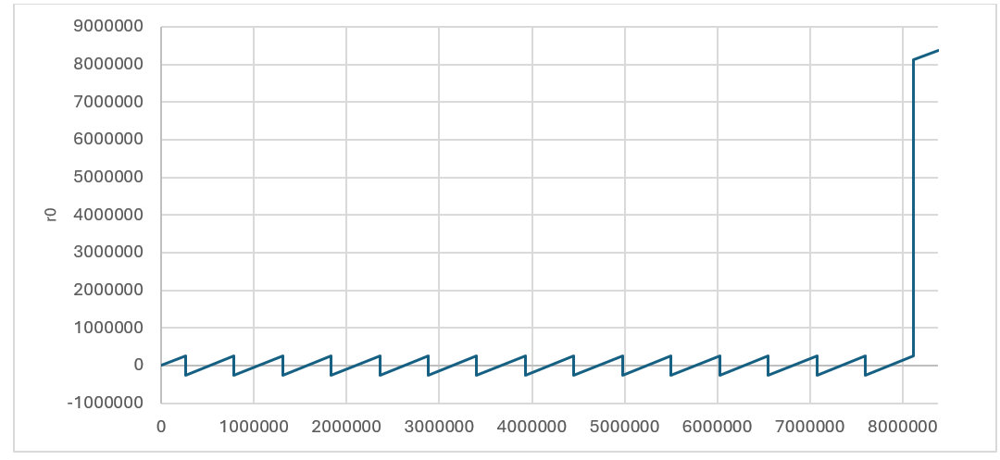
<figcaption>
r0 value based on the given r considering boarder
case
</figcaption>
</figure>

## MakeHint Architecture

The basic approach of the MakeHint(z, r) function involves decomposing
both r and r+z into two parts: (r1, r0) for r and (rz1, rz0) for r+z. It
then proceeds to evaluate whether r1 and rz1 are identical. In the event
that r1 does not match rz1, it indicates that a hint is necessary to
proceed. This process is essential for determining when additional
information is required to resolve discrepancies between the compared
segments.

However, decompose function is expensive on hardware to be implemented.
Furthermore, performing a sequential decompose function using a shared
hardware resource requires more latency.

The process of implementing the decompose function is notably
resource-intensive and can incur significant costs when executed on
hardware. Additionally, the sequential execution of this function,
particularly when it relies on a common hardware resource, tends to
introduce increased latency. This is due to the fact that shared
resources often necessitate additional time to manage concurrent
operations, which can result in delays and reduced efficiency.

The following architecture shows Dilithium algorithm to compute
h=MakeHint(−ct0, w − cs2 + ct0). There are several decompose operations
embedded into HighBits, LowBits, and MakeHint functions, shown by red.

{width="6.5in"
height="3.5340277777777778in"}

As an alternative and more efficient way, we can use a method to realize
where hint needs to be generated as follows:

To compute h=MakeHint(−ct0, w − cs2 + ct0), first note is that instead
of computing (r1, r0) = Decomposeq (w−cs2, α) and checking whether
$\left\| r0 \right\|_{\infty} < \gamma_{2}\  - \ \beta$ and r1 = w1, it
is equivalent to just check that
$\left\| w_{0} - {cs}_{2} \right\|_{\infty} < \gamma_{2} - \beta$, where
w0 is the low part of w. If this check passes, w0 − cs2 is the low part
of w − cs2. Next, recall that by the definition of the MakeHint
function, a coefficient of a polynomial in h as computed is non-zero
precisely if the high parts of the corresponding coefficients of w − cs2
and w − cs2 + ct0 differ. Now, we have already computed the full
decomposition w = αw1 + w0 of w, and we know that αw1 + (w0 −cs2) is the
correct decomposition of w−cs2. But then, αw1 + (w0 −cs2 +ct0) is the
correct decomposition of w − cs2 + ct0 (i.e. the high part is w1) if and
only if each coefficient of w0 − cs2 + ct0 lies in the interval (−γ2,
γ2\], or, when some coefficient is −γ2 and the corresponding coefficient
of w1 is zero. The last condition is due to the border case in the
Decompose function. On the other hand, if these conditions are not true,
then the high parts must differ, and it then follows that for computing
the hint vector h it suffices to just check these conditions on the
coefficients of w0 − cs2 + ct0. This algorithm is shown as follows:

{width="6.5in"
height="3.5680555555555555in"}

The alternative algorithm reduces the decompose cost by modifying the
MakeHint to enhance the efficiency of the architecture. We propose
efficient architecture for performing the alternative MakeHint operation
on hardware platform and accelerate this operation using a pipeline
architecture.

High-level architecture is illustrated as follows:

{width="5.404784558180228in"
height="5.689459755030621in"}

### Hint Sum and Hint BitPack

In Dilithium signing algorithm, the output of Makehint (hint output) is
further processed to generate the encoded 'h' component of the
signature. Additionally, one of the validity checks in signing algorithm
uses hint sum to determine validity of the generated signature. These
post-processing steps can be embedded into the Makehint architecture to
avoid latency overhead while maintaining low complexity. The following
figure shows the embedded logic into Makehint to generate the required
outputs.

{width="6.5in"
height="4.4118055555555555in"}

Hint Sum:

In the pipelined architecture, as 4 hints are generated every cycle,
they are accumulated every cycle for all 8 polynomials.

$$\left\{ \begin{matrix}
if\ hintsum > \ \omega & invalid\_ h = 1 \\
else & invalid\_ h = 0
\end{matrix} \right.\ $$

Hint BitPack:

The output of hint bitpack is a byte string 'y' of which \[ω-1:0\] bytes
are the indices at which the generated hint is non-zero. \[ω+k-1 : ω\]
bytes are the total number of indices per polynomial at which the hint
is non-zero. If the number of non-zero hints is \< ω, the rest of the
entries of y are filled with 0s. If the number of non-zero hints is \>
ω, Makehint flow continues for the remaining coefficients and the 'y'
array is overwritten with the subsequent values. In this case, the 'h'
component is invalid and the signature is discarded.

The following table shows an example of construction of y array per
polynomial based on generated hints.

  --------------------------------------------------------------------------------------
  Polynomial   Hint\[3:0\]   Index\[3:0\]\[7:0\]   y\[ω-1:0\]
  ------------ ------------- --------------------- -------------------------------------
  0            1-1-0-0       3-2-1-0               3-2

  0            0-1-0-1       7-6-5-4               6-4-3-2

  0            0-0-1-0       11-10-9-8             9-6-4-3-2

  ...          ...           ...                   ...-9-6-4-3-2

  1            1-1-1-0       3-2-1-0               3-2-1-...-9-6-4-3-2

  1            0-1-1-0       7-6-5-4               6-5-3-2-1-...-9-6-4-3-2

  ...          ...           ...                   ...-6-5-3-2-1-...-9-6-4-3-2

  2            0-0-0-0       3-2-1-0               ...-6-5-3-2-1-...-9-6-4-3-2

  2            0-0-0-1       7-6-5-4               4-...-6-5-3-2-1-...-9-6-4-3-2

  2            1-1-0-0       11-10-9-8             11-10-4-...-6-5-3-2-1-...-9-6-4-3-2

  ...          ...           ...                   ...
  --------------------------------------------------------------------------------------

To optimize area, 1 dword of 'y' buffer is written directly to the
register API. The buffer generates a valid signal after accumulating 1
dword worth of data which can be used as a write enable for the register
API. To protect the signature from intermittent firmware reads, the
signature register is lockable. The lock is asserted during signing flow
and is only unlocked after the entire flow has been completed.

At the end of all polynomials, the hintsum is written to the register
API to construct the y\[ω+k-1:ω\] locations of the byte string.

It is possible that during the last cycle of a given polynomial, the
index buffer contains \< 1 dword of index values to be written to the
reg API. To accommodate this scenario, the controller flushes out the
buffer at the end of each polynomial and writes the remaining data to
the register API.

## W1Encode

The signer's commitment is shown by w, while this value needs to be
decomposed into two shares to provide the required hint as a part of
signature. The output of decompose is shown by (w1, w0) which presents
the higher and lower parts of the given input. While w0 can be stored
into the memory, the value of w1 is required to compute commitment hash
using SHAKE256 operation. The following equation shows this operation:

$$\widetilde{c} = H(\mu||w1Encode(w1))$$

Where $\mu$ is a 512-bit value computed based on the message and $||$
means the concatenation between these two parts.

In ML-DSA-87 algorithm, there are 8 polynomials for w shown by w~0~ to
w~7~. Furthermore, higher parts of each coefficient of these
polynomials, shown by w1, is a value in \[0:15\] range that can be
presented by 4 bits. Based on this, the total input size for performing
SHAKE256 is:

$$inputsize = 512(size\ of\ \mu) + 8(poly\ number)*256(coeff\ per\ poly)*4(higher\ bit\ per\ coeff) = 8,704\ bits$$

Since SHAKE256 takes only 1088 bits per each round, we have to feed
these values sequentially. However, due to the prefix value of $\mu$,
and also the SHAKE256 input size does not divide evenly by each
polynomial w1 size (which is 256\*4=1024 bits), the pattern of feeding
decompose results into hashing buffer is challenging.

There are k polynomials (k=8 for ML-DSA-87) that needs to be decomposed
as follows:

$$w = \begin{bmatrix}
w_{0} \\
 \vdots \\
w_{k - 1}
\end{bmatrix}$$

Due to our memory configuration that stores 4 coefficients per address,
we need 4 parallel cores for decompose and encode units to match the
throughout between these modules.

{width="6.5in"
height="3.786111111111111in"}

To optimize the performance and remove the cost of memory, we use a
pipeline architecture for encode that processes the input values and
feed them into Keccak buffer. The following figure shows the optimized
architecture for W1Encoder.

{width="3.848832020997375in"
height="1.9717377515310586in"}

In the suggested design, every cycle, 4 coefficients for w1 are
calculated from the decompose unit and then sent to the encode unit.
Each coefficient is represented by 4 bits, making a total of 16 bits.
However, the Keccak buffer only accepts input in 64-bit chunks.
Therefore, a shift register is used to store the coefficients and pass a
64-bit chunk every 4 cycles to the Keccak SIPO buffer. An internal
counter is used to control when the Keccak SIPO buffer takes this 64-bit
chunk every 4 cycles.

Meanwhile, Keccak SIPO buffer can store 1088 bits of data and then
activate Keccak to process it. The internal counter counts the number of
writes on Keccak SIPO, and when it reaches 17 (17\*64 = 1088 bits),
Keccak enable is triggered. Because of Keccak architecture, SIPO can
keep buffering a new input while Keccak works on the previous stored
data.

The very first iteration of Keccak contains a 512-bit value shown by
$\mu$, which the high-level controller puts in Keccak SIPO buffer before
decompose/encode process. So, only 576 bits of SIPO are left for
encoding output. We suggest starting with a counter value of 8 to deal
with this edge case in the first Keccak round. The other rounds have 17
SIPO write enable.

The following figure shows the counter architecture. The first two bits
is used to enable SIPO buffer, while the remaining bits of \[6:2\] is
used to enable Keccak process.

{width="2.991484033245844in"
height="1.281058617672791in"}

The following table reports the SIPO input for different Keccak rounds.

  -----------------------------------------------------------------------
  Keccak SHAKE256 Round          Buffer input          Bits
  ------------------------------ --------------------- ------------------
  1                              $$\mu$$               512

                                 w0\[143:0\]           576

  2                              w0\[255:144\]         448

                                 w1\[159:0\]           640

  3                              w1\[255:160\]         384

                                 w2\[175:0\]           704

  4                              w2\[255:176\]         320

                                 w3\[191:0\]           768

  5                              w3\[255:192\]         256

                                 w4\[207:0\]           832

  6                              w4\[255:208\]         192

                                 w5\[223:0\]           896

  7                              w5\[255:224\]         128

                                 w6\[239:0\]           960

  8                              w6\[255:240\]         64

                                 w7\[255:0\]           1024

  9                              padding               1088
  -----------------------------------------------------------------------

When the whole polynomials are done in the first 8 rounds of Keccak and
Keccak done signal is asserted, the encode done signal is asserted and
the high-level controller resumes control and adds the necessary padding
to SIPO to finish the SHAKE256 process.

## Norm Check

The figure provided illustrates the finite field range for polynomial
coefficients. It indicates that each coefficient is an integer ranging
from 0 to q-1:

{width="2.986266404199475in"
height="2.683312554680665in"}

The infinity norm is defined as follows:

For an element $w\  \in \ Z$ , $\parallel w \parallel \infty\  = \ |w|$,
the absolute value of *w*. For an element
$w\  \in \ Zq$,$\parallel w \parallel \infty\  = \ w\ mod^{\pm}\ q$ .
For an element *w* of *R* or *Rq*,
$\parallel w \parallel \infty\  = \ \max 0 \leq i < 256\  \parallel wi \parallel \infty\ $.
For a length-*m* vector w with entries from *R* or *Rq*,
$\parallel w \parallel \infty\  = \ \max 0 \leq i < m\  \parallel w\lbrack i\rbrack \parallel \infty\ $.

In the context of norm definition within a finite field, when a value
for the bound is provided, the norm check determines whether the
coefficient falls below the bound or exceeds the q-bound, which is
highlighted in red in the following figure.

{width="2.6030686789151356in"
height="2.116991469816273in"}

There are three different validity checks with different bounds during
signing operations as follows:

1)  $\left| |z| \right|_{\infty}\  \geq \ \gamma 1\  - \beta$

2)  $\left| |r0| \right|_{\infty}\  \geq \ \gamma 2\  - \beta$

3)  $\left| \left\langle \left\langle ct0 \right\rangle \right\rangle \right|_{\infty}\  \geq \ \gamma 2$

Vector z contains l polynomials (l=7 for ML-DSA-87) and r0 and ct0
contains k polynomials (k=8 for ML-DSA-87) that needs to be evaluated by
norm check operation.

Due to our memory configuration that stores 4 coefficients per address,
we need 4 parallel cores for norm check unit to match the throughput
between these modules. To optimize the performance and remove the cost
of memory, we use a pipeline architecture for norm check that processes
the input values.

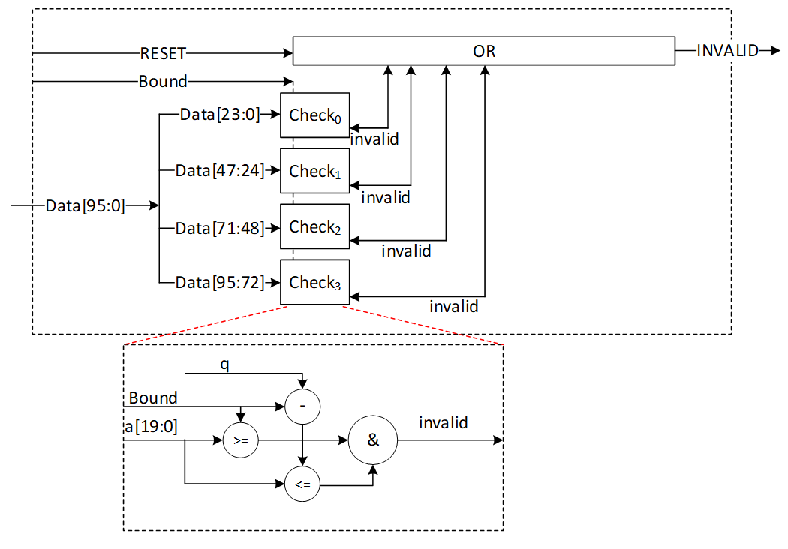{width="6.5in" height="4.53125in"}

In the proposed design, during each cycle, 4 norm check coefficients are
computed from stored data. This provides a performance improvement since
this block only needs to read from memory and does not perform any
writes to memory. Every coefficient is expressed using 24 bits,
culminating in a combined total of 96 bits. A norm check is executed on
each of these coefficients to produce a invalid output. The invalid
outputs for all coefficients across all polynomials must be collectively
ORed to yield the ultimate INVALID signal. This INVALID signal is
asserted when any coefficient fails to meet the predetermined norm check
criteria within the specified bound.

The proposed design is configurable and accepts different bounds to
reduce the required hardware resources. The following table shows the
latency requirements for these three norm checks.

  -----------------------------------------------------------------------
  Input polynomials Number of         Total             Latency for
                    polynomials       coefficients      ML-DSA-87
  ----------------- ----------------- ----------------- -----------------
  z                 L                 L\*256            448 (for 4)

  r0                K                 K\*256            512 (for 4)

  ct0               k                 K\*256            512 (for 4)
  -----------------------------------------------------------------------

## skDecode

The given sk to the core for performing a signing operation has been
encoded, and skDecode is responsible to reverse the encoding procedure
to divide sk to the appropriate portions. The initial segments within sk
should be allocated to variables p, K, and tr, corresponding to sizes of
256 bits, 256 bits, and 512 bits, respectively, without necessitating
any modifications.

The remaining part of sk stores the packed form of s1, s2, and t0,
respectively. For s1 and s2, each coefficient is represented by η bits
and needs to be unpacked as follows:

coefficient = η -- data\[η_size-1:0\]

where η_size = bitlen(2\*η).

For t0, each coefficient is represented by d bits and needs to be
unpacked as follows:

coefficient = 2^d-1^ -- data\[d-1:0\]

+-------+--------+----------+------------------------+----------------+
| sk    | poly   | coeff    | Total size             | Latency for    |
| part  | size   | size     |                        | ML-DSA-87      |
+=======+========+==========+========================+================+
| s1    | l=7    | η_size=3 | l\*                    | 224 cycles     |
|       |        |          | 256\*η_size=7\*256\*3= |                |
|       |        |          | 5376                   |                |
+-------+--------+----------+------------------------+----------------+
| s2    | k=8    | η_size=3 | k\*256\*η_size         | 256 cycles     |
|       |        |          | =8\*256\*3= 6144       |                |
+-------+--------+----------+------------------------+----------------+
| t0    | K=8    | d=13     | k\*256\*d=8\*256\*13=  | 256 cycles     |
|       |        |          | 26624                  | (using 8       |
|       |        |          |                        | parallel       |
|       |        |          |                        | cores)         |
|       |        |          |                        |                |
|       |        |          |                        | 512 cycles     |
|       |        |          |                        | (using 4       |
|       |        |          |                        | parallel       |
|       |        |          |                        | cores)         |
+-------+--------+----------+------------------------+----------------+

The skDecode architecture reads 8 values from the register API, based on
the memory pattern that has 4 coefficients for each address. It then
maps them to modulo q value using the given equation. Then it stores the
mapped value in the memory with two parallel write operations.

The high-level architecture for skDecode is as follows:

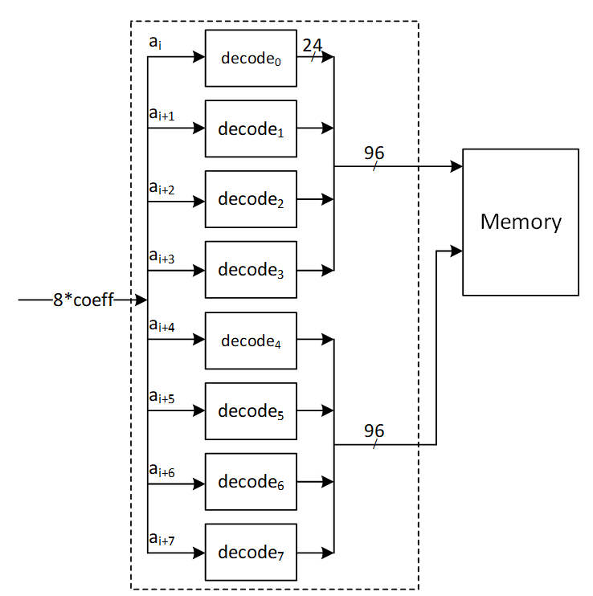{width="5.348272090988626in"
height="5.377413604549432in"}

For s1 and s2 unpacking, the decode architecture is as follows:

{width="4.563136482939632in"
height="2.8545647419072617in"}

In case a\[2:0\] is greater than 'h4, the sk is considered out of range.
skDecode block triggers an error interrupt to the RV core and the
algorithm is aborted.

For t0 unpacking, the decode architecture is shown below:

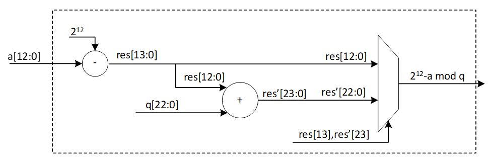{width="6.5in" height="2.1375in"}

Since key sizes are large, a key memory is used to interface with FW and
skDecode module to avoid routing and timing issues. Assuming a memory
interface of two 32-bit RW ports, s1s2 unpacking can be done with 8
parallel cores. This requires 24-bits per cycle to be processed which
can be accommodated with a single key memory read per cycle (32-bits)
and accumulating remaining bits in a sample buffer. Once next read
occurs, bits are appended to the previous ones and the values are fed
from buffer to the unpack module.

In case of t0 unpacking, since 13-bits are required per core, 4 parallel
cores can be used instead of 8 to support the 32-bit memory interface.
Two memory reads are done per cycle (64-bits) and 52 bits are processed
per cycle (13\*4). Remaining bits are accumulated in the sample buffer
and read out.

The s1/s2 buffer can hold up to 32+24 bits of data. To avoid data
conflict within s1/s2 buffer, the following memory access pattern is
used:

S1, s2 unpack:

Cycle 0 🡪 read 1 addr (buffer = 32 bits)

Cycle 1 🡪 read 1 addr (buffer = 32 + 8 bits)

Cycle 2 🡪 read 1 addr (buffer = 32 + 16 bits)

Cycle 3 🡪 stall and read buffer contents (24 bits)

T0 unpack:

In case of t0 unpack, the t0 sample buffer can hold up to 64+52 = 116
bits of data. The buffer generates a full signal that is used to stall
key memory reads for a cycle before continuing to write to the buffer.

## sigEncode_z

The sigEncode_z operation converts a signature into a sequence of bytes.
This operation has three distinct parts, namely c, z, and h. The first
part simply writes the c into the register API as it is. The last part
also uses the MakeHint structure to combine the MakeHint outputs into
register API. However, the middle part, that is z, requires encoding.

Every coefficient of z is between \[-γ1+1, γ1\], but its value mod q is
kept in memory. To encode it, this equation is needed on the non-modular
value:

Encoded z = γ1 -- z

The high-level architecture processes each coefficient of z in this way:

{width="6.5in"
height="1.9444444444444444in"}

The modular and non-modular value are equal when the z is in the
interval \[0, γ1\]. The first branch in this architecture shows this.
But for the negative range, we need to remove q from the difference
results. In this case, we get γ1 -- (z mod q) = γ1 -- (q + z) = γ1 -- z
-- q. So, the second branch adds q to the result to finish the encoding.

Using two parallel read ports, 8 encoding units read 8 coefficients from
the memory and write the encoded values to the register API as follows:

{width="6.5in" height="5.16875in"}

## PISO Buffer

The output of the Keccak unit is used to feed four different samplers at
varying data rates. The Parallel in Serial out buffer is a generic
buffer that can take the full width of the Keccak state and deliver it
to the sampler units at the appropriate data rates.

Input data from the Keccak can come at 1088 or 1344 bits per clock.
During expand mask operation, the buffer needs to be written from a
write pointer while valid data remains in the buffer. All other modes
only require writing the full Keccak state into the buffer when it is
empty.

Output data rate varies - 32 bits for RejBounded and SampleInBall, 80
bits for Expand Mask and 120 bits for SampleRejq.

## Power2Round

Power2Round function is used to split each coefficient of vector t to
two parts (similar to decompose unit). Power2Round calculates high and
low bits r1 and r0 such that:

$$r\  = \ r_{1}\  \cdot \ 2^{d}\  + r_{0}\ \ mod\ q$$

where:

$$- 2^{d - 1} < r_{0} \leq 2^{d - 1}$$

**Definition:**

-   mod α: If α is a positive integer and m ∈ Z or m ∈ Z~α~, then m mod
    α denotes the unique element m ′∈ Z in the range 0 ≤ m ′ \< α such
    that m and m ′ are congruent modulo α.

-   mod^±^ α: If α is a positive integer and m ∈ Z or m ∈ Z~α~, then m
    mod^±^ α denotes the unique element m ′∈ Z in the range −α/2 \< m ′
    ≤ α/2 such that m and m ′ are congruent modulo α.

The power2round process yields two outputs, t0 and t1. The value of t0
must be processed using skEncode and then placed in the API register.
Meanwhile, t1 is to be processed with pkEncode and then fed into the
register API. This is depicted in the high-level architecture diagram.

{width="6.5in"
height="1.070138888888889in"}

The goal is to create a pipeline architecture for skEncode and pkEncode
that minimizes memory overhead costs. Therefore, these operations will
be executed simultaneously with power2round, and the outcomes will be
directly stored into the API.

Power2Round reads 2 addresses of memory containing 8 coefficients.

The expected r1 and r0 for different values of given r is illustrated as
follows:

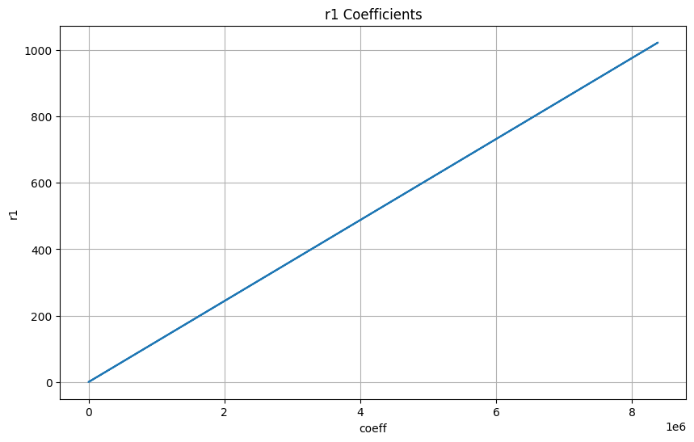{width="5.284122922134733in"
height="3.3646773840769906in"}

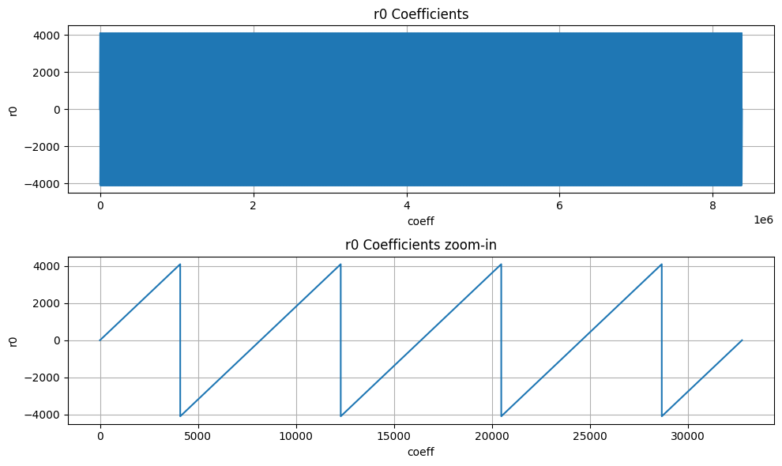{width="5.127347987751531in"
height="3.055592738407699in"}

The diagram illustrates the structure of the power2round mechanism
integrated with the skEncode arrangement. However, pkEncode is the
process of saving the t1 values into the register API.

{width="6.5in"
height="7.147916666666666in"}

## skEncode

The SkEncode operation requires multiple inputs (skEncode(ρ, K, tr, s1,
s2, t0)). But ρ, K, tr, and t0 have been preloaded into the API through
different operations. In terms of s1 and s2, SkEncode serves as a
conversion tool that maps the values of these coefficients using the
following equation:

data\[η_size-1:0\] = η -- coefficient

For ML-DSA-87 with η=2, there are only 5 possible values for the s1 and
s2 coefficients, and the following architecture converts their modular
presentation into the packed format:

{width="5.694032152230971in"
height="6.734897200349956in"}

## pkDecode

During the verification process, the provided pk must be decoded. The
initial 256 bits of pk include ρ exactly as it is. The bits that follow
consist of t1 polynomials. According to ML-DSA-87 protocol, each set of
10 bits represents a single coefficient. Therefore, these 10 bits need
to be read, shifted left by 13 bits, and the outcome should be saved
into memory.

The architecture is as follows:

{width="5.182294400699912in"
height="5.573734689413823in"}

## sigDecode_z

The sigDecode operation reverses the sigEncode. This operation has three
distinct parts, namely c, z, and h. The first part simply writes the c
from the register API as it is. The last part also uses the
HintBitUnpack structure to combine the MakeHint outputs into register
API. However, the middle part, that is z, requires decoding.

Every coefficient of z is presented by 20 bits, but its value mod q is
required to be stored into memory. To decode it, this equation is
needed:

Decoded z = γ1 -- z

However, because the decoded value falls within \[-γ1+1, γ1\], we must
convert it to its equivalent modular q value.

The high-level architecture is as follows:

{width="6.5in" height="6.45625in"}

## sigDecode_h

The sigDecode function reverses sigEncode and is composed of three
separate segments: c, z, and h. The h part uses the HintBitUnpack
structure to decode given Hint and store it into memory.

We must reconstruct k polynomials (with k being 8 in the case of
ML-DSA-87) using the decoding process provided. The total number of
non-zero indices of each polynomial can be found in the range of bytes
\[ω: ω+k-1\] (where ω is set to 75 for ML-DAS-87). Therefore, the
initial step to reconstruct each h~i~ involves reading the byte at
position ω+i for each polynomial (where 0≤i\<k), shown by HINTSUM_i.

HINTSUM_i indicates how many bytes to read from \[ω-1:0\] byte range for
the current polynomial from the register API. To keep the API constant
and avoid any complexity in storing hints for the next polynomial, the
decode module always reads 4 bytes from the register API and an internal
vector, current polynomial map (curr_poly_map), is used to indicate
which of the 4 bytes belongs to the current polynomial. For example, if
the HINTSUM is 3, the curr_poly_map is updated to 0-1-1-1 to indicate
that bytes \[2:0\] are valid. Byte\[3\] is processed as part of the next
polynomial. Once the required bytes are identified, a 256-bit vector is
updated with 1s in the positions indicated by these input bytes. After
the first cycle, the first 4 bits of the bitmap are ready to be written
to the memory.

To keep the throughput as storing 4 coefficients per cycle into internal
memory, hints are processed every cycle and the bitmap is updated every
cycle. To store data into memory, each coefficient, which might either
be a 0 or a 1, is represented using 24 bits.

Since a non-zero hint can occur in any position of the 256-bit vector,
it takes 64 cycles (4 coeffs/cycle) to write all 256 coefficients to
memory irrespective of the value of the coefficient. For example, if the
last 1 recorded is in index 35, the decode module continues to write the
rest of the coefficients (36, 37, etc) to memory.

{width="6.5in" height="3.00625in"}

Example hint processing:

  ----------------------------------------------------------------------------------------
  Cycle    Polynomial   Hintsum   Hintsum_curr   Remaining   Byte select   Curr_poly_map
                                                 hintsum     of reg API    
  -------- ------------ --------- -------------- ----------- ------------- ---------------
  0        0            5         5              5           3-2-1-0       1-1-1-1

  1        0            5         5              5-4 = 1     7-6-5-4       0-0-0-1

  2-63     0            5         5              0           \-            0-0-0-0

  64       1            11        11-5 = 6       6           8-7-6-5       1-1-1-1

  65       1            11        6              6-4 = 2     12-11-10-9    0-0-1-1

  66-127   1            11        6              0           \-            0-0-0-0

  128      2            25        25-11 = 14     14          14-13-12-11   1-1-1-1

  129      2            25        14             14-4 = 10   18-17-16-15   1-1-1-1

  130      2            25        14             10-4 = 6    22-21-20-19   1-1-1-1

  131      2            25        14             6-4 = 2     26-25-24-23   0-0-1-1
  ----------------------------------------------------------------------------------------

In each cycle, the positions indicated by y\[rd_ptr\] are flipped to 1
in the bitmap. Once a polynomial is finished, the bitmap, read pointer,
current polynomial map, etc are all reset to prepare for the next
polynomial. In this way, sigdecode_h takes (64\*8 = 512) cycles to
finish writing all coefficients to the internal memory (a few additional
cycles are required for control state transitions).

## UseHint

To reconstruct the signer\'s commitment, it is necessary to update the
approximate computed value labeled as w\' by utilizing the provided
hint. Hence, the value of w' should be decomposed, and its higher part
should be altered if the related hint equals 1 for that coefficient.
Subsequently, the higher part requires encoding through the W1Encode
operation and must be stored into the Keccak SIPO.

The procedure is similar to the Decompose and W1Encode steps in the
signing process, but it differs since there\'s no need to store the
lower segment in memory. Moreover, the UseHint operation occurs between
Decompose and W1Encode, adjusting the upper portion of the Decompose
output utilizing h.

The Decompose and W1Encode stages of the signing procedure are depicted
below (with the gray components being inactive):

{width="6.5in"
height="3.2916666666666665in"}

The UseHint operation in the verifying operation is as follows (with the
gray components being inactive):

{width="6.5in"
height="4.4319444444444445in"}

For w0 condition we have:

$$\left\{ \begin{matrix}
if\ w0 = 0\ or\ w0 > \gamma_{2} & w1 \leftarrow (w1 - 1)\ mod\ 16 \\
else & w1 \leftarrow (w1 + 1)\ mod\ 16
\end{matrix} \right.\ $$

# High-Level architecture

## Sequencer

High-Level controller works as a sequencer to perform a specific
sequence of operations. There are several blocks of memory in the
architecture that can be accessed by sub-modules. However, the sequencer
would be responsible for passing the required addresses for each
operation.

As an example, an NTT operation needs to take three base addresses as
follows:

NTT(initialvalue_base_address, intermediatevalue_base_address,
result_base_address)

So, for performing a=NTT(b), the sequencer needs to be:

NTT(a_base_address, temp_base_address, b_base_address)

The following table lists different operations used in the high-level
controller.

**Keccak and samplers Opcodes:**

  -----------------------------------------------------------------------
  Instruction               Description
  ------------------------- ---------------------------------------------
  RST_Keccak                Reset the Keccak SIPO buffer

  EN_Keccak                 Enable the Keccak

  LDKeccak_MEM src, len     Load Keccak SIPO buffer at memory address src
                            in len -width

  LDKeccak_REG src, len     Load Keccak SIPO buffer at register ID src in
                            len -width

  RDKeccak_MEM dest, len    Read Keccak PISO buffer and store it at
                            memory address dest in len -width

  RDKeccak_REG dest, len    Read Keccak PISO buffer and store it at
                            register ID dest in len -width

  REJBOUND_SMPL dest        Start Keccak and RejBounded sampler and store
                            the results at memory address dest

  REJ_SMPL                  Start Keccak and rejection sampler (results
                            is used by PWM)

  SMPL_INBALL               Start Keccak and SampleInBall (results is
                            stored in SampleInBall memory)

  EXP_MASK dest             Start Keccak and ExpandMask sampler and store
                            the results at memory address dest
  -----------------------------------------------------------------------

**NTT/INTT/PWO Opcodes:**

  -----------------------------------------------------------------------
  Instruction               Description
  ------------------------- ---------------------------------------------
  NTT src, temp, dest       Perform NTT on data at memory address src and
                            store the results at address dest

  INTT src, temp, dest      Perform INTT on data at memory address src
                            and store the results at address dest

  PWM src0, src1, dest      Perform PWM on data at memory address src0
                            and src1 and store the results at address
                            dest (dest = src0\*src1)

  PWM_SMPL src, dest        Perform PWM on data from sampler and at
                            memory address src and store the results at
                            address dest (dest = smpl\*src)

  PWM_ACCU src0, src1, dest Perform PWM in accumulation mode on data at
                            memory address src0 and src1 and store the
                            results at address dest (dest =
                            src0\*src1+dest)

  PWM_ACCU_SMPL src, dest   Perform PWM in accumulation mode on data from
                            sampler and at memory address src and store
                            the results at address dest (dest =
                            smpl\*src + dest)

  PWA src0, src1, dest      Perform PWA on data at memory address src0
                            and src1 and store the results at address
                            dest (dest = src0+src1)

  PWS src0, src1, dest      Perform PWS on data at memory src0 and src1
                            and store the results at address dest (dest =
                            src0-src1)
  -----------------------------------------------------------------------

**Other Opcodes:**

  -----------------------------------------------------------------------
  Instruction                 Description
  --------------------------- -------------------------------------------
  MAKEHINT src, dest          Perform MakeHint on data at memory address
                              src and store the results at register API
                              address dest

  USEHINT src0, src1          Perform Decompose on w data at memory
                              address src0 considering the hint data at
                              memory address src1, and perform W1Encode
                              on w1 and store them into Keccak SIPO

  NORM_CHK src, mode          Perform NormCheck on data at memory address
                              src with mode configuration

  SIG_ENCODE src0, src1, dest Perform sigEncode on data at memory address
                              src0 and src1 and store the results at
                              register API address dest

  DECOMP_SIGN src, dest       Perform Decompose on w data at memory
                              address src and store w0 at memory address
                              dest, and perform W1Encode on w1 and store
                              them into Keccak SIPO

  UPDATE_κ                    The value of κ will be updated as κ+l

  POWER2ROUND src, dest0,     Perform Power2Round on t data at memory
  dest1                       address src and store t0 at register API
                              address dest0 and t1 at register API
                              address dest1

  SIG_DECODE_Z src, dest      Perform sigDecode_z on data at register API
                              address src and store the results at memory
                              address dest

  SIG_DECODE_H src, dest      Perform sigDecode_h on data at register API
                              address src and store the results at memory
                              address dest
  -----------------------------------------------------------------------

**Color definition:**

  -----------------------------------------------------------------------
  API
  -----------------------------------------------------------------------
  Register ID

  Memory

  Constant
  -----------------------------------------------------------------------

## Keygen Operation:

The algorithm for keygen is presented below. We will explain the
specifics of each operation in the following subsections.

{width="6.5in"
height="3.4868055555555557in"}

### (p,p\',K)= H(ξ\|\|K\|\|L ,1024)

Keygen starts with running Keccak operation on seed to derive three
different values. Seed is a value stored in register API, and we need to
perform SHAKE256 with 256-bit inputs to generate 1024 bits output.

  -----------------------------------------------------------------------------
  Operation                opcode          operand       operand      operand
  ------------------------ --------------- ------------- ------------ ---------
  (p,p\',K)=Keccak(seed)   Keccak_SIPO     seed          32 bytes     

                           Keccak_SIPO     K             1 byte       

                           Keccak_SIPO     L             1 byte       

                           Keccak_PISO     p             32 bytes     

                           Keccak_PISO     p\'           64 bytes     

                           Keccak_PISO     K             32 bytes     
  -----------------------------------------------------------------------------

Firstly, we need to fill Keccak input buffer with seed and then run the
Keccak core. After that, the Keccak output stored in PISO is used to set
the p, p', and K values.

### (s1,s2)←ExpandS(ρ′)

We use the previous step\'s p\' as the input for the Keccak and run the
rejbounded sampler. For each polynomial, we need to feed the Keccak
input buffer with p\' and a constant value of length 16 bits. To do
this, we first feed the 512-bit p\' into SIPO, and then we add a 16 bits
value (which acts as a counter from 0 to 14) to the end of the fed p\'
and then padding starts from there.

Rejbounded opcode enables both Keccak and sampler and shows the
destination of output into the memory.

Then we run the rejbounded sampler 15 times with the shake256 mode. We
can mask the latency of SIPO, the Keccak_SIPO can be invoked when
rejbounded is handling the previous data. However, the Keccak will not
be enabled until rejbounded is done.

  -------------------------------------------------------------------------
  Operation           opcode         operand       operand     operand
  ------------------- -------------- ------------- ----------- ------------
  s1=expandS          Keccak_SIPO    p\'           0 (2bytes)  

                      rejbounded     s1_0                      

                      Keccak_SIPO    p\'           1           

                      rejbounded     s1_1                      

                      ...                                      

                      Keccak_SIPO    p\'           6           

                      rejbounded     s1_6                      

  s2=expandS          Keccak_SIPO    p\'           7           

                      rejbounded     s2_0                      

                      ...                                      

                      Keccak_SIPO    p\'           14          

                      rejbounded     s2_7                      
  -------------------------------------------------------------------------

### NTT(s1)

We need to call NTT for s1 by passing three addresses. Temp address can
be the same for all NTT calls while init and destination are different.

  --------------------------------------------------------------------------
  Operation            opcode          operand       operand      operand
  -------------------- --------------- ------------- ------------ ----------
  NTT(s1)              NTT             s1_0          temp         s1_0_ntt

                       NTT             s1_1          temp         s1_1_ntt

                       ...                                        

                       NTT             s1_6          temp         s1_6_ntt
  --------------------------------------------------------------------------

### Aˆ ←ExpandA(ρ) AND Aˆ ◦NTT(s1)

We perform rejection sampling and PWM simultaneously. This step takes p
from the first step and appends two bytes of Keccak SIPO to the end of
the given p and then starts padding from there. We run the rejection
sampler 56 times with shake128 mode, where k \* l=56.

Each polynomial requires p and the necessary constants to fill SIPO.
Then Rejection_sample opcode activates both Keccak and sampler. The
output of rejection sampler goes straight to PWM unit. Then, the pwm
opcode turns on pwm core, which can check the input from rejection
sampler for a valid input.

There are two different opcodes for PWM: regular PWM and PWM_ACCU that
indicates different modes for PWM units.

We can mask the latency of SIPO, the Keccak_SIPO can be invoked when
PWM/Rejection_sampler is handling the previous data. However, the Keccak
will not be enabled until PWM is done.

  ---------------------------------------------------------------------------
  Operation           opcode              operand       operand     operand
  ------------------- ------------------- ------------- ----------- ---------
  As1_0=PWM(A,        Keccak_SIPO         p             0 (1 byte)  0 (1
  NTT(s1))                                                          byte)

                      Rejection_sampler                             

                      pwm                 DONTCARE      s1_0_ntt    As0

                      Keccak_SIPO         p             0           1

                      Rejection_sampler                             

                      pwm_accu            DONTCARE      s1_1_ntt    As0

                      Keccak_SIPO         p             0           2

                      Rejection_sampler                             

                      pwm_accu            DONTCARE      s1_2_ntt    As0

                      ...                                           

                      Keccak_SIPO         p             0           6

                      Rejection_sampler                             

                      pwm_accu            DONTCARE      s1_6_ntt    As0

  As1_1=PWM(A,        Keccak_SIPO         p             1           0
  NTT(s1))                                                          

                      Rejection_sampler                             

                      pwm                 DONTCARE      s1_0_ntt    As1

                      Keccak_SIPO         p             1           1

                      Rejection_sampler                             

                      pwm_accu            DONTCARE      s1_1_ntt    As1

                      ...                                           

                      Keccak_SIPO         p             1           6

                      Rejection_sampler                             

                      pwm_accu            DONTCARE      s1_6_ntt    As1

  As1_7=PWM(A,        ...                                           
  NTT(s1))                                                          

                      Keccak_SIPO         p             7           6

                      Rejection_sampler                             

                      pwm_accu            DONTCARE      s1_6_ntt    As7
  ---------------------------------------------------------------------------

### NTT^−1^(Aˆ ◦NTT(s1))

We need to call INTT for As1 by passing three addresses. Temp address
can be the same for all INTT calls while init and destination are
different.

  --------------------------------------------------------------------------
  Operation            opcode          operand       operand      operand
  -------------------- --------------- ------------- ------------ ----------
  INTT(As1)            INTT            As0           temp         As0_intt

                       INTT            As1           temp         As1_intt

                       ...                                        

                       INTT            As7           temp         As7_intt
  --------------------------------------------------------------------------

### t ←NTT^−1^(Aˆ ◦NTT(s1))+s2

We need to call point-wise addition for As1 results and s2 by passing
three addresses.

  -------------------------------------------------------------------------
  Operation            opcode          operand       operand      operand
  -------------------- --------------- ------------- ------------ ---------
  t=INTT(As1)+s2       PWA             As0_intt      s2_0         t0

                       PWA             As1_intt      s2_1         t1

                       ...                                        

                       PWA             As7_intt      s2_7         t7
  -------------------------------------------------------------------------

### (t1,t0)←Power2Round(t,*d*) AND *pk* ←pkEncode(ρ,t1) AND *sk* ←skEncode(t0)

We need to call power2round for t results from the previous step, and
the results are stored in two different addresses to API for sk and pk.

  --------------------------------------------------------------------------------
  Operation                    Opcode         operand       operand      operand
  ---------------------------- -------------- ------------- ------------ ---------
  (t1,t0)←Power2Round(t,*d*)   POWER2ROUND    t             t0 (sk)      t1 (pk)

  --------------------------------------------------------------------------------

NOTE: The value of ρ needs to be also stored into register API for pk.

### *tr* ←H(BytesToBits(*pk*),512)

The value of pk from register API needs to be read and stored into
Keccak SIPO to perform SHAKE256. Due to long size of pk, 20 rounds of
Keccak is required to executed to generate 512-bit tr.

  -------------------------------------------------------------------------
  Operation            opcode          operand       operand      operand
  -------------------- --------------- ------------- ------------ ---------
  tr=Keccak(pk)        Keccak_SIPO     pk            2592 bytes   

                       Keccak_PISO     tr            64 bytes     
  -------------------------------------------------------------------------

### *sk* ←skEncode(ρ,*K*,*tr*,s1,s2,t0)

The value of ρ, *K* needs to be stored into register API, while *tr* and
*t0* are already stored by previous steps.

We need to call skEncode for s1 and s2 coefficients and the results are
stored into API for sk.

  -------------------------------------------------------------------------
  Operation            opcode          operand       operand      operand
  -------------------- --------------- ------------- ------------ ---------
  *sk* ←skEncode(s1)   skEncode        s1            sk           

  *sk* ←skEncode(s2)   skEncode        S2            sk           
  -------------------------------------------------------------------------

## Signing

Signing operation is the most challenging operation for ML-DSA. From a
high-level perspective, the required operation for performing a signing
operation can be shown as follows:

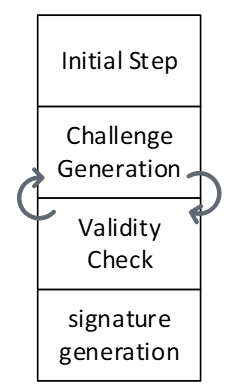{width="1.849630358705162in"
height="3.0381167979002623in"}

The are some initial processes to decode private key. The loop between
challenge generation and validity check should be continued until
validity check passed the results and then, the signature will be
generated and published.

In our optimized design, the next challenge is generated in advance, so
that it can be used if the validity check of the current round fails.
Therefore, we use two sequencers to support parallel operations.

The algorithm for signing is presented below. We will explain the
specifics of each operation in the following subsections.

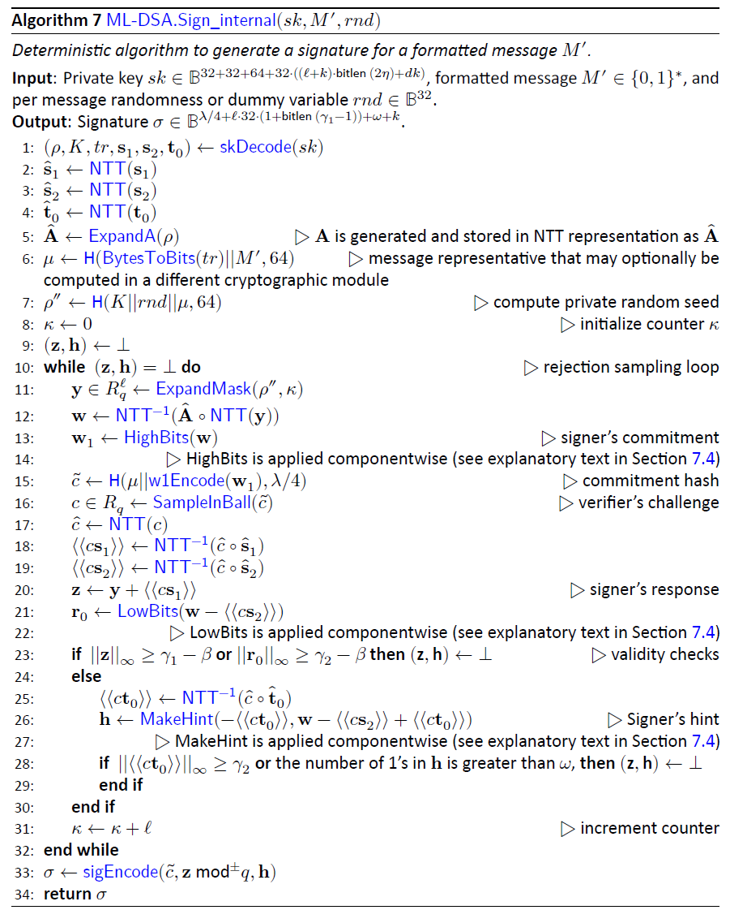{width="6.5in" height="8.0875in"}

The following table shows the operations for each sequencer:

  -----------------------------------------------------------------------------------------------
  Sequencer 2                                         Sequencer 1                    
  ------------ -------------------------------------- ------------------------------ ------------
  Initial      (ρ,*K*,*tr*,s1,s2,t0)←skDecode(*sk*)   μ ←H(*tr*\|\|*M*,512)          Challenge
  steps                                                                              Generation

               sˆ1 ←NTT(s1)                           ρ′←H(*K*\|\|*rnd*\|\|μ,512)    

               sˆ2 ←NTT(s2)                           y ←ExpandMask(ρ′ ,κ)           

               ˆt0 ←NTT(t0)                           w ←NTT−1(Aˆ ◦NTT(y))           

  *Validity    *c*ˆ ←NTT(*c*)                         (w1,w0) ←Decompose(w)          
  Checks*                                                                            

               ⟨⟨*c*s1⟩⟩←NTT−1(*c*ˆ◦ sˆ1)             *c*˜←H(μ\|\|w1Encode(w1),2λ)   

               ⟨⟨*c*s2⟩⟩←NTT−1(*c*ˆ◦ sˆ2)             *c* ←SampleInBall(*c*˜)        

               z ←y +⟨⟨*c*s1⟩⟩                        *κ ←κ +ℓ*                      

               r0 ←(w0 −⟨⟨*c*s2⟩⟩)                                                   

               ⟨⟨*c*t0⟩⟩←NTT−1(*c*ˆ◦ tˆ0)                                            

               h ←MakeHint(w1,                                                       
               w0−⟨⟨*c*s2⟩⟩+⟨⟨*c*t0⟩⟩)                                               

               \|\|z\|\|∞ ≥ γ1 −β                                                    

               \|\|r0\|\|∞ ≥ γ2 −β                                                   

               \|\|⟨⟨*c*t0⟩⟩\|\|∞ ≥ γ2                                               

  Signature    σ ←sigEncode(*c*˜,z mod±*q*,h)                                        
  Generation                                                                         
  -----------------------------------------------------------------------------------------------

### (ρ,*K*,*tr*,s1,s2,t0)←skDecode(*sk*)

We need to call skDecode for s1, s2, and t0 by passing the required
addresses.

  -----------------------------------------------------------------------
  Operation      opcode      operand        operand        operand
  -------------- ----------- -------------- -------------- --------------
  skDecode(s1)   skDecode    s1             s1             

  skDecode(s2)               s2             s2             

  skDecode(t0)               t0             t0             
  -----------------------------------------------------------------------

### sˆ1 ←NTT(s1)

We need to call NTT for s1 by passing three addresses. Temp address can
be the same for all NTT calls while init and destination are different.

  --------------------------------------------------------------------------
  Operation            opcode          operand       operand      operand
  -------------------- --------------- ------------- ------------ ----------
  NTT(s1)              NTT             s1_0          temp         s1_0_ntt

                       NTT             s1_1          temp         s1_1_ntt

                       ...                                        

                       NTT             s1_6          temp         s1_6_ntt
  --------------------------------------------------------------------------

### sˆ2 ←NTT(s2)

We need to call NTT for t0 by passing three addresses. Temp address can
be the same for all NTT calls while init and destination are different.

  --------------------------------------------------------------------------
  Operation            opcode          operand       operand      operand
  -------------------- --------------- ------------- ------------ ----------
  NTT(s2)              NTT             t0_0          temp         t0_0_ntt

                       NTT             t0_1          temp         t0_1_ntt

                       ...                                        

                       NTT             t0_7          temp         t0_7_ntt
  --------------------------------------------------------------------------

### ˆt0 ←NTT(t0)

We need to call NTT for s2 by passing three addresses. Temp address can
be the same for all NTT calls while init and destination are different.

  --------------------------------------------------------------------------
  Operation            opcode          operand       operand      operand
  -------------------- --------------- ------------- ------------ ----------
  NTT(s2)              NTT             s2_0          temp         s2_0_ntt

                       NTT             s2_1          temp         s2_1_ntt

                       ...                                        

                       NTT             s2_7          temp         s2_7_ntt
  --------------------------------------------------------------------------

### *c*ˆ ←NTT(*c*)

This is the part where two sequencers sync up. Sequencer 1 will pause
until the second sequencer finishes the SampleInBall operation and the
ready flag from SampleInBall tells the first sequencer to go on.

We need to call NTT for c by passing three addresses. Temp address can
be the same for all NTT calls while init and destination are different.

  -------------------------------------------------------------------------
  Operation           opcode           operand       operand     operand
  ------------------- ---------------- ------------- ----------- ----------
  NTT(c)              NTT              c             temp        c_ntt

  -------------------------------------------------------------------------

### ⟨⟨*c*s1⟩⟩←NTT−1(*c*ˆ◦ sˆ1)

We need firstly to call PWM to perform point-wise multiplication between
c and s1.

  --------------------------------------------------------------------------
  Operation           opcode           operand       operand     operand
  ------------------- ---------------- ------------- ----------- -----------
  cs1=PWM(c, s1)      PWM              c_ntt         s1_0_ntt    cs1_0_ntt

                      PWM              c_ntt         s1_1_ntt    cs1_1_ntt

                      ...                                        

                      PWM              c_ntt         s1_6_ntt    cs1_6_ntt
  --------------------------------------------------------------------------

Then, we need to call INTT for cs1 by passing three addresses. Temp
address can be the same for all INTT calls while init and destination
are different.

  ------------------------------------------------------------------------
  Operation           opcode           operand       operand     operand
  ------------------- ---------------- ------------- ----------- ---------
  INTT(cs1)           INTT             cs1_0_ntt     temp        cs1_0

                      INTT             cs1_1_ntt     temp        cs1_1

                      ...                                        

                      INTT             cs1_6_ntt     temp        cs1_6
  ------------------------------------------------------------------------

### ⟨⟨*c*s2⟩⟩←NTT−1(*c*ˆ◦ sˆ2)

We need first to call PWM to perform point-wise multiplication between c
and s2.

  --------------------------------------------------------------------------
  Operation           opcode           operand       operand     operand
  ------------------- ---------------- ------------- ----------- -----------
  cs2=PWM(c, s2)      PWM              c_ntt         s2_0_ntt    cs2_0_ntt

                      PWM              c_ntt         s2_1_ntt    cs2_1_ntt

                      ...                                        

                      PWM              c_ntt         s2_7_ntt    cs2_7_ntt
  --------------------------------------------------------------------------

Then, we need to call INTT for cs2 by passing three addresses. Temp
address can be the same for all INTT calls while init and destination
are different.

  ------------------------------------------------------------------------
  Operation           opcode           operand       operand     operand
  ------------------- ---------------- ------------- ----------- ---------
  INTT(cs2)           INTT             cs2_0_ntt     temp        cs2_0

                      INTT             cs2_1_ntt     temp        cs2_1

                      ...                                        

                      INTT             cs2_7_ntt     temp        cs2_7
  ------------------------------------------------------------------------

### z ←y +⟨⟨*c*s1⟩⟩

We need to call PWA to perform point-wise addition between cs1 and y.

  ------------------------------------------------------------------------
  Operation           opcode           operand       operand     operand
  ------------------- ---------------- ------------- ----------- ---------
  z=PWA(y, cs1)       PWA              y_0           cs1_0       z_0

                      PWA              y_1           cs1_1       z_1

                      ...                                        

                      PWA              y_6           cs1_6       z_6
  ------------------------------------------------------------------------

### r0 ←(w0 −⟨⟨*c*s2⟩⟩)

We need to call PWS to perform point-wise subtraction between w0 and
cs2.

  ------------------------------------------------------------------------
  Operation           opcode           operand       operand     operand
  ------------------- ---------------- ------------- ----------- ---------
  r0=PWS(w0, cs2)     PWS              w0_0          cs2_0       r0_0

                      PWS              w0_1          cs2_1       r0_1

                      ...                                        

                      PWS              w0_7          cs2_7       r0_7
  ------------------------------------------------------------------------

### ⟨⟨*c*t0⟩⟩←NTT−1(*c*ˆ◦ tˆ0)

We need first to call PWM to perform point-wise multiplication between c
and t0.

  --------------------------------------------------------------------------
  Operation           opcode           operand       operand     operand
  ------------------- ---------------- ------------- ----------- -----------
  ct0=PWM(c, t0)      PWM              c_ntt         t0_0_ntt    ct0_0_ntt

                      PWM              c_ntt         t0_1_ntt    ct0_1_ntt

                      ...                                        

                      PWM              c_ntt         t0_7_ntt    ct0_7_ntt
  --------------------------------------------------------------------------

Then, we need to call INTT for ct0 by passing three addresses. Temp
address can be the same for all INTT calls while init and destination
are different.

  ------------------------------------------------------------------------
  Operation           opcode           operand       operand     operand
  ------------------- ---------------- ------------- ----------- ---------
  INTT(ct0)           INTT             ct0_0_ntt     temp        ct0_0

                      INTT             ct0_1_ntt     temp        ct0_1

                      ...                                        

                      INTT             ct0_7_ntt     temp        ct0_7
  ------------------------------------------------------------------------

### h ←MakeHint(w1,r0+⟨⟨*c*t0⟩⟩)

We need to call PWA to perform point-wise addition between r0 and ct0.

  ------------------------------------------------------------------------
  Operation           opcode           operand       operand     operand
  ------------------- ---------------- ------------- ----------- ---------
  hint_r=PWA(r0, ct0) PWA              hint_r_0      r0_0        ct0_0

                      PWA              hint_r_1      r0_1        ct0_1

                      ...                                        

                      PWA              hint_r_7      r0_7        ct0_7
  ------------------------------------------------------------------------

Then, we need to call MakeHint for hint_r. It will process the entire
hint_r polynomials, i.e., from hint_r_0 to hint_r_7.

  ------------------------------------------------------------------------
  Operation           opcode           operand       operand     operand
  ------------------- ---------------- ------------- ----------- ---------
  hint_r=PWA(r0, ct0) MAKEHINT         hint_r_0      h           

  ------------------------------------------------------------------------

### \|\|z\|\|∞ ≥ γ1 −β

We need to call Norm_Check to perform validity check on z. The output
will be stored as an individual flag in the high-level architecture.

  -------------------------------------------------------------------------
  Operation            opcode           operand       operand     operand
  -------------------- ---------------- ------------- ----------- ---------
  Valid=NormCheck(z)   NormChk          z             mode        

  -------------------------------------------------------------------------

### \|\|r0\|\|∞ ≥ γ2 −β

We need to call Norm_Check to perform validity check on r0. The output
will be stored as an individual flag in the high-level architecture.

  --------------------------------------------------------------------------
  Operation             opcode           operand       operand     operand
  --------------------- ---------------- ------------- ----------- ---------
  Valid=NormCheck(r0)   NormChk          r             mode        

  --------------------------------------------------------------------------

### \|\|⟨⟨*c*t0⟩⟩\|\|∞ ≥ γ2

We need to call Norm_Check to perform validity check on ct0. The output
will be stored as an individual flag in the high-level architecture.

  ---------------------------------------------------------------------------
  Operation              opcode           operand       operand     operand
  ---------------------- ---------------- ------------- ----------- ---------
  Valid=NormCheck(ct0)   NormChk          ct0           mode        

  ---------------------------------------------------------------------------

### σ ←sigEncode(*c*˜,z mod±*q*,h)

This step writes the final signature into the register API. Before that,
the high-level design will check all four flags coming from:

1)  MakeHint

2)  NormChk on z

3)  NormChk on r0

4)  NormChk on ct0

If all checks show the successful signature, then the sigEncode unit
will be called. The value of h is already stored by MakeHint unit into
the register API. Hence, only two remaining parts will be passed to this
unit.

  ------------------------------------------------------------------------
  Operation           opcode           operand       operand     operand
  ------------------- ---------------- ------------- ----------- ---------
  σ=sigEncode(c,z)    sigEncode        c             z           σ

  ------------------------------------------------------------------------

### μ ←H(*tr*\|\|*M*,512)

The other sequencer starts with running Keccak operation on tr and the
given message. tr and the message are stored in register API as inputs,
and we need to perform SHAKE256 with to generate 512 bits output.

Since the engine only supports prehash signing/verifying ML-DSA
operations, the assumption is the given message is the hash of a pure
message. Based on FIPS 204 \[3\], the hashed message needs to be
extended by some pre-defined OIDs.

  -------------------------------------------------------------------------
  Operation            opcode          operand       operand      operand
  -------------------- --------------- ------------- ------------ ---------
  μ=Keccak(tr \|\| M)  Keccak_SIPO     tr            64 bytes     

                       Keccak_SIPO     1             1 byte       

                       Keccak_SIPO     OID           11 bytes     

                       Keccak_SIPO     Message       64 bytes     

                       Keccak_PISO     μ             64 bytes     
  -------------------------------------------------------------------------

Firstly, we need to fill Keccak input buffer with tr and then
concatenate it with message. NIST may apply some changes in this
operation by adding some constant value into this concatenation. Then we
run the Keccak core, and the Keccak output stored in PISO is used to set
the μ value into a special register.

### ρ′←H(*K*\|\|*rnd*\|\|μ,512)

We need to run Keccak operation on K, rnd, and μ values. K and rnd are
stored in register API as inputs, and μ is stored in an internal
register. we need to perform SHAKE256 with to generate 512 bits output.

  -----------------------------------------------------------------------------
  Operation                opcode          operand       operand      operand
  ------------------------ --------------- ------------- ------------ ---------
  ρ′=Keccak(K\|\|rnd\|\|   Keccak_SIPO     K             4 (x64       
  μ)                                                     words)       

                           Keccak_SIPO     sign_rnd      4 (x64       
                                                         words)       

                           Keccak_SIPO     μ             8 (x64       
                                                         words)       

                           Keccak_PISO     ρ′            8 (x64       
                                                         words)       
  -----------------------------------------------------------------------------

Firstly, we need to fill Keccak input buffer with K and then concatenate
it with sign_rnd and μ. Then we run the Keccak core, and the Keccak
output stored in PISO is used to set the ρ′ value into a special
register.

### y ←ExpandMask(ρ' ,κ)

We use the previous step\'s p\' as the input for the Keccak and run the
ExpandMask sampler. For each polynomial, we need to feed the Keccak
input buffer with p\' and a register value of length 16 bits. To do
this, we first feed the 512-bit p\' into SIPO, and then we add a 16 bits
value (which acts as a counter from 0 to 6) to the end of the fed p\'
and then padding starts from there.

ExpandMask opcode enables both Keccak and sampler and shows the
destination of output into the memory.

Then we run the ExpandMask sampler 7 times with the shake256 mode. We
can mask the latency of SIPO, the Keccak_SIPO can be invoked when
ExpandMask is handling the previous data. However, the Keccak will not
be enabled until ExpandMask is done.

  -------------------------------------------------------------------------
  Operation           opcode         operand       operand     operand
  ------------------- -------------- ------------- ----------- ------------
  y=ExpandMask(ρ' ,κ) LDKeccak       p\'           64 bytes    

                      LDKeccak       κ             2 bytes     

                      Exp_Mask       y_0                       

                      LDKeccak       p\'           1 bytes     

                      LDKeccak       κ+1           2 bytes     

                      Exp_Mask       y_1                       

                      ...                                      

                      LDKeccak       p\'           64 bytes    

                      LDKeccak       κ +6          2 bytes     

                      Exp_Mask       y_6                       
  -------------------------------------------------------------------------

### NTT(y)

We need to call NTT for s1 by passing three addresses. Temp address can
be the same for all NTT calls while init and destination are different.

  -------------------------------------------------------------------------
  Operation            opcode          operand       operand      operand
  -------------------- --------------- ------------- ------------ ---------
  NTT(y)               NTT             y_0           temp         y_0_ntt

                       NTT             y_1           temp         y_1_ntt

                       ...                                        

                       NTT             y_6           temp         y_6_ntt
  -------------------------------------------------------------------------

### Aˆ ←ExpandA(ρ) AND Aˆ ◦NTT(y)

We perform rejection sampling and PWM simultaneously. This step takes p
from and appends two bytes of Keccak SIPO to the end of the given p and
then starts padding from there. We run the rejection sampler 56 times
with shake128 mode, where k \* l=56.

Each polynomial requires p and the necessary constants to fill SIPO.
Then Rejection_sample opcode activates both Keccak and sampler. The
output of rejection sampler goes straight to PWM unit. Then, the pwm
opcode turns on pwm core, which can check the input from rejection
sampler for a valid input.

There are two different opcodes for PWM: regular PWM and PWM_ACCU that
indicates different modes for PWM units.

We can mask the latency of SIPO, the Keccak_SIPO can be invoked when
PWM/Rejection_sampler is handling the previous data. However, the Keccak
will not be enabled until PWM is done.

  ---------------------------------------------------------------------------
  Operation           opcode              operand       operand     operand
  ------------------- ------------------- ------------- ----------- ---------
  Ay0=PWM(A, NTT(y))  LDKeccak            p             32 bytes    

                      LDKeccak            0             1 byte      

                      LDKeccak            0             1 byte      

                      Rejection_sampler                             

                      pwm                 DONTCARE      y_0_ntt     Ay0

                      LDKeccak            p             32 bytes    

                      LDKeccak            0             1 byte      

                      LDKeccak            1             1 byte      

                      Rejection_sampler                             

                      pwm_accu            DONTCARE      y_1_ntt     Ay0

                      LDKeccak            p             32 bytes    

                      LDKeccak            0             1 byte      

                      LDKeccak            2             1 byte      

                      Rejection_sampler                             

                      pwm_accu            DONTCARE      y_2_ntt     Ay0

                      ...                                           

                      LDKeccak            p             32 bytes    

                      LDKeccak            0             1 byte      

                      LDKeccak            6             1 byte      

                      Rejection_sampler                             

                      pwm_accu            DONTCARE      y_6_ntt     Ay0

  Ay1=PWM(A, NTT(y))  LDKeccak            p             32 bytes    0

                      LDKeccak            1             1 byte      

                      LDKeccak            0             1 byte      

                      Rejection_sampler                             

                      pwm                 DONTCARE      y_0_ntt     Ay1

                      LDKeccak            p             32 bytes    

                      LDKeccak            1             1 byte      

                      LDKeccak            1             1 byte      

                      Rejection_sampler                             

                      pwm_accu            DONTCARE      y_1_ntt     Ay1

                      ...                                           

                      LDKeccak            p             32 bytes    

                      LDKeccak            1             1 byte      

                      LDKeccak            6             1 byte      

                      Rejection_sampler                             

                      pwm_accu            DONTCARE      y_6_ntt     Ay1

  Ay7=PWM(A, NTT(y))  ...                                           

                      LDKeccak            p             32 bytes    

                      LDKeccak            7             1 byte      

                      LDKeccak            6             1 byte      

                      Rejection_sampler                             

                      pwm_accu            DONTCARE      y_6_ntt     Ay7
  ---------------------------------------------------------------------------

### w ←NTT−1(Aˆ ◦NTT(y))

We need to call INTT for Ay by passing three addresses. Temp address can
be the same for all INTT calls while init and destination are different.

  -------------------------------------------------------------------------
  Operation            opcode          operand       operand      operand
  -------------------- --------------- ------------- ------------ ---------
  INTT(Ay)             INTT            Ay0           temp         w_0

                       INTT            Ay1           temp         w_1

                       ...                                        

                       INTT            Ay7           temp         w_7
  -------------------------------------------------------------------------

### (w1,w0) ←Decompose(w) AND *c*˜←H(μ\|\|w1Encode(w1),2λ)

The decompose unit takes w from memory and splits it into two parts. It
saves w0 in memory and sends w1 to the Keccak SIPO for SampleInBall.
However, SIPO requires the μ prefix before receiving the w1 values.
Therefore, the high-level controller should provide μ before using
decompose. After completing the decompose operation, the high-level
controller needs to add the necessary padding for
H(μ\|\|w1Encode(w1),2λ). Then, by activating the SampleInBall, the
Keccak will start and the data in the SIPO will be processed.

  -----------------------------------------------------------------------------
  Operation                 opcode         operand       operand      operand
  ------------------------- -------------- ------------- ------------ ---------
  H(μ\|\|w1Encode(w1),2λ)   LDKeccak       μ             64 bytes     

  (w1,w0) ←Decompose(w)     Decomp_Enc     w             w0           

  H(μ\|\|w1Encode(w1),2λ)   LDKeccak       padding                    
  -----------------------------------------------------------------------------

### *c* ←SampleInBall(*c*˜)

We take the SIPO value from the last step as the Keccak input and run
SampleInBall. The output stays in the SampleInBall memory.

  ---------------------------------------------------------------------------
  Operation              opcode          operand       operand      operand
  ---------------------- --------------- ------------- ------------ ---------
  *c*                    SMPL_INBALL                                
  ←SampleInBall(*c*˜1)                                              

  ---------------------------------------------------------------------------

### κ ←κ +ℓ

High-level controller increases the value of κ by l.

  -------------------------------------------------------------------------
  Operation            opcode          operand       operand      operand
  -------------------- --------------- ------------- ------------ ---------
  κ ←κ +ℓ              Update_k                                   

  -------------------------------------------------------------------------

## Verifying

The algorithm for verifying is presented below. We will explain the
specifics of each operation in the following subsections.

{width="6.5in"
height="4.0256944444444445in"}

### (ρ,t1)←pkDecode(*pk*)

We need to call pkDecode to decode the given pk for t1 values.

  -------------------------------------------------------------------------
  Operation            opcode          operand       operand      operand
  -------------------- --------------- ------------- ------------ ---------
  *t1←pkDecode(pk)*    pkDecode        *pk*          t1           

  -------------------------------------------------------------------------

### (*c*˜,z,h)←sigDecode(σ) 

We need to call sigDecode to decode the given signature for z and h
values.

  -------------------------------------------------------------------------
  Operation            opcode          operand       operand      operand
  -------------------- --------------- ------------- ------------ ---------
  (z,h)←sigDecode(σ)   sigDecode_z     *σ_z*         z            

                       sigDecode_h     *σ_h*         h            
  -------------------------------------------------------------------------

### \|\|z\|\|∞ ≥ γ1 −β

We need to call Norm_Check to perform validity check on the given z. The
output will be stored as an individual flag in the high-level
architecture.

  -------------------------------------------------------------------------
  Operation            opcode           operand       operand     operand
  -------------------- ---------------- ------------- ----------- ---------
  Valid=NormCheck(z)   NormChk          z             mode        

  -------------------------------------------------------------------------

### \[\[number of 1's in h is ≤ ω\]\]

We need to call HintSum to perform validity check on the given h. The
output will be stored as an individual flag in the high-level
architecture.

  ------------------------------------------------------------------------
  Operation           opcode           operand       operand     operand
  ------------------- ---------------- ------------- ----------- ---------
  Valid=HintSum(h)    HINTSUM          h                         

  ------------------------------------------------------------------------

### z ←NTT(z)

We need to call NTT for z by passing three addresses. Temp address can
be the same for all NTT calls while init and destination are different.

  -------------------------------------------------------------------------
  Operation            opcode          operand       operand      operand
  -------------------- --------------- ------------- ------------ ---------
  NTT(z)               NTT             z_0           temp         z_0_ntt

                       NTT             z_1           temp         z_1_ntt

                       ...                                        

                       NTT             z_6           temp         z_6_ntt
  -------------------------------------------------------------------------

### Aˆ ←ExpandA(ρ) AND Aˆ ◦NTT(z)

We perform rejection sampling and PWM simultaneously. This step takes p
from the register API and appends two bytes of Keccak SIPO to the end of
the given p and then starts padding from there. We run the rejection
sampler 56 times with shake128 mode, where k \* l=56.

Each polynomial requires p and the necessary constants to fill SIPO.
Then Rejection_sample opcode activates both Keccak and sampler. The
output of rejection sampler goes straight to PWM unit. Then, the pwm
opcode turns on pwm core, which can check the input from rejection
sampler for a valid input.

There are two different opcodes for PWM: regular PWM and PWM_ACCU that
indicates different modes for PWM units.

We can mask the latency of SIPO, the Keccak_SIPO can be invoked when
PWM/Rejection_sampler is handling the previous data. However, the Keccak
will not be enabled until PWM is done.

  ---------------------------------------------------------------------------
  Operation           opcode              operand       operand     operand
  ------------------- ------------------- ------------- ----------- ---------
  Az_0=PWM(A, NTT(z)) Keccak_SIPO         p             0 (1 byte)  0 (1
                                                                    byte)

                      Rejection_sampler                             

                      pwm                 DONTCARE      z_0_ntt     Az0

                      Keccak_SIPO         p             0           1

                      Rejection_sampler                             

                      pwm_accu            DONTCARE      z_1_ntt     Az0

                      Keccak_SIPO         p             0           2

                      Rejection_sampler                             

                      pwm_accu            DONTCARE      z_2_ntt     Az0

                      ...                                           

                      Keccak_SIPO         p             0           6

                      Rejection_sampler                             

                      pwm_accu            DONTCARE      z_6_ntt     Az0

  Az_1=PWM(A, NTT(z)) Keccak_SIPO         p             1           0

                      Rejection_sampler                             

                      pwm                 DONTCARE      z_0_ntt     Az1

                      Keccak_SIPO         p             1           1

                      Rejection_sampler                             

                      pwm_accu            DONTCARE      z_1_ntt     Az1

                      ...                                           

                      Keccak_SIPO         p             1           6

                      Rejection_sampler                             

                      pwm_accu            DONTCARE      z_6_ntt     Az1

  Az_7=PWM(A, NTT(z)) ...                                           

                      Keccak_SIPO         p             7           6

                      Rejection_sampler                             

                      pwm_accu            DONTCARE      z_6_ntt     Az7
  ---------------------------------------------------------------------------

### tr ←H(pk,512)

The sequencer runs Keccak operation on pk. pk is stored in register API
as input, and we need to perform SHAKE256 with to generate 512 bits
output.

  -------------------------------------------------------------------------
  Operation            opcode          operand       operand      operand
  -------------------- --------------- ------------- ------------ ---------
  tr=Keccak(pk)        Keccak_SIPO     pk            2592 bytes   

                       Keccak_PISO     tr            64 bytes     
  -------------------------------------------------------------------------

### μ ←H(*tr*\|\|*M*,512)

The sequencer starts with running Keccak operation on tr and the given
message. tr is stored in an internal register from the previous step,
and the message is stored in register API as input, and we need to
perform SHAKE256 with to generate 512 bits output.

  -------------------------------------------------------------------------
  Operation            opcode          operand       operand      operand
  -------------------- --------------- ------------- ------------ ---------
  μ=Keccak(tr \|\| M)  Keccak_SIPO     tr            64 bytes     

                       Keccak_SIPO     1             1 byte       

                       Keccak_SIPO     OID           11 bytes     

                       Keccak_SIPO     Message       64 bytes     

                       Keccak_PISO     μ             64 bytes     
  -------------------------------------------------------------------------

Firstly, we need to fill Keccak input buffer with tr and then
concatenate it with message. NIST may apply some changes in this
operation by adding some constant value into this concatenation. Then we
run the Keccak core, and the Keccak output stored in PISO is used to set
the μ value into a special register.

### *c* ←SampleInBall(*c*˜)

We take the c\~ values from register API as the Keccak input and run
SampleInBall. The output stays in the SampleInBall memory.

  --------------------------------------------------------------------------
  Operation             opcode          operand       operand      operand
  --------------------- --------------- ------------- ------------ ---------
                        Keccak_SIPO     c\~           64 bytes     

  *c*                   SMPL_INBALL                                
  ←SampleInBall(*c*˜)                                              
  --------------------------------------------------------------------------

### *c*ˆ ←NTT(*c*)

We need to call NTT for c by passing three addresses. Temp address can
be the same for all NTT calls while init and destination are different.

  -------------------------------------------------------------------------
  Operation           opcode           operand       operand     operand
  ------------------- ---------------- ------------- ----------- ----------
  NTT(c)              NTT              c             temp        c_ntt

  -------------------------------------------------------------------------

### *c*ˆ ←NTT(*c*)

We need to call NTT for c by passing three addresses. Temp address can
be the same for all NTT calls while init and destination are different.

  -------------------------------------------------------------------------
  Operation           opcode           operand       operand     operand
  ------------------- ---------------- ------------- ----------- ----------
  NTT(c)              NTT              c             temp        c_ntt

  -------------------------------------------------------------------------

### t1 ←NTT(t1)

We need to call NTT for t1 by passing three addresses. Temp address can
be the same for all NTT calls while init and destination are different.

  --------------------------------------------------------------------------
  Operation            opcode          operand       operand      operand
  -------------------- --------------- ------------- ------------ ----------
  NTT(t1)              NTT             t1_0          temp         t1_0_ntt

                       NTT             t1_1          temp         t1_1_ntt

                       ...                                        

                       NTT             t1_7          temp         t1_7_ntt
  --------------------------------------------------------------------------

### NTT(*c*) ◦NTT(t1)

We need to call point-wise multiplication between c and all t1
polynomials in NTT domain.

  ------------------------------------------------------------------------
  Operation           opcode           operand       operand     operand
  ------------------- ---------------- ------------- ----------- ---------
  ct1=PWM(NTT(*c*)    PWM              c_ntt         t1_0_ntt    ct1_0
  ◦NTT(t1))                                                      

                      PWM              c_ntt         t1_1_ntt    ct1_1

                      ...                                        

  .                   PWM              c_ntt         t1_7_ntt    ct1_7
  ------------------------------------------------------------------------

### A ˆ ◦NTT(z*)* −NTT(*c*) ◦NTT(t1)

We need to call point-wise subtraction between Az and ct1 polynomials in
NTT domain.

  -------------------------------------------------------------------------
  Operation           opcode           operand       operand     operand
  ------------------- ---------------- ------------- ----------- ----------
  Az-ct1=A ˆ          PWS              Az_0          ct1_0       Az_ct1_0
  ◦NTT(z*)* −NTT(*c*)                                            
  ◦NTT(t1)                                                       

                      PWS              Az_1          ct1_1       Az_ct1_1

                      ...                                        

  .                   PWS              Az_7          ct1_7       Az_ct1_7
  -------------------------------------------------------------------------

### w′ ←NTT-1(A ˆ ◦NTT(z*)* −NTT(*c*) ◦NTT(t1))

We need to call INTT for Az_ct1 by passing three addresses. Temp address
can be the same for all INTT calls while init and destination are
different.

  -------------------------------------------------------------------------
  Operation            opcode          operand       operand      operand
  -------------------- --------------- ------------- ------------ ---------
  w′ ←NTT-1(A ˆ        INTT            Az_ct1_0      temp         w'\_0
  ◦NTT(z*)* −NTT(*c*)                                             
  ◦NTT(t1))                                                       

                       INTT            Az_ct1_1      temp         w'\_1

                       ...                                        

                       INTT            Az_ct1_7      temp         w'\_7
  -------------------------------------------------------------------------

### w ′ ←UseHint(h,w ′) AND *c*˜←H(μ\|\|w1Encode(w1),2λ)

In the UseHint phase, the decompose unit retrieves w from memory and
divides it into two components. Next, w1 is refreshed through useHint,
encoded, and forwarded to the Keccak SIPO. Nonetheless, the μ prefix
must precede w1 before SIPO can accept it. Therefore, the high-level
controller should provide μ before using decompose. After completing the
UseHint operation, the high-level controller needs to add the necessary
padding for H(μ\|\|w1Encode(w1),2λ). Then, the Keccak will start and the
data in the SIPO will be stored at register API as verification result.

  ------------------------------------------------------------------------------
  Operation                 opcode         operand        operand      operand
  ------------------------- -------------- -------------- ------------ ---------
  H(μ\|\|w1Encode(w1),2λ)   LDKeccak       μ              64 bytes     

  w ′ ←UseHint(h,w ′)       USEHINT        w              H            

  H(μ\|\|w1Encode(w1),2λ)   LDKeccak       padding                     

                            EN_Keccak                                  

                            RDKeccak       Verification                
                                           Result                      
  ------------------------------------------------------------------------------

References:

  --------------------------------------------------------------------------------------------------------------------------------------------------------------------------------------------------------------------------------------
  \[1\]   The White House, \"National Security Memorandum on Promoting United States Leadership in Quantum Computing While Mitigating Risks to Vulnerable Cryptographic Systems,\" 2022. \[Online\]. Available:
          https://www.whitehouse.gov/briefing-room/statements-releases/2022/05/04/national-security-memorandum-on-promoting-united-states-leadership-in-quantum-computing-while-mitigating-risks-to-vulnerable-cryptographic-systems/.
  ------- ------------------------------------------------------------------------------------------------------------------------------------------------------------------------------------------------------------------------------
  \[2\]   NIST, \"PQC Standardization Process: Announcing Four Candidates to be Standardized, Plus Fourth Round Candidates,\" \[Online\]. Available: https://csrc.nist.gov/news/2022/pqc-candidates-to-be-standardized-and-round-4.
          \[Accessed 2022\].

  \[3\]   NIST, \"FIPS 204 Module-Lattice-Based Digital Signature Standard,\" August 13, 2024.
  --------------------------------------------------------------------------------------------------------------------------------------------------------------------------------------------------------------------------------------
