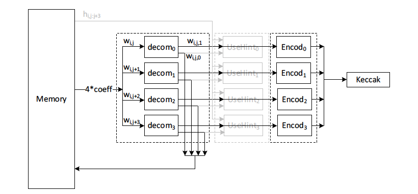
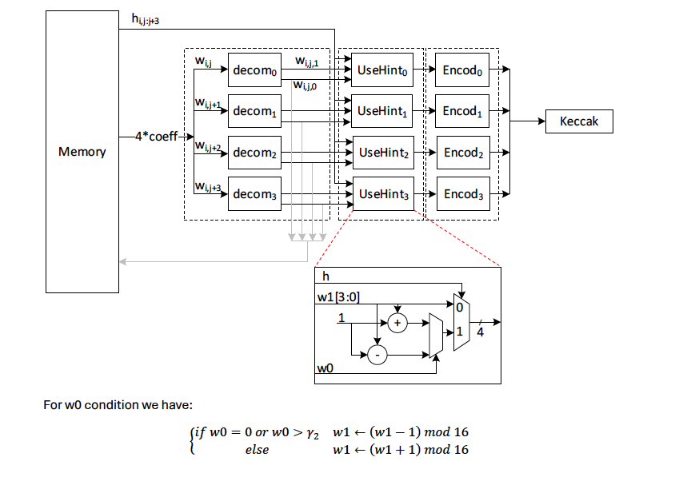

<!--
SPDX-License-Identifier: Apache-2.0

Licensed under the Apache License, Version 2.0 (the "License");
you may not use this file except in compliance with the License.
You may obtain a copy of the License at

http://www.apache.org/licenses/LICENSE-2.0

Unless required by applicable law or agreed to in writing, software
distributed under the License is distributed on an "AS IS" BASIS,
WITHOUT WARRANTIES OR CONDITIONS OF ANY KIND, either express or implied.
See the License for the specific language governing permissions and
limitations under the License.
-->

# Decompose
Date: 26.03.2025
Author: LUBIS EDA GmbH

## Folder Structure
The following subdirectories are part of the main directory **formal/fv_decompose**

- model: Contains the high level abstracted model (`decompose_sign_mode.h` is the high level model for decompose block in sign mode, `decompose_verify_mode.h` is the high level model for decompose block in verify mode)

- fv_decompose_sign_mode: Contains the assertion IP(AIP) for decompose block (sign mode) named as **fv_decompose_sign_mode/fv_decompose_sign_mode_m.sv**, the assertion IP package **fv_decompose_sign_mode/fv_decompose_sign_mode_pkg.sv**, the AIP binding file **fv_decompose_sign_mode/fv_decompose_sign_mode_binding.sv**, the AIP functions file **fv_decompose_sign_mode/fv_decompose_sign_mode_functions.sv**, the top-level wrapper **fv_decompose_sign_mode/fv_decompose_sign_mode_top.sv**, and the constraints **fv_decompose_sign_mode/fv_decompose_sign_mode_constraints.sv**

- fv_decompose_verify_mode: Contains the assertion IP(AIP) for decompose block (verify mode) named as **fv_decompose_verify_mode/fv_decompose_verify_mode_m.sv**, the assertion IP package **fv_decompose_verify_mode/fv_decompose_verify_mode_pkg.sv**, the AIP binding file **fv_decompose_verify_mode/fv_decompose_verify_mode_binding.sv**, the AIP functions file **fv_decompose_verify_mode/fv_decompose_verify_mode_functions.sv**, the top-level wrapper **fv_decompose_verify_mode/fv_decompose_verify_mode_top.sv**, and the constraints **fv_decompose_verify_mode/fv_decompose_verify_mode_constraints.sv**

## DUT Overview

The DUT decompose has the primary inputs and primary outputs as shown below.

| S.No | Port                       | Direction | Description                                                                       |
| ---- | ---------------------      | --------- | --------------------------------------------------------------------------------- |
| 1    | clk                        | input     | The positive edge of the clk is used for all the signals                          |
| 2    | reset_n                    | input     | The reset signal is active low and resets the module                              |
| 3    | zeroize                    | input     | The module is reseted when this signal is triggered.                              |
| 4    | decompose_enable           | input     | The module is enabled by the top hierarchy with this signal                       |
| 5    | dcmp_mode                  | input     | The selection mode of the module (0 = sign mode, 1 = verify mode)                 |
| 6    | src_base_addr[14:0]        | input     | The base address of reading the coefficient data from the memory                  |
| 7    | dest_base_addr[14:0]       | input     | The base address of writing output (r0) to the memory                             |
| 8    | hint_src_base_addr[14:0]   | input     | The base address of reading the hint bit information from the memory              |
| 9    | mem_rd_data[95:0]          | input     | The coefficient data input (r)                                                    |
| 10   | mem_hint_rd_data[95:0]     | input     | The hint bits data input (only bits 0,24,48,72 are used)                          |
| 11   | mem_rd_req                 | output    | The memory read data request, consists of r/w mode and addr                       |
| 12   | mem_wr_req                 | output    | The memory write data request for r0, consists of r/w mode and addr               |
| 13   | mem_hint_rd_req            | output    | The memory read hint bit data request, consists of r/w mode and addr              |
| 14   | z_mem_wr_req               | output    | The memory write data request for z, consists of r/w mode and addr                |
| 15   | mem_wr_data[95:0]          | output    | The output data r0 to be saved into memory                                        |
| 16   | z_neq_z[3:0]               | output    | The output data z to be saved into memory                                         |
| 17   | w1_o[63:0]                 | output    | The output of w1_encode block to SIPO/keccak buffer                               |
| 18   | buffer_en                  | output    | The output bit indicating 64 bits of w1_o data are ready for keccak to sample     |
| 19   | decompose_done             | output    | The output bit indicating decompose operation is done/idle                        |

The decompose process iterates for 8 polynomials, with each polynomial corresponds to 256 coefficient. The memory configuration allows 4 coefficients read/write per cycle, thus there will be 8*256/4=512 rounds of iterations to decompose 8 polynomials in series. When the **decompose_enable** bit is asserted, the block performs the following operations depending on the selected mode:

- Sign mode: The block reads the polynomial coefficient data from the memory and decompose it into two parts: r0 (lower decompose parts), r1 (upper decompose parts), and z (corner case of r0). Output r0 & z is saved back to the memory, while r1 is forwarded to SIPO/keccak sample buffer.

- Verify mode: The block reads the polynomial coefficient data from the memory and decompose it into two parts: r0 (lower decompose parts), r1 (upper decompose parts) and forwarded to the usehint block. The block also reads the hint bit (h) information from the memory and it is used as a selector signal in the usehint block. The encoded output is then forwarded to SIPO/keccak buffer. No output data is saved to the memory.

## Assertion IP Overview

The Assertion IP signals are bound with the respective signals in the dut, where for the **rst_n** is bound with the DUT (reset_n && !zeroize), which ensures the reset functionality.

- reset_a: Checks that all the registers are resetted and the state is idle, with the ready to high.

- IDLE_wait_a: Checks for **decompose_enable** signal. If it is not triggered, then the state stays in idle and holds the past values and the block is ready.

- IDLE_to_REQ_1ST_DATA_a :If state is in idle and **decompose_enable** signal is asserted, it sends the first read request the first to the memory. The memory request outputs are updated accordingly. **decompose_done** bit will be deasserted as it is no longer in idle state. The **mem_wr_data**, **z_neq_z**, and **w1_o** data outputs are not available yet.

- REQ_1ST_DATA_to_REQ_2ND_DATA_a: After the first read request is sent, the second read request is sent in the following clock cycle. The memory request outputs are updated accordingly. The **mem_wr_data**, **z_neq_z**, and **w1_o** data outputs are still not available yet.

- REQ_2ND_DATA_to_REQ_3RD_DATA_a: After the second read request is sent, the third read request is sent in the following clock cycle. The memory request outputs are updated accordingly. The **mem_wr_data**, **z_neq_z**, and **w1_o** data outputs are still not available yet.

- REQ_3RD_DATA_to_RD_MEM_WR_MEM_a: After the third read request is sent, it enters the RD_MEM_WR_MEM state where both data read and data write occur. The memory request outputs are updated accordingly. In sign mode, **mem_wr_data** & **z_neq_z** will have the computed r0 & z value from the first data read and are written to the memory, while in verify mode these output will remain be zero. In the sign mode, **w1_o** will have the computed r1 value from the first data read. **buffer_en** will not be asserted yet because only 16 bits of r1 is available at the first write. In the verify mode, **w1_o** output is not available yet because the usehint calculation must be done by the usehint block, instead it will be ready in the next clock cycle.

- RD_MEM_WR_MEM_to_RD_MEM_WR_MEM_a: The RD_MEM_WR_MEM state iterates to read input and write outputs until the last read request is sent. All the data outputs will have the computed value of the subsequent data reads. **buffer_en** is asserted every four clock cycles to indicate 16*4=64 r1 bits is available at **w1_o** output for keccak to sample. In the verify mode, **buffer_en** will be asserted one clock cycle later due to the delay computation of usehint explained in the previous state.

- RD_MEM_WR_MEM_to_RD_MEM_WR_MEM_1_a: The RD_MEM_WR_MEM iterates to write the few last outputs until the second last write request is sent. All the data outputs will have the computed value of the subsequent data reads. No read request is sent.

- RD_MEM_WR_MEM_to_RESP_LAST_DATA_a: Not a valid assertion as it presents unrealistics condition in the assumption part. It is automatically generated by the LUBIS app builder.

- RD_MEM_WR_MEM_to_RESP_LAST_DATA_1_a: The last (512th) write request is sent. All the data outputs will have the computed value of the last data reads. **buffer_en** is asserted for the last time.

- RESP_LAST_DATA_to_IDLE_a: The state transitions back to idle. **decompose_done** is set true as both read & write operations are done/idle. 

- RESP_LAST_DATA_to_IDLE_BUFFER_EN_a: This state transition only occurs on the verify mode, when usehint operation comes into picture. There is an additional clock cycle required before data is available at **w1_o** and in turn, also delaying the assertion of **buffer_en** by one clock cycle. **decompose_done** is set true as both read & write operations are done/idle.

- IDLE_BUFFER_EN_to_IDLE_a: This state transition only occurs on the verify mode, when usehint operation comes into picture. The state transitions back to idle.

Remarks on the current constraints:
 - assume_base_address_constraint: base addresses are set to a certain fixed number as per the design

 - assume_not_dcmp_enable_while_not_done: dcmp_enable should not be triggered when dcmp_done is not yet set (i.e. decompose full operation has not yet been completed). In verify mode, one additional clock cycle is added because the last buffer_en signal is asserted one clock cycle after decompose_done.

 - assume_not_verify: to constraint the operation mode to only sign mode. Note that this is also required at the moment during IDLE state, as the computation of address requests (z_mem_wr_req & mem_wr_req) during IDLE state is different between sign & verify mode.

- assume_verify: to constraint the operation mode to only verify mode. Note that this is also required at the moment during IDLE state, as the computation of address requests (z_mem_wr_req & mem_wr_req) during IDLE state is different between sign & verify mode.

## Reproduce Results

The AIP has been tested and proven with atleast one of these formals tools (Onespin ,Jasper , vcf) and formal coverage is at 100% excluding valid unreachable and deadcode. 

To reproduce the results:
Load the AIP with all the necessary constraints together in your formal tool. 

Feel free to reach out to contact@lubis-eda.com to request the loadscripts or the lubis modules.
